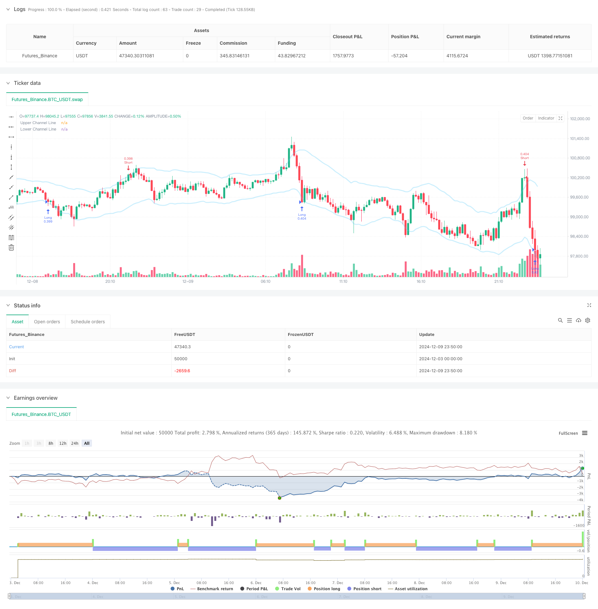

> Name

Multi-Factor-Counter-Trend-Trading-Strategy
> Author

ChaoZhang

> Strategy Description



[trans]
#### Overview
The Multi-Factor Reversal Trend Trading Strategy is a programmed trading system specifically designed to identify potential reversal points in the market following consecutive increases or decreases. This strategy analyzes price trends and combines multiple technical indicators such as volume confirmation and channel bands (Bollinger Bands or Keltner Channels) to capture reversal opportunities when the market is overbought or oversold. The core of the strategy is to improve the reliability and accuracy of trading signals through comprehensive judgment of multiple factors.
#### Strategy Principle
The strategy is mainly based on the following three core elements to generate trading signals:
1. Continuous price change identification - Identify the formation of a strong trend by setting a threshold for the number of K lines that continuously rise or fall.
2. Trading volume confirmation mechanism - You can optionally add trading volume analysis, which requires a simultaneous increase in trading volume during continuous price changes to increase signal reliability.
3. Channel breakthrough verification - supports both Bollinger Bands and Keltner Channel, and confirms overbought and oversold through the interaction of price and channel boundaries.
The triggering of trading signals requires meeting a set combination of conditions. After confirming the closing of the K-line, the system will draw a triangle mark at a qualified position and perform corresponding long and short operations. The strategy uses 80% of the account equity as the position size for each transaction, and takes into account the 0.01% transaction fee.
#### Strategic Advantages
1. Multi-dimensional signal confirmation - effectively reduce false signals through comprehensive analysis of multiple dimensions such as price, trading volume and channel lines.
2. Flexible parameter configuration - supports customizing the number of continuous K lines, selective use of trading volume and channel confirmation, adapting to different market environments
3. Clear visual feedback - Entry points are intuitively displayed through triangle marks, which facilitates strategy monitoring and backtest analysis.
4. Reasonable fund management - adopt account proportion positions, dynamically adjust transaction scale, and effectively control risks
#### Strategy Risk
1. Risk of failed reversal - In a strong trend, reversal signals may lead to wrong trades
2. Capital efficiency issues - fixed use of 80% equity may be too aggressive under certain market conditions
3. Lag risk - waiting for the K-line to confirm the closing may result in less than ideal entry points
4. Parameter sensitivity - the performance of different parameter combinations varies greatly and needs to be fully tested
#### Strategy optimization direction
1. Introduce a dynamic stop loss mechanism - it is recommended to set an adaptive stop loss level based on ATR or volatility
2. Optimize position management - consider dynamically adjusting position proportions based on market volatility
3. Add trend filter - add trend indicators such as moving averages to avoid reversals in the direction of the main trend
4. Improve the exit mechanism - design profit-taking rules based on technical indicators
5. Market environment adaptation - dynamically adjust strategy parameters according to different market conditions
#### Summary
The multi-factor reversal trend trading strategy provides traders with a systematic reversal trading plan by comprehensively analyzing multiple dimensions of market information such as price patterns, trading volume changes, and channel breakthroughs. The advantage of the strategy lies in its flexible parameter configuration and multi-dimensional signal confirmation mechanism, but it also requires attention to market environment adaptation and risk control. Through the suggested optimization direction, the strategy is expected to achieve better performance in real trading. ||
#### Overview
The Multi-Factor Counter-Trend Trading Strategy is a sophisticated algorithmic trading system designed to identify potential reversal points after consecutive price rises or falls in the market. The strategy analyzes price movements in conjunction with volume confirmation and channel bands (Bollinger Bands or Keltner Channels) to capture reversal opportunities in overbought or oversold conditions. The core strength lies in its multi-factor approach to enhance signal reliability and accuracy.

#### Strategy Principles
The strategy generates trading signals based on three core elements:
1. Consecutive Price Movement Detection - Identifies strong trends through threshold settings for consecutive rising or falling bars
2. Volume Confirmation Mechanism - Optional volume analysis requiring increasing volume during consecutive price movements
3. Channel Breakout Verification - Supports both Bollinger Bands and Keltner Channels to confirm overbought/oversold conditions

Trade signals trigger when set conditions are met. The system plots triangle markers and executes corresponding long/short positions after bar confirmation. The strategy uses 80% of account equity for position sizing and factors in a 0.01% trading commission.

#### Strategy Advantages
1. Multi-dimensional Signal Confirmation - Reduces false signals through comprehensive analysis of price, volume, and channel lines
2. Flexible Parameter Configuration - Customizable bar count, optional volume and channel confirmation for different market conditions
3. Clear Visual Feedback - Intuitive entry point visualization through triangle markers for monitoring and backtesting
4. Rational Money Management - Dynamic position sizing based on account proportion for effective risk control

#### Strategy Risks
1. Failed Reversal Risk - Counter-trend signals may lead to losses in strong trends
2. Capital Efficiency Issues - Fixed 80% equity usage may be too aggressive in certain market conditions
3. Time Lag Risk - Waiting for bar confirmation may result in suboptimal entry points
4. Parameter Sensitivity - Performance varies significantly with different parameter combinations

#### Strategy Optimization Directions
1. Implement Dynamic Stop-Loss - Consider adaptive stop-loss based on ATR or volatility
2. Optimize Position Management - Consider dynamic position sizing based on market volatility
3. Add Trend Filters - Incorporate trend indicators like moving averages to avoid counter-trend trades in strong trends
4. Enhance Exit Mechanism - Design technical indicator-based profit-taking rules
5. Market Environment Adaptation - Dynamically adjust strategy parameters based on market conditions

#### Summary
The Multi-Factor Counter-Trend Trading Strategy provides a systematic approach to reversal trading through comprehensive analysis of price patterns, volume changes, and channel breakouts. While the strategy excels in its flexible configuration and multi-dimensional signal confirmation, attention must be paid to market environment adaptation and risk control. The suggested optimization directions offer potential improvements for live trading performance.[/trans]


> Source (PineScript)

``` pinescript
/*backtest
start: 2024-12-03 00:00:00
end: 2024-12-10 00:00:00
period: 10m
basePeriod: 10m
exchanges: [{"eid":"Futures_Binance","currency":"BTC_USDT"}]
*/

//@version=5
strategy(title="The Bar Counter Trend Reversal Strategy [TradeDots]", overlay=true, initial_capital = 10000, default_qty_type = strategy.percent_of_equity, default_qty_value = 80, commission_type = strategy.commission.percent, commission_value = 0.01)

// Initialize variables
var bool rise_triangle_ready = false
var bool fall_triangle_ready = false
var bool rise_triangle_plotted = false
var bool fall_triangle_plotted = false

//Strategy condition setup
noOfRises = input.int(3, "No. of Rises", minval=1, group="STRATEGY")
noOfFalls = input.int(3, "No. of Falls", minval=1, group="STRATEGY")
volume_confirm = input.bool(false, "Volume Confirmation", group="STRATEGY")

channel_confirm = input.bool(true, "", inline="CHANNEL", group="STRATEGY")
channel_type = input.string("KC", "", inline="CHANNEL", options=["BB", "KC"],group="STRATEGY")
channel_source = input(close, "", inline="CHANNEL", group="STRATEGY")
channel_length = input.int(20, "", inline="CHANNEL", minval=1,group="STRATEGY")
channel_mult = input.int(2, "", inline="CHANNEL", minval=1,group="STRATEGY")

//Get channel line information
[_, upper, lower] = if channel_type == "KC"
    ta.kc(channel_source, channel_length,channel_mult)
else 
    ta.bb(channel_source, channel_length,channel_mult)

//Entry Condition Check
if channel_confirm and volume_confirm
    rise_triangle_ready := ta.falling(close, noOfFalls) and ta.rising(volume, noOfFalls) and high > upper
    fall_triangle_ready := ta.rising(close, noOfRises) and ta.rising(volume, noOfRises) and low < lower

else if channel_confirm
    rise_triangle_ready := ta.falling(close, noOfFalls) and low < lower
    fall_triangle_ready := ta.rising(close, noOfRises) and high > upper 

else if volume_confirm
    rise_triangle_ready := ta.falling(close, noOfFalls) and ta.rising(volume, noOfFalls)
    fall_triangle_ready := ta.rising(close, noOfRises) and ta.rising(volume, noOfRises)
else
    rise_triangle_ready := ta.falling(close, noOfFalls)
    fall_triangle_ready := ta.rising(close, noOfRises)

// Check if trend is reversed
if close > close[1]
    rise_triangle_plotted := false  // Reset triangle plotted flag

if close < close[1]
    fall_triangle_plotted := false

//Wait for bar close and enter trades
if barstate.isconfirmed
    // Plot triangle when ready and counts exceed threshold
    if rise_triangle_ready and not rise_triangle_plotted 
        label.new(bar_index, low, yloc = yloc.belowbar, style=label.style_triangleup, color=color.new(#9CFF87,10))
        strategy.entry("Long", strategy.long)
        rise_triangle_plotted := true
        rise_triangle_ready := false  // Prevent plotting again until reset

    if fall_triangle_ready and not fall_triangle_plotted
        label.new(bar_index, low, yloc = yloc.abovebar, style=label.style_triangledown, color=color.new(#F9396A,10))
        strategy.entry("Short", strategy.short)
        fall_triangle_plotted := true
        fall_triangle_ready := false

// plot channel bands
plot(upper, color = color.new(#56CBF9, 70), linewidth = 3, title = "Upper Channel Line")
plot(lower, color = color.new(#56CBF9, 70), linewidth = 3, title = "Lower Channel Line")
```

> Detail

https://www.fmz.com/strategy/474710

> Last Modified

2024-12-11 17:36:41
