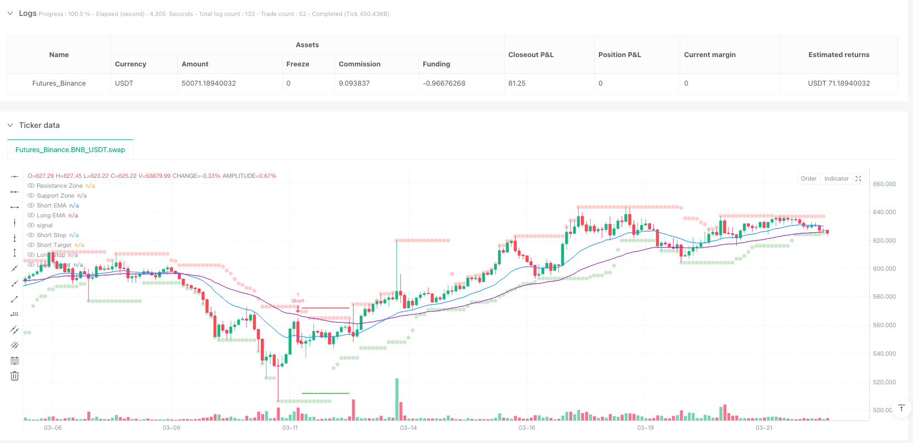
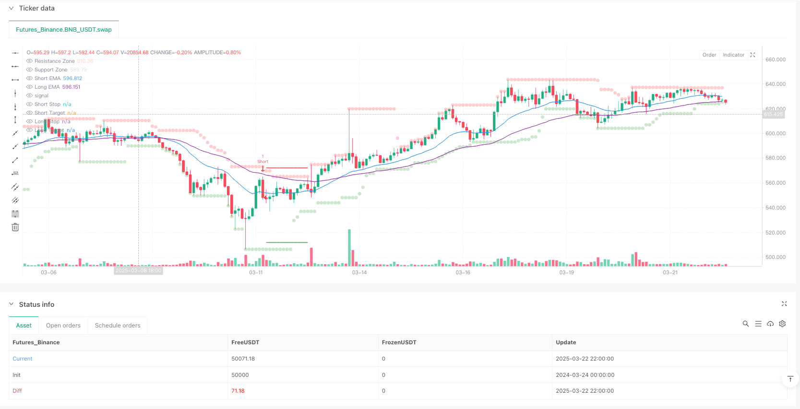

> Name

Multi-Factor-Trend-Price-Action-Strategy-with-Dynamic-Risk-Management-System
> Author

ianzeng123

> Strategy Description





[trans]

## Overview
The Multi-Factor Trend Price Action Strategy and Dynamic Risk Management System is a quantitative trading strategy that combines multiple analytical elements. It integrates trend identification, price action patterns, volume confirmation and volatility management functions to generate high-probability trading signals. The strategy uses a dual exponential moving average (EMA) crossover system, average directional index (ADX) filtering, support and resistance identification, fair value gap (FVG) detection and adaptive true range (ATR) stop-loss and take-profit mechanisms to form a comprehensive trading decision-making framework.
The core advantage is its layered signal system, which distinguishes between strong and weak signals, allowing traders to adjust position sizes based on signal strength. Through a comprehensive assessment of trend direction, price patterns, volume confirmation, and market volatility, this strategy provides systematic trading rules while maintaining flexibility.
## Strategy Principle
The strategy works together through four main components: trend identification, price action signals, volume verification, and risk management.
1. **Trend Identification System**:
   - Use the intersection of short-term EMA (default 20 periods) and long-term EMA (default 50 periods) to determine the trend direction
   - Use the ADX indicator (default 14 periods) to filter non-trending markets, requiring the ADX value to be greater than 20
   - The short-term EMA confirms an uptrend when it is above the long-term EMA, and vice versa confirms a downtrend.
2. **Price Action Signals**:
   - Detect engulfing patterns (bullish/bearish) as potential reversal signals
   - Identify hammer/inverted hammer patterns and verify consistency with trend direction
   - Track the fair value gap (FVG) and monitor its filling status, and the filling window is set to 5 candlesticks
3. **Trading volume verification**:
   - The current trading volume is required to be greater than 1.5 times the volume moving average
   - The trading volume of the previous K line must be greater than 1.2 times its moving average
   - Combine volume spikes with price action to confirm signal validity
4. **Risk Management Mechanism**:
   - Calculate dynamic stop loss and take profit levels using 14-period ATR
   - The stop loss distance is set to 2 times the ATR value
   - The take-profit distance is set to 3 times the ATR value, establishing a risk-reward ratio of 1:1.5
The core of the strategy lies in its signal priority system: a strong signal requires all conditions of FVG + engulfing pattern + volume + trend to be met simultaneously, while a weak signal only requires pattern + volume + support and resistance breakthrough. This tiered approach ensures that only the largest positions are used in the highest confidence cases.
## Strategic Advantages
1. **Multi-factor confirmation mechanism**:
   - Significantly reduces false signals by requiring joint confirmation of multiple technical indicators
   - Improve signal quality through comprehensive analysis of trends, patterns, volume and volatility
   - Hierarchical signal system allows flexible adjustment of positions based on confirmation strength
2. **Adaptive Risk Management**:
   - ATR基础的动态止损止盈根据市场实际波动性自动调整
   - Differentiated risk management under different market conditions (different thresholds for strong/weak signals)
   - Preset risk-reward ratio ensures long-term stability
3. **No redraw support and resistance**:
   - Calculate support and resistance areas using confirmed historical pivot points to avoid common repaint issues
   - Visualization of support and resistance areas makes decision-making more intuitive
4. **Adaptive Fair Value Gap Tracking**:
   - Intelligent detection of price gaps and monitoring of their filling status
   - The gap of 5 K lines is filled with expiration mechanism to avoid interference of outdated signals.
5. **Highly Customizable**:
   - Provides multiple user-adjustable parameters to adapt to different markets and time frames
   - 模块化设计允许单独优化各个组件(趋势、支撑阻力、FVG、成交量)
6. **Visual decision support**:
   - Signals use different colors and sizes to differentiate intensity
   - 实时显示止损止盈水平增强风险意识
## Strategy Risk
1. **Parameter sensitivity**:
   - Multiple parameter settings increase the risk of overfitting
   - Different market conditions may require frequent parameter adjustments
   - Solution: Establish parameter presets for multiple market types and conduct comprehensive backtest verification
2. **Limitations of multi-condition filtering**:
   - 严格的多重条件筛选可能导致交易机会减少
   - 高标准入场可能错过部分有效但不完美的交易机会
   - 解决方案:考虑增加中等强度信号类别或根据市场波动调整条件严格程度
3. **Moving average hysteresis**:
   - The EMA crossover system has inherent lag and may miss the early stages of the trend
   - Solution: Use price action and support and resistance breakouts to identify potential trend shifts in advance
4. **ATR stop loss fixed multiplier problem**:
   - Fixed ATR multiplier may not be flexible enough in extremely volatile markets
   - Solution: Implement an adaptive multiplier system that dynamically adjusts according to market volatility
5. **Limitations dependent on trading volume**:
   - Volume data for some markets or time periods may be unreliable or less meaningful
   - Solution: Provide optional non-volume alternative verification methods such as RSI or MACD confirmations
6. **Lack of adaptability to market conditions**:
   - 当前策略在趋势市场表现优秀,但可能在区间震荡市场效果不佳
   - Solution: Add a market status detection module and use different trading rules in range markets
## Strategy optimization direction
1. **Market status adaptive system**:
   - 实现自动检测不同市场状态(趋势、区间、高波动)的机制
   - Dynamically adjust strategy parameters and signal thresholds based on detected market conditions
   - This will significantly improve the stability of the strategy in different market environments
2. **Multiple Time Frame Integration**:
   - Added trend filtering function for higher time frames
   - Enables consistency checking of low time frame entries and high time frame trend direction
   - This helps avoid trading against the general trend and improves the overall winning rate
3. **Dynamic Stop Loss Management**:
   - 实现追踪止损功能,在趋势发展中锁定利润
   - 根据市场波动率和价格走势自动调整ATR乘数
   - 这可以在保护资金的同时最大化有利行情中的收益
4. **Re-entry mechanism optimization**:
   - 开发智能重入场算法,在强趋势中允许增加仓位
   - 设计梯度仓位管理系统,根据信号强度和市场确认度调整头寸规模
   - 这将提升策略在强趋势行情中的资金利用效率
5. **Machine Learning Enhancement**:
   - 整合简单的机器学习算法动态优化参数组合
   - 使用历史数据训练模型识别最佳的参数设置
   - 这将减少人为干预并提高策略的自适应能力
6. **Sentiment Indicator Integration**:
   - 增加市场情绪指标(如VIX或恐惧与贪婪指数)作为额外过滤器
   - 在极端市场情绪条件下调整信号阈值
   - 这有助于在市场极端情况下避免错误信号
## Summarize
The multi-factor trend price action strategy and dynamic risk management system represents a comprehensive technical analysis trading approach that provides high-probability trading opportunities by integrating multiple market analysis techniques.该策略的核心优势在于其严格的多因素确认机制、自适应风险管理系统和分层信号优先级架构。
By combining trend identification (EMA crossovers and ADX filtering), price action analysis (engulfing patterns and FVG), volume confirmation and dynamic ATR risk management, this strategy is able to provide sufficient flexibility while remaining systematic. Its modular design allows traders to adjust to different market environments and personal risk preferences.
Although the strategy has multiple verification mechanisms that can reduce false signals, the risk of overfitting brought by the multi-parameter system and the reduction of trading opportunities caused by strict conditions still need to be noted. Future optimization directions should focus on market state adaptation, multi-time frame integration and dynamic risk management functions to further improve the performance of strategies in different market environments.
Overall, this strategy provides a structured trading framework that balances multiple dimensions of technical analysis to pursue consistent returns while maintaining reasonable risks.对于理解技术分析并寻求系统化交易方法的交易者而言,这是一个值得考虑的策略模板。 ||
## Overview

The Multi-Factor Trend-Price Action Strategy with Dynamic Risk Management System is a quantitative trading strategy that combines multiple analytical elements, integrating trend identification, price action patterns, volume confirmation, and volatility management to generate high-probability trading signals. This strategy employs a dual Exponential Moving Average (EMA) crossover system, Average Directional Index (ADX) filtering, support/resistance identification, Fair Value Gap (FVG) detection, and adaptive Average True Range (ATR) stop-loss and take-profit mechanisms to form a comprehensive trading decision framework.

The core advantage lies in its tiered signal system, which distinguishes between strong and weak signals, allowing traders to adjust position sizing based on signal strength. Through a comprehensive assessment of trend direction, price patterns, volume confirmation, and market volatility, this strategy provides systematic trading rules while maintaining flexibility.

## Strategy Principles

The strategy operates through four main components working in harmony: trend identification, price action signals, volume validation, and risk management.

1. **Trend Identification System**:
   - Uses short-term EMA (default 20-period) and long-term EMA (default 50-period) crossovers to determine trend direction
   - Employs ADX indicator (default 14-period) to filter non-trending markets, requiring ADX values above 20
   - Confirms uptrend when short-term EMA is above long-term EMA, and downtrend in the opposite scenario

2. **Price Action Signals**:
   - Detects engulfing patterns (bullish/bearish) as potential reversal signals
   - Identifies hammer/inverted hammer formations and validates alignment with trend direction
   - Tracks Fair Value Gaps (FVGs) and monitors their fill status, with a fill window set to 5 bars

3. **Volume Validation**:
   - Requires current volume to exceed 1.5 times the volume moving average
   - Previous bar's volume must exceed 1.2 times its moving average
   - Combines volume spikes with price action to confirm signal validity

4. **Risk Management Mechanism**:
   - Uses 14-period ATR to calculate dynamic stop-loss and take-profit levels
   - Sets stop-loss distance at 2 times the ATR value
   - Sets take-profit distance at 3 times the ATR value, establishing a 1:1.5 risk-reward ratio

The core of the strategy lies in its signal priority system: strong signals require all conditions (FVG + engulfing pattern + volume + trend) to be met simultaneously, while weak signals only need pattern + volume + support/resistance break. This tiered approach ensures maximum position sizing only in highest confidence scenarios.

## Strategy Advantages

1. **Multi-Factor Confirmation Mechanism**:
   - Significantly reduces false signals by requiring multiple technical indicators to confirm simultaneously
   - Enhances signal quality through comprehensive analysis of trend, pattern, volume, and volatility
   - Tiered signal system allows flexible position sizing based on confirmation strength

2. **Adaptive Risk Management**:
   - ATR-based dynamic stop-loss and take-profit automatically adjust to actual market volatility
   - Differentiated risk management under various market conditions (strong/weak signals use different thresholds)
   - Preset risk-reward ratio ensures long-term stability

3. **Anti-Repainting Support/Resistance**:
   - Calculates support/resistance zones using confirmed historical pivot points, avoiding common repainting issues
   - Visualization of support/resistance zones makes decision-making more intuitive

4. **Adaptive Fair Value Gap Tracking**:
   - Intelligently detects price gaps and monitors their fill status
   - 5-bar gap fill expiration mechanism prevents outdated signals from interfering

5. **High Customizability**:
   - Provides multiple user-adjustable parameters to adapt to different markets and timeframes
   - Modular design allows independent optimization of individual components (trend, support/resistance, FVG, volume)

6. **Visual Decision Support**:
   - Signals use different colors and sizes to differentiate strength
   - Real-time display of stop-loss and take-profit levels enhances risk awareness

## Strategy Risks

1. **Parameter Sensitivity**:
   - Multiple parameter settings increase the risk of overfitting
   - Different market conditions may require frequent parameter adjustments
   - Solution: Establish parameter presets for various market types and conduct comprehensive backtest validation

2. **Limitations of Multi-Condition Filtering**:
   - Strict multi-condition screening may reduce trading opportunities
   - High-standard entries might miss some valid but imperfect trading chances
   - Solution: Consider adding medium-strength signal categories or adjusting condition strictness based on market volatility

3. **Moving Average Lag**:
   - EMA crossover systems have inherent lag, potentially missing early stages of trends
   - Solution: Incorporate price action and support/resistance breakouts to identify potential trend changes earlier

4. **Issues with Fixed ATR Multipliers**:
   - Fixed ATR multipliers may not be flexible enough in extremely volatile markets
   - Solution: Implement adaptive multiplier systems that dynamically adjust based on market volatility

5. **Volume Dependency Limitations**:
   - Volume data may be unreliable or less meaningful in certain markets or time periods
   - Solution: Provide optional non-volume alternative validation methods, such as RSI or MACD confirmation

6. **Lack of Market State Adaptability**:
   - Current strategy performs excellently in trending markets but may underperform in range-bound markets
   - Solution: Add market state detection module to use different trading rules in range-bound markets

## Strategy Optimization Directions

1. **Market State Adaptive System**:
   - Implement a mechanism to automatically detect different market states (trending, range-bound, high volatility)
   - Dynamically adjust strategy parameters and signal thresholds based on detected market state
   - This will significantly enhance strategy stability across different market environments

2. **Multiple Timeframe Integration**:
   - Add higher timeframe trend filtering functionality
   - Implement consistency checks between lower timeframe entries and higher timeframe trend direction
   - This helps avoid trading against major trends, improving overall win rate

3. **Dynamic Stop-Loss Management**:
   - Implement trailing stop functionality to lock in profits during trend development
   - Automatically adjust ATR multipliers based on market volatility and price action
   - This can maximize returns in favorable market conditions while protecting capital

4. **Re-Entry Mechanism Optimization**:
   - Develop intelligent re-entry algorithms to allow position additions in strong trends
   - Design gradient position management systems to adjust position size based on signal strength and market confirmation
   - This will improve capital utilization efficiency in strong trending markets

5. **Machine Learning Enhancement**:
   - Integrate simple machine learning algorithms to dynamically optimize parameter combinations
   - Use historical data to train models to identify optimal parameter settings
   - This will reduce manual intervention and improve the strategy's adaptive capabilities

6. **Sentiment Indicator Integration**:
   - Add market sentiment indicators (such as VIX or Fear & Greed Index) as additional filters
   - Adjust signal thresholds under extreme market sentiment conditions
   - This helps avoid false signals during extreme market conditions

## Summary

The Multi-Factor Trend-Price Action Strategy with Dynamic Risk Management System represents a comprehensive technical analysis trading approach that provides high-probability trading opportunities by integrating multiple market analysis techniques. The core strengths of this strategy lie in its rigorous multi-factor confirmation mechanism, adaptive risk management system, and tiered signal priority framework.

By combining trend identification (EMA crossovers and ADX filtering), price action analysis (engulfing patterns and FVGs), volume confirmation, and dynamic ATR risk management, the strategy offers sufficient flexibility while maintaining a systematic approach. Its modular design allows traders to adjust based on different market environments and personal risk preferences.

Though the strategy features multiple validation mechanisms to reduce false signals, risks from potential overfitting due to the multi-parameter system and reduced trading opportunities due to strict conditions should be noted. Future optimization directions should focus on market state adaptability, multiple timeframe integration, and dynamic risk management functions to further enhance the strategy's performance across different market environments.

Overall, this strategy provides a structured trading framework that balances multiple dimensions of technical analysis to pursue consistent returns while maintaining reasonable risk. For traders who understand technical analysis and seek systematic trading methods, this represents a valuable strategy template worth considering.[/trans]


> Source (PineScript)

``` pinescript
/*backtest
start: 2024-03-24 00:00:00
end: 2025-03-23 00:00:00
period: 2h
basePeriod: 2h
exchanges: [{"eid":"Futures_Binance","currency":"BNB_USDT"}]
*/

//@version=6
strategy("Prism Confluence System", overlay=true, margin_long=100, margin_short=100)

// --- Input Parameters ---
lengthMA = input.int(20, "Short EMA Length")
emaLongLength = input.int(50, "Long EMA Length")
lengthSR = input.int(14, "Support/Resistance Length")
fvgLookback = input.int(10, "FVG Lookback")
atrLength = input.int(14, "ATR Length")
volumeSpikeMultiplier = input.float(1.5, "Volume Spike Threshold")
volumeSpikeThreshold = input.float(1.2, "Secondary Volume Threshold")
adxLength = input.int(14, "ADX Trend Filter Length")
slMultiplier = input.float(2, "ATR Stop-Loss Multiplier")
tpMultiplier = input.float(3, "ATR Take-Profit Multiplier")

// --- Anti-Repainting Support/Resistance ---
recentHigh = ta.highest(high, lengthSR)
recentLow = ta.lowest(low, lengthSR)
plot(recentHigh, "Resistance Zone", color.new(color.red, 70), 2, plot.style_circles)
plot(recentLow, "Support Zone", color.new(color.green, 70), 2, plot.style_circles)

// --- Multi-Timeframe Trend Confirmation ---
emaShort = ta.ema(close, lengthMA)
emaLong = ta.ema(close, emaLongLength)
plot(emaShort, "Short EMA", color.blue)
plot(emaLong, "Long EMA", color.purple)
trendBullish = emaShort > emaLong
trendBearish = emaShort < emaLong

// --- Enhanced Candlestick Patterns ---
engulfingBull = close > open and close[1] < open[1] and 
  close > open[1] and open < close[1] and 
  (close - open) > (open[1] - close[1])

engulfingBear = close < open and close[1] > open[1] and 
  close < open[1] and open > close[1] and 
  (open - close) > (close[1] - open[1])

hammer = low == ta.lowest(low, 10) and close > open and 
  (close - low) > (high - low) * 0.6 and trendBullish

invertedHammer = high == ta.highest(high, 10) and close < open and 
  (high - close) > (high - low) * 0.6 and trendBearish

// --- Improved FVG Logic ---
fvgBull = low[fvgLookback] > high[1] and high[1] < low
fvgBear = high[fvgLookback] < low[1] and low[1] > high
fvgBullFilled = ta.barssince(fvgBull) <= 5
fvgBearFilled = ta.barssince(fvgBear) <= 5

// --- Volume Validation ---
volumeMA = ta.sma(volume, lengthMA)
volumeSpike = volume > volumeMA * volumeSpikeMultiplier and 
  volume[1] > volumeMA[1] * volumeSpikeThreshold

// --- Market Context Filter ---
[_, _, adxValue] = ta.dmi(adxLength, adxLength)
trendingMarket = adxValue > 20

// --- Signal Logic with Priority System ---
strongBuy = (fvgBull and fvgBullFilled and engulfingBull) and 
  trendBullish and volumeSpike and trendingMarket

weakBuy = (engulfingBull or hammer) and close > recentLow and 
  volumeSpike and trendingMarket

strongSell = (fvgBear and fvgBearFilled and engulfingBear) and 
  trendBearish and volumeSpike and trendingMarket

weakSell = (engulfingBear or invertedHammer) and close < recentHigh and 
  volumeSpike and trendingMarket

// --- Risk Management ---
atrValue = ta.atr(atrLength)
var float longStop = na
var float longProfit = na
var float shortStop = na
var float shortProfit = na

if strongBuy or weakBuy
    longStop := close - (atrValue * slMultiplier)
    longProfit := close + (atrValue * tpMultiplier)
    strategy.entry("Long", strategy.long)
    strategy.exit("Exit Long", "Long", stop=longStop, limit=longProfit)
    
if strongSell or weakSell
    shortStop := close + (atrValue * slMultiplier)
    shortProfit := close - (atrValue * tpMultiplier)
    strategy.entry("Short", strategy.short)
    strategy.exit("Exit Short", "Short", stop=shortStop, limit=shortProfit)

// --- Visual SL/TP Levels ---
plot(strategy.position_size > 0 ? longStop : na, "Long Stop", color.red, 2, plot.style_linebr)
plot(strategy.position_size > 0 ? longProfit : na, "Long Target", color.green, 2, plot.style_linebr)
plot(strategy.position_size < 0 ? shortStop : na, "Short Stop", color.red, 2, plot.style_linebr)
plot(strategy.position_size < 0 ? shortProfit : na, "Short Target", color.green, 2, plot.style_linebr)

// --- Signal Visualization ---
plotshape(strongBuy, "Strong Buy", location=location.belowbar, 
  color=color.new(#00FF00, 0), style=shape.triangleup, size=size.large)

plotshape(weakBuy, "Weak Buy", location=location.belowbar, 
  color=color.new(#90EE90, 0), style=shape.triangleup, size=size.small)

plotshape(strongSell, "Strong Sell", location=location.abovebar, 
  color=color.new(#FF0000, 0), style=shape.triangledown, size=size.large)

plotshape(weakSell, "Weak Sell", location=location.abovebar, 
  color=color.new(#FFA07A, 0), style=shape.triangledown, size=size.small)

// --- Alerts ---
alertcondition(strongBuy, "Strong Buy Alert", "Prism Confluence System STRONG BUY")
alertcondition(strongSell, "Strong Sell Alert", "Prism Confluence System STRONG SELL")
```

> Detail

https://www.fmz.com/strategy/488018

> Last Modified

2025-03-24 14:11:32
