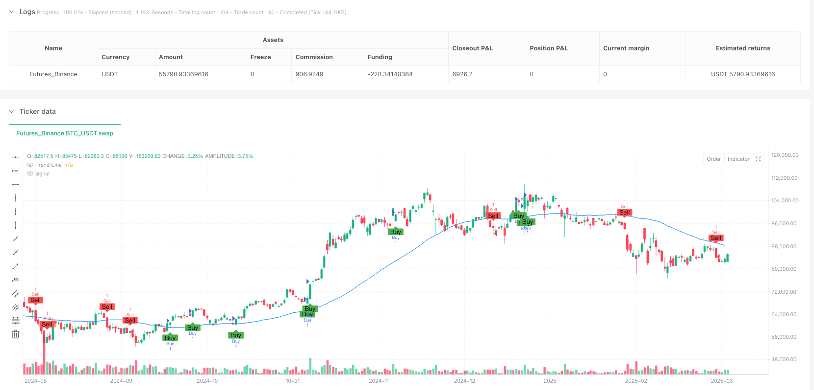
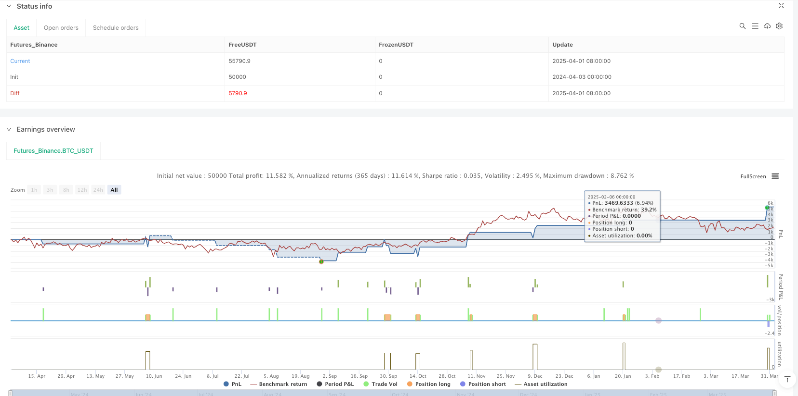

> Name

Multi-Filter-Convergence-Scalping-Strategy-Technical-Analysis-Approach
> Author

ianzeng123

> Strategy Description





[trans]
### Overview
The Multiple Filter Convergence Short-Term Trading Strategy is a sophisticated quantitative trading method designed for traders who wish to capture short-term price fluctuations in rapidly moving markets. This strategy identifies precise buying and selling opportunities by combining trend analysis, momentum indicators, volume, volatility, and candlestick patterns. This approach solves the problem of finding reliable entry and exit points in volatile or unpredictable markets, making it ideal for short-term traders, while providing built-in risk management capabilities through stop-loss and take-profit settings.
### Strategy Principles
This strategy uses a multiple filtering mechanism to generate trading signals only when all technical indicators meet the conditions at the same time to ensure high probability trading opportunities. Specifically, the strategy uses the following five key components:
1. **Trend Direction**: The 50-period Simple Moving Average (SMA) serves as a trend filter. If the price is above this line, it indicates a bullish market and is suitable for buying; if the price is below the line, it indicates a bearish market and is suitable for selling.
2. **Momentum Indicator**: The 14-period relative strength index (RSI) is used to measure the speed of price changes. It ensures that the market is not overbought (RSI < 70) when buying and oversold (RSI > 30) when selling.
3. **Volume Analysis**: The strategy compares current trading volume to the 20-period average volume to confirm that market participation is strong. Only movements above average volume will trigger the signal.
4. **Volatility**: The 14-period Average True Range (ATR) checks whether the price fluctuation is large enough (above the user-set minimum value, which defaults to 2.0) to justify the trade.
5. **Candlestick Patterns**: Simple yet effective pattern recognition (for example, a bullish candle that opens below the previous day's close and then closes above the previous day's close) adds confirmation to a signal.
A buy or sell signal will only trigger when all these conditions coincide, ensuring high-probability trading. Once the signal is triggered, the strategy automatically places the order and sets customizable Stop Loss (e.g., 1% below the entry point) and Take Profit (e.g., 2% above the entry point) levels.
### Strategic Advantages
The multiple filtering convergence short-term trading strategy has several obvious advantages:
1. **Reduce False Signals**: Since the strategy requires all five technical indicators to be confirmed simultaneously, the possibility of false signals is greatly reduced and the success rate of transactions is improved.
2. **Comprehensive Market Analysis**: By taking into account trend, momentum, volume, volatility and price patterns simultaneously, the strategy provides a comprehensive analysis of market conditions rather than relying solely on a single indicator.
3. **Adaptable**: The parameters of the strategy can be adjusted according to different market environments, making it suitable for various trading varieties and time frames, whether it is a low-volatility or high-volatility market.
4. **Built-in Risk Management**: Automatic stop-loss and take-profit settings ensure that the risk of each transaction is controlled, helping traders maintain discipline and avoid emotional decision-making.
5. **Levels of technical confirmation**: The strategy provides multiple levels of technical confirmation, from long-term trends (SMA) to short-term price behavior (candlestick patterns), allowing traders to be more confident in the reliability of signals.
6. **Automation Potential**: The clear rules and conditions of the strategy make it easy to program and automate, reducing the need for human intervention and suitable for busy traders or traders who want to reduce the emotional impact.
### Strategy Risk
Although the multi-filter convergence strategy is well designed, there are some potential risks and limitations:
1. **Missed Trading Opportunities**: Since the strategy requires all filters to be confirmed simultaneously, some trading opportunities that only partially meet the conditions but are still profitable may be missed, especially in fast-moving markets.
2. **Parameter Optimization Requirements**: The effectiveness of the strategy is highly dependent on selecting appropriate parameters for specific trading instruments and market conditions. Improper parameter settings can lead to over-optimization or poor performance.
3. **Limitations of Fixed Percent Stop Loss**: Using a fixed percentage stop loss may not be suitable for all market environments, especially during periods of sudden changes in volatility.
4. **Volume Dependence**: In less liquid markets or during certain time periods, high volume requirements may result in reduced signal frequency and reduced trading opportunities.
5. **Technical Indicator Hysteresis**: All technical indicators have a certain degree of lag, which may result in slower reactions in extreme market conditions.
6. **Form limitations of strong trending markets**: In strong trending markets, it may be difficult to meet specific candlestick pattern requirements, resulting in missed potential trend following opportunities.
To mitigate these risks, traders should consider conducting adequate backtesting before live trading and adjust parameters based on their risk tolerance.
### Strategy optimization direction
Based on the analysis of strategy principles and potential risks, the following are several possible optimization directions:
1. **Adaptive parameters**: Change fixed parameters (such as moving average length, RSI threshold) to dynamic parameters that are automatically adjusted based on market conditions. For example, in different volatility environments, the ATR minimum can be automatically adjusted based on historical volatility.
2. **Multiple time frame analysis**: Integrate confirmation signals from multiple time frames, such as using a larger time frame to determine the main trend direction, and then looking for specific entry points on a smaller time frame.
3. **Improved stop loss strategy**: Use ATR-based stop loss instead of fixed percentage stop loss to better adapt to the volatility characteristics of different trading varieties. For example, the stop loss can be set to the entry point minus 1.5 times the current ATR value.
4. **Add market status filter**: Add the recognition function of market status (such as range oscillation or trend) to the algorithm, and adopt different trading rules according to different market status.
5. **Signal Strength Grading**: Instead of a simple binary signal (buy/sell), the signal is graded based on the strength that meets the conditions, allowing the position size to be adjusted according to the signal strength.
6. **Machine Learning Integration**: Use machine learning algorithms to optimize parameter combinations or predict which signals are more likely to be successful, especially in identifying patterns in a specific market environment.
These optimizations can be implemented individually or combined to improve the overall performance and adaptability of the strategy. Before implementing any optimization, it is recommended to conduct a thorough backtest under different market conditions.
### Summary
The multiple filtering convergence short-term trading strategy provides short-term traders with a comprehensive and powerful trading system by integrating multiple technical analysis methods. Its core advantage is that it combines multiple independent technical indicators and generates a trading signal only when all indicators point in the same direction, thus significantly improving the reliability of the signal.
The strategy's flexibility makes it suitable for a variety of market environments and trading instruments, while built-in risk management features help protect capital and maintain long-term profitability. Although there are some inherent limitations and risks, these issues can be effectively mitigated through continued parameter optimization and the strategy improvements suggested above.
For traders who wish to apply a systematic and disciplined approach to short-term trading, the Multiple Filter Convergence Strategy provides a solid framework that takes into account the technical aspects of the market while focusing on risk control. It is a comprehensive and balanced approach in the field of quantitative trading.
|| 

### Overview
The Multi-Filter Convergence Scalping Strategy is a precision-designed quantitative trading method created for traders who want to capture short-term price movements in fast-moving markets. This strategy identifies precise buy and sell opportunities by combining trend analysis, momentum indicators, volume, volatility, and candlestick patterns. This approach solves the problem of finding reliable entry and exit points in choppy or unpredictable markets, making it ideal for scalpers, while providing built-in risk management through stop-loss and take-profit settings.

### Strategy Principles
The strategy employs a multi-filter mechanism where trading signals are generated only when all technical indicators simultaneously meet the conditions, ensuring high-probability trading opportunities. Specifically, the strategy uses the following five key components:

1. **Trend Direction**: A 50-period Simple Moving Average (SMA) acts as a trend filter. If the price is above this line, it indicates a bullish market suitable for buying; if below, it indicates a bearish market suitable for selling.

2. **Momentum Indicator**: The 14-period Relative Strength Index (RSI) measures the speed of price movements. It ensures the market isn't overbought (RSI < 70) for buys or oversold (RSI > 30) for sells.

3. **Volume Analysis**: The strategy compares current trading volume to a 20-period average volume to confirm strong market participation—only moves with above-average volume trigger signals.

4. **Volatility**: The 14-period Average True Range (ATR) checks if price swings are large enough (above a user-set minimum, default 2.0) to justify a trade.

5. **Candlestick Patterns**: Simple yet effective pattern recognition (e.g., a bullish candle closing higher than the previous day's close after opening lower) adds confirmation to signals.

Buy or sell signals trigger only when all these conditions align, ensuring high-probability trades. Once a signal fires, the strategy automatically places orders with customizable stop-loss (e.g., 1% below entry) and take-profit (e.g., 2% above entry) levels.

### Strategy Advantages
The Multi-Filter Convergence Scalping Strategy offers several distinct advantages:

1. **Reduced False Signals**: By requiring all five technical indicators to confirm simultaneously, the strategy greatly reduces the likelihood of false signals, improving the success rate of trades.

2. **Comprehensive Market Analysis**: By considering trend, momentum, volume, volatility, and price patterns simultaneously, the strategy provides a comprehensive analysis of market conditions rather than relying on a single indicator.

3. **High Adaptability**: The strategy's parameters can be adjusted for different market environments, making it applicable to various trading instruments and timeframes, whether in low or high volatility markets.

4. **Built-in Risk Management**: Automatic stop-loss and take-profit settings ensure that risk is controlled for each trade, helping traders maintain discipline and avoid emotional decision-making.

5. **Hierarchical Technical Confirmation**: The strategy provides multiple layers of technical confirmation, from long-term trends (SMA) to short-term price action (candlestick patterns), giving traders greater confidence in the reliability of signals.

6. **Automation Potential**: The strategy's clear rules and conditions make it easy to program and automate, reducing the need for human intervention, suitable for busy traders or those looking to reduce emotional influence.

### Strategy Risks
Despite its sophisticated design, the Multi-Filter Convergence Strategy has some potential risks and limitations:

1. **Missed Trading Opportunities**: As the strategy requires all filters to confirm simultaneously, it may miss potentially profitable trading opportunities that satisfy only some conditions, especially in rapidly changing markets.

2. **Parameter Optimization Needs**: The strategy's effectiveness is highly dependent on selecting appropriate parameters for specific trading instruments and market conditions. Inappropriate parameter settings may lead to over-optimization or poor performance.

3. **Limitations of Fixed Stop-Loss Percentages**: Using fixed percentage stop-losses may not be suitable for all market environments, especially during periods of sudden volatility changes.

4. **Volume Dependency**: In less liquid markets or certain time periods, the high volume requirement may reduce signal frequency, limiting trading opportunities.

5. **Technical Indicator Lag**: All technical indicators have some degree of lag, which may result in slower reactions during extreme market conditions.

6. **Pattern Limitations in Strong Trend Markets**: In strongly trending markets, it may be difficult to satisfy specific candlestick pattern requirements, leading to missed trend-following opportunities.

To mitigate these risks, traders should consider thorough backtesting before live trading and adjusting parameters according to their risk tolerance.

### Strategy Optimization Directions
Based on the analysis of strategy principles and potential risks, here are several possible optimization directions:

1. **Adaptive Parameters**: Convert fixed parameters (such as moving average length, RSI thresholds) to dynamic parameters that automatically adjust based on market conditions. For example, the ATR minimum value could automatically adjust based on historical volatility in different volatility environments.

2. **Multi-Timeframe Analysis**: Integrate confirmation signals from multiple timeframes, for instance, using larger timeframes to determine the main trend direction, then looking for specific entry points on smaller timeframes.

3. **Improved Stop-Loss Strategy**: Replace fixed percentage stop-losses with ATR-based stops to better accommodate the volatility characteristics of different trading instruments. For example, the stop-loss could be set at the entry point minus 1.5 times the current ATR value.

4. **Add Market State Filters**: Incorporate functionality to identify market states (such as range-bound or trending) in the algorithm and apply different trading rules based on different market states.

5. **Signal Strength Grading**: Instead of binary signals (buy/sell), grade signals based on the strength of conditions met, allowing for position sizing adjustments according to signal strength.

6. **Machine Learning Integration**: Use machine learning algorithms to optimize parameter combinations or predict which signals are more likely to succeed, particularly in identifying patterns in specific market environments.

These optimizations can be implemented individually or in combination to improve the overall performance and adaptability of the strategy. Before implementing any optimization, thorough backtesting under different market conditions is recommended.

### Summary
The Multi-Filter Convergence Scalping Strategy provides scalpers with a comprehensive and powerful trading system by integrating multiple technical analysis methods. Its core strength lies in combining several independent technical indicators, generating trading signals only when all indicators consistently point in the same direction, significantly improving signal reliability.

The strategy's flexibility makes it applicable to various market environments and trading instruments, while its built-in risk management features help protect capital and maintain long-term profitability. Although there are some inherent limitations and risks, these can be effectively mitigated through continuous parameter optimization and the strategy improvements suggested above.

For traders seeking to apply a systematic and disciplined approach to scalping, the Multi-Filter Convergence Strategy provides a solid framework that considers both technical aspects of the market and risk control, representing a comprehensive and balanced approach in the field of quantitative trading.
[/trans]


> Source (PineScript)

``` pinescript
/*backtest
start: 2024-04-03 00:00:00
end: 2025-04-02 00:00:00
period: 1d
basePeriod: 1d
exchanges: [{"eid":"Futures_Binance","currency":"BTC_USDT"}]
*/

//@version=6
strategy("Malama's Scalping", overlay=true)

// ──────────────────────────────
// SETTINGS YOU CAN CHANGE
// ──────────────────────────────
// Trend Length: How many candles (price bars) to check for the trend
trendLength = input.int(50, title="Trend Length")

// RSI Length: How many candles to measure price speed
rsiLength = input.int(14, title="RSI Length")

// Stop Loss: How much you’re willing to lose (in %)
stopLossPerc = input.float(1.0, title="Stop Loss (%)")

// Take Profit: How much profit you want to take (in %)
takeProfitPerc = input.float(2.0, title="Take Profit (%)")

// Volume Length: How many candles to average volume over
volumeLength = input.int(20, title="Volume Length")

// Volatility (ATR) Length: How many candles to measure price movement
atrLength = input.int(14, title="Volatility Length")

// Minimum Volatility: Price needs to move this much to trade (adjust for TSLA)
minVolatility = input.float(2.0, title="Minimum Volatility (ATR)")

// ──────────────────────────────
// CALCULATIONS
// ──────────────────────────────
// Trend: The average price over the trend length (a blue line on the chart)
trendMA = ta.sma(close, trendLength)

// Is the price above the trend line? (Good for buying)
isBullish = close > trendMA

// Is the price below the trend line? (Good for selling)
isBearish = close < trendMA

// RSI: Checks how fast the price is moving (0-100 scale)
rsiValue = ta.rsi(close, rsiLength)

// Is RSI not too high for buying? (Below 70 means it’s okay)
isRSIOKForBuy = rsiValue < 70

// Is RSI not too low for selling? (Above 30 means it’s okay)
isRSIOKForSell = rsiValue > 30

// Volume: Is today’s trading activity higher than the average?
volumeAvg = ta.sma(volume, volumeLength)
isHighVolume = volume > volumeAvg

// Volatility (ATR): Measures how much the price is moving on average
atrValue = ta.atr(atrLength)

// Is the market moving enough to trade? (ATR must be above the minimum)
isVolatileEnough = atrValue > minVolatility

// Candlestick Pattern: A simple check for a strong buy signal
// (Price opens lower than yesterday’s close but closes higher)
bullishPattern = open < close[1] and close > open[1]

// Candlestick Pattern: A simple check for a strong sell signal
// (Price opens higher than yesterday’s close but closes lower)
bearishPattern = open > close[1] and close < open[1]

// ──────────────────────────────
// SIGNALS
// ──────────────────────────────
// Buy Signal: Price is above trend, RSI is okay, volume is high, pattern fits, and market is moving enough
buySignal = isBullish and isRSIOKForBuy and isHighVolume and bullishPattern and isVolatileEnough

// Sell Signal: Price is below trend, RSI is okay, volume is high, pattern fits, and market is moving enough
sellSignal = isBearish and isRSIOKForSell and isHighVolume and bearishPattern and isVolatileEnough

// ──────────────────────────────
// VISUALS ON THE CHART
// ──────────────────────────────
// Show the trend line in blue
plot(trendMA, color=color.blue, title="Trend Line")

// Show a green "Buy" label below the bar when it’s time to buy
plotshape(buySignal, location=location.belowbar, color=color.green, style=shape.labelup, title="Buy", text="Buy")

// Show a red "Sell" label above the bar when it’s time to sell
plotshape(sellSignal, location=location.abovebar, color=color.red, style=shape.labeldown, title="Sell", text="Sell")

// ──────────────────────────────
// AUTOMATIC TRADING
// ──────────────────────────────
// If there’s a buy signal, enter a buy trade and set stop loss/take profit
if (buySignal)
    strategy.entry("Buy", strategy.long)
    strategy.exit("Exit Buy", "Buy", stop=close * (1 - stopLossPerc / 100), limit=close * (1 + takeProfitPerc / 100))

// If there’s a sell signal, enter a sell trade and set stop loss/take profit
if (sellSignal)
    strategy.entry("Sell", strategy.short)
    strategy.exit("Exit Sell", "Sell", stop=close * (1 + stopLossPerc / 100), limit=close * (1 - takeProfitPerc / 100))

```

> Detail

https://www.fmz.com/strategy/489330

> Last Modified

2025-04-03 14:59:34
