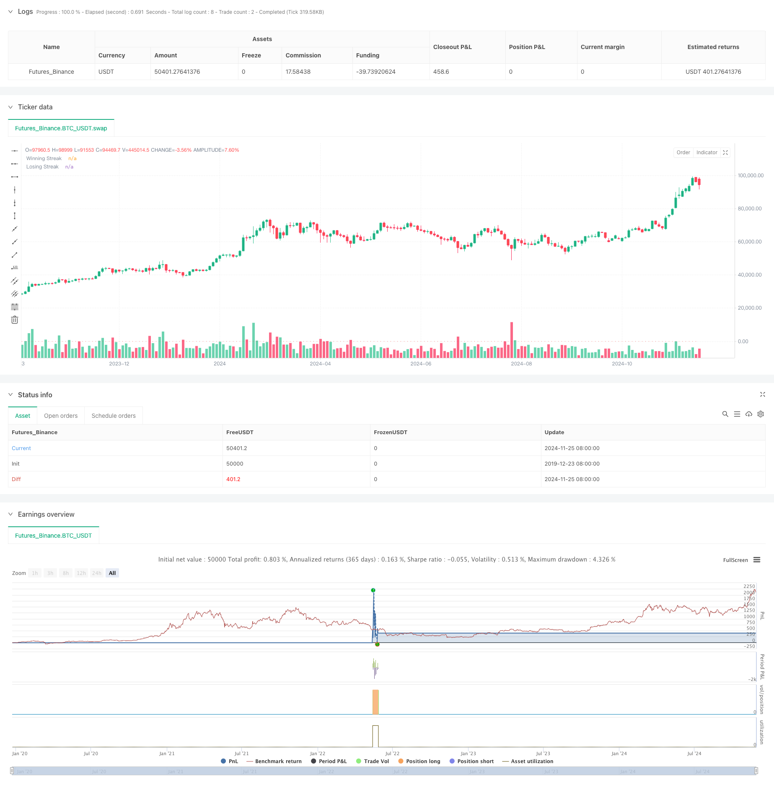

> Name

Multi-Frequency-Momentum-Reversal-Quantitative-Strategy-System-Multi-Frequency-Momentum-Reversal-Quantitative-Strategy-System
> Author

ChaoZhang

> Strategy Description



[trans]
#### Overview
This strategy is a quantitative trading system based on the continuous movement characteristics of the market. It captures market reversal opportunities by analyzing the frequency of continuous price increases or decreases. The core of the strategy is to set a threshold for continuous rise and fall, take reverse operations when the threshold is reached, and make trading decisions based on multi-dimensional indicators such as position time and K-line shape. This strategy makes full use of the reversal characteristics of the market and performs reverse operations when the price appears overbought or oversold.
#### Strategy Principle
The core logic of the strategy includes the following key elements:
1. Continuous number statistics: The system will count the number of consecutive price increases and decreases in real time and compare it with the preset threshold.
2. Trading direction selection: You can choose two directions: long or short. When going long, focus on continuous declines, and when going short, focus on continuous increases.
3. Position period management: Set a fixed position period and automatically close the position when it expires to avoid excessive positions.
4. Doji filter: Doji judgment is introduced to filter out false signals during market fluctuations.
5. Position control: Use a single position for trading, and do not add positions or open positions in batches.
#### Strategic Advantages
1. Clear logic: The trading logic of the strategy is intuitive and easy to understand and execute.
2. Controllable risk: Control risks through fixed position period and single position.
3. Strong adaptability: parameters can be adjusted according to different market characteristics.
4. High degree of automation: The entire process is automatically executed by the system, reducing human intervention.
5. Multi-dimensional analysis: Combining multiple dimensions such as price trends and K-line patterns.
#### Strategy Risk
1. Trend continuation risk: Misjudgments may occur in strong trending markets.
2. Parameter sensitivity: The settings of thresholds and holding periods directly affect strategy performance.
3. Market environment dependence: It performs better in volatile markets, but may suffer frequent losses in unilateral markets.
4. Impact of slippage: High-frequency trading may be affected by slippage.
5. Cost pressure: Frequent transactions generate higher transaction costs.
#### Strategy optimization direction
1. Introduce volatility indicators: adjust threshold settings through indicators such as ATR.
2. Add trend filtering: combined with long-term trend judgment to improve the winning rate.
3. Dynamic holding period: adaptively adjust the holding time according to market characteristics.
4. Position management optimization: Introduce a dynamic position management mechanism.
5. Multi-time period analysis: Add multi-period signal confirmation mechanism.
#### Summary
This strategy is a quantitative trading system based on market reversal characteristics, which captures market reversal opportunities by analyzing the continuous movement of prices. The strategy design is reasonable and the risks are controllable, but parameters need to be adjusted according to the market environment. Through continuous optimization and improvement, this strategy is expected to achieve stable returns in actual transactions. It is recommended to conduct sufficient historical data backtesting before real trading, and verify the effectiveness of the strategy in simulated trading.
|| 

#### Overview
This strategy is a quantitative trading system based on market continuous movement characteristics, capturing market reversal opportunities by analyzing the frequency of consecutive price rises or falls. The core of the strategy is to take reverse actions when reaching preset thresholds for consecutive movements, combining multiple dimensions such as holding periods and candlestick patterns for trading decisions.

#### Strategy Principles
The core logic includes several key elements:
1. Streak Counting: The system continuously tracks consecutive price increases and decreases, comparing them with preset thresholds.
2. Trade Direction Selection: Users can choose between long or short positions, focusing on losing streaks for long positions and winning streaks for short positions.
3. Holding Period Management: Fixed holding periods are set with automatic position closure to avoid over-holding.
4. Doji Filtering: Incorporates Doji candlestick analysis to filter false signals during market fluctuations.
5. Position Control: Utilizes single position trading without scaling or partial position building.

#### Strategy Advantages
1. Clear Logic: Trading logic is intuitive and easy to understand and execute.
2. Controlled Risk: Risk is managed through fixed holding periods and single position control.
3. High Adaptability: Parameters can be adjusted according to different market characteristics.
4. High Automation: Fully system-executed, reducing human intervention.
5. Multi-dimensional Analysis: Combines price trends, candlestick patterns, and other dimensions.

#### Strategy Risks
1. Trend Continuation Risk: Potential misjudgments in strong trend markets.
2. Parameter Sensitivity: Strategy performance directly affected by threshold and holding period settings.
3. Market Environment Dependency: Performs well in oscillating markets but may frequently lose in unidirectional markets.
4. Slippage Impact: High-frequency trading may be affected by slippage.
5. Cost Pressure: Frequent trading generates high transaction costs.

#### Strategy Optimization Directions
1. Incorporate Volatility Indicators: Adjust thresholds using indicators like ATR.
2. Add Trend Filtering: Improve win rate by incorporating long-term trend analysis.
3. Dynamic Holding Periods: Adapt holding times based on market characteristics.
4. Position Management Optimization: Introduce dynamic position management mechanisms.
5. Multi-timeframe Analysis: Add multi-period signal confirmation mechanisms.

#### Conclusion
This strategy is a quantitative trading system based on market reversal characteristics, capturing reversal opportunities through analysis of continuous price movements. The strategy design is reasonable with controlled risks but requires parameter adjustment according to market conditions. Through continuous optimization and improvement, this strategy has the potential to achieve stable returns in actual trading. It is recommended to conduct thorough historical data backtesting and verify strategy effectiveness in demo trading before live implementation.[/trans]


> Source (PineScript)

``` pinescript
/*backtest
start: 2019-12-23 08:00:00
end: 2024-11-27 08:00:00
period: 2d
basePeriod: 2d
exchanges: [{"eid":"Futures_Binance","currency":"BTC_USDT"}]
*/

//@version=5
strategy("Streak-Based Trading Strategy", overlay=true)

// User Inputs
trade_direction = input.string(title="Trade Direction", defval="Long", options=["Long", "Short"]) // Option to choose Long or Short
streak_threshold = input.int(title="Streak Threshold", defval=8, minval=1) // Input for number of streaks before trade
hold_duration = input.int(title="Hold Duration (in periods)", defval=7, minval=1) // Input for holding the position
doji_threshold = input.float(0.01, title="Doji Threshold (%)", minval=0.001) / 100 // Doji sensitivity

// Calculate win or loss streak
is_doji = math.abs(close - open) / (high - low) < doji_threshold
win = close > close[1] and not is_doji
loss = close < close[1] and not is_doji

// Initialize variables for streak counting
var int win_streak = 0
var int loss_streak = 0
var bool in_position = false
var int hold_counter = 0

// Track streaks (only when not in a position)
if not in_position
    if win
        win_streak += 1
        loss_streak := 0
    else if loss
        loss_streak += 1
        win_streak := 0
    else
        win_streak := 0
        loss_streak := 0

// Logic for closing the position after the holding duration
if in_position
    hold_counter -= 1
    if hold_counter <= 0
        strategy.close_all() // Close all positions
        in_position := false // Reset position flag
        win_streak := 0 // Reset streaks after position is closed
        loss_streak := 0

// Trade condition (only when no position is open and streak is reached)
if not in_position
    if trade_direction == "Long" and loss_streak >= streak_threshold
        strategy.entry("Long", strategy.long) // Open a long position
        in_position := true
        hold_counter := hold_duration // Set holding period

    if trade_direction == "Short" and win_streak >= streak_threshold
        strategy.entry("Short", strategy.short) // Open a short position
        in_position := true
        hold_counter := hold_duration // Set holding period

// Plotting streaks for visualization
plot(win_streak, color=color.green, title="Winning Streak", style=plot.style_histogram, linewidth=2)
plot(loss_streak, color=color.red, title="Losing Streak", style=plot.style_histogram, linewidth=2)
```

> Detail

https://www.fmz.com/strategy/473344

> Last Modified

2024-11-29 14:47:54
