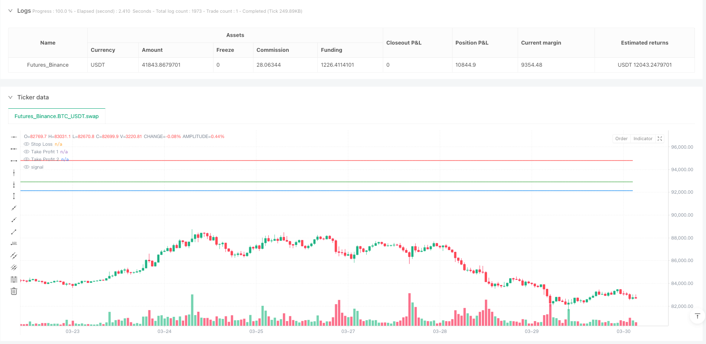
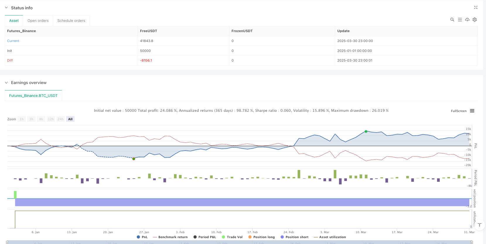

> Name

Multi-Indicator-Breakout-and-Reversal-Trading-Strategy-A-Dual-Entry-System-with-Opening-Range-Optimization
> Author

ianzeng123

> Strategy Description





[trans]

## Overview
The multi-indicator breakout and reversal trading strategy is a quantitative trading method that combines technical analysis indicators and price action to capture the two main types of trading opportunities in the market: price reversals and trend breakouts. This strategy cleverly integrates a variety of technical indicators such as moving averages, relative strength index (RSI), average true range (ATR) and volume weighted average price (VWAP), while introducing an opening range breakout (ORB) mechanism to enhance the reliability of entry signals. The strategy adopts a dual-target take-profit design and has a risk management mechanism that automatically adjusts the stop-loss to the break-even point. It is especially suitable for application on short time periods (such as 2-minute charts). It can also be applied to higher time periods through parameter adjustment.
## Strategy Principle
The core principle of this strategy is to identify three types of potentially beneficial trading opportunities through multiple indicator filters and confirmations:
1. **Reversal Trading Signals**:
   - Bull reversal: triggered when the price crosses the 50-period simple moving average (SMA50), the RSI is below the oversold threshold (default 30), and the price is below the VWAP, while the overall trend is upward (the price is above the SMA200).
   - Short reversal: Triggered when the price falls below SMA50, the RSI is above the overbought threshold (default 70), and the price is above VWAP, while the overall trend is downward (price is below SMA200).
2. **Trend Breakout Signal**:
   - Bull breakout: triggered when the 9-period exponential moving average (EMA9) crosses the 20-period exponential moving average (EMA20), the price is above VWAP, and the overall trend is upward.
   - Short breakout: triggered when EMA9 crosses EMA20, the price is below VWAP, and the overall trend is downward.
3. **Opening Range Breakout (ORB) Signal**:
   - Long ORB: Triggered when the price breaks through the highest price formed by a specific number of bars (default 15 bars) before the opening, and the trading volume exceeds the preset multiple of the average trading volume in the opening range (default 1.5 times).
   - Short ORB: Triggered when the price falls below the lowest price formed before the opening and the trading volume meets the threshold conditions.
The strategy uses the ATR indicator to calculate dynamic stop-loss positions, which are set by looking back at the lowest/highest prices for a specific period (default 7) and adding or subtracting multiples of the ATR value (default 0.5). After entering the market, the strategy sets two take-profit targets:
- First target (TP1): 0.5 times the risk (default), close 25% of the position
- Second target (TP2): 1.1 times the risk (default), close the remaining 75% of the position
When the first take-profit target is reached, the strategy automatically adjusts the stop-loss to the entry price (break-even point), effectively protecting the profits already obtained.
## Strategic Advantages
1. **Diversified entry signals**: By integrating three different entry signals: reversal, breakthrough and opening range breakout, the strategy can adapt to a variety of market environments, effectively increasing trading opportunities while maintaining high signal quality.
2. **Perfect risk management**: The strategy adopts a graded profit-taking mechanism, allowing partial profits while retaining potential greater profits. When the first take-profit target is reached, the stop-loss is automatically adjusted to the break-even point to achieve "let profits run" while protecting capital.
3. **Dynamic stop loss calculation**: Use the ATR indicator to calculate the stop loss position, so that the stop loss level can be dynamically adjusted according to market volatility, more accurately reflect the current market conditions, and avoid too tight or too loose stop loss settings.
4. **Trading volume confirmation**: In particular, a trading volume confirmation mechanism is introduced in the ORB signal, which requires that the trading volume at the time of breakthrough must exceed a specific multiple of the average trading volume in the opening range, effectively filtering out low-quality breakthroughs.
5. **Trend filter**: Use the 200-period simple moving average (SMA200) to determine the long-term trend direction to ensure that the trading direction is consistent with the main trend and improve the success rate of trading.
6. **Fund management integration**: The strategy has a built-in fund management mechanism that limits the proportion of funds used in each transaction (default 50% of capital), ensuring diversified allocation of funds and reducing the risk exposure of a single transaction.
## Strategy Risk
1. **Indicator lag**: The strategy mainly relies on lagging indicators such as moving averages, which may lead to delayed entry opportunities in rapidly changing markets, missing better entry points or causing unnecessary losses.
Solution: Consider adding forward-looking indicators such as price action pattern recognition, or shortening the parameters of longer-period moving averages to increase sensitivity to market changes.
2. **Parameter sensitivity**: A large number of adjustable parameters (such as EMA length, RSI threshold, ATR coefficient, etc.) complicate strategy optimization and may lead to overfitting of historical data and poor performance in future markets.
Solution: Use appropriate parameter optimization methods, such as forward verification and Monte Carlo simulation, to avoid over-optimization; or use fixed parameters and focus on more robust rule design.
3. **Multiple signal conflicts**: In certain market environments, different entry signals may produce conflicting trading recommendations, leading to unstable strategy performance.
Solution: Establish a stricter signal priority system, or introduce additional confirmation mechanisms to ensure that transactions are only executed in high-probability situations.
4. **Stop-loss gap risk**: In markets with greater volatility or low liquidity, the price may gap past the stop-loss position, causing actual losses to exceed expectations.
Solution: Consider using options hedging strategies, or increasing your stop loss distance or even temporarily reducing your position size during high-volatility market conditions.
5. **Systemic Risk Exposure**: A strategy that runs multiple related transactions at the same time may face systemic risks when the market fluctuates violently, causing multiple transactions to lose money at the same time.
Solution: Implement global risk control, limit the overall position size, or diversify transactions among different asset classes to reduce correlation risks.
## Strategy optimization direction
1. **Introducing machine learning models**: Applying machine learning algorithms to indicator weight optimization or market environment classification can automatically adjust the relative importance of each indicator under different market conditions and improve the adaptability of the strategy.
Reason for optimization: Traditional fixed-weight indicator combinations are difficult to adapt to different market stages, while machine learning can automatically learn the optimal indicator combination pattern from historical data.
2. **Integrated market sentiment indicators**: Add the volatility index (VIX) or high-frequency market sentiment indicators to help strategies better identify the market environment and adjust entry conditions and risk parameters.
Reason for optimization: Market sentiment has a significant impact on short-term price trends. Integrating such indicators can capture market turning points in advance and optimize the timing of entry and exit.
3. **Dynamic adjustment of take-profit ratio**: Automatically adjust the take-profit target based on historical volatility or support and resistance levels, so that the strategy can obtain reasonable profits in different volatile environments.
Reasons for optimization: A fixed risk-reward ratio may not be flexible enough in different market environments. Dynamic adjustments can set further goals in high-volatility markets and more conservative goals in low-volatility markets.
4. **Introduction of time filter**: Add a filtering mechanism based on market periods to avoid trading during low volatility or unfavorable periods, such as the first few minutes after the market opens or the midday period when liquidity is low.
Reasons for optimization: Market activity shows obvious differences at different times of the day, and time filtering can help strategies focus on the most advantageous trading periods.
5. **Optimize position size calculation**: Switch from a fixed capital ratio to a volatility-based position size calculation, automatically reduce positions during periods of high volatility, and increase positions appropriately during periods of low volatility.
Reasons for optimization: Risk is directly related to market volatility, and dynamic position management can maintain a more consistent risk level and improve long-term risk-adjusted returns.
## Summarize
The multi-indicator breakthrough and reversal trading strategy is a comprehensive quantitative trading system that integrates multiple technical analysis methods. By integrating reversal, trend breakthrough and opening range breakthrough signals, combined with a complete risk management and fund management mechanism, it aims to capture trading opportunities in various market environments. The core advantages of the strategy are signal diversification, perfect risk control and highly customizable parameters, which are particularly suitable for short-cycle trading. At the same time, the strategy also faces potential risks such as indicator lag, parameter sensitivity, and signal conflicts, and needs to be further optimized by introducing machine learning, market sentiment analysis, and dynamic take-profit settings. Overall, this is a comprehensively designed and clear-thinking trading strategy framework that provides a good starting point for quantitative traders. Through continuous improvement and proper risk management, it has the potential to become a robust and reliable trading system. ||
## Overview

The Multi-Indicator Breakout and Reversal Trading Strategy is a quantitative trading approach that combines technical analysis indicators with price action to capture two primary trading opportunities in the market: price reversals and trend breakouts. This strategy cleverly integrates multiple technical indicators including moving averages, Relative Strength Index (RSI), Average True Range (ATR), and Volume Weighted Average Price (VWAP), while also incorporating an Opening Range Breakout (ORB) mechanism to enhance entry signal reliability. The strategy employs a dual target profit-taking design and features an automatic risk management mechanism that adjusts the stop loss to breakeven, making it particularly suitable for short timeframes (such as 2-minute charts), with parameter adjustments allowing for application to higher timeframes as well.

## Strategy Principles

The core principle of this strategy is to identify three potential favorable trading opportunities through multiple indicator filtering and confirmation:

1. **Reversal Trading Signals**:
   - Long Reversal: Triggered when price crosses above the 50-period Simple Moving Average (SMA50), RSI is below the oversold threshold (default 30), price is below VWAP, and the overall trend is up (price above SMA200).
   - Short Reversal: Triggered when price crosses below SMA50, RSI is above the overbought threshold (default 70), price is above VWAP, and the overall trend is down (price below SMA200).

2. **Trend Breakout Signals**:
   - Long Breakout: Triggered when the 9-period Exponential Moving Average (EMA9) crosses above the 20-period Exponential Moving Average (EMA20), price is above VWAP, and the overall trend is up.
   - Short Breakout: Triggered when EMA9 crosses below EMA20, price is below VWAP, and the overall trend is down.

3. **Opening Range Breakout (ORB) Signals**:
   - Long ORB: Triggered when price breaks above the highest price formed during a specific number of bars (default 15) at the opening, and volume exceeds a preset multiple (default 1.5x) of the average volume in the opening range.
   - Short ORB: Triggered when price breaks below the lowest price formed at the opening, and volume meets the threshold condition.

The strategy uses the ATR indicator to calculate dynamic stop loss positions by looking back at the lowest/highest price over a specific period (default 7) and adding/subtracting a multiple (default 0.5) of the ATR value. After entry, the strategy sets two profit targets:
- First target (TP1): 0.5 times the risk (default), closing 25% of the position
- Second target (TP2): 1.1 times the risk (default), closing the remaining 75% of the position

When the first profit target is achieved, the strategy automatically adjusts the stop loss to the entry price (breakeven point), effectively protecting the profit already gained.

## Strategy Advantages

1. **Diversified Entry Signals**: By integrating three different entry signals—reversal, breakout, and opening range breakout—the strategy can adapt to various market environments, effectively increasing trading opportunities while maintaining high signal quality.

2. **Comprehensive Risk Management**: The strategy adopts a tiered profit-taking mechanism, allowing partial profit realization while retaining potential for greater returns. When the first profit target is reached, the stop loss is automatically adjusted to breakeven, achieving "let profits run" while protecting capital.

3. **Dynamic Stop Loss Calculation**: Using the ATR indicator to calculate stop loss positions allows the stop level to dynamically adjust based on market volatility, more accurately reflecting current market conditions and avoiding overly tight or loose stop loss settings.

4. **Volume Confirmation**: A volume confirmation mechanism is introduced especially in ORB signals, requiring that breakout volume must exceed a specific multiple of the average volume in the opening range, effectively filtering low-quality breakouts.

5. **Trend Filtering**: Using the 200-period Simple Moving Average (SMA200) to determine long-term trend direction ensures that trading direction is consistent with the main trend, improving the success rate of trades.

6. **Integrated Capital Management**: The strategy has built-in capital management mechanisms, limiting the proportion of funds used for each trade (default 50% of capital), ensuring diversified capital allocation and reducing risk exposure from any single trade.

## Strategy Risks

1. **Indicator Lag**: The strategy primarily relies on lagging indicators such as moving averages, which may lead to delayed entry timing in rapidly changing markets, missing optimal entry points or causing unnecessary losses.

   Solution: Consider adding forward-looking indicators such as price action pattern recognition, or shortening the parameters of longer-period moving averages to increase sensitivity to market changes.

2. **Parameter Sensitivity**: Numerous adjustable parameters (such as EMA length, RSI threshold, ATR coefficient, etc.) make strategy optimization complex and may lead to overfitting historical data, resulting in poor performance in future markets.

   Solution: Adopt appropriate parameter optimization methods, such as forward validation or Monte Carlo simulation, to avoid over-optimization; or use fixed parameters and focus on more robust rule design.

3. **Multi-Signal Conflicts**: In certain market environments, different entry signals may produce contradictory trading recommendations, leading to unstable strategy performance.

   Solution: Establish a stricter signal priority system or introduce additional confirmation mechanisms to ensure trades are executed only in high-probability situations.

4. **Stop Loss Gap Risk**: In volatile or less liquid markets, prices may gap beyond stop loss positions, resulting in actual losses exceeding expectations.

   Solution: Consider using options hedging strategies, or increase stop loss distance in high-volatility market conditions, or even temporarily reduce position size.

5. **Systemic Risk Exposure**: Running multiple related trades simultaneously, the strategy may face systemic risk during severe market volatility, leading to multiple trades losing at the same time.

   Solution: Implement global risk control, limit overall position size, or diversify trades across different asset classes to reduce correlation risk.

## Strategy Optimization Directions

1. **Introduce Machine Learning Models**: Applying machine learning algorithms to indicator weight optimization or market environment classification can automatically adjust the relative importance of various indicators under different market conditions, improving strategy adaptability.

   Optimization Rationale: Traditional fixed-weight indicator combinations struggle to adapt to different market phases, while machine learning can automatically learn the optimal indicator combination patterns from historical data.

2. **Integrate Market Sentiment Indicators**: Adding volatility indices (VIX) or high-frequency market sentiment indicators helps the strategy better identify market environments and adjust entry conditions and risk parameters.

   Optimization Rationale: Market sentiment significantly influences short-term price movements; integrating such indicators can capture market turning points in advance, optimizing entry and exit timing.

3. **Dynamically Adjust Profit-Taking Ratios**: Automatically adjusting profit targets based on historical volatility or support/resistance levels allows the strategy to capture reasonable profits in different volatility environments.

   Optimization Rationale: Fixed risk-reward ratios may not be flexible enough in different market environments; dynamic adjustment can set more distant targets in high-volatility markets and more conservative targets in low-volatility markets.

4. **Introduce Time Filters**: Adding filtering mechanisms based on market sessions helps avoid trading during low-volatility or unfavorable periods, such as the first few minutes after market opening or low-liquidity noon sessions.

   Optimization Rationale: Market activity shows significant differences across different periods of the day; time filtering can help the strategy focus on the most advantageous trading sessions.

5. **Optimize Position Size Calculation**: Switching from fixed capital percentage to volatility-based position sizing, automatically reducing positions during high-volatility periods and appropriately increasing positions during low-volatility periods.

   Optimization Rationale: Risk is directly related to market volatility; dynamic position management can maintain more consistent risk levels, improving long-term risk-adjusted returns.

## Summary

The Multi-Indicator Breakout and Reversal Trading Strategy is a comprehensive quantitative trading system that integrates various technical analysis methods. By combining reversal, trend breakout, and opening range breakout signals with comprehensive risk and capital management mechanisms, it aims to capture trading opportunities across various market environments. The core advantages of the strategy lie in signal diversification, robust risk control, and strong parameter customizability, making it particularly suitable for short-term trading. Meanwhile, the strategy also faces potential risks such as indicator lag, parameter sensitivity, and signal conflicts, requiring further optimization through machine learning integration, market sentiment analysis, dynamic profit-taking settings, and other approaches. Overall, this is a comprehensively designed, clearly structured trading strategy framework that provides quantitative traders with a solid starting point. Through continuous improvement and appropriate risk management, it has the potential to become a robust and reliable trading system.[/trans]


> Source (PineScript)

``` pinescript
/*backtest
start: 2025-01-01 00:00:00
end: 2025-03-31 00:00:00
period: 1h
basePeriod: 1h
exchanges: [{"eid":"Futures_Binance","currency":"BTC_USDT"}]
*/

//@version=5
strategy("Reversal & Breakout Strategy with ORB", overlay=true, pyramiding=2, initial_capital=50000)

// --- Inputs ---
ema9Length = input.int(9, "9 EMA Length", minval=1)
ema20Length = input.int(20, "20 EMA Length", minval=1)
sma50Length = input.int(50, "50 SMA Length", minval=1)
sma200Length = input.int(200, "200 SMA Length", minval=1)
rsiLength = input.int(14, "RSI Length", minval=1)
rsiOverbought = input.int(70, "RSI Overbought", minval=0, maxval=100)
rsiOversold = input.int(30, "RSI Oversold", minval=0, maxval=100)
atrLength = input.int(14, "ATR Length", minval=1)
stopMulti = input.float(0.5, "Stop Loss ATR Multiplier", minval=0.1, step=0.1)
stopLookback = input.int(7, "Stop Loss Lookback", minval=1)
rr1 = input.float(0.5, "Risk:Reward Target 1", minval=0.1, step=0.1)
rr2 = input.float(1.1, "Risk:Reward Target 2", minval=0.1, step=0.1)
target1Percent = input.float(25, "Profit % Target 1", minval=0, maxval=100)
orbBars = input.int(15, "Opening Range Bars", minval=1, tooltip="Number of bars to define the opening range (e.g., 15 bars = 30 min on 2-min chart)")
volThreshold = input.float(1.5, "Volume Threshold Multiplier", minval=1.0, step=0.1, tooltip="Volume must be this multiple of the opening range average")

// --- Indicators ---
// Moving Averages
ema9 = ta.ema(close, ema9Length)
ema20 = ta.ema(close, ema20Length)
sma50 = ta.sma(close, sma50Length)
sma200 = ta.sma(close, sma200Length)

// VWAP
vwapValue = ta.vwap(close)

// RSI
rsi = ta.rsi(close, rsiLength)

// ATR
atr = ta.atr(atrLength)

// --- Opening Range Breakout ---
var float openingRangeHigh = na
var float openingRangeLow = na
var float openingRangeAvgVol = na
if bar_index < orbBars
    openingRangeHigh := na
    openingRangeLow := na
    openingRangeAvgVol := na
else if bar_index == orbBars
    openingRangeHigh := ta.highest(high, orbBars)
    openingRangeLow := ta.lowest(low, orbBars)
    openingRangeAvgVol := ta.sma(volume, orbBars)

orbLong = not na(openingRangeHigh) and ta.crossover(close, openingRangeHigh) and volume > openingRangeAvgVol * volThreshold
orbShort = not na(openingRangeLow) and ta.crossunder(close, openingRangeLow) and volume > openingRangeAvgVol * volThreshold

// --- Trend Detection ---
trendUp = close > sma200
trendDown = close < sma200

// --- Reversal Conditions ---
reversalLong = ta.crossover(close, sma50) and rsi < rsiOversold and close < vwapValue and trendUp
reversalShort = ta.crossunder(close, sma50) and rsi > rsiOverbought and close > vwapValue and trendDown

// --- Range Breakout Conditions ---
breakoutLong = ta.crossover(ema9, ema20) and close > vwapValue and trendUp
breakoutShort = ta.crossunder(ema9, ema20) and close < vwapValue and trendDown

// Combine conditions
longCondition = (reversalLong or breakoutLong or orbLong)
shortCondition = (reversalShort or breakoutShort or orbShort)

// --- Calculate Position Size ---
equityPerPosition = 25000.0  // $50,000 / 2 positions
positionSizeLong = math.floor(equityPerPosition / close)
positionSizeShort = math.floor(equityPerPosition / close)

// --- Stop Loss Calculation ---
longStop = ta.lowest(low, stopLookback) - (atr * stopMulti)
shortStop = ta.highest(high, stopLookback) + (atr * stopMulti)

// --- Variables to Store Trade Levels ---
var float tradeStop = na
var float tradeTarget1 = na
var float tradeTarget2 = na
var float initialPositionSize = na
var bool breakEvenSet = false  // Track if stop has been moved to break-even
var float stopLevel = na       // Dedicated variable for stop loss in exits
var float target1Level = na    // Dedicated variable for first take profit
var float target2Level = na    // Dedicated variable for second take profit
var float qtyTotal = na        // Track total quantity

// --- Reset Levels Before New Trade ---
var bool newTrade = false
if longCondition or shortCondition
    newTrade := true
else
    newTrade := false

if strategy.position_size == 0 and newTrade
    tradeStop := na
    tradeTarget1 := na
    tradeTarget2 := na
    stopLevel := na
    target1Level := na
    target2Level := na
    initialPositionSize := na
    qtyTotal := na
    breakEvenSet := false

// --- Strategy Entries ---
if longCondition and strategy.position_size == 0
    strategy.entry("Long", strategy.long, qty=positionSizeLong * 2)
    tradeStop := longStop
    stopLevel := longStop
    stopDistance = close - tradeStop
    tradeTarget1 := close + (stopDistance * rr1)
    tradeTarget2 := close + (stopDistance * rr2)
    target1Level := tradeTarget1
    target2Level := tradeTarget2
    initialPositionSize := positionSizeLong * 2
    qtyTotal := positionSizeLong * 2
    breakEvenSet := false  // Reset break-even flag

if shortCondition and strategy.position_size == 0
    strategy.entry("Short", strategy.short, qty=positionSizeShort * 2)
    tradeStop := shortStop
    stopLevel := shortStop
    stopDistance = tradeStop - close
    tradeTarget1 := close - (stopDistance * rr1)
    tradeTarget2 := close - (stopDistance * rr2)
    target1Level := tradeTarget1
    target2Level := tradeTarget2
    initialPositionSize := positionSizeShort * 2
    qtyTotal := positionSizeShort * 2
    breakEvenSet := false  // Reset break-even flag

// --- Trade Exits ---
if strategy.position_size > 0
    qty_tp1 = qtyTotal * (target1Percent / 100)
    qty_tp2 = qtyTotal * ((100 - target1Percent) / 100)
    strategy.exit("Long Exit 1", "Long", qty=qty_tp1, stop=stopLevel, limit=target1Level)
    strategy.exit("Long Exit 2", "Long", qty=qty_tp2, stop=stopLevel, limit=target2Level)

if strategy.position_size < 0
    qty_tp1 = qtyTotal * (target1Percent / 100)
    qty_tp2 = qtyTotal * ((100 - target1Percent) / 100)
    strategy.exit("Short Exit 1", "Short", qty=qty_tp1, stop=stopLevel, limit=target1Level)
    strategy.exit("Short Exit 2", "Short", qty=qty_tp2, stop=stopLevel, limit=target2Level)

// --- Move Stop to Break-even ---
if strategy.position_size != 0 and not na(initialPositionSize) and not breakEvenSet
    if math.abs(strategy.position_size) < math.abs(initialPositionSize)
        tradeStop := strategy.position_avg_price
        stopLevel := strategy.position_avg_price
        tradeTarget1 := na  // Clear first target for plotting
        breakEvenSet := true  // Mark break-even as set

// --- Manual Close Fallback ---
if strategy.position_size > 0
    if close >= target2Level or close <= stopLevel
        strategy.close("Long", qty=qtyTotal, comment="Manual Close")

if strategy.position_size < 0
    if close <= target2Level or close >= stopLevel
        strategy.close("Short", qty=qtyTotal, comment="Manual Close")

// --- Reset Levels When No Position ---
if strategy.position_size == 0 and not newTrade
    tradeStop := na
    tradeTarget1 := na
    tradeTarget2 := na
    stopLevel := na
    target1Level := na
    target2Level := na
    initialPositionSize := na
    qtyTotal := na
    breakEvenSet := false

// --- Plotting ---
plot(tradeStop, title="Stop Loss", color=color.red, linewidth=1, style=plot.style_linebr)
plot(tradeTarget1, title="Take Profit 1", color=color.green, linewidth=1, style=plot.style_linebr)
plot(tradeTarget2, title="Take Profit 2", color=color.blue, linewidth=1, style=plot.style_linebr)
```

> Detail

https://www.fmz.com/strategy/489048

> Last Modified

2025-04-01 16:00:37
