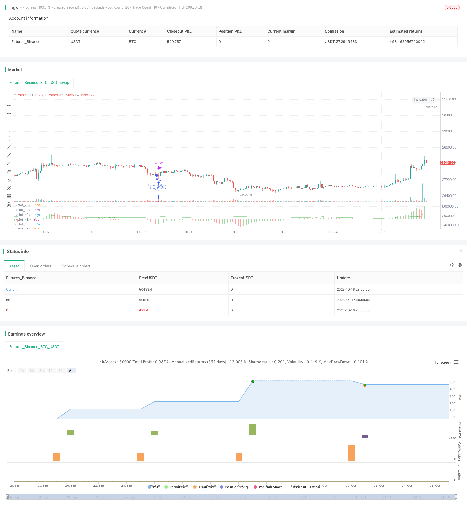

> Name

Multi-Indicator-Buy-and-Sell-Strategy
> Author

ChaoZhang

> Strategy Description



[trans]


### Overview
This strategy combines moving average indicators, overbought and oversold indicators, and volatility indicators to buy on dips when oversold and rebound, and sell on highs when overbought falls to achieve trend tracking.
### Strategy Principles
A position is established when the RSI and Stoch indicators are both in the oversold zone and the AO oscillator shows a reversal signal. Specifically, go long when RSI and Stoch are both low (below 30 and 20), and AO turns from negative to positive; go short when RSI and Stoch are both high (above 70, 80), and AO turns from positive to negative. Stop loss and take profit are set based on the value of the ATR indicator, allowing the stop loss and take profit positions to be adjusted according to market fluctuations.
This strategy mainly uses four indicators:
- AO oscillator: reflects the momentum of price changes and can be used to determine trend reversal.
- RSI Relative Strength Index: reflects overbought and oversold conditions. Below 30 is oversold territory.
- StochStochastic: Reflects overbought and oversold areas. Below 20 is oversold territory.  
-ATR average true volatility: reflects the recent price fluctuations.
When AO has a reversal signal, and RSI and Stoch are both in the oversold zone, it means that the price may reverse, and you can step in to establish a position. The ATR indicator is used to set the stop-loss and take-profit prices, and adjust the stop-loss and take-profit ranges according to market volatility to avoid being trapped.
### Strategic Advantages
- Use multiple indicators to confirm signals to avoid wrong transactions caused by a single indicator.
- Set stop-loss and stop-profit ranges according to market volatility, which can effectively control single losses.
- The strategic trading logic is simple and clear, easy to understand and implement.
- Use overbought and oversold conditions to intervene and capture reversal opportunities in time.
### Risks and Solutions
- The AO indicator is prone to produce false signals and needs to be used in combination with the RSI and Stoch indicators to avoid wrong transactions.
- Fixed parameter settings may not be able to adapt to market changes, and parameters need to be optimized.
- If the stop loss point is too close, the loss may be stopped frequently. You can appropriately relax the stop loss range or use an exit strategy.
- Fixed take profit points, possible premature exits or inlineCallbacks. You can use trailing take profit or exit in batches.
In order to reduce these risks, the following aspects can be optimized:
1. Optimize parameters to make them more adaptable to markets of different cycles and varieties.
2. Improve the stop loss mechanism, such as trailing stop loss, batch exit, etc. 
3. Optimize entry conditions to avoid false signals caused by a single indicator.
4. Optimize the take-profit method, such as moving take-profit or segmented take-profit based on the trend.
### Strategy optimization direction
This strategy can be optimized from the following aspects:
1. Optimize parameter settings. Better parameter combinations can be found through methods such as traversal optimization.
2. Add filter conditions. Additional indicator confirmation can be added when entering the market to avoid false signals.
3. Optimize the stop loss mechanism. You can use methods such as trailing stop loss and batch exit to control risks.
4. Optimize the profit-taking method. You can use moving take-profit, segmented take-profit based on trends, etc. to lock in more profits.
5. Add automatic profit stop. For example, take profit when approaching an important integer mark to avoid a rebound from highs.
6. Optimize fund management. For example, adjust the position size according to changes in risk and control the maximum loss.
7. Test optimization for specific varieties/cycles. Parameters and stop-loss and take-profit methods should be optimized for different varieties and cycles.
8. Increase the handling of emergencies. For example, avoid trading when there is important news, or stop losses quickly.
### Summarize
This strategy comprehensively uses the moving average system, overbought and oversold system, and volatility system to buy low when the value is underestimated and sell when the value is overvalued. It has strong trend tracking capabilities. However, there are also problems such as fixed parameter settings and imperfect stop loss mechanisms. We can optimize from multiple angles by optimizing parameter settings, improving the stop loss mechanism, and adding filtering conditions to make the strategy more robust and reliable. When using the real offer, it is also necessary to combine the backtest results to conduct testing and optimization for specific varieties and cycles, in order to maximize the effectiveness of the strategy and obtain stable returns.

||

### Overview

This strategy combines moving average, overbought-oversold and volatility rate indicators to buy on dips when oversold and sell on rallies when overbought, in order to track trends.

### Strategy Logic

Take positions when RSI and Stoch are both in oversold/overbought zones and AO oscillator shows reversal signal. Specifically, go long when RSI and Stoch are low (below 30 and 20) and AO turns from negative to positive; go short when RSI and Stoch are high (above 70 and 80) and AO turns from positive to negative. Set stop loss and take profit based on ATR value to adjust loss/profit levels according to market volatility.

The strategy mainly uses four indicators:

- AO oscillator: reflects price momentum, can be used to identify trend reversal.  
- RSI: reflects overbought/oversold levels. Below 30 is oversold zone.
- Stoch: reflects overbought/oversold zones. Below 20 is oversold zone.
- ATR: reflects recent price volatility.

When AO shows reversal signal and RSI & Stoch are both in oversold/overbought zones, price may reverse. Take positions at this time. Use ATR to set stop loss and take profit prices to avoid being trapped by adjusting loss/profit range based on volatility.

### Advantages

- Use multiple indicators to confirm signals, avoiding wrong trades from single indicator.
- Set stop loss/profit based on volatility to control single loss.
- Simple and clear logic, easy to understand and implement.  
- Take advantage of overbought/oversold situations to capture reversals.

### Risks and Solutions

- AO may generate false signals. Needs to combine with RSI and Stoch to avoid wrong trades.
- Fixed parameters may fail to adapt to market changes. Parameters need to be optimized.
- Stop loss too close may trigger frequent stops. Can loosen stop range or use exit strategies.  
- Fixed take profit may exit too early or late. Can use adaptive take profit or partial exits.

To reduce risks, optimize in below aspects:

1. Optimize parameters to adapt to different periods and instruments.
2. Improve stop loss methods like trailing stop, partial exits.
3. Optimize entry rules to avoid false signals.
4. Optimize take profit ways like adaptive take profit, segmented by trends.

### Optimization Directions

Below aspects can be optimized for the strategy:

1. Optimize parameter settings by traversing different values.

2. Add filter conditions on entry to avoid false signals.  

3. Optimize stop loss methods like trailing stop loss.

4. Optimize take profit ways like adaptive take profit.

5. Add automatic take profit near key levels to avoid pullback.

6. Optimize money management adjusting position size by risk.

7. Test and optimize parameters and stop/profit levels based on different instruments and timeframes.

8. Handle extreme events like avoiding trades during news or fast cut loss.

### Summary

This strategy combines moving average, overbought-oversold and volatility systems to buy low and sell high, with strong trend following ability. But some problems like fixed parameters and improper stop loss exist. We can optimize from various aspects like parameter tuning, improving stop loss, adding filters to make it more robust. In real trading, need to test and optimize based on specific instruments and periods to maximize its efficacy and profitability.

[/trans]

> Strategy Arguments


|Argument|Default|Description|
|----|----|----|
|v_input_1|5|Fast Length|
|v_input_2|34|Slow length|
|v_input_3|14|K|
|v_input_4|3|D|
|v_input_5|3|smooth|
|v_input_6_close|0|rsi source: close|high|low|open|hl2|hlc3|hlcc4|ohlc4|
|v_input_7|10|rsi length|
|v_input_8|14|ATR Length|


> Source (PineScript)

``` pinescript
/*backtest
start: 2023-09-17 00:00:00
end: 2023-10-17 00:00:00
period: 1h
basePeriod: 15m
exchanges: [{"eid":"Futures_Binance","currency":"BTC_USDT"}]
*/

//@version=4

strategy("Buy&Sell Strategy depends on AO+Stoch+RSI+ATR by SerdarYILMAZ", shorttitle="Buy&Sell Strategy")
// Created by Serdar YILMAZ
// This strategy is just for training, its purpose is just learning code in pine script.
// Don't make buy or sell decision with this strategy.
// Bu strateji sadece pine script'te kodlamanın nasıl yapildigini ogrenmek icindir.
// Bu stratejiye dayanarak, kesinlikle al-sat islemleri yapmayin.

//AO

fast=input(title="Fast Length",type=input.integer,defval=5)
slow=input(title="Slow length",type=input.integer,defval=34)

awesome=(sma(hl2,fast)-sma(hl2,slow))*1000

plot(awesome, style=plot.style_histogram, color=(awesome>awesome[1]?color.green:color.red))

//Stoch

K=input(title="K",type=input.integer,defval=14)
D=input(title="D",type=input.integer,defval=3)
smooth=input(title="smooth",type=input.integer,defval=3)

k=sma(stoch(close,high,low,K),D)
d=sma(k,smooth)

hline(80)
hline(20)

plot(k,color=color.blue)

//RSI

rsisource=input(title="rsi source",type=input.source,defval=close)
rsilength=input(title="rsi length",type=input.integer,defval=10)

rsi=rsi(rsisource,rsilength)

hline(70,color=color.orange)
hline(30,color=color.orange)

plot(rsi,color=color.orange)

//ATR

atrlen=input(title="ATR Length", type=input.integer,defval=14)

atrvalue=rma(tr,atrlen)

plot(atrvalue*1000,color=color.green)

LongCondition=k<20 and rsi<30 and awesome>awesome[1]
ShortCondition=k>80 and rsi>70 and awesome<awesome[1]
if (LongCondition)
    stoploss=low-atrvalue
    takeprofit=close+atrvalue
    strategy.entry("Long Position", strategy.long)
    strategy.exit("TP/SL",stop=stoploss,limit=takeprofit)
    
if (ShortCondition)
    stoploss=high+atrvalue
    takeprofit=close-atrvalue
    strategy.entry("Short Position",strategy.short)
    strategy.exit("TP/SL",stop=stoploss,limit=takeprofit)
    
    

    
    


```

> Detail

https://www.fmz.com/strategy/429567

> Last Modified

2023-10-18 11:36:38
