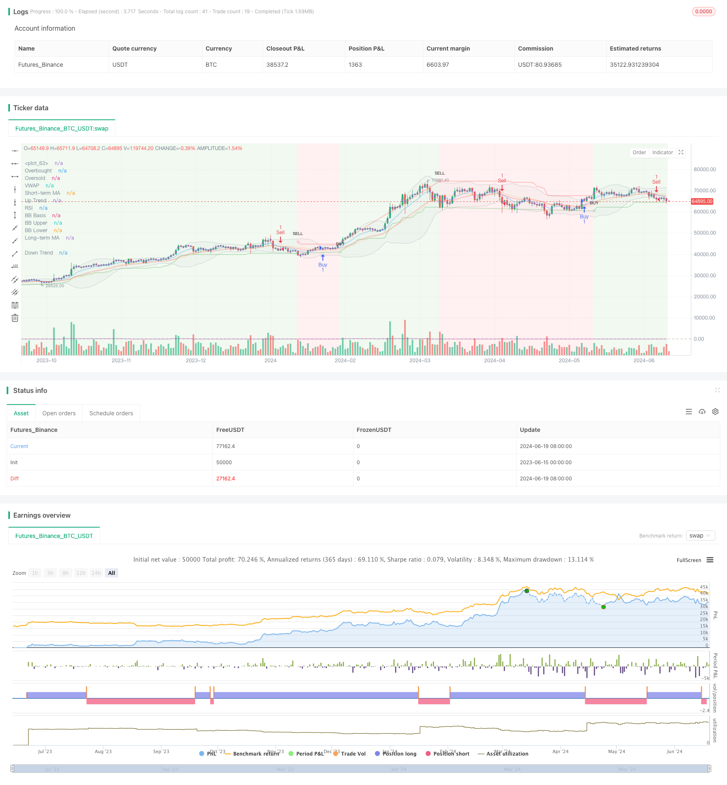

> Name

Multi-Indicator-Composite-Trend-Following-Strategy
> Author

ChaoZhang

> Strategy Description



[trans]
#### Overview
This strategy is a comprehensive technical analysis trading system that combines multiple commonly used technical indicators to generate buy and sell signals. This strategy mainly uses indicators such as the Moving Average (MA), Relative Strength Index (RSI), Bollinger Bands, Supertrend indicators, and Volume Weighted Average Price (VWAP) to judge market trends and make trading decisions through the crossover and breakthrough of these indicators. The core idea of ​​the strategy is to improve the reliability of trading signals through comprehensive analysis of multiple indicators, and at the same time use trend tracking methods to capture the main trends of the market.
#### Strategy Principle
1. Moving Average (MA): The strategy uses two exponential moving averages (EMA), which are short-term (9 periods) and long-term (21 periods). When the short-term moving average crosses the long-term moving average, it is considered a buy signal; conversely, when the short-term moving average crosses below the long-term moving average, it is considered a sell signal.
2. Relative Strength Index (RSI): The strategy uses the 14-period RSI indicator. Although RSI is not directly used in the code to generate trading signals, RSI can be used to determine whether the market is overbought or oversold and provides an auxiliary reference for other indicators.
3. Bollinger Bands: The strategy uses 20-period Bollinger Bands with a bandwidth of 2 times the standard deviation. Bollinger Bands can be used to determine the range of price fluctuations. When the price touches or breaks through the upper and lower rails, it may indicate a trend reversal.
4. Supertrend Indicator: This is a trend following indicator calculated based on ATR (Average True Range). When the Supertrend line moves from below to above the price, a buy signal is generated; when it moves from above to below, a sell signal is generated.
5. Volume Weighted Average Price (VWAP): VWAP is plotted on the chart and can be used to determine the position of the current price relative to the intraday average level, providing additional reference for trading decisions.
6. Background color: The strategy changes the background color of the chart according to the trend direction of the Supertrend indicator. Green indicates an upward trend and red indicates a downward trend, which visually displays the overall trend of the market.
The final trading signal for the strategy is generated based on the crossover of the short-term and long-term moving averages. When the short-term moving average crosses the long-term moving average, a buy signal is triggered; when the short-term moving average crosses below the long-term moving average, a sell signal is triggered. This method is designed to capture the initial stages of a trend, while other indicators can be used to confirm the validity of the signal.
#### Strategic Advantages
1. Multi-indicator comprehensive analysis: By combining multiple technical indicators, the strategy can analyze the market from different angles and improve the reliability and accuracy of signals. This approach can reduce false signals that a single indicator may bring.
2. Trend following: The core of the strategy is to follow market trends, which helps capture big market trends and improve profit opportunities.
3. Visualization effect: The strategy draws multiple indicators and signals on the chart, including changes in background color, which allows traders to intuitively understand the market status and potential trading opportunities.
4. Flexibility: The strategy provides multiple adjustable parameters, allowing traders to optimize according to different market conditions and personal preferences.
5. Comprehensive market analysis: The strategy provides comprehensive market analysis by comprehensively considering price trends (moving averages), volatility (Bollinger Bands), momentum (RSI), and volume (VWAP).
6. Automated trading: The strategy can realize automated trading on the TradingView platform, reducing the impact of human emotions and improving the objectivity and discipline of trading.
#### Strategy Risk
1. Over-optimization: Since the strategy contains multiple indicators and parameters, there is a risk of over-optimization. Over-optimization may result in a strategy that performs well on historical data but performs poorly in actual trading.
2. Signal lag: Moving averages and other technical indicators often have a lag, which may result in larger retracements near trend turning points.
3. Frequent trading: In a volatile market, the moving average may cross frequently, resulting in too many trading signals and high transaction costs.
4. Changes in market conditions: A strategy may perform well under specific market conditions, but its effectiveness may decline significantly when market conditions change.
5. Indicator conflicts: Multiple indicators may produce conflicting signals at certain times, which may lead to difficulty and uncertainty in trading decisions.
6. Lack of risk management: There are no clear stop loss and take profit settings in the code, which may lead to excessive losses in adverse market conditions.
#### Strategy optimization direction
1. Introduce dynamic parameters: You can consider dynamically adjusting the parameters of the moving average and Bollinger Bands according to market volatility to adapt to different market environments.
2. Add filter conditions: Additional filter conditions can be added, such as volume confirmation or trend strength indicators, to reduce false signals and improve trade quality.
3. Implement stop loss and take profit: Add appropriate stop loss and take profit mechanisms to the strategy to control risks and lock in profits.
4. Optimize entry timing: You can consider combining the signals of RSI and Bollinger Bands to optimize entry timing, such as entering when the RSI is in the overbought/oversold area and the price is close to the Bollinger Band boundary.
5. Add market regime recognition: realize the recognition of different market states (trends, shocks), and adopt different trading strategies in different states.
6. Improve the use of Supertrend indicator: You can consider using Supertrend indicator as the main trend judgment tool, not just for changes in background color.
7. Add sentiment indicators: Introduce market sentiment indicators based on trading volume or volatility to help determine the overall state of the market and potential turning points.
8. Implement position management: dynamically adjust position size based on signal strength and market volatility to optimize the risk-return ratio.
#### Summarize
"Multi-Indicator Combination Trend Following Strategy" is a comprehensive technical analysis trading system that generates trading signals by combining multiple commonly used technical indicators. The core advantage of this strategy lies in its comprehensive market analysis methods and trend tracking capabilities, which enable it to evaluate market conditions and make trading decisions from multiple angles. However, strategies also face risks such as over-optimization, signal lag, and frequent trading.
In order to further improve the effectiveness of the strategy, optimization measures such as introducing dynamic parameter adjustment, adding filtering conditions, implementing a stop-loss and stop-profit mechanism, optimizing entry timing, and adding market regime recognition can be considered. In addition, improving the use of Supertrend indicators, adding sentiment indicators and achieving effective position management are also directions worth exploring.
Overall, this strategy provides traders with a comprehensive technical analysis framework, but in actual application it needs to be appropriately adjusted and optimized based on specific market conditions and personal risk preferences. Through continuous testing and improvement, this strategy has the potential to become a powerful trading tool, helping traders make more informed decisions in complex and volatile markets.
|| 

#### Overview

This strategy is a comprehensive technical analysis trading system that combines multiple commonly used technical indicators to generate buy and sell signals. The strategy primarily utilizes Moving Averages (MA), Relative Strength Index (RSI), Bollinger Bands (BB), Supertrend indicator, and Volume Weighted Average Price (VWAP) to assess market trends and make trading decisions. The core idea of the strategy is to enhance the reliability of trading signals through the comprehensive analysis of multiple indicators, while using trend-following methods to capture major market movements.

#### Strategy Principles

1. Moving Averages (MA): The strategy uses two Exponential Moving Averages (EMA), a short-term (9-period) and a long-term (21-period). A buy signal is generated when the short-term MA crosses above the long-term MA, and a sell signal when it crosses below.

2. Relative Strength Index (RSI): The strategy employs a 14-period RSI. Although not directly used for generating trading signals in the code, RSI can be used to determine if the market is overbought or oversold, providing auxiliary reference for other indicators.

3. Bollinger Bands (BB): The strategy uses 20-period Bollinger Bands with a width of 2 standard deviations. Bollinger Bands can be used to judge the range of price fluctuations, and when prices touch or break through the upper or lower bands, it may indicate a trend reversal.

4. Supertrend Indicator: This is a trend-following indicator based on the Average True Range (ATR) calculation. It generates a buy signal when the Supertrend line moves from below to above the price, and a sell signal when it moves from above to below.

5. Volume Weighted Average Price (VWAP): VWAP is plotted on the chart and can be used to judge the current price position relative to the intraday average level, providing additional reference for trading decisions.

6. Background Color: The strategy changes the chart background color based on the trend direction of the Supertrend indicator, with green indicating an uptrend and red indicating a downtrend, visually displaying the overall market trend.

The final trading signals are generated based on the crossover of short-term and long-term moving averages. A buy signal is triggered when the short-term MA crosses above the long-term MA, and a sell signal is triggered when it crosses below. This method aims to capture the beginning stages of trends, while other indicators can be used to confirm the validity of the signals.

#### Strategy Advantages

1. Multi-indicator Comprehensive Analysis: By combining multiple technical indicators, the strategy can analyze the market from different perspectives, improving the reliability and accuracy of signals. This approach can reduce false signals that might be generated by a single indicator.

2. Trend Following: The core of the strategy is to follow market trends, which helps capture major market movements and increase profit opportunities.

3. Visualization: The strategy plots multiple indicators and signals on the chart, including background color changes, allowing traders to intuitively understand market conditions and potential trading opportunities.

4. Flexibility: The strategy provides multiple adjustable parameters, allowing traders to optimize according to different market conditions and personal preferences.

5. Comprehensive Market Analysis: By considering price trends (moving averages), volatility (Bollinger Bands), momentum (RSI), and volume (VWAP), the strategy can provide a comprehensive market analysis.

6. Automated Trading: The strategy can be implemented for automated trading on the TradingView platform, reducing the impact of human emotions and improving the objectivity and discipline of trading.

#### Strategy Risks

1. Over-optimization: Due to the multiple indicators and parameters involved, there is a risk of over-optimization. This may lead to the strategy performing well on historical data but poorly in actual trading.

2. Signal Lag: Moving averages and other technical indicators typically have a lag, which may result in significant drawdowns near trend reversal points.

3. Frequent Trading: In oscillating markets, moving averages may cross frequently, leading to excessive trading signals and high transaction costs.

4. Changing Market Conditions: The strategy may perform well under specific market conditions but could significantly underperform when market environments change.

5. Indicator Conflicts: Multiple indicators may sometimes produce contradictory signals, which can lead to difficulties and uncertainties in trading decisions.

6. Lack of Risk Management: The code does not include explicit stop-loss and take-profit settings, which may result in excessive losses in unfavorable market conditions.

#### Strategy Optimization Directions

1. Introduce Dynamic Parameters: Consider dynamically adjusting parameters for moving averages and Bollinger Bands based on market volatility to adapt to different market environments.

2. Add Filtering Conditions: Additional filtering conditions, such as volume confirmation or trend strength indicators, can be added to reduce false signals and improve trading quality.

3. Implement Stop-Loss and Take-Profit: Incorporate appropriate stop-loss and take-profit mechanisms in the strategy to control risk and lock in profits.

4. Optimize Entry Timing: Consider combining RSI and Bollinger Bands signals to optimize entry timing, for example, entering when RSI is in overbought/oversold areas and price is near Bollinger Band boundaries.

5. Add Market Regime Recognition: Implement recognition of different market states (trend, oscillation) and adopt different trading strategies for different states.

6. Improve Supertrend Indicator Usage: Consider using the Supertrend indicator as the primary trend judgment tool, rather than just for background color changes.

7. Add Sentiment Indicators: Introduce market sentiment indicators based on volume or volatility to help judge the overall market state and potential turning points.

8. Implement Position Management: Dynamically adjust position sizes based on signal strength and market volatility to optimize the risk-reward ratio.

#### Conclusion

The "Multi-Indicator Composite Trend Following Strategy" is a comprehensive technical analysis trading system that generates trading signals by combining multiple commonly used technical indicators. The core advantages of this strategy lie in its comprehensive market analysis method and trend-following capability, allowing for market condition assessment from multiple angles and informed trading decisions. However, the strategy also faces risks such as over-optimization, signal lag, and frequent trading.

To further improve the effectiveness of the strategy, considerations can be given to introducing dynamic parameter adjustment, adding filtering conditions, implementing stop-loss and take-profit mechanisms, optimizing entry timing, and adding market regime recognition. Additionally, improving the use of the Supertrend indicator, adding sentiment indicators, and implementing effective position management are also worthwhile directions to explore.

Overall, this strategy provides traders with a comprehensive technical analysis framework, but appropriate adjustments and optimizations are needed in practical applications based on specific market conditions and individual risk preferences. Through continuous testing and improvement, this strategy has the potential to become a powerful trading tool, helping traders make more informed decisions in complex and changing markets.

[/trans]


> Source (PineScript)

``` pinescript
/*backtest
start: 2023-06-15 00:00:00
end: 2024-06-20 00:00:00
period: 1d
basePeriod: 1h
exchanges: [{"eid":"Futures_Binance","currency":"BTC_USDT"}]
*/

//@version=5
strategy("Comb Backtest Debug", overlay=true)

// Input Parameters
lengthMA1 = input.int(9, title="Short-term MA Length")
lengthMA2 = input.int(21, title="Long-term MA Length")
lengthRSI = input.int(14, title="RSI Length")
lengthBB = input.int(20, title="Bollinger Bands Length")
multBB = input.float(2.0, title="Bollinger Bands Multiplier")
lengthSupertrend = input.int(3, title="Supertrend Length")
multSupertrend = input.float(3.0, title="Supertrend Multiplier")
Periods = input.int(10, title="ATR Period")
src = input.source(hl2, title="Source")
Multiplier = input.float(3.0, title="ATR Multiplier", step=0.1)
changeATR = input.bool(true, title="Change ATR Calculation Method?")
highlighting = input.bool(true, title="Highlighter On/Off?")

// Moving Averages
ma1 = ta.ema(close, lengthMA1)
ma2 = ta.ema(close, lengthMA2)

// RSI
rsi = ta.rsi(close, lengthRSI)

// Bollinger Bands
basis = ta.sma(close, lengthBB)
dev = multBB * ta.stdev(close, lengthBB)
upperBB = basis + dev
lowerBB = basis - dev

// ATR Calculation
atr2 = ta.sma(ta.tr, Periods)
atr = changeATR ? ta.atr(Periods) : atr2

// Supertrend Calculation
up = src - (Multiplier * atr)
up1 = nz(up[1], up)
up := close[1] > up1 ? math.max(up, up1) : up

dn = src + (Multiplier * atr)
dn1 = nz(dn[1], dn)
dn := close[1] < dn1 ? math.min(dn, dn1) : dn

trend = 1
trend := nz(trend[1], trend)
trend := trend == -1 and close > dn1 ? 1 : trend == 1 and close < up1 ? -1 : trend

// VWAP
vwap = ta.vwap(close)

// Plotting Supertrend
upPlot = plot(trend == 1 ? up : na, title="Up Trend", style=plot.style_line, linewidth=2, color=color.new(color.green, 70))
dnPlot = plot(trend == 1 ? na : dn, title="Down Trend", style=plot.style_line, linewidth=2, color=color.new(color.red, 70))

// Buy and Sell Signals for Supertrend
buySignal = trend == 1 and trend[1] == -1
sellSignal = trend == -1 and trend[1] == 1

plotshape(buySignal ? up : na, title="UpTrend Begins", location=location.absolute, style=shape.circle, size=size.tiny, color=color.new(color.green, 70), text="BUY", transp=0)
plotshape(sellSignal ? dn : na, title="DownTrend Begins", location=location.absolute, style=shape.circle, size=size.tiny, color=color.new(color.red, 70), text="SELL", transp=0)

// Highlighting the Trend
mPlot = plot(ohlc4, title="", style=plot.style_circles, linewidth=0)
longFillColor = highlighting ? (trend == 1 ? color.new(color.green, 90) : color.white) : color.white
shortFillColor = highlighting ? (trend == -1 ? color.new(color.red, 90) : color.white) : color.white
fill(mPlot, upPlot, title="UpTrend Highlighter", color=longFillColor)
fill(mPlot, dnPlot, title="DownTrend Highlighter", color=shortFillColor)

// Plot Moving Averages
plot(ma1, title="Short-term MA", color=color.new(color.blue, 70), linewidth=2)
plot(ma2, title="Long-term MA", color=color.new(color.red, 70), linewidth=2)

// Plot RSI
hline(70, "Overbought", color=color.new(color.red, 70))
hline(30, "Oversold", color=color.new(color.green, 70))
plot(rsi, title="RSI", color=color.new(color.purple, 70), linewidth=2)

// Plot Bollinger Bands
plot(basis, title="BB Basis", color=color.new(color.orange, 70))
p1 = plot(upperBB, title="BB Upper", color=color.new(color.gray, 70))
p2 = plot(lowerBB, title="BB Lower", color=color.new(color.gray, 70))
fill(p1, p2, color=color.new(color.silver, 90), transp=90)

// Plot VWAP
plot(vwap, title="VWAP", color=color.new(color.green, 70), linewidth=2)

// Background Color Based on Supertrend
bgcolor(trend == 1 ? color.new(color.green, 90) : color.new(color.red, 90), title="Background Color", transp=90)

// Simplified Buy and Sell Conditions for Testing
buyCondition = ta.crossover(ma1, ma2)
sellCondition = ta.crossunder(ma1, ma2)

// Debugging plots
plotchar(buyCondition, char='B', location=location.belowbar, color=color.new(color.green, 70), size=size.small, title="Buy Condition")
plotchar(sellCondition, char='S', location=location.abovebar, color=color.new(color.red, 70), size=size.small, title="Sell Condition")

// Strategy orders for backtesting
if (buyCondition)
    strategy.entry("Buy", strategy.long)

if (sellCondition)
    strategy.entry("Sell", strategy.short)

// Alerts for Combined Buy and Sell Conditions
alertcondition(buyCondition, title="Combined Buy Alert", message="Combined Buy Signal")
alertcondition(sellCondition, title="Combined Sell Alert", message="Combined Sell Signal")
alertcondition(buySignal, title="SuperTrend Buy", message="SuperTrend Buy!")
alertcondition(sellSignal, title="SuperTrend Sell", message="SuperTrend Sell!")
changeCond = trend != trend[1]
alertcondition(changeCond, title="SuperTrend Direction Change", message="SuperTrend has changed direction!")

```

> Detail

https://www.fmz.com/strategy/454766

> Last Modified

2024-06-21 18:12:28
