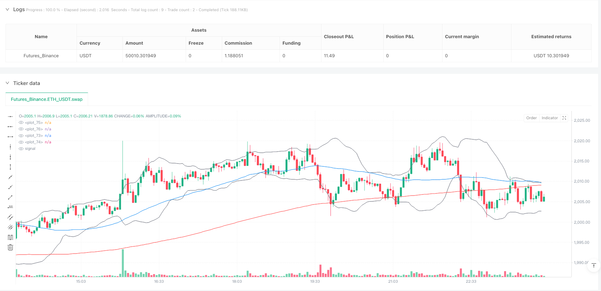
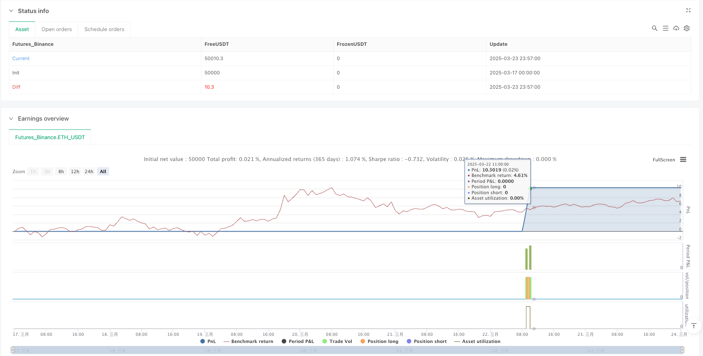

> Name

Multi-Indicator-Comprehensive-Analysis-Quantitative-Trading-Strategy-Trend-Momentum-and-Volatility-Collaborative-Prediction-Model
> Author

ianzeng123

> Strategy Description





[trans]

## Overview
Multi-indicator comprehensive analysis quantitative trading strategy is a quantitative trading method based on the fusion analysis of multiple technical indicators. This strategy integrates 30 different technical indicators, including trend indicators, momentum indicators, volatility indicators, trading volume indicators and other special indicators. Through the collaborative analysis of these indicators, a complete trading signal system is formed. This strategy mainly uses the mutual verification and filtering mechanism between multiple indicators to identify market trends and combine momentum and volatility analysis to find high-probability trading opportunities. The strategy adopts strict entry conditions and dynamic stop-loss and take-profit settings based on ATR, aiming to balance returns and risks.
## Strategy Principle
The core principle of this strategy is to form a mutually verified trading decision-making system through multi-dimensional market analysis. The strategy first defines five major categories of indicator systems:
1. **Trend indicators**: including SMA50, SMA200, EMA20, EMA50 and ADX indicators. These indicators are used to confirm the main direction of the market, with rising or falling ADX used to identify strengthening or weakening of the trend respectively.
2. **Momentum indicators**: including RSI, MACD, Stochastic, CCI and Momentum. These indicators are primarily used to measure the speed and intensity of price movements and identify potential overbought or oversold areas.
3. **Volatility Indicators**: including Bollinger Bands, Average True Range (ATR) and Keltner Channel. These indicators are used to assess market volatility and identify potential price breakouts.
4. **Trading volume indicators**: including OBV, money flow indicator (MFI), VWAP and Chaikin indicators. These indicators confirm the authenticity of price trends by analyzing volume changes.
5. **Other special indicators**: including Parabolic SAR, Supertrend, Williams %R, Fibonacci Retracement and some improved indicators based on moving averages.
The trading logic of the strategy is based on the comprehensive analysis of these indicators. The specific trading signal conditions are as follows:
- **Long conditions**: ADX trend is required to rise, RSI does not exceed 70, MACD line is above the signal line, stochastic K is greater than 20, CCI is greater than -100, the price breaks through the upper Bollinger Band, OBV is greater than its 20-day moving average, trading volume suddenly increases, a golden cross is formed, and the price is above the 200-day moving average.
- **Short selling conditions**: It requires that ADX trend declines, RSI is greater than 30, MACD line is below the signal line, stochastic indicator D is less than 80, CCI is less than 100, price falls below the lower Bollinger Band track, OBV is less than its 20-day moving average, trading volume suddenly increases, a death cross is formed, and the price is below the 200-day moving average.
Once the trading signal is triggered, the strategy will use dynamic stop-loss and take-profit settings based on ATR. Specifically, the stop-loss is set at the current price minus 2 times ATR, and the take-profit is set at the current price plus 4 times ATR (long), or vice versa (short).
## Strategic Advantages
1. **Multi-dimensional market analysis**: By integrating 30 different types of technical indicators, the strategy can analyze the market from multiple dimensions, reduce misleading signals from a single indicator, and improve the reliability of trading decisions.
2. **Strict signal filtering mechanism**: The strategy sets multiple conditions for trading signals. A position will only be opened when most indicators point in the same direction, effectively filtering out false signals.
3. **Dynamic Risk Management**: Adopt dynamic stop-loss and take-profit settings based on ATR, adjust risk parameters according to the actual market volatility, and avoid the limitations of fixed-point stop-loss and take-profit under different market conditions.
4. **Combination of trend and volatility**: The strategy focuses on both mid- and long-term trends and short-term fluctuations, which can not only capture trading opportunities in the general trend, but also optimize entry opportunities through volatility indicators.
5. **Volume and price combined analysis**: By integrating multiple trading volume indicators, we can verify the authenticity of price trends and improve the accuracy of trend judgment.
6. **Comprehensive technical school**: The strategy integrates the ideas of multiple technical analysis schools such as trend following, breakout trading, swing trading, etc., making the strategy more adaptable.
## Strategy Risk
1. **Indicator overcrowding risk**: Using 30 indicators may lead to conflicting signals. Especially in volatile markets, multiple indicators may give conflicting signals, leading to loss of trading opportunities or wrong decisions.
2. **Parameter Optimization Challenge**: So many indicators mean that a large number of parameters need to be optimized, which can easily lead to overfitting of historical data and poor performance in real trading.
3. **System calculation burden**: The calculation of a large number of indicators will increase system resource consumption and may cause the strategy to run slowly, especially when high-frequency trading or multiple varieties are running simultaneously.
4. **Signal scarcity problem**: Due to extremely strict entry conditions, trading signals may not be generated for a long time, reducing the efficiency of capital utilization.
5. **Market Condition Dependence**: Although the strategy integrates multiple indicators, it may still fail under certain market conditions (such as extreme volatility or liquidity depletion).
Solution:
- Group and prioritize indicators based on market conditions to avoid equal weighting of all indicators
- Conduct special optimization tests on key parameters such as the cycle of Williams %R
- Consider using more efficient calculation methods or simplifying the calculation logic of some indicators
- Dynamically adjust the stringency of entry conditions for different market stages
- Increase liquidity and market status detection mechanism to reduce or suspend trading under extreme market conditions
## Strategy optimization direction
1. **Indicator weight optimization**: Assign weights to different indicators, instead of simple "and" logic, you can use machine learning methods such as random forests or neural networks to evaluate the importance of each indicator and dynamically adjust the weights.
2. **Parameter adaptive mechanism**: For key parameters such as the William indicator, cycle parameters can be automatically adjusted based on market volatility or trading cycles, such as using longer cycles when volatility increases.
3. **Signal layered processing**: Divide indicators into two categories: confirmation indicators and filtering indicators. Confirmation indicators are used to generate basic signals, and filtering indicators are used to improve signal quality. This can increase the number of signals while maintaining high quality.
4. **Market Environment Identification**: Add a market status classification module to identify whether the current market is a trending market or a volatile market, and dynamically adjust strategy parameters and trading rules accordingly.
5. **Optimize calculation efficiency**: Streamline some high-correlation indicators, or use more efficient calculation methods, such as using exponential smoothing technology instead of simple moving averages to reduce calculation burden.
6. **Improve stop loss strategy**: Consider adding trailing stop loss or dynamic stop loss based on volatility to protect profits while giving the price enough room to fluctuate.
7. **Fund management optimization**: Add position management based on Kelly criterion or fixed score model, and adjust the capital ratio of each transaction according to signal strength and market volatility.
The reason for optimizing these directions is that although the current strategy integrates multi-dimensional analysis, the overly rigid signal generation logic and equal-weighted indicator processing limit the adaptability and efficiency of the strategy. By introducing adaptive mechanisms, hierarchical processing and intelligent weight allocation, the flexibility and market adaptability of strategies can be improved while maintaining the advantages of multi-index analysis.
## Summarize
Multi-indicator comprehensive analysis quantitative trading strategy builds a comprehensive trading decision-making system by integrating multi-dimensional market information such as trend, momentum, volatility, trading volume, etc. The main advantages of the strategy are high signal reliability and dynamic risk management, but it also faces challenges such as signal scarcity and computational burden.
From an implementation perspective, the strategy's code structure on the TradingView platform is clear and logical, and is divided into three modules: indicator definition, signal generation and strategy execution. The code optimization space mainly lies in parameter adaptation and indicator weight.
Overall, this is a comprehensive quantitative strategy with complete ideas and strict logic, which is especially suitable for medium and long-term trend trading and volatile market environments. Through the proposed optimization direction, especially the hierarchical processing of indicators and identification of market environment, the strategy can further improve its adaptability and stability under different market conditions and become a more comprehensive and robust quantitative trading system. ||
## Overview

The Multi-Indicator Comprehensive Analysis Quantitative Trading Strategy is a quantitative trading method based on the integrated analysis of multiple technical indicators. This strategy incorporates 30 different technical indicators, including trend indicators, momentum indicators, volatility indicators, volume indicators, and other specialized indicators, forming a complete trading signal system through the collaborative analysis of these indicators. The strategy primarily utilizes mutual verification and filtering mechanisms between multiple indicators to identify market trends while combining momentum and volatility analysis to find high-probability trading opportunities. The strategy employs strict entry conditions and ATR-based dynamic stop-loss and take-profit settings, aiming to balance returns and risks.

## Strategy Principles

The core principle of this strategy lies in creating a mutually verifying trading decision system through multi-dimensional market analysis. The strategy first defines five major categories of indicator systems:

1. **Trend Indicators**: Including SMA50, SMA200, EMA20, EMA50, and ADX. These indicators are used to confirm the primary market direction, with rising or falling ADX used to identify strengthening or weakening trends.

2. **Momentum Indicators**: Including RSI, MACD, Stochastic, CCI, and Momentum. These indicators primarily measure the speed and strength of price movements, identifying potential overbought or oversold areas.

3. **Volatility Indicators**: Including Bollinger Bands, Average True Range (ATR), and Keltner Channel. These indicators assess market volatility and determine potential price breakouts.

4. **Volume Indicators**: Including OBV, Money Flow Index (MFI), VWAP, and Chaikin indicator. These indicators confirm the authenticity of price trends by analyzing volume changes.

5. **Other Specialized Indicators**: Including Parabolic SAR, Supertrend, Williams %R, Fibonacci Retracement, and some modified indicators based on moving averages.

The strategy's trading logic is based on the comprehensive analysis of these indicators, with specific trading signal conditions as follows:

- **Long Conditions**: Requires ADX trend rising, RSI not exceeding 70, MACD line above signal line, Stochastic K greater than 20, CCI greater than -100, price breaking through the upper Bollinger Band, OBV greater than its 20-day moving average, sudden volume increase, golden cross formation, and price above the 200-day moving average.

- **Short Conditions**: Requires ADX trend falling, RSI greater than 30, MACD line below signal line, Stochastic D less than 80, CCI less than 100, price falling below the lower Bollinger Band, OBV less than its 20-day moving average, sudden volume increase, death cross formation, and price below the 200-day moving average.

Once a trading signal is triggered, the strategy uses ATR-based dynamic stop-loss and take-profit settings, specifically setting the stop-loss at the current price minus 2 times ATR and take-profit at the current price plus 4 times ATR (for long positions), or vice versa (for short positions).

## Strategy Advantages

1. **Multi-dimensional Market Analysis**: By integrating 30 different types of technical indicators, the strategy can analyze the market from multiple dimensions, reducing misleading signals from a single indicator and improving the reliability of trading decisions.

2. **Strict Signal Filtering Mechanism**: The strategy sets multiple conditions for trading signals, only opening positions when most indicators point in the same direction, effectively filtering out false signals.

3. **Dynamic Risk Management**: Using ATR-based dynamic stop-loss and take-profit settings, adjusting risk parameters according to actual market volatility, avoiding the limitations of fixed-point stop-loss and take-profit under different market conditions.

4. **Combination of Trend and Volatility**: The strategy focuses on both medium-to-long-term trends and short-term volatility, capturing trading opportunities within major trends while optimizing entry timing through volatility indicators.

5. **Integration of Price and Volume Analysis**: By integrating multiple volume indicators, the strategy verifies the authenticity of price movements, improving the accuracy of trend determination.

6. **Comprehensive Technical Schools**: The strategy integrates ideas from various technical analysis schools such as trend following, breakout trading, and swing trading, making it more adaptable.

## Strategy Risks

1. **Indicator Overcrowding Risk**: Using 30 indicators may lead to conflicting signals, especially in oscillating markets, where multiple indicators may give contradictory signals, resulting in lost trading opportunities or incorrect decisions.

2. **Parameter Optimization Challenges**: So many indicators mean a large number of parameters that need optimization, easily leading to overfitting historical data and poor performance in live trading.

3. **System Computation Burden**: Calculating numerous indicators increases system resource consumption, potentially causing slow strategy operation, especially in high-frequency trading or when running multiple instruments simultaneously.

4. **Signal Scarcity Issue**: Due to extremely strict entry conditions, it may result in long periods without trading signals, reducing capital efficiency.

5. **Market Condition Dependency**: Despite integrating multiple indicators, the strategy may still fail under certain specific market conditions (such as extreme volatility or liquidity drought).

Solutions:
- Group indicators and prioritize them according to market conditions, avoiding equal weighting of all indicators
- Conduct specialized optimization tests for key parameters such as Williams %R period
- Consider using more efficient calculation methods or simplifying the calculation logic of some indicators
- Dynamically adjust the strictness of entry conditions for different market phases
- Add liquidity and market state detection mechanisms, reducing or suspending trading under extreme market conditions

## Strategy Optimization Directions

1. **Indicator Weight Optimization**: Assign weights to different indicators rather than simple "AND" logic, using machine learning methods such as random forests or neural networks to evaluate the importance of various indicators and dynamically adjust weights.

2. **Parameter Adaptive Mechanism**: For key parameters such as Williams %R, automatically adjust cycle parameters according to market volatility or trading cycles, for example, using longer cycles when volatility increases.

3. **Signal Hierarchical Processing**: Divide indicators into confirmation indicators and filter indicators, using confirmation indicators to generate basic signals and filter indicators to improve signal quality, thus increasing signal quantity while maintaining high quality.

4. **Market Environment Recognition**: Add a market state classification module to identify whether the current market is a trend market or an oscillating market, and dynamically adjust strategy parameters and trading rules accordingly.

5. **Optimize Calculation Efficiency**: Streamline some highly correlated indicators or use more efficient calculation methods, such as using exponential smoothing techniques instead of simple moving averages, reducing computational burden.

6. **Improve Stop-Loss Strategy**: Consider adding trailing stop-loss or volatility-based dynamic stop-loss, giving prices sufficient room to fluctuate while protecting profits.

7. **Capital Management Optimization**: Add position management based on the Kelly criterion or fixed fraction model, adjusting the proportion of funds for each trade according to signal strength and market volatility.

The reason for optimizing these directions is that although the current strategy integrates multi-dimensional analysis, the rigid signal generation logic and equal-weight indicator processing method limit the strategy's adaptability and efficiency. By introducing adaptive mechanisms, hierarchical processing, and intelligent weight allocation, the strategy's flexibility and market adaptability can be improved while maintaining the advantages of multi-indicator analysis.

## Summary

The Multi-Indicator Comprehensive Analysis Quantitative Trading Strategy constructs a comprehensive trading decision system by integrating market information from multiple dimensions such as trend, momentum, volatility, and volume. The main advantages of the strategy lie in high signal reliability and dynamic risk management, but it also faces challenges such as signal scarcity and computational burden.

From an implementation perspective, the strategy's code structure on the TradingView platform is clear and logical, divided into three major modules: indicator definition, signal generation, and strategy execution. The code optimization space is mainly in parameter adaptation and indicator weighting.

Overall, this is a comprehensive quantitative strategy with complete ideas and rigorous logic, particularly suitable for medium-to-long-term trend trading and highly volatile market environments. Through the proposed optimization directions, especially indicator hierarchical processing and market environment recognition, the strategy can further enhance its adaptability and stability under different market conditions, becoming a more comprehensive and robust quantitative trading system.[/trans]


> Source (PineScript)

``` pinescript
/*backtest
start: 2025-03-17 00:00:00
end: 2025-03-24 00:00:00
period: 3m
basePeriod: 3m
exchanges: [{"eid":"Futures_Binance","currency":"ETH_USDT"}]
*/

//@version=5
strategy("30 Göstergeli Strateji (BAKİ REİS)", overlay=true)

// 1. Trend Göstergeleri
// ------------------------------
sma50 = ta.sma(close, 50)
sma200 = ta.sma(close, 200)
ema20 = ta.ema(close, 20)
ema50 = ta.ema(close, 50)
[diPlus, diMinus, adx] = ta.dmi(14, 14)
trendUp = ta.rising(adx, 3)
trendDown = ta.falling(adx, 3)

// 2. Momentum Göstergeleri
// ------------------------------
rsi = ta.rsi(close, 14)
macdLine = ta.ema(close, 12) - ta.ema(close, 26)
macdSignal = ta.ema(macdLine, 9)
stochK = ta.sma(ta.stoch(close, high, low, 14), 3)
stochD = ta.sma(stochK, 3)
cci = ta.cci(close, 20)
mom = ta.mom(close, 10)

// 3. Volatilite Göstergeleri
// ------------------------------
bbUpper = ta.sma(close, 20) + 2 * ta.stdev(close, 20)
bbLower = ta.sma(close, 20) - 2 * ta.stdev(close, 20)
atr = ta.atr(14)
kcUpper = ta.ema(close, 20) + 2 * ta.atr(20)
kcLower = ta.ema(close, 20) - 2 * ta.atr(20)

// 4. Hacim Göstergeleri
// ------------------------------
obv = ta.obv
mfi = ta.mfi(close, 14)
vwap = ta.vwap(close)
chaikin = ta.ema((close - low) - (high - close), 3) / (high - low) * volume

// 5. Diğer Göstergeler
// ------------------------------
sar = ta.sar(0.02, 0.2, 0.2)
[supertrendLine, supertrendDir] = ta.supertrend(3, 10)
williamsR = ta.wpr(14) // DÜZELTME BURADA!
fibRetrace = close > ta.highest(close, 50) * 0.618
ichimokuTenkan = ta.ema(close, 9)
ichimokuKijun = ta.ema(close, 26)

// 6. Özel Koşullar
// ------------------------------
goldenCross = ta.crossover(ema20, ema50)
deathCross = ta.crossunder(ema20, ema50)
volumeSpike = volume > 2 * ta.sma(volume, 20)
priceAboveSMA200 = close > sma200

// Sinyal Mantığı (Aynı)
// ------------------------------
longCondition = trendUp and rsi < 70 and macdLine > macdSignal and stochK > 20 and cci > -100 and close > bbUpper and obv > ta.ema(obv, 20) and volumeSpike and goldenCross and priceAboveSMA200

shortCondition = trendDown and rsi > 30 and macdLine < macdSignal and stochD < 80 and cci < 100 and close < bbLower and obv < ta.ema(obv, 20) and volumeSpike and deathCross and close < sma200

// Strateji Kuralları
// ------------------------------
if (longCondition)
    strategy.entry("Long", strategy.long)
    strategy.exit("Exit Long", stop=close - 2 * atr, limit=close + 4 * atr)

if (shortCondition)
    strategy.entry("Short", strategy.short)
    strategy.exit("Exit Short", stop=close + 2 * atr, limit=close - 4 * atr)

// Grafik Çizimleri
// ------------------------------
plot(sma50, color=color.blue)
plot(sma200, color=color.red)
plot(bbUpper, color=color.gray)
plot(bbLower, color=color.gray)
```

> Detail

https://www.fmz.com/strategy/488137

> Last Modified

2025-03-25 13:50:49
