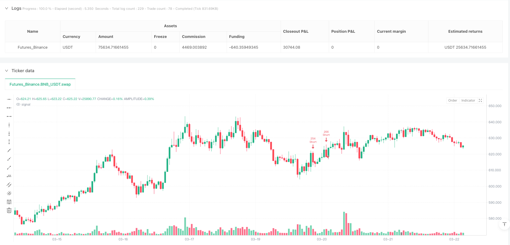
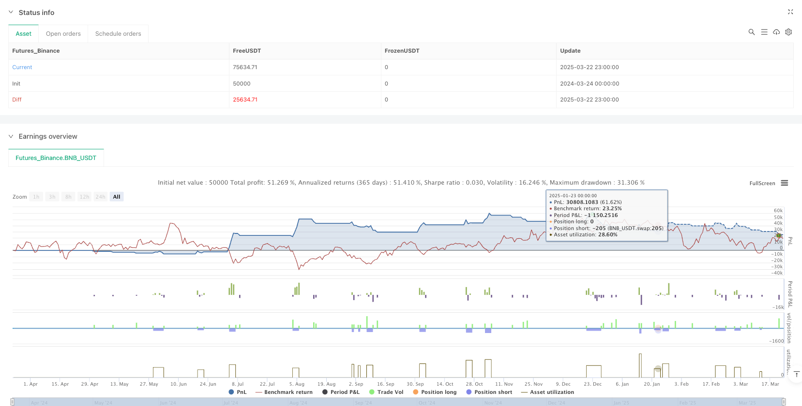

> Name

Multi-Indicator-Confirmation-Dynamic-Trailing-Breakout-Quantitative-Trading-Strategy
> Author

ianzeng123

> Strategy Description





[trans]

## Overview
MomentumBreakout V1.2 is a quantitative trading strategy that combines a multi-indicator confirmation system and dynamic position management. The core design concept of this strategy is to use multiple technical indicators (EMA, RSI, MACD) to collaboratively confirm the market trend, enter the market when the price breaks through the key position, and cooperate with ATR to dynamically adjust the stop loss position to effectively grasp the trend market. The strategy uses intelligent position control based on account equity and volatility, combined with dynamic leverage adjustment and time exit mechanisms to optimize capital utilization and control risk exposure. This strategy supports both long and short two-way trading, can adapt to different market environments, and is especially suitable for capturing short- and medium-term price breakthrough opportunities in clear trend markets.
## Strategy Principle
MomentumBreakout V1.2 strategy operation is based on a multi-layer indicator confirmation system and strict risk control mechanism. Its core transaction logic is as follows:
1. **Multiple indicator trend confirmation**:
   - The strategy uses fast EMA (15 periods) and slow EMA (40 periods) to establish a basic trend judgment framework
   - At the same time, the RSI and MACD indicators of the 1-hour time period are introduced as auxiliary confirmation to reduce false breakthrough signals
   - Bull entry requirements: the price crosses the fast EMA, and the fast EMA>slow EMA, the 1-hour RSI>50, the 1-hour MACD is bullish, and the price is above the 20-period SMA
   - Short entry requirements: the price falls below the slow EMA, and the fast EMA < the slow EMA, and the ATR volatility increases.
2. **Dynamic Position Management**:
   - Calculate position size for each trade based on account equity, set risk ratio and ATR volatility
   - Determine the basic position through the formula: (Equity*Risk Percent)/(1.2*ATR)
   - Dynamically adjust the leverage multiple, up to the set base leverage (default 5 times), and automatically reduce leverage according to market volatility to control risks
3. **Intelligent Stop Loss System**:
   - The initial stop loss is set to the entry price ±1.2 times ATR (lower for longs, above for shorts)
   - Adopt ATR trailing stop loss mechanism. As the price moves in a favorable direction, the stop loss line will be adjusted at a distance of 0.5 times ATR.
   - This design not only protects existing profits, but also gives enough room for price fluctuations
4. **Time constraint exit**:
   - Set the maximum holding time (default is 72 K lines, approximately 12 hours based on a 10-minute period)
   - Automatically close positions after the set period to avoid long-term exposure to market risks
5. **Transaction fee considerations**:
   - Incorporate transaction fees into strategy calculations, with the default setting being 0.1%
   - Consider two-way (in and out) fees to make the backtest results closer to the actual trading environment
## Strategic Advantages
An in-depth analysis of the MomentumBreakout V1.2 strategy code shows that this strategy shows many advantages:
1. **Multi-dimensional trend confirmation**: By combining multiple technical indicators (EMA, RSI, MACD) in different time periods (10 minutes and 1 hour), a three-dimensional trend judgment system is formed to effectively reduce false breakthrough signals and improve the quality of entry.
2. **Intelligent risk control**: The risk of each transaction is limited to a fixed proportion of the account's net value (default 0.5%), ensuring that the loss of a single transaction will not have a major impact on the account, and achieving long-term steady growth of funds.
3. **Volatility Adaptive Adjustment**: Dynamically adjust position size and leverage multiples based on the ATR indicator, automatically reduce risk exposure in high-volatility markets, moderately increase capital utilization in low-volatility markets, and achieve "follow the trend" volatility management.
4. **Multi-level stop loss protection**: Combining initial fixed stop loss and dynamic trailing stop loss, it not only limits the maximum possible loss, but also locks in part of the profit as the price moves favorably to avoid excessive retracement.
5. **Time risk limit**: Through the forced time exit mechanism, funds are prevented from being trapped in a single transaction for a long time, improving the efficiency of fund utilization and preventing excessive exposure to market risks.
6. **Full parameter customization**: All key parameters (EMA period, ATR setting, risk percentage, leverage multiple, position time, etc.) can be adjusted through the input interface, allowing the strategy to adapt to different market environments and personal risk preferences.
7. **Two-way trading capability**: Supports both long and short strategies, can find trading opportunities in different market trends, and is more adaptable than one-way strategies.
## Strategy Risk
Although the MomentumBreakout V1.2 strategy is designed with multi-layer risk control in mind, the following potential risks still exist:
1. **Concussive market risk**: This strategy is designed based on the concept of trend tracking and breakthrough. In a volatile market that lacks a clear direction, frequent false breakthrough signals may occur, resulting in continuous stop loss and exit, forming a "stop loss cycle".
   - Solution: Consider adding a volatility filter and temporarily reducing leverage or suspending trading when high volatility and trendless markets are identified.
2. **Extreme market risk**: In extreme market conditions such as market crashes or surges, the price may directly skip the stop loss price, causing the actual stop loss price to be much lower than (long) or much higher than (short) the expected stop loss, resulting in unexpected losses.
   - Solution: Consider setting a maximum allowable loss ratio, or introducing a dynamic risk adjustment mechanism based on volatility.
3. **Indicator lag risk**: All technical indicators inherently have a certain degree of lag, especially moving average indicators such as EMA and MACD, which may cause late entry opportunities and miss part of the market.
   - Solution: Consider introducing forward-looking indicators (such as price structure, trading volume analysis) as auxiliary confirmation methods.
4. **Parameter Optimization Trap**: Over-optimizing parameters based on historical data may lead to the "over-fitting" problem, causing the strategy to perform worse than backtesting in real trading.
   - Solution: Use diversified test data sets, including different market environments, and keep parameters relatively robust rather than pursuing extreme optimization.
5. **Leverage amplification risk**: Although the strategy is designed with a dynamic leverage adjustment mechanism, the basic leverage setting may still amplify losses in continuous adverse market conditions.
   - Solution: Reduce the basic leverage setting, or increase the continuous loss limiter to automatically reduce risk exposure after continuous stop loss.
6. **The two-sided nature of the time exit mechanism**: Although a fixed time exit mechanism helps control risk exposure, it may also end profitable transactions prematurely in a strong trend.
   - Solution: Consider dynamically adjusting position duration based on profit target and trend strength.
## Strategy optimization direction
Based on an in-depth analysis of the MomentumBreakout V1.2 strategy code, the following are several possible optimization directions:
1. **Volatility state classification**: Introduce volatility cyclical analysis, divide the market into two states: "trend type" and "shock type", and dynamically adjust strategy parameters for different states. This can help strategies better adapt to different market environments and reduce false signals in volatile markets.
2. **Multi-time period collaboration**: Expand the current multi-time period framework, add trend confirmation for longer periods (such as 4 hours or daily), establish a three-layer time period collaboration system, and improve the stability and reliability of trend judgment.
3. **Trading volume confirmation mechanism**: Incorporate trading volume indicators into the breakthrough confirmation system, requiring price breakthroughs to be accompanied by amplification of trading volume, which helps identify real breakthroughs with greater potential.
4. **Dynamic Time Exit**: Upgrade the current fixed time exit mechanism to a dynamic exit system based on trend strength and profit performance, which allows the position to be extended in a strong trend and ends the transaction early in a weak trend.
5. **Machine Learning Optimization**: Introduce simple machine learning algorithms to dynamically evaluate the market environment and breakthrough quality, achieve adaptive adjustment of parameters, reduce human intervention and improve strategy adaptability.
6. **Drawback control optimization**: Add a risk control mechanism based on the drawdown of the account's net value. When the account experiences continuous losses or reaches a specific drawdown ratio, the risk exposure will be automatically reduced or transactions will be suspended until the market environment improves.
7. **Fund Management Upgrade**: Introduce a dynamic capital management system based on Kelly's formula, dynamically adjust the risk ratio of each transaction based on the historical winning rate and profit-loss ratio, and maximize the long-term capital growth rate.
8. **Parameter Adaptation**: Develop a parameter adaptation module so that key parameters such as EMA cycle and ATR multiplier can be dynamically adjusted according to recent market fluctuation characteristics to improve the adaptive ability of the strategy.
## Summarize
MomentumBreakout V1.2 is a comprehensive quantitative trading strategy that combines a multi-indicator confirmation system, dynamic position management and intelligent stop loss mechanism. Through the collaborative confirmation of technical indicators such as EMA, RSI, and MACD, this strategy can effectively identify price breakthrough opportunities; with the help of dynamic position calculation and trailing stop loss mechanism based on ATR, precise control of capital risks is achieved; at the same time, through time-constrained exit and dynamic leverage adjustment, it balances profit potential and risk exposure.
This strategy is particularly suitable for operating in trending markets with clear directions, and can capture short- and medium-term price breakthrough opportunities in both long and short directions. However, in a trendless and volatile market, you may face the challenges of false breakthroughs and frequent stop losses. Future optimization can focus on market environment classification, multi-time period coordination, trading volume confirmation and dynamic parameter adjustment to further improve the adaptability and robustness of the strategy.
Overall, MomentumBreakout V1.2 provides a quantitative trading framework with clear structure and rigorous logic, which can be directly applied to actual transactions or used as a basic module for more complex trading systems, with high practical value and expansion potential. ||
## Overview

MomentumBreakout V1.2 is a quantitative trading strategy that combines a multi-indicator confirmation system with dynamic position management. The core design philosophy is to confirm market trends through multiple technical indicators (EMA, RSI, MACD), enter positions when prices break through key levels, and adjust stop-loss positions dynamically using ATR to effectively capture trending markets. The strategy employs intelligent position control based on account equity and volatility, combined with dynamic leverage adjustment and time-based exit mechanisms to optimize capital utilization and control risk exposure. The strategy supports both long and short trading directions, adapting to different market environments, and is particularly suitable for capturing medium to short-term price breakout opportunities in clearly trending markets.

## Strategy Principles

MomentumBreakout V1.2 operates based on a multi-layered indicator confirmation system and strict risk control mechanisms. Its core trading logic is as follows:

1. **Multi-Indicator Trend Confirmation**:
   - The strategy uses fast EMA (15 periods) and slow EMA (40 periods) to establish a basic trend determination framework
   - It also incorporates 1-hour timeframe RSI and MACD indicators as auxiliary confirmations to reduce false breakout signals
   - Long entry requirements: price crosses above fast EMA, fast EMA > slow EMA, 1-hour RSI > 50, 1-hour MACD is bullish, price is above the 20-period SMA
   - Short entry requirements: price crosses below slow EMA, fast EMA < slow EMA, ATR volatility is rising

2. **Dynamic Position Management**:
   - Calculates position size for each trade based on account equity, set risk percentage, and ATR volatility
   - Determines base position through the formula: (equity * risk percentage) / (1.2 * ATR)
   - Dynamically adjusts leverage multiple, up to the set base leverage (default 5x), and automatically reduces leverage based on market volatility to control risk

3. **Intelligent Stop-Loss System**:
   - Initial stop-loss is set at entry price ± 1.2 times ATR (below for longs, above for shorts)
   - Employs ATR trailing stop mechanism, adjusting the stop-loss line at a distance of 0.5 times ATR as price moves favorably
   - This design both protects existing profits and gives price sufficient room to fluctuate

4. **Time-Constrained Exit**:
   - Sets maximum holding time (default is 72 bars, approximately 12 hours at 10-minute intervals)
   - Automatically closes positions after the set period to avoid prolonged exposure to market risk

5. **Trading Fee Consideration**:
   - Incorporates trading fees into strategy calculations, default setting at 0.1%
   - Considers two-way (entry and exit) fees, making backtest results closer to actual trading environments

## Strategy Advantages

A deep analysis of the MomentumBreakout V1.2 strategy code reveals several advantages:

1. **Multi-dimensional Trend Confirmation**: By combining multiple technical indicators (EMA, RSI, MACD) across different timeframes (10-minute and 1-hour), it forms a three-dimensional trend judgment system, effectively reducing false breakout signals and improving entry quality.

2. **Intelligent Risk Control**: Each trade's risk is limited to a fixed percentage of account equity (default 0.5%), ensuring that single trade losses will not significantly impact the account, achieving long-term stable capital growth.

3. **Volatility-Adaptive Adjustment**: Dynamically adjusts position size and leverage multiple based on the ATR indicator, automatically reducing risk exposure in high-volatility markets and moderately increasing capital utilization in low-volatility markets, achieving volatility management that "follows the trend."

4. **Multi-level Stop-Loss Protection**: Combines initial fixed stop-loss with dynamic trailing stop-loss, both limiting maximum possible losses and locking in partial profits as price moves favorably, avoiding excessive drawdowns.

5. **Time Risk Limitation**: Through forced time-based exit mechanisms, avoids capital being trapped in a single trade for extended periods, improving capital utilization efficiency and preventing excessive exposure to market risk.

6. **Full Parameter Customization**: All key parameters (EMA periods, ATR settings, risk percentage, leverage multiple, holding time, etc.) can be adjusted through the input interface, allowing the strategy to adapt to different market environments and personal risk preferences.

7. **Bi-directional Trading Capability**: Supports both long and short strategies simultaneously, able to find trading opportunities in different market trends, providing stronger adaptability compared to unidirectional strategies.

## Strategy Risks

Despite the multi-layered risk control considerations in the MomentumBreakout V1.2 strategy design, the following potential risks remain:

1. **Oscillating Market Risk**: This strategy is designed based on trend-following and breakout concepts, which may generate frequent false breakout signals in oscillating markets lacking clear direction, leading to consecutive stop-loss exits and forming a "stop-loss cycle."
   - Solution: Consider adding a volatility filter to temporarily reduce leverage or pause trading when high-volatility, non-trending markets are identified.

2. **Extreme Market Risk**: In market flash crashes or surges, prices may jump directly past stop-loss prices, causing actual stop-loss prices to be far lower (for longs) or higher (for shorts) than expected, resulting in losses beyond expectations.
   - Solution: Consider setting maximum allowable loss percentages or introducing volatility-based dynamic risk adjustment mechanisms.

3. **Indicator Lag Risk**: All technical indicators inherently have a certain lag, especially moving average-type indicators like EMA and MACD, which may lead to delayed entry timing and missing parts of market movements.
   - Solution: Consider introducing forward-looking indicators (such as price structure, volume analysis) as auxiliary confirmation methods.

4. **Parameter Optimization Trap**: Excessive optimization of parameters against historical data may lead to "overfitting" issues, causing strategy performance in live trading to fall short of backtesting results.
   - Solution: Use diverse testing datasets including different market environments, and maintain relatively robust parameters rather than pursuing extreme optimization.

5. **Leverage Amplification Risk**: Although the strategy includes dynamic leverage adjustment mechanisms, the base leverage setting may still amplify losses during consecutive adverse market movements.
   - Solution: Lower the base leverage setting or add consecutive loss limiters that automatically reduce risk exposure after consecutive stop-losses.

6. **Dual Nature of Time Exit Mechanism**: Fixed time exit mechanisms, while helpful for controlling risk exposure, may also prematurely end profitable trades during strong trends.
   - Solution: Consider dynamically adjusting holding time based on profit targets and trend strength.

## Strategy Optimization Directions

Based on a deep analysis of the MomentumBreakout V1.2 strategy code, here are several possible optimization directions:

1. **Volatility State Classification**: Introduce volatility cycle analysis to categorize the market into "trending" and "oscillating" states, and dynamically adjust strategy parameters for different states. This can help the strategy better adapt to different market environments and reduce false signals in oscillating markets.

2. **Multi-Timeframe Collaboration**: Expand the current multi-timeframe framework to include longer timeframe (such as 4-hour or daily) trend confirmation, establishing a three-layer timeframe collaboration system to improve the stability and reliability of trend judgment.

3. **Volume Confirmation Mechanism**: Incorporate volume indicators into the breakout confirmation system, requiring price breakouts to be accompanied by increased volume, which helps identify more potentially genuine breakouts.

4. **Dynamic Time Exit**: Upgrade the current fixed time exit mechanism to a dynamic exit system based on trend strength and profit performance, allowing extended holding times during strong trends and earlier trade termination during weak trends.

5. **Machine Learning Optimization**: Introduce simple machine learning algorithms to dynamically evaluate market environments and breakout quality, achieving adaptive parameter adjustment, reducing human intervention, and improving strategy adaptability.

6. **Drawdown Control Optimization**: Add risk control mechanisms based on account equity drawdown, automatically reducing risk exposure or pausing trading when the account experiences consecutive losses or reaches specific drawdown percentages, until market conditions improve.

7. **Capital Management Upgrade**: Introduce a dynamic capital management system based on the Kelly formula, dynamically adjusting the risk percentage for each trade according to historical win rates and profit/loss ratios, maximizing long-term capital growth rates.

8. **Parameter Self-Adaptation**: Develop a parameter self-adaptation module enabling key parameters such as EMA periods and ATR multipliers to dynamically adjust based on recent market volatility characteristics, improving the strategy's self-adaptation capabilities.

## Conclusion

MomentumBreakout V1.2 is a comprehensive quantitative trading strategy that combines multi-indicator confirmation systems, dynamic position management, and intelligent stop-loss mechanisms. Through the collaborative confirmation of technical indicators such as EMA, RSI, and MACD, the strategy can effectively identify price breakout opportunities; through ATR-based dynamic position calculation and trailing stop mechanisms, it achieves precise control over capital risk; while through time-constrained exits and dynamic leverage adjustments, it balances profit potential with risk exposure.

The strategy is particularly suitable for operation in trending markets with clear direction, capable of capturing medium to short-term price breakout opportunities in both long and short directions. However, it may face challenges of false breakouts and frequent stop-losses in non-trending, oscillating markets. Future optimizations could focus on market environment classification, multi-timeframe collaboration, volume confirmation, and dynamic parameter adjustment to further enhance the strategy's adaptability and robustness.

Overall, MomentumBreakout V1.2 provides a clearly structured and logically rigorous quantitative trading framework that can be directly applied to actual trading or serve as a foundational module for more complex trading systems, offering high practical value and expansion potential.[/trans]


> Source (PineScript)

``` pinescript
/*backtest
start: 2024-03-24 00:00:00
end: 2025-03-23 00:00:00
period: 1h
basePeriod: 1h
exchanges: [{"eid":"Futures_Binance","currency":"BNB_USDT"}]
*/

//@version=6
strategy("MomentumBreakout V1.2 - DOGE/USDT", overlay=true, margin_long=20, margin_short=20)

// === Core Parameters ===
emaFast = input.int(15, "Fast EMA Length", minval=10, maxval=50)
emaSlow = input.int(40, "Slow EMA Length", minval=20, maxval=100)
atrPeriod = input.int(14, "ATR Period", minval=1, maxval=50)
riskPct = input.float(0.5, "Risk Per Trade (%)", minval=0.1, maxval=5.0, step=0.1)
baseLeverage = input.float(5.0, "Base Leverage", minval=1.0, maxval=20.0, step=0.5)
feeRate = input.float(0.1, "Fee Rate (%)", minval=0.0, maxval=1.0, step=0.01)
maxHoldBars = input.int(72, "Max Hold Bars (12H)", minval=1, maxval=1000)
rsiPeriod = input.int(14, "RSI Period", minval=5, maxval=50)
macdFast = input.int(12, "MACD Fast Length", minval=5, maxval=50)
macdSlow = input.int(26, "MACD Slow Length", minval=5, maxval=50)
macdSignal = input.int(9, "MACD Signal Length", minval=1, maxval=50)

// === Calculate Indicators ===
// EMA (10m)
emaFastValue = ta.ema(close, emaFast)
emaSlowValue = ta.ema(close, emaSlow)

// ATR
atrValue = ta.atr(atrPeriod)

// RSI (10m and 1H)
rsiValue = ta.rsi(close, rsiPeriod)
rsiValue_1h = request.security(syminfo.tickerid, "60", ta.rsi(close, rsiPeriod)[1], barmerge.gaps_off)

// MACD (1H)
[macdLine_1h, signalLine_1h, _] = request.security(syminfo.tickerid, "60", ta.macd(close, macdFast, macdSlow, macdSignal), barmerge.gaps_off)
macdLine_1h := macdLine_1h[1]
signalLine_1h := signalLine_1h[1]

// Trend Confirmation
trendUp_1h = emaFastValue > emaSlowValue and rsiValue_1h > 50 and macdLine_1h > signalLine_1h
trendDown_1h = emaFastValue < emaSlowValue
breakoutLong = ta.crossover(close, emaFastValue) and trendUp_1h and close > ta.sma(close, 20) and not na(emaFastValue)
breakoutShort = ta.crossunder(close, emaSlowValue) and trendDown_1h and atrValue > ta.sma(atrValue, 14) and not na(emaSlowValue)
noActivePosition = strategy.position_size == 0

// === Dynamic Position Sizing ===
equity = strategy.equity
riskAmount = equity * (riskPct / 100)
stopDistance = atrValue * 1.2  // Tightened to 1.2x ATR
leverage = baseLeverage * math.min(1.0, 1.0 / (atrValue / close))
positionSize = math.round((riskAmount / stopDistance) * leverage)

// === Trailing Stop ===
var float longStopPrice = 0.0
var float shortStopPrice = 0.0
var int entryBarIndex = 0

if breakoutLong
    longStopPrice := close - (atrValue * 1.2)
    entryBarIndex := bar_index

if breakoutShort
    shortStopPrice := close + (atrValue * 1.2)
    entryBarIndex := bar_index

if strategy.position_size > 0
    longStopPrice := math.max(longStopPrice, close - (atrValue * 0.5))
if strategy.position_size < 0
    shortStopPrice := math.min(shortStopPrice, close + (atrValue * 0.5))

// === Time-based Exit ===
barsSinceEntry = bar_index - entryBarIndex
if strategy.position_size != 0 and barsSinceEntry >= maxHoldBars
    strategy.close_all(comment="Time Exit")

// === Strategy Execution ===
if breakoutLong and noActivePosition
    strategy.entry("Long", strategy.long, qty=positionSize)
    strategy.exit("Long Exit", "Long", stop=longStopPrice, qty_percent=100, comment="Long Exit")

if breakoutShort and noActivePosition
    strategy.entry("Short", strategy.short, qty=positionSize)
    strategy.exit("Short Exit", "Short", stop=shortStopPrice, qty_percent=100, comment="Short Exit")

// === Fee Calculation ===
feeCost = positionSize * close * (feeRate / 100) * 2
```

> Detail

https://www.fmz.com/strategy/488020

> Last Modified

2025-03-24 14:20:27
