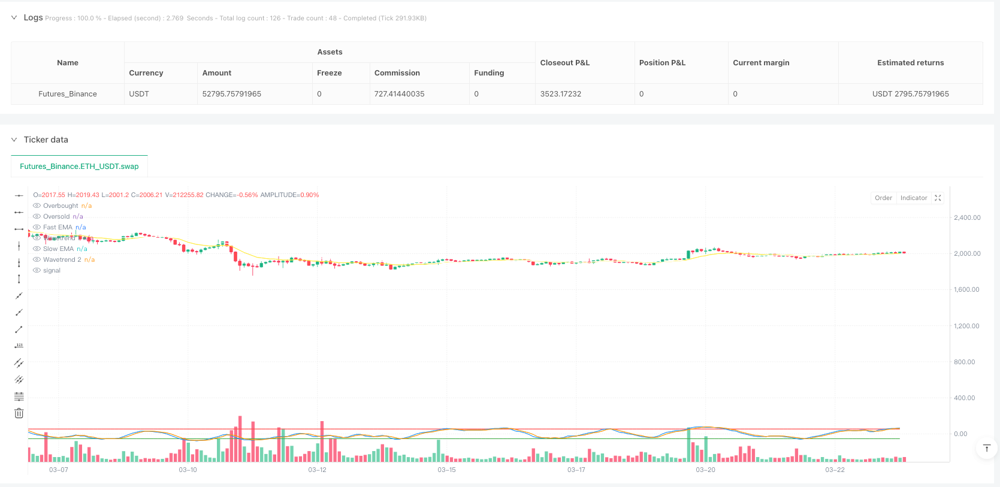
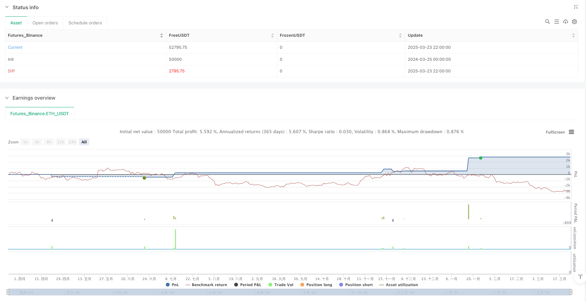

> Name

Multi-Indicator-Consensus-Trading-Strategy-Liquidity-Weighted-Trend-Signal-System
> Author

ianzeng123

> Strategy Description





[trans]

#### Overview
The multi-indicator consensus trading strategy is a quantitative trading system that combines three different technical indicators to confirm trading signals through mutual verification between indicators. This strategy integrates the Liquidity Weighted Super Trend (LWST), the Trend Signal System and the Enhanced Wave Trend Oscillator (WT), and only executes buy or sell operations when at least two indicators give signals in the same direction. This consensus mechanism significantly improves the reliability of signals and reduces losses caused by false breakthroughs. At the same time, the strategy has built-in stop-loss and take-profit mechanisms to provide a risk control framework for each transaction.
#### Strategy Principle
The core principle of the multi-indicator consensus trading strategy is to confirm the trading direction by analyzing the market status in multiple dimensions:
1. **Liquidity Weighted Super Trend (LWST)**: Combines ATR and volume information to create dynamic support and resistance bands. This indicator combines the traditional Super Trend indicator with volume weighting, making the bandwidth more sensitive in high volume areas. The calculation process includes:
   - Calculate volume SMA and generate volume weight ratio
   - Calculate upper and lower rails based on ATR and volume weight
   - Determine trend direction through the relationship between price and trend lines
2. **Trend Signal System**: Use the dual EMA system to detect price trends. Determine the strength of a market trend by comparing the percentage difference between fast and slow moving averages. When the fast EMA exceeds the slow EMA and reaches the set threshold, a long signal is generated; otherwise, a short signal is generated.
3. **Enhanced Wave Trend Oscillator (WT)**: Calculates the oscillation value based on the deviation of the price from its smoothed mean, used to identify overbought and oversold conditions. The indicator generates signals through the following steps:
   - Calculate typical prices (HLC3) and perform EMA smoothing
   - Calculate price volatility and normalize to generate oscillator values
   - Apply two lines with varying degrees of smoothness to identify intersections and extreme regions
4. **Consensus signal mechanism**: The strategy only executes transactions when at least two indicators agree. This is achieved by calculating the number of bull indicators (ranging from -3 to 3), generating a buy signal when the value is greater than or equal to 2, and a sell signal when less than or equal to -2.
5. **Risk Management**: Each transaction sets a stop loss level (default 2%) and a take profit level (default 4%) based on the entry price, and automatically exits when any condition is met.
#### Strategic Advantages
1. **Signal filtering enhancement**: Multiple indicators are required to reach consensus before executing a transaction, which greatly reduces the misleading signals that may be generated by a single indicator and improves the accuracy of transactions.
2. **Adapt to different market conditions**: The three indicators focus on different market attributes (trend, momentum, volatility) respectively, allowing the strategy to maintain effectiveness in different market environments.
3. **Liquidity Sensitive Adjustment**: Liquidity-weighted super trend dynamically adjusts sensitivity based on trading volume, allowing the strategy to capture trend changes faster in high-liquidity areas and more conservatively in low-liquidity areas.
4. **Built-in risk management**: The preset stop-loss and take-profit mechanisms provide a clear risk-return ratio for each transaction, controlling the risk of a single transaction within an acceptable range.
5. **Intuitive visualization tools**: The strategy provides real-time signal tables and graphic markers to help traders quickly grasp the current market status and various indicator signals.
6. **Fund Management Integration**: By setting the position size based on account equity, intelligent fund management is achieved to avoid excessive risk exposure.
#### Strategy Risk
1. **Parameter Sensitivity**: The strategy uses multiple adjustable parameters. Improper parameter settings may lead to over-optimization or insufficient signal. Solution: Conduct a comprehensive parameter sensitivity analysis and select parameter combinations that perform stably across multiple market conditions.
2. **Signal Delay**: Due to the use of moving averages and multi-indicator confirmation, the strategy may miss part of the market early in the trend. Solution: Consider setting different parameter combinations for different time periods, or adding a more sensitive short-term indicator.
3. **Poor sideways market effects**: In a market without a clear trend, multiple trend indicators may give mixed signals, leading to frequent trading or no trading. Solution: Add a filter specifically to identify sideways markets, pause trading when sideways are identified or switch to a strategy specifically designed for sideways.
4. **Fixed stop loss risk**: Using a fixed percentage stop loss may not adapt to the volatility characteristics of different assets. Solution: Dynamically adjust the stop loss distance based on ATR or historical volatility.
5. **Fund Management Risk**: Using 100% of account funds by default may lead to excessive risk concentration. Solution: Dynamically adjust position size based on market status and signal strength, and implement a diversified trading strategy.
#### Strategy optimization direction
1. **Dynamic parameter adjustment**:
   - Implement parameter adaptation mechanism based on market volatility, such as increasing ATR multiplier when volatility is high
   - Principle: Different market environments require different parameter sensitivities, and adaptive parameters can improve the universality of the strategy.
2. **Add market environment filter**:
   - Add a judgment mechanism that can identify market status (trend, sideways, high volatility)
   - Adjust trading frequency or suspend trading under different market environments
   - Principle: Not all market conditions are suitable for trading, and selective trading can improve the overall winning rate
3. **Optimize the profit/stop loss mechanism**:
   - Implement dynamic take-profit targets based on support/resistance levels
   - Design trailing stops to protect profits
   - Principle: Fixed percentage take-profit/stop-loss cannot make full use of the market structure characteristics
4. **Signal Strength Grading**:
   - Design a position sizing mechanism based on indicator consistency and signal strength
   - Use the largest position when all three indicators are consistent, use the smaller position when only two are consistent
   - Principle: Signal strength is related to the probability of transaction success and should be reflected in position management
5. **Time Filter**:
   - Add time filters to avoid important economic data releases or market opening/closing swings
   - Principle: Market fluctuations in specific time periods may not follow the principles of technical analysis. Avoiding these times can reduce noise
#### Summary
The multi-indicator consensus trading strategy creates a robust trading system by integrating liquidity-weighted supertrends, trend signal systems, and enhanced wave trend oscillators. Its core advantage is that the multi-index consensus mechanism significantly improves signal reliability, while the liquidity-weighted component adds sensitivity to market depth to the strategy. The built-in risk management framework ensures every trade has a predefined risk-reward ratio.
Despite this, there is still room for optimization of the strategy, especially in terms of parameter adaptability, market state recognition and dynamic stop loss and take profit. By implementing the recommended optimization directions, in particular establishing market environment filters and signal strength grading systems, the strategy can further improve adaptability and stability under various market conditions.
In general, this is a well-designed quantitative trading system suitable for experienced traders to conduct backtesting and parameter optimization before real trading. The modular design of the strategy also makes it easy to modify and expand based on individual needs. ||
#### Overview
The Multi-Indicator Consensus Trading Strategy is a quantitative trading system that combines three distinct technical indicators, using cross-validation between indicators to confirm trading signals. This strategy integrates Liquidity Weighted Supertrend (LWST), Trend Signal System, and Enhanced Wavetrend Oscillator (WT), executing buy or sell operations only when at least two indicators provide signals in the same direction. This consensus mechanism significantly improves signal reliability and reduces losses from false breakouts. Additionally, the strategy incorporates built-in stop-loss and take-profit mechanisms, providing a risk control framework for each trade.

#### Strategy Principles
The core principle of the Multi-Indicator Consensus Trading Strategy lies in analyzing market conditions from multiple dimensions to confirm trading direction:

1. **Liquidity Weighted Supertrend (LWST)**: Combines ATR and volume information to create dynamic support and resistance bands. This indicator merges the traditional Supertrend indicator with volume weighting, making the bandwidth more sensitive in high-volume areas. The calculation process includes:
   - Calculating volume SMA and generating volume weight ratio
   - Computing upper and lower bands based on ATR and volume weight
   - Determining trend direction through the relationship between price and trend lines

2. **Trend Signal System**: Uses a dual EMA system to detect price trends. By comparing the percentage difference between fast and slow moving averages, it judges market trend strength. When the fast EMA exceeds the slow EMA by the set threshold, a bullish signal is generated; conversely, a bearish signal is produced.

3. **Enhanced Wavetrend Oscillator (WT)**: Calculates oscillation values based on the deviation of price from its smoothed average to identify overbought and oversold conditions. This indicator generates signals through the following steps:
   - Calculating typical price (HLC3) and applying EMA smoothing
   - Computing price volatility and standardizing to generate oscillator values
   - Applying two lines with different smoothing degrees to identify crossing points and extreme areas

4. **Consensus Signal Mechanism**: The strategy executes trades only when at least two indicators reach consensus. This is achieved by calculating the number of bullish indicators (range from -3 to 3), generating a buy signal when the value is greater than or equal to 2, and a sell signal when less than or equal to -2.

5. **Risk Management**: Each trade sets stop-loss (default 2%) and take-profit (default 4%) levels based on entry price, automatically exiting when either condition is met.

#### Strategy Advantages
1. **Enhanced Signal Filtering**: Requiring consensus among multiple indicators before executing trades significantly reduces misleading signals that might be generated by a single indicator, improving trading accuracy.

2. **Adaptation to Different Market Conditions**: The three indicators focus on different market attributes (trend, momentum, volatility), enabling the strategy to maintain effectiveness in various market environments.

3. **Liquidity-Sensitive Adjustment**: The Liquidity Weighted Supertrend dynamically adjusts sensitivity according to volume, allowing the strategy to capture trend changes more quickly in high-liquidity areas while remaining more conservative in low-liquidity areas.

4. **Built-in Risk Management**: Preset stop-loss and take-profit mechanisms provide a clear risk-reward ratio for each trade, keeping single-trade risk within an acceptable range.

5. **Intuitive Visualization Tools**: The strategy provides real-time signal tables and graphical markers, helping traders quickly grasp current market conditions and indicator signals.

6. **Integrated Capital Management**: By setting position sizes based on account equity, intelligent capital management is achieved, avoiding excessive risk exposure.

#### Strategy Risks
1. **Parameter Sensitivity**: The strategy uses multiple adjustable parameters; inappropriate parameter settings may lead to over-optimization or insufficient signals. Solution: Conduct comprehensive parameter sensitivity analysis and select parameter combinations that perform stably under multiple market conditions.

2. **Signal Delay**: Due to the use of moving averages and multi-indicator confirmation, the strategy may miss part of the initial trend. Solution: Consider setting different parameter combinations for different time periods, or add a more sensitive short-term indicator.

3. **Poor Performance in Ranging Markets**: In markets without clear trends, multiple trend indicators may give mixed signals, leading to frequent trading or no trading. Solution: Add a filter specifically designed to identify ranging markets, pausing trading when ranging is detected or switching to a strategy designed for ranging markets.

4. **Fixed Stop-Loss Risk**: Using fixed percentage stop-losses may not adapt to the volatility characteristics of different assets. Solution: Dynamically adjust stop-loss distances based on ATR or historical volatility.

5. **Capital Management Risk**: Using 100% of account funds by default may lead to excessive risk concentration. Solution: Dynamically adjust position size based on market conditions and signal strength, implementing diversified trading strategies.

#### Strategy Optimization Directions
1. **Dynamic Parameter Adjustment**:
   - Implement parameter self-adaptive mechanisms based on market volatility, such as increasing the ATR multiplier during high volatility
   - Rationale: Different market environments require different parameter sensitivities; self-adaptive parameters can improve strategy universality

2. **Add Market Environment Filters**:
   - Add mechanisms to identify market states (trending, ranging, high volatility)
   - Adjust trading frequency or pause trading in different market environments
   - Rationale: Not all market conditions are suitable for trading; selective trading can improve overall win rate

3. **Optimize Take-Profit/Stop-Loss Mechanisms**:
   - Implement dynamic take-profit targets based on support/resistance levels
   - Design trailing stops to protect profits
   - Rationale: Fixed percentage take-profits/stop-losses cannot fully utilize market structure characteristics

4. **Signal Strength Grading**:
   - Design position sizing adjustment mechanisms based on indicator consensus degree and signal strength
   - Use maximum position when all three indicators agree, smaller position when only two agree
   - Rationale: Signal strength correlates with trade success probability and should be reflected in position management

5. **Time Filters**:
   - Add time filters to avoid important economic data releases or market open/close volatility
   - Rationale: Market fluctuations during specific time periods may not follow technical analysis principles; avoiding these times can reduce noise

#### Summary
The Multi-Indicator Consensus Trading Strategy creates a robust trading system by integrating Liquidity Weighted Supertrend, Trend Signal System, and Enhanced Wavetrend Oscillator. Its core advantage lies in the multi-indicator consensus mechanism, which significantly improves signal reliability, while the liquidity-weighted component adds sensitivity to market depth. The built-in risk management framework ensures each trade has a predefined risk-reward ratio.

Nevertheless, there is room for optimization, particularly in parameter adaptability, market state identification, and dynamic stop-loss/take-profit. By implementing the suggested optimization directions, especially establishing market environment filters and signal strength grading systems, the strategy can further improve its adaptability and stability under various market conditions.

Overall, this is a well-designed quantitative trading system suitable for experienced traders to backtest and optimize parameters before live trading. The modular design also makes it easy to modify and extend according to individual needs.[/trans]


> Source (PineScript)

``` pinescript
/*backtest
start: 2024-03-25 00:00:00
end: 2025-03-24 00:00:00
period: 2h
basePeriod: 2h
exchanges: [{"eid":"Futures_Binance","currency":"ETH_USDT"}]
*/

//@version=5
strategy("Multi-Indicator Consensus Strategy", overlay=true, initial_capital=100000, default_qty_type=strategy.percent_of_equity, default_qty_value=100)

// =================== Input Parameters ===================
// Liquidity Weighted Supertrend
lwst_period      = input.int(10, "LWST Period", minval=1, tooltip="Period for ATR calculation")
lwst_multiplier  = input.float(3.0, "LWST Multiplier", minval=0.1, tooltip="Multiplier for ATR bands")
lwst_length      = input.int(20, "Volume SMA Length", minval=1, tooltip="Length for volume SMA")

// Trend Signals
trend_length     = input.int(14, "Trend Length", minval=1, tooltip="Length for EMA calculation")
trend_threshold  = input.float(0.5, "Trend Threshold", minval=0.1, tooltip="Percentage threshold for trend signals")

// Enhanced Wavetrend
wt_channel_length = input.int(9, "WT Channel Length", minval=1, tooltip="Smoothing period for initial calculations")
wt_average_length = input.int(12, "WT Average Length", minval=1, tooltip="Smoothing period for final signal")
wt_ma_length      = input.int(3, "WT MA Length", minval=1, tooltip="Moving average length for signal line")
wt_overbought     = input.float(53, "WT Overbought", minval=0, tooltip="Level to identify overbought conditions")
wt_oversold       = input.float(-53, "WT Oversold", minval=-100, tooltip="Level to identify oversold conditions")

// Risk Management
sl_percent       = input.float(2.0, "Stop Loss %", minval=0.1, tooltip="Stop loss percentage from entry")
tp_percent       = input.float(4.0, "Take Profit %", minval=0.1, tooltip="Take profit percentage from entry")

// =================== Indicator 1: Liquidity Weighted Supertrend ===================
// Volume-weighted component for dynamic sensitivity
vol_sma    = ta.sma(volume, lwst_length)
vol_weight = volume / vol_sma

// ATR-based bands with volume weighting
atr        = ta.atr(lwst_period)
upperBand  = hl2 + lwst_multiplier * atr * vol_weight
lowerBand  = hl2 - lwst_multiplier * atr * vol_weight

// Trend determination based on price action
var float lwst_trend = 0.0
lwst_trend := close > lwst_trend[1] ? 1 : close < lwst_trend[1] ? -1 : lwst_trend[1]

// =================== Indicator 2: Trend Signals ===================
// Dual EMA system for trend detection
fast_ema    = ta.ema(close, trend_length)
slow_ema    = ta.ema(close, trend_length * 2)
trend_diff  = (fast_ema - slow_ema) / slow_ema * 100
trend_signal = trend_diff > trend_threshold ? 1 : trend_diff < -trend_threshold ? -1 : 0

// =================== Indicator 3: Enhanced Wavetrend ===================
// Calculate Wavetrend components
ap  = hlc3  // Typical price
esa = ta.ema(ap, wt_channel_length)  // Smoothed price
d   = ta.ema(math.abs(ap - esa), wt_channel_length)  // Average volatility
ci  = (ap - esa) / (0.015 * d)  // Base oscillator
tci = ta.ema(ci, wt_average_length)  // Smoothed oscillator

// Generate main and signal lines
wt1 = tci
wt2 = ta.sma(wt1, wt_ma_length)

// Generate Wavetrend Signal based on overbought/oversold conditions
wt_signal = 0
wt_signal := wt1 > wt_overbought and wt2 > wt_overbought ? -1 : 
             wt1 < wt_oversold and wt2 < wt_oversold ? 1 : 
             wt_signal[1]

// =================== Consensus Signal Generation ===================
// Count bullish signals (1 point for each bullish indicator)
var int consensus_count = 0
consensus_count := (lwst_trend == 1 ? 1 : 0) + 
                   (trend_signal == 1 ? 1 : 0) + 
                   (wt_signal == 1 ? 1 : 0)

// Generate trading signals when majority (2+ indicators) agree
bool buy_signal  = consensus_count >= 2
bool sell_signal = consensus_count <= -2

// =================== Trade Execution ===================
// Long position entry and exit with risk management
if (buy_signal and strategy.position_size <= 0)
    strategy.entry("Long", strategy.long)
    strategy.exit("Long TP/SL", "Long", 
                 profit = close * tp_percent / 100, 
                 loss = close * sl_percent / 100)

// Short position entry and exit with risk management
if (sell_signal and strategy.position_size >= 0)
    strategy.entry("Short", strategy.short)
    strategy.exit("Short TP/SL", "Short", 
                 profit = close * tp_percent / 100, 
                 loss = close * sl_percent / 100)

// =================== Visualization ===================
// Signal markers for entry points
plotshape(buy_signal ? low : na, "Buy Signal", shape.triangleup, location.belowbar, color.green, size=size.small)
plotshape(sell_signal ? high : na, "Sell Signal", shape.triangledown, location.abovebar, color.red, size=size.small)

// Indicator lines
plot(wt1, "Wavetrend 1", color.blue, linewidth=1)
plot(wt2, "Wavetrend 2", color.orange, linewidth=1)
plot(wt_overbought, "Overbought", color.red, linewidth=1)
plot(wt_oversold, "Oversold", color.green, linewidth=1)
plot(fast_ema, "Fast EMA", color.yellow, linewidth=1)
plot(slow_ema, "Slow EMA", color.white, linewidth=1)
plot(lwst_trend == 1 ? upperBand : na, "Upper Band", color.green, linewidth=2)
plot(lwst_trend == -1 ? lowerBand : na, "Lower Band", color.red, linewidth=2)

// =================== Information Table ===================
// Real-time display of indicator signals
var table info = table.new(position.top_right, 2, 4)
table.cell(info, 0, 0, "Indicator", bgcolor=color.gray, text_color=color.white)
table.cell(info, 1, 0, "Signal", bgcolor=color.gray, text_color=color.white)
table.cell(info, 0, 1, "LWST", text_color=color.white)
table.cell(info, 1, 1, str.tostring(lwst_trend), text_color=lwst_trend == 1 ? color.green : color.red)
table.cell(info, 0, 2, "Trend", text_color=color.white)
table.cell(info, 1, 2, str.tostring(trend_signal), text_color=trend_signal == 1 ? color.green : color.red)
table.cell(info, 0, 3, "Wavetrend", text_color=color.white)
table.cell(info, 1, 3, str.tostring(wt_signal), text_color=wt_signal == 1 ? color.green : color.red)

```

> Detail

https://www.fmz.com/strategy/488167

> Last Modified

2025-03-25 17:07:14
