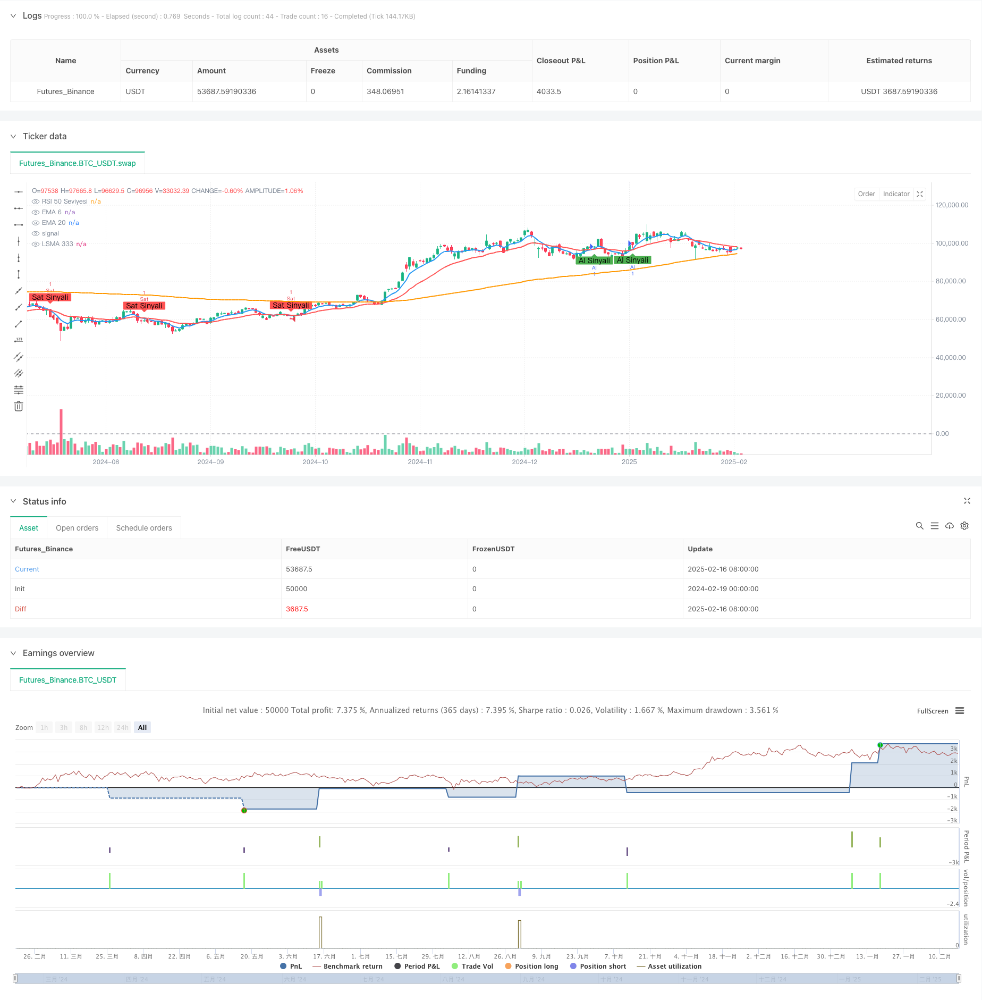

> Name

Multi-Indicator-Cross-Adaptive-Trend-Following-Trading-Strategy Multi-Indicator-Cross-Adaptive-Trend-Following-Trading-Strategy
> Author

ChaoZhang

> Strategy Description



[trans]
#### Overview
This strategy is a trend following system based on the intersection of multiple technical indicators. It combines three indicators: EMA (Exponential Moving Average), LSMA (Least Squares Moving Average) and RSI (Relative Strength Index) to filter trading opportunities through multiple signal confirmations. The strategy adopts an adaptive stop-profit and stop-loss mechanism, which can dynamically adjust risk management parameters according to market fluctuations.
#### Strategy Principle
The core logic of the strategy includes the following aspects:
1. Use short-period (6) and long-period (20) EMA to capture the turning point of the trend
2. Use LSMA(333) as a long-term trend confirmation indicator
3. Use the 50 dividing line of RSI(14) as a criterion for judging market strength.
4. Open a long position when the following conditions are met at the same time:
   - EMA6 crosses EMA20
   - Price above LSMA333
   - RSI greater than 50
5. Open a short position when the following conditions are met at the same time:
   - EMA6 crosses EMA20
   - Price below LSMA333
   - RSI less than 50
#### Strategic Advantages
1. Multiple indicators cross-confirm, greatly reducing the impact of false signals
2. Combines trend following and momentum indicators to improve signal reliability
3. An adaptive stop-profit and stop-loss mechanism is adopted, which can be flexibly adjusted according to market conditions.
4. The strategy logic is clear and the parameters are highly adjustable
5. Improve the winning rate of transactions through multi-dimensional market analysis
#### Strategy Risk
1. Frequent false signals may occur in volatile markets
2. Multiple indicator confirmations may lead to a slight delay in entry timing
3. Fixed percentage take profit and stop loss may not be suitable for all market environments
4. Excessive parameter optimization may lead to overfitting
5. You may miss some trading opportunities in fast market conditions
#### Strategy optimization direction
1. Introduce volatility indicators to dynamically adjust the take-profit and stop-loss ratios
2. Add trading volume analysis to confirm the validity of the trend
3. Consider adding a market environment classification system to use different parameters under different market conditions.
4. Adaptive mechanism to optimize indicator parameters
5. Add a location management system to achieve more flexible warehouse control
#### Summary
This strategy builds a relatively robust trend tracking system through the combined use of multiple technical indicators. The core advantage of the strategy lies in the reliability of signal confirmation, but at the same time, attention must be paid to adaptability issues in different market environments. Through continuous optimization and improvement, the strategy is expected to achieve better performance in actual trading.
|| 

#### Overview
This strategy is a trend-following system based on multiple technical indicator crossovers, combining EMA (Exponential Moving Average), LSMA (Least Squares Moving Average), and RSI (Relative Strength Index). It filters trading opportunities through multiple signal confirmations and employs an adaptive stop-loss/take-profit mechanism that can dynamically adjust risk management parameters based on market volatility.

#### Strategy Principles
The core logic includes:
1. Using short-period (6) and long-period (20) EMAs to capture trend reversal points
2. Employing LSMA(333) as a long-term trend confirmation indicator
3. Using RSI(14)'s 50 level as a market strength/weakness threshold
4. Opening long positions when all conditions are met:
   - EMA6 crosses above EMA20
   - Price is above LSMA333
   - RSI is above 50
5. Opening short positions when all conditions are met:
   - EMA6 crosses below EMA20
   - Price is below LSMA333
   - RSI is below 50

#### Strategy Advantages
1. Multiple indicator crossover confirmations significantly reduce false signals
2. Combines trend-following and momentum indicators for improved signal reliability
3. Implements adaptive stop-loss/take-profit mechanisms that adjust to market conditions
4. Clear strategy logic with adjustable parameters
5. Enhanced win rate through multi-dimensional market analysis

#### Strategy Risks
1. May generate frequent false signals in ranging markets
2. Multiple indicator confirmation may lead to slightly delayed entries
3. Fixed percentage stop-loss/take-profit may not suit all market conditions
4. Risk of overfitting through parameter optimization
5. Potential missed opportunities in fast-moving markets

#### Optimization Directions
1. Introduce volatility indicators for dynamic stop-loss/take-profit ratio adjustment
2. Add volume analysis for trend validity confirmation
3. Consider implementing market condition classification for parameter adaptation
4. Optimize indicator parameter self-adaptation mechanisms
5. Add position management system for more flexible position control

#### Summary
This strategy constructs a relatively robust trend-following system through the coordinated use of multiple technical indicators. Its core strength lies in signal confirmation reliability, while attention must be paid to adaptability across different market conditions. Through continuous optimization and improvement, the strategy shows promise for enhanced performance in actual trading.[/trans]


> Source (PineScript)

``` pinescript
/*backtest
start: 2024-02-19 00:00:00
end: 2025-02-17 00:00:00
period: 1d
basePeriod: 1d
exchanges: [{"eid":"Futures_Binance","currency":"BTC_USDT"}]
*/

//@version=6
strategy("EMA 6-20 + LSMA 333 + RSI 50 Filtreli Al-Sat Stratejisi", overlay=true)

// Parametreler
emaShortLength = input.int(6, title="Kısa EMA Uzunluğu", minval=1)
emaLongLength = input.int(20, title="Uzun EMA Uzunluğu", minval=1)
lsmaLength = input.int(333, title="LSMA Uzunluğu", minval=1)
rsiLength = input.int(14, title="RSI Uzunluğu", minval=1)
stopLossPerc = input.float(1.0, title="Stop Loss Yüzdesi", minval=0.1)
takeProfitPerc = input.float(2.0, title="Take Profit Yüzdesi", minval=0.1)

// EMA Hesaplamaları
emaShort = ta.ema(close, emaShortLength)
emaLong = ta.ema(close, emaLongLength)

// LSMA Hesaplaması
lsma = ta.linreg(close, lsmaLength, 0)

// RSI Hesaplaması
rsi = ta.rsi(close, rsiLength)

// EMA Kesişimleri
emaCrossUp = ta.crossover(emaShort, emaLong)  // EMA 6, EMA 20'nin üzerine çıkarsa
emaCrossDown = ta.crossunder(emaShort, emaLong)  // EMA 6, EMA 20'nin altına inerse

// LSMA Filtresi
lsmaFilterBuy = close > lsma  // Fiyat LSMA 333'ün üzerinde mi?
lsmaFilterSell = close < lsma  // Fiyat LSMA 333'ün altında mı?

// RSI Filtresi
rsiFilterBuy = rsi > 50  // RSI 50'nin üzerinde mi?
rsiFilterSell = rsi < 50  // RSI 50'nin altında mı?

// Alım ve Satım Koşulları
if (emaCrossUp and lsmaFilterBuy and rsiFilterBuy)  // EMA 6, EMA 20'nin üzerine çıkarsa VE fiyat LSMA 333'ün üzerindeyse VE RSI 50'nin üzerindeyse
    strategy.entry("Al", strategy.long)
    strategy.exit("Take Profit/Stop Loss", "Al", stop=close * (1 - stopLossPerc / 100), limit=close * (1 + takeProfitPerc / 100))

if (emaCrossDown and lsmaFilterSell and rsiFilterSell)  // EMA 6, EMA 20'nin altına inerse VE fiyat LSMA 333'ün altındaysa VE RSI 50'nin altındaysa
    strategy.entry("Sat", strategy.short)
    strategy.exit("Take Profit/Stop Loss", "Sat", stop=close * (1 + stopLossPerc / 100), limit=close * (1 - takeProfitPerc / 100))

// EMA, LSMA ve RSI Çizgileri
plot(emaShort, color=color.blue, title="EMA 6", linewidth=2)
plot(emaLong, color=color.red, title="EMA 20", linewidth=2)
plot(lsma, color=color.orange, title="LSMA 333", linewidth=2)
hline(50, "RSI 50 Seviyesi", color=color.gray)

// Kesişim İşaretleri
plotshape(series=emaCrossUp and lsmaFilterBuy and rsiFilterBuy, location=location.belowbar, color=color.green, style=shape.labelup, text="Al Sinyali")
plotshape(series=emaCrossDown and lsmaFilterSell and rsiFilterSell, location=location.abovebar, color=color.red, style=shape.labeldown, text="Sat Sinyali")
```

> Detail

https://www.fmz.com/strategy/482500

> Last Modified

2025-02-18 17:17:25
