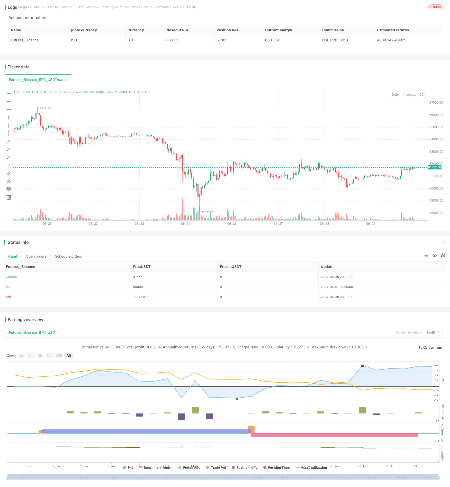

> Name

Multi-Indicator-Divergence-Trading-Strategy-with-Adaptive-Take-Profit-and-Stop-Loss
> Author

ChaoZhang

> Strategy Description



[trans]

#### Overview
This strategy is a trading system based on multiple technical indicator divergences, combining the signals of RSI, MACD and stochastic indicators to identify potential buying and selling opportunities. The strategy also integrates flexible take-profit and stop-loss mechanisms to manage risk and lock in profits. By comprehensively analyzing the divergence signals of multiple indicators, this strategy aims to improve the accuracy and reliability of trading decisions.
#### Strategy Principle
The core principle of this strategy is to use the divergence of multiple technical indicators to identify potential trend reversal points. Specifically, the strategy uses the following three indicators:
1. Relative Strength Index (RSI): Used to measure price momentum.
2. Moving Average Convergence/Divergence Indicator (MACD): Used to identify trend direction and strength.
3. Stochastic: used to determine whether an asset is overbought or oversold.
The strategy works through the following steps:
1. Calculate the values ​​of RSI, MACD and stochastic indicators.
2. Detect the deviation of each indicator:
   - RSI Divergence: When the RSI crosses its 14-period simple moving average.
   - MACD Divergence: When the MACD line crosses the signal line.
   - Stochastic Divergence: When Stochastic crosses its 14-period simple moving average.
3. The strategy generates a trading signal when all three indicators show divergence:
   - Buy signal: RSI divergence + MACD divergence + Stochastic divergence
   - Sell signal: RSI divergence + MACD divergence + stochastic indicator does not divergence
4. Execute the trade and set take profit and stop loss levels:
   - Take profit level: 20% of entry price
   - Stop loss level: 10% of entry price
This multiple confirmation method is designed to reduce false signals and improve trading accuracy.
#### Strategic Advantages
1. Multiple indicator confirmation: By combining the signals of RSI, MACD and stochastic indicators, the strategy can more accurately identify potential trend reversal points and reduce the impact of false signals.
2. Flexible risk management: Integrated take-profit and stop-loss mechanisms allow traders to adjust the risk-reward ratio based on personal risk preferences and market conditions.
3. Highly adaptable: The strategy can be applied to different time frames and various financial instruments, and has wide applicability.
4. Automated trading: Strategies can be easily automated, reducing the impact of human emotions and improving execution efficiency.
5. Clear entry and exit rules: Clearly defined trading rules eliminate subjective judgment and help maintain trading discipline.
6. Dynamic stop-profit and stop-loss: Take-profit and stop-loss settings based on the percentage of the entry price, which can be automatically adjusted according to different market volatility.
7. Trend catching ability: By identifying divergences, the strategy has the potential to catch the formation of new trends at an early stage.
#### Strategy Risk
1. Excessive trading risk: Multiple indicators may lead to frequent trading signals, increase transaction costs and may affect overall performance.
2. Lagging problem: Technical indicators are lagging in nature, which may result in trading after the trend has changed significantly.
3. Market condition sensitivity: In sideways or low-volatility markets, strategies may underperform and generate more false signals.
4. Limitations of fixed take-profit and stop-loss: Although percentage-based take-profit and stop-loss provide some flexibility, they may not be suitable for all market conditions.
5. Parameter optimization risk: Over-optimizing indicator parameters may lead to over-fitting and poor performance in actual transactions.
6. Correlation risk: Under certain market conditions, different indicators may be highly correlated, reducing the effectiveness of multiple confirmations.
7. Lack of fundamental considerations: Pure technical analysis methods may ignore important fundamental factors and affect long-term performance.
#### Strategy optimization direction
1. Dynamic indicator parameters: Introduce an adaptive mechanism to dynamically adjust the parameters of RSI, MACD and stochastic indicators according to market volatility.
2. Market regime identification: Integrate market status classification algorithms to adjust strategic behaviors in different market environments (such as trends, shocks).
3. Take-profit and stop-loss optimization: Implement dynamic take-profit and stop-loss, taking into account market volatility and support and resistance levels, instead of just relying on fixed percentages.
4. Add trading volume analysis: integrate trading volume indicators to improve the accuracy of trend reversal identification.
5. Time filter: Introduce time-based filters to avoid trading during known periods of low liquidity or high volatility.
6. Machine learning enhancement: Use machine learning algorithms to optimize indicator combinations and weights to improve signal quality.
7. Risk management improvements: Implement more complex position management strategies, such as volatility-based position sizing.
8. Multi-time frame analysis: Integrate the analysis of multiple time frames to improve the robustness of trading decisions.
9. Fundamental integration: Consider incorporating key fundamental indicators or events into the decision-making process to achieve a more comprehensive analysis.
#### Summarize
"Multi-Indicator Divergence Buying and Selling Strategy with Adaptive Take Profit and Stop Loss" is a complex and comprehensive trading system that identifies potential trend reversal opportunities by integrating divergence signals from multiple technical indicators. The advantage of this strategy lies in its multiple confirmation mechanism and flexible risk management method, which help improve the accuracy and reliability of trading decisions. However, it also faces challenges such as over-trading, hysteresis and sensitivity to market conditions.
The strategy has the potential to further improve its performance and adaptability by implementing recommended optimization measures, such as dynamic parameter adjustments, market state identification and more advanced risk management techniques. Importantly, traders should be cautious in practical application, fully test the performance of the strategy under different market conditions, and make necessary adjustments based on personal risk tolerance and investment goals.
Overall, this strategy provides quantitative traders with a powerful framework that can serve as the basis for building more complex and personalized trading systems. Through continuous optimization and improvement, it has the potential to become an effective trading tool to help traders succeed in complex and ever-changing financial markets.
|| 

#### Overview

This strategy is a trading system based on multiple technical indicator divergences, combining signals from RSI, MACD, and Stochastic indicators to identify potential buying and selling opportunities. The strategy also integrates flexible take profit and stop loss mechanisms to manage risk and lock in profits. By comprehensively analyzing divergence signals from multiple indicators, this strategy aims to improve the accuracy and reliability of trading decisions.

#### Strategy Principle

The core principle of this strategy is to utilize divergences from multiple technical indicators to identify potential trend reversal points. Specifically, the strategy uses the following three indicators:

1. Relative Strength Index (RSI): Used to measure price momentum.
2. Moving Average Convergence Divergence (MACD): Used to identify trend direction and strength.
3. Stochastic Oscillator: Used to determine if an asset is overbought or oversold.

The strategy operates through the following steps:

1. Calculate the values of RSI, MACD, and Stochastic indicators.
2. Detect divergences for each indicator:
   - RSI divergence: When RSI crosses its 14-period simple moving average.
   - MACD divergence: When the MACD line crosses the signal line.
   - Stochastic divergence: When the Stochastic oscillator crosses its 14-period simple moving average.
3. Generate trading signals when all three indicators show divergences:
   - Buy signal: RSI divergence + MACD divergence + Stochastic divergence
   - Sell signal: RSI divergence + MACD divergence + No Stochastic divergence
4. Execute trades and set take profit and stop loss levels:
   - Take profit level: 20% of the entry price
   - Stop loss level: 10% of the entry price

This multiple confirmation approach aims to reduce false signals and improve trading accuracy.

#### Strategy Advantages

1. Multiple indicator confirmation: By combining signals from RSI, MACD, and Stochastic indicators, the strategy can more accurately identify potential trend reversal points, reducing the impact of false signals.

2. Flexible risk management: The integrated take profit and stop loss mechanism allows traders to adjust risk-reward ratios according to personal risk preferences and market conditions.

3. High adaptability: The strategy can be applied to different time frames and various financial instruments, offering wide applicability.

4. Automated trading: The strategy can be easily automated, reducing human emotional influence and improving execution efficiency.

5. Clear entry and exit rules: Well-defined trading rules eliminate subjective judgment, helping maintain trading discipline.

6. Dynamic take profit and stop loss: Setting take profit and stop loss based on entry price percentages allows for automatic adjustment according to different market volatilities.

7. Trend capturing ability: By identifying divergences, the strategy has the potential to capture new trend formations in their early stages.

#### Strategy Risks

1. Overtrading risk: Multiple indicators may lead to frequent trading signals, increasing trading costs and potentially affecting overall performance.

2. Lag issue: Technical indicators are inherently lagging, which may result in trades being executed after significant trend changes have already occurred.

3. Market condition sensitivity: The strategy may underperform in ranging or low volatility markets, generating more false signals.

4. Limitations of fixed take profit and stop loss: Although percentage-based take profit and stop loss provide some flexibility, they may not be suitable for all market conditions.

5. Parameter optimization risk: Over-optimizing indicator parameters may lead to overfitting, resulting in poor performance in actual trading.

6. Correlation risk: Under certain market conditions, different indicators may be highly correlated, reducing the effectiveness of multiple confirmations.

7. Lack of fundamental considerations: A purely technical analysis approach may ignore important fundamental factors, affecting long-term performance.

#### Strategy Optimization Directions

1. Dynamic indicator parameters: Introduce adaptive mechanisms to dynamically adjust RSI, MACD, and Stochastic indicator parameters based on market volatility.

2. Market regime recognition: Integrate market state classification algorithms to adjust strategy behavior in different market environments (e.g., trending, ranging).

3. Take profit and stop loss optimization: Implement dynamic take profit and stop loss considering market volatility and support/resistance levels, rather than relying solely on fixed percentages.

4. Incorporate volume analysis: Integrate volume indicators to improve the accuracy of trend reversal identification.

5. Time filters: Introduce time-based filters to avoid trading during known low liquidity or high volatility periods.

6. Machine learning enhancement: Utilize machine learning algorithms to optimize indicator combinations and weights, improving signal quality.

7. Risk management improvements: Implement more sophisticated position management strategies, such as volatility-based position sizing adjustments.

8. Multi-timeframe analysis: Integrate analysis from multiple timeframes to improve the robustness of trading decisions.

9. Fundamental integration: Consider incorporating key fundamental indicators or events into the decision-making process for more comprehensive analysis.

#### Conclusion

The "Multi-Indicator Divergence Trading Strategy with Adaptive Take Profit and Stop Loss" is a complex and comprehensive trading system that identifies potential trend reversal opportunities by integrating divergence signals from multiple technical indicators. The strategy's strengths lie in its multiple confirmation mechanism and flexible risk management approach, which help improve the accuracy and reliability of trading decisions. However, it also faces challenges such as overtrading, lagging issues, and market condition sensitivity.

By implementing the suggested optimization measures, such as dynamic parameter adjustment, market state recognition, and more advanced risk management techniques, the strategy has the potential to further enhance its performance and adaptability. It is important for traders to exercise caution in practical application, thoroughly test the strategy's performance under various market conditions, and make necessary adjustments based on individual risk tolerance and investment objectives.

Overall, this strategy provides a powerful framework for quantitative traders and can serve as a foundation for building more complex and personalized trading systems. Through continuous optimization and improvement, it has the potential to become an effective trading tool, helping traders achieve success in complex and dynamic financial markets.

[/trans]


> Source (PineScript)

``` pinescript
/*backtest
start: 2024-06-01 00:00:00
end: 2024-06-30 23:59:59
period: 1h
basePeriod: 15m
exchanges: [{"eid":"Futures_Binance","currency":"BTC_USDT"}]
*/

//You will have to choose between High profits and high risks or low profits and low risks? By adjusting TP and SL values  
//.........................Working principle
//Even though many pyramid orders are opened  The position will be closed when the specified TP target profit is reached. 
//..... and setting SL is to ensure safety from being dragged down and losing a large sum of money (it is very important, you need to know what percentage the price swings on the moving chart are in most cases).
//I wish you good luck and prosperity as you use this indicator.


//@version=5
strategy("Multi-Divergence Buy/Sell Strategy with TP and SL", overlay=true)

// Input parameters
rsiLength = input(14, "RSI Length")
macdShortLength = input(12, "MACD Short Length")
macdLongLength = input(26, "MACD Long Length")
macdSignalSmoothing = input(9, "MACD Signal Smoothing")
stochLength = input(14, "Stochastic Length")
stochOverbought = input(80, "Stochastic Overbought Level")
stochOversold = input(20, "Stochastic Oversold Level")

// Take Profit and Stop Loss as percentage of entry price
takeProfitPerc = input(20.0, "Take Profit (%)") / 100.0
stopLossPerc = input(10.0, "Stop Loss (%)") / 100.0

// Calculate RSI
rsi = ta.rsi(close, rsiLength)

// Calculate MACD
[macdLine, signalLine, _] = ta.macd(close, macdShortLength, macdLongLength, macdSignalSmoothing)

// Calculate Stochastic
stoch = ta.stoch(close, high, low, stochLength)

// Determine divergences
rsiDivergence = ta.crossover(rsi, ta.sma(rsi, 14))
macdDivergence = ta.crossover(macdLine, signalLine)
stochDivergence = ta.crossover(stoch, ta.sma(stoch, 14))

// Determine buy/sell conditions
buyCondition = rsiDivergence and macdDivergence and stochDivergence
sellCondition = rsiDivergence and macdDivergence and not stochDivergence

// Execute buy/sell orders
if (buyCondition)
    strategy.entry("Buy", strategy.long)

if (sellCondition)
    strategy.entry("Sell", strategy.short)

// Calculate take profit and stop loss levels
longTakeProfitPrice = strategy.position_avg_price * (1 + takeProfitPerc)
longStopLossPrice = strategy.position_avg_price * (1 - stopLossPerc)
shortTakeProfitPrice = strategy.position_avg_price * (1 - takeProfitPerc)
shortStopLossPrice = strategy.position_avg_price * (1 + stopLossPerc)

// Close positions at take profit or stop loss level
if (strategy.position_size > 0)
    strategy.exit("Take Profit/Stop Loss", "Buy", limit=longTakeProfitPrice, stop=longStopLossPrice)

if (strategy.position_size < 0)
    strategy.exit("Take Profit/Stop Loss", "Sell", limit=shortTakeProfitPrice, stop=shortStopLossPrice)

// Plotting buy/sell signals
plotshape(buyCondition, title="Buy Signal", location=location.belowbar, color=color.green, style=shape.labelup, text="Buy")
plotshape(sellCondition, title="Sell Signal", location=location.abovebar, color=color.red, style=shape.labeldown, text="Sell")

```

> Detail

https://www.fmz.com/strategy/458071

> Last Modified

2024-07-29 17:02:12
