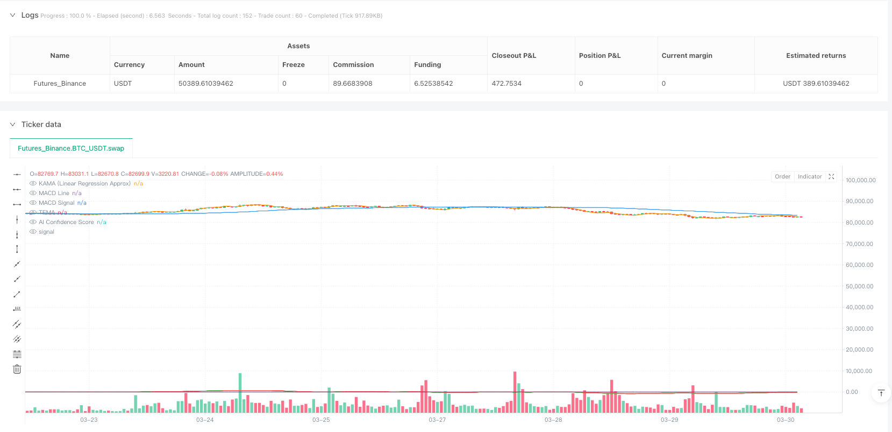
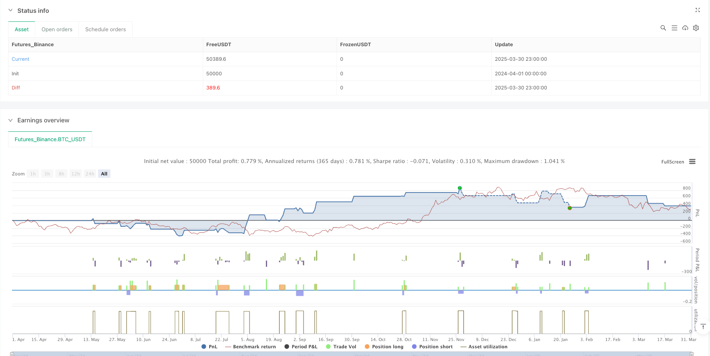

> Name

Multi-Indicator-Dynamic-Adaptive-Quantitative-Trading-Strategy
> Author

ianzeng123

> Strategy Description





[trans]

## Overview
This trading strategy is a comprehensive quantitative trading system that combines multiple technical indicators and artificial intelligence-assisted signal filtering. This strategy utilizes Triple Exponential Moving Average (TEMA), Kaufman Adaptive Moving Average (KAMA), MACD, Relative Strength Index (RSI), Average True Range (ATR), and volume analysis to identify potential entry and exit points. Through the AI ​​signal filtering mechanism, this strategy can screen out high-confidence trading signals and use dynamic risk management technology to set stop loss and take profit levels.
## Strategy Principle
The core principle of this strategy is based on multi-indicator crossover and auxiliary condition confirmation:
1. **Indicator Calculation**:
   - Triple Exponential Moving Average (TEMA): performs triple exponential smoothing on prices to reduce lag
   - Kaufman Adaptive Approximation (Linear Regression): Uses linear regression instead of traditional KAMA to provide predictions of price trends
   - MACD: Calculate fast, slow and signal lines and identify momentum changes
   - RSI: measures the speed and magnitude of price changes, identifying overbought and oversold areas
   - ATR: measures market volatility and is used to set dynamic stop loss points
2. **AI signal filtering**:
   The policy creates a weighted confidence score that combines the following factors:
   - Normalization of MACD histogram relative to historical highs
   - How far the RSI deviates from the center line (50)
   - Ratio of volume relative to average volume
   The average of these three indicators forms the AI signal, and only when the signal exceeds the set threshold, the transaction will be executed.
3. **Admission Conditions**:
   Long entry requirements:
   - KAMA crosses TEMA (trend changes to upward)
   - MACD line is above the signal line (upward momentum)
   - RSI is above oversold levels (price has rebound momentum)
   - Volume is a certain multiple above average volume (strong market participation)
   - AI confidence is higher than the threshold (comprehensive confirmation)
For short entries the opposite conditions apply.
4. **Risk Management**:
   - Dynamic stop loss points are calculated based on ATR to adapt to market volatility
   - The take-profit level is set based on the risk-reward ratio to ensure that the risk-reward ratio of each transaction is consistent
## Strategic Advantages
1. **Multi-dimensional signal confirmation**:
   By requiring simultaneous confirmation from multiple independent indicators, this strategy reduces the possibility of false signals. The crossover of TEMA and KAMA provides trend direction, while MACD and RSI confirm momentum and overbought and oversold conditions respectively.
2. **Dynamic Risk Management**:
   Use ATR's stop-loss setting method to adapt to current market volatility, ensuring that stops are not triggered by market noise or are too loose in high-volatility environments.
3. **AI enhanced filtering**:
   While the AI implementation in the code is simulated, it integrates three key market aspects (price momentum, overbought and oversold, and volume abnormalities), adding an extra layer of confirmation to traditional indicators.
4. **Trading volume confirmation**:
   By requiring trades to occur at times of unusually high volume, the strategy ensures that moves are entered with sufficient market participation, which usually means more reliable price action.
5. **Flexible parameterization**:
   The strategy provides multiple adjustable parameters, allowing traders to optimize based on different market conditions or personal risk preferences.
## Strategy Risk
1. **Parameter optimization overfitting**:
   The strategy contains multiple parameters (such as TEMA length, KAMA length, MACD settings, etc.), and over-optimizing these parameters may lead to over-fitting problems that perform well on historical data but perform poorly on future real-time markets. Mitigation is achieved using stepwise optimization and robustness testing under multiple market conditions.
2. **Limitations of relying on technical indicators**:
   All indicators used are lagging in nature and may give inaccurate signals in rapidly changing markets or extreme conditions. This problem can be partially alleviated by adding AI confidence scores, but it cannot be completely eliminated.
3. **Increased fault points in complex systems**:
   Since the strategy relies on multiple indicators and conditions to be met at the same time, it may lead to a reduction in trading frequency and miss some potentially beneficial opportunities. In low volatility or sideways markets, this conservative approach can result in long periods of no trading.
4. **Limitations of AI simulation**:
   The "AI" in the code is actually a simplified mathematical model, not a real machine learning algorithm. It lacks adaptive learning and true pattern recognition capabilities and may not be able to identify complex market patterns as effectively as real AI.
5. **Slippage and Commission Impact**:
   Although the strategy takes slippage and commissions into account, in actual trading, these costs may be higher than expected, especially in low liquidity or high volatility environments, affecting the overall profitability of the strategy.
## Strategy optimization direction
1. **Real AI Integration**:
   Replace simple AI signals with true machine learning models such as random forests or neural networks. This can be achieved by externally training the model, and then inputting the prediction results into the policy, improving the policy's ability to identify real patterns.
2. **Market status adaptive**:
   Add market state identification logic (such as trend, interval or high volatility state) to automatically adjust parameters according to different market environments. For example, a range-bound market may require more sensitive indicator settings, while a trending market may require more conservative settings.
3. **Time filter**:
   Implement a time filtering mechanism to avoid trading during periods when major economic data is released or market liquidity is low, and reduce risks caused by abnormal fluctuations.
4. **Improve stop loss strategy**:
   Consider implementing a trailing stop or a stop based on support/resistance levels rather than relying solely on ATR. This can better protect profits and adapt to changes in market structure.
5. **Optimize position management**:
   The current strategy uses a fixed percentage of capital for each trade. Dynamic position management can be implemented to adjust the position size based on market volatility, trading signal strength and historical winning rate to achieve better capital risk management.
6. **Add filter**:
   Consider adding trend strength indicators (such as ADX) or market structure indicators (such as support/resistance, key price levels) as an additional layer of confirmation to reduce trading in low-quality setups.
## Summarize
This "Multi-Indicator Dynamic Adaptive Quantitative Trading Strategy" represents a carefully designed quantitative trading approach that creates a comprehensive trading system by combining traditional technical analysis indicators with simulated AI confidence scoring. Its core strengths lie in multi-level signal confirmation and dynamic risk management that adapts to market fluctuations.
The basis of the strategy is the intersection of TEMA and KAMA, supplemented by MACD, RSI and volume analysis, followed by final screening by AI confidence scores. This multi-layered approach helps reduce false signals, but can also lead to missed trading opportunities.
To further improve strategy performance, it is recommended to implement true machine learning models, market state adaptability, optimized stop loss mechanisms and dynamic position management. These improvements can enhance the strategy's ability to respond to different market environments and improve long-term stability and profit potential.
Importantly, any quantitative strategy needs to be comprehensively backtested and forward tested before implementation, with special attention to performance under different market conditions to ensure the robustness and adaptability of the strategy. In actual trading, continuous monitoring and necessary adjustments are also crucial to adapt to changing market dynamics. ||
## Overview

This trading strategy is a comprehensive quantitative trading system that combines multiple technical indicators with AI-assisted signal filtering. The strategy utilizes Triple Exponential Moving Average (TEMA), Kaufman Adaptive Moving Average (KAMA), MACD, Relative Strength Index (RSI), Average True Range (ATR), and volume analysis to identify potential entry and exit points. Through an AI signal filtering mechanism, the strategy can screen for high-confidence trading signals and uses dynamic risk management techniques to set stop-loss and take-profit levels.

## Strategy Principle

The core principle of this strategy is built on multi-indicator crossovers and confirmatory conditions:

1. **Indicator Calculation**:
   - Triple Exponential Moving Average (TEMA): Applies exponential smoothing three times to reduce lag
   - Kaufman Adaptive Approximation (Linear Regression): Uses linear regression instead of traditional KAMA to provide price trend prediction
   - MACD: Calculates fast line, slow line, and signal line to identify momentum changes
   - RSI: Measures the speed and magnitude of price movements to identify overbought and oversold areas
   - ATR: Measures market volatility, used for setting dynamic stop points

2. **AI Signal Filtering**:
   The strategy creates a weighted confidence score by incorporating:
   - Normalized MACD histogram relative to historical highs
   - RSI deviation from the centerline (50)
   - Volume ratio relative to average volume
   These three metrics are averaged to form the AI signal, and trades are only executed when this signal exceeds a set threshold.

3. **Entry Conditions**:
   Long entry requirements:
   - KAMA crosses above TEMA (trend turns upward)
   - MACD line is above the signal line (upward momentum)
   - RSI is above oversold level (price has rebound momentum)
   - Volume is higher than a specific multiple of average volume (strong market participation)
   - AI confidence is above threshold (comprehensive confirmation)

   Opposite conditions apply for short entries.

4. **Risk Management**:
   - Dynamic stop-loss points calculated based on ATR, adapting to market volatility
   - Take-profit levels set based on risk-reward ratio, ensuring consistent risk-reward proportion for each trade

## Strategy Advantages

1. **Multi-dimensional Signal Confirmation**:
   By requiring multiple independent indicators to confirm simultaneously, the strategy reduces the possibility of false signals. The TEMA and KAMA crossover provides trend direction, while MACD and RSI confirm momentum and overbought/oversold conditions respectively.

2. **Dynamic Risk Management**:
   The ATR-based stop-loss method adapts to current market volatility, ensuring stops aren't triggered by market noise but also aren't too loose in highly volatile environments.

3. **AI-Enhanced Filtering**:
   While the AI implementation in the code is simulated, it integrates three key market aspects (price momentum, overbought/oversold conditions, and volume anomalies), adding an extra layer of confirmation to traditional indicators.

4. **Volume Confirmation**:
   By requiring trades to occur during abnormally high volume, the strategy ensures entry into movements with sufficient market participation, which typically indicates more reliable price movements.

5. **Flexible Parameterization**:
   The strategy offers multiple adjustable parameters, allowing traders to optimize according to different market conditions or personal risk preferences.

## Strategy Risks

1. **Parameter Optimization Overfitting**:
   The strategy includes multiple parameters (such as TEMA length, KAMA length, MACD settings, etc.). Excessive optimization of these parameters may lead to overfitting, performing well on historical data but poorly in future live markets. This can be mitigated through walk-forward optimization and robustness testing across multiple market conditions.

2. **Limitations of Technical Indicators**:
   All indicators used are inherently lagging and may provide inaccurate signals in rapidly changing markets or extreme conditions. The addition of the AI confidence score partially mitigates this issue but cannot eliminate it entirely.

3. **Increased Failure Points in Complex Systems**:
   As the strategy relies on multiple indicators and conditions being met simultaneously, it may lead to reduced trading frequency, missing some potentially favorable opportunities. In low-volatility or sideways markets, this conservative approach may result in extended periods without trades.

4. **Limitations of AI Simulation**:
   The "AI" in the code is actually a simplified mathematical model, not a true machine learning algorithm. It lacks adaptive learning and true pattern recognition capabilities, potentially not being as effective at identifying complex market patterns as actual AI.

5. **Impact of Slippage and Commissions**:
   Although the strategy considers slippage and commissions, in actual trading, these costs may be higher than expected, especially in low-liquidity or high-volatility environments, affecting the overall profitability of the strategy.

## Strategy Optimization Directions

1. **True AI Integration**:
   Replace the simple AI signal with a genuine machine learning model, such as random forests or neural networks. This can be implemented through externally trained models with predictions fed into the strategy, improving the ability to identify genuine patterns.

2. **Market State Adaptation**:
   Add market state recognition logic (such as trending, ranging, or high-volatility states) to automatically adjust parameters based on different market environments. For example, more sensitive indicator settings might be needed in ranging markets, while more conservative settings are appropriate in trending markets.

3. **Time Filters**:
   Implement time filtering mechanisms to avoid trading during major economic data releases or low-liquidity market sessions, reducing risks from abnormal volatility.

4. **Improved Stop-Loss Strategy**:
   Consider implementing trailing stops or support/resistance-based stops rather than relying solely on ATR. This would better protect profits and adapt to changing market structures.

5. **Optimized Position Management**:
   The current strategy uses a fixed percentage of funds for each trade. Implementing dynamic position sizing based on market volatility, signal strength, and historical win rates would achieve optimal capital risk management.

6. **Additional Filters**:
   Consider adding trend strength indicators (such as ADX) or market structure indicators (such as support/resistance, key price levels) as additional confirmation layers to reduce trading in low-quality setups.

## Summary

This "Multi-Indicator Dynamic Adaptive Quantitative Trading Strategy" represents a carefully designed quantitative trading approach that creates a comprehensive trading system by combining traditional technical analysis indicators with simulated AI confidence scoring. Its core strengths lie in multi-layered signal confirmation and dynamic risk management that adapts to market volatility.

The strategy is based on TEMA and KAMA crossovers, supplemented by MACD, RSI, and volume analysis confirmation, then finally filtered by an AI confidence score. This multi-layered approach helps reduce false signals but may also result in missing certain trading opportunities.

To further enhance strategy performance, implementing genuine machine learning models, market state adaptive adjustments, optimized stop mechanisms, and dynamic position management are recommended. These improvements can enhance the strategy's ability to handle different market environments, improving long-term stability and profit potential.

Importantly, any quantitative strategy requires comprehensive backtesting and forward testing before implementation, with particular attention to performance under different market conditions to ensure strategy robustness and adaptability. In actual trading, continuous monitoring and necessary adjustments are equally important to adapt to constantly changing market dynamics.[/trans]


> Source (PineScript)

``` pinescript
/*backtest
start: 2024-04-01 00:00:00
end: 2025-03-31 00:00:00
period: 1h
basePeriod: 1h
exchanges: [{"eid":"Futures_Binance","currency":"BTC_USDT"}]
*/

//@version=5
strategy("AI-Powered Crypto Strategy", overlay=true, default_qty_type=strategy.percent_of_equity, default_qty_value=10, calc_on_order_fills=true, calc_on_every_tick=true, slippage=1, commission_value=0.05)

// Parameters
temaLength = input(20, "Triple EMA Length")
kamaLength = input(10, "KAMA Length")
macdFast = input(12, "MACD Fast")
macdSlow = input(26, "MACD Slow")
macdSignal = input(9, "MACD Signal")
rsiLength = input(14, "RSI Length")
rsiOverbought = input(75, "RSI Overbought")
rsiOversold = input(25, "RSI Oversold")
atrLength = input(14, "ATR Length")
stopATRMultiplier = input(2, "ATR Stop Multiplier")
riskRewardRatio = input(4, "Risk-Reward Ratio")
volumeThreshold = input(2, "Volume Multiplier")
aiThreshold = input(0.6, "AI Confidence Threshold")

// Indicators
tema = ta.ema(ta.ema(ta.ema(close, temaLength), temaLength), temaLength)
kama = ta.linreg(close, kamaLength, 0) // Replacing KAMA with Linear Regression Approximation
[macdLine, signalLine, _] = ta.macd(close, macdFast, macdSlow, macdSignal)
rsi = ta.rsi(close, rsiLength)
atr = ta.atr(atrLength)
avgVolume = ta.sma(volume, 20)

// AI-Based Signal Filtering (Simulated using a weighted confidence score)
aiSignal = ((macdLine - signalLine) / ta.highest(macdLine - signalLine, 50) + (rsi - 50) / 50 + (volume / avgVolume - 1)) / 3
highConfidence = aiSignal > aiThreshold

// Entry Conditions (AI-Powered Setups)
longCondition = ta.crossover(kama, tema) and macdLine > signalLine and rsi > rsiOversold and volume > avgVolume * volumeThreshold and highConfidence
shortCondition = ta.crossunder(kama, tema) and macdLine < signalLine and rsi < rsiOverbought and volume > avgVolume * volumeThreshold and highConfidence

// Stop Loss and Take Profit (Using ATR for Dynamic Risk Management)
longStopLoss = close - (atr * stopATRMultiplier)
shortStopLoss = close + (atr * stopATRMultiplier)
longTakeProfit = close + (close - longStopLoss) * riskRewardRatio
shortTakeProfit = close - (shortStopLoss - close) * riskRewardRatio

// Execute Trades
if (longCondition)
    strategy.entry("Long", strategy.long)
    strategy.exit("Long TP", from_entry="Long", limit=longTakeProfit, stop=longStopLoss)

if (shortCondition)
    strategy.entry("Short", strategy.short)
    strategy.exit("Short TP", from_entry="Short", limit=shortTakeProfit, stop=shortStopLoss)

// Plot Indicators
plot(tema, title="TEMA", color=color.blue)
plot(kama, title="KAMA (Linear Regression Approx)", color=color.orange)
plot(macdLine, title="MACD Line", color=color.green)
plot(signalLine, title="MACD Signal", color=color.red)
plot(aiSignal, title="AI Confidence Score", color=color.purple)
plotshape(series=longCondition, location=location.belowbar, color=color.green, style=shape.labelup, title="BUY")
plotshape(series=shortCondition, location=location.abovebar, color=color.red, style=shape.labeldown, title="SELL")

```

> Detail

https://www.fmz.com/strategy/489025

> Last Modified

2025-04-01 11:25:46
