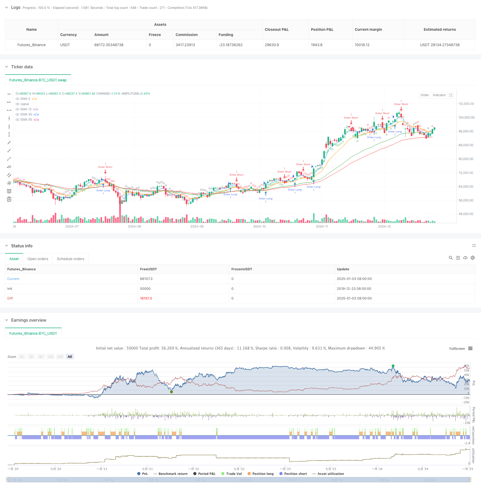

> Name

Multi-Indicator-Dynamic-Momentum-Cross-Strategy
> Author

ChaoZhang

> Strategy Description



[trans]
#### Overview
This strategy is a trading system based on multiple technical indicators, which mainly combines three core components: exponential moving average (EMA), relative strength index (RSI) and distance calculation. The strategy dynamically monitors market trend intensity and momentum changes to effectively avoid false breakthroughs and volatile markets while maintaining signal stability. The system uses a multiple confirmation mechanism to achieve accurate judgment on the market status by calculating the relative distance and dynamic threshold between indicators.
#### Strategy Principle
The strategy uses four EMA lines of different periods (5, 13, 40, and 55 periods) to build a trend framework, and uses the RSI indicator (14 periods) to enhance market direction judgment. Specifically:
1. When the 5-period EMA crosses above the 13-period EMA and the 40-period EMA crosses above the 55-period EMA, the system sends a long signal
2. A bullish trend is confirmed when the RSI value is greater than 50 and above its 14-period average
3. The system calculates the distance between EMA5 and EMA13, and compares it with the average distance of the past five K lines to determine the trend strength.
4. A strong buy signal is issued when the RSI exceeds 60, and a strong sell signal is issued when it is below 40.
5. Verify the continuity of the trend by calculating the distance change between EMA40 and EMA13
#### Strategic Advantages
1. Multiple confirmation mechanism significantly reduces false signals
2. Dynamic distance calculation helps identify changes in trend strength
3. RSI threshold design provides additional judgment of market strength
4. The signal continuity judgment mechanism reduces the risk of frequent trading
5. Trend turning point warning function helps to plan in advance
6. The system has good adaptability and can adapt to different market environments.
#### Strategy Risk
1. A sideways market may generate too many neutral signals
2. Multiple indicators may cause signal lag
3. Excessive parameter optimization may cause overfitting
4. Large retracements may occur during rapid trend reversals
5. False breakthroughs generated by EMA crossovers require additional filtering
#### Strategy optimization direction
1. Introduce trading volume indicators to enhance signal reliability
2. Optimize RSI parameters and improve the ability to predict market turning points
3. Add ATR indicator to dynamically adjust stop loss position
4. Develop an adaptive parameter system to improve strategy stability
5. Build a multi-time period signal confirmation mechanism
6. Add volatility filter to reduce false signals
#### Summary
This strategy uses the coordination of multiple technical indicators to effectively control risks while maintaining signal stability. The system design fully considers the diversity of the market, and uses dynamic threshold and distance calculation methods to improve adaptability. Through continuous optimization and improvement, the strategy is expected to maintain stable performance in different market environments. ||
#### Overview
This strategy is a trading system based on multiple technical indicators, primarily combining Exponential Moving Averages (EMA), Relative Strength Index (RSI), and distance calculations. The strategy dynamically monitors market trend strength and momentum changes, maintaining signal stability while effectively avoiding false breakouts and choppy markets. The system employs multiple confirmation mechanisms and calculates relative distances between indicators and dynamic thresholds to achieve precise market state assessment.

#### Strategy Principle
The strategy utilizes four EMAs of different periods (5, 13, 40, 55) to construct a trend framework, enhanced by the RSI indicator (14-period) for market direction judgment. Specifically:
1. Long signals are generated when the 5-period EMA crosses above the 13-period EMA and the 40-period EMA crosses above the 55-period EMA
2. Trend confirmation requires RSI above 50 and higher than its 14-period average
3. The system calculates the distance between EMA5 and EMA13, comparing it with the average distance of the past 5 candles to judge trend strength
4. Strong buy signals are issued when RSI exceeds 60, and strong sell signals when below 40
5. Trend persistence is verified by calculating distance changes between EMA40 and EMA13

#### Strategy Advantages
1. Multiple confirmation mechanisms significantly reduce false signals
2. Dynamic distance calculations help identify trend strength changes
3. RSI threshold design provides additional market strength assessment
4. Signal persistence mechanism reduces frequent trading risks
5. Trend reversal early warning function aids in advance positioning
6. System demonstrates good adaptability to different market environments

#### Strategy Risks
1. May generate excessive neutral signals in sideways markets
2. Multiple indicators might lead to signal lag
3. Parameter optimization could result in overfitting
4. Large drawdowns possible during rapid trend reversals
5. False breakouts from EMA crossovers require additional filtering

#### Strategy Optimization Directions
1. Incorporate volume indicators to enhance signal reliability
2. Optimize RSI parameters to improve market turning point prediction
3. Add ATR indicator for dynamic stop-loss adjustment
4. Develop adaptive parameter system to enhance strategy stability
5. Build multi-timeframe signal confirmation mechanism
6. Implement volatility filters to reduce false signals

#### Summary
This strategy achieves effective risk control while maintaining signal stability through the synergy of multiple technical indicators. The system design thoroughly considers market diversity, employing dynamic thresholds and distance calculations to enhance adaptability. Through continuous optimization and improvement, the strategy shows promise in maintaining stable performance across various market conditions.[/trans]


> Source (PineScript)

``` pinescript
/*backtest
start: 2019-12-23 08:00:00
end: 2025-01-04 08:00:00
period: 1d
basePeriod: 1d
exchanges: [{"eid":"Futures_Binance","currency":"BTC_USDT"}]
*/

//@version=6
strategy("EMA Crossover Strategy with RSI Average, Distance, and Signal Persistence", overlay=true, fill_orders_on_standard_ohlc=true)

// Define EMAs
ema5 = ta.ema(close, 5)
ema13 = ta.ema(close, 13)
ema40 = ta.ema(close, 40)
ema55 = ta.ema(close, 55)

// Calculate 14-period RSI
rsi = ta.rsi(close, 14)

// Calculate the RSI average
averageRsiLength = 14  // Length for RSI average
averageRsi = ta.sma(rsi, averageRsiLength)

// Define conditions
emaShortTermCondition = ema5 > ema13  // EMA 5 > EMA 13
emaLongTermCondition = ema40 > ema55  // EMA 40 > EMA 55
rsiCondition = rsi > 50 and rsi > averageRsi  // RSI > 50 and RSI > average RSI

// Track the distance between ema5 and ema13 for the last 5 candles
distance = math.abs(ema5 - ema13)
distanceWindow = 5
distances = array.new_float(distanceWindow, 0.0)
array.shift(distances)
array.push(distances, distance)

// Calculate the average distance of the last 5 distances
avgDistance = array.avg(distances)

// Track distance between EMA40 and EMA13 for the last few candles
distance40_13 = math.abs(ema40 - ema13)
distanceWindow40_13 = 5
distances40_13 = array.new_float(distanceWindow40_13, 0.0)
array.shift(distances40_13)
array.push(distances40_13, distance40_13)

// Calculate the average distance for EMA40 and EMA13
avgDistance40_13 = array.avg(distances40_13)

// Neutral condition: if the current distance is lower than the average of the last 5 distances
neutralCondition = distance < avgDistance or ema13 > ema5

// Short signal condition: EMA40 crosses above EMA55
shortCondition = ema40 > ema55

// Conditions for Green and Red signals (based on RSI thresholds)
greenSignalCondition = rsi > 60  // Green if RSI > 60, regardless of EMAs
redSignalCondition = rsi < 40  // Red if RSI < 40, regardless of EMAs

// Combine conditions for a buy signal (Long)
longCondition = emaShortTermCondition and emaLongTermCondition and rsiCondition and not neutralCondition

// Store the last signal (initialized as na)
var string lastSignal = na

// Track previous distance between EMA40 and EMA13
var float prevDistance40_13 = na

// Check if the current distance between EMA40 and EMA13 is greater than the previous
distanceCondition = (not na(prevDistance40_13)) ? (distance40_13 > prevDistance40_13) : true

// Update the lastSignal only if the current candle closes above EMA5, otherwise recalculate it
if (close > ema5)
    if (longCondition and distanceCondition)
        lastSignal := "long"
    else if (shortCondition and distanceCondition)
        lastSignal := "short"
    else if (neutralCondition)
        lastSignal := "neutral"
    // Add green signal based on RSI
    else if (greenSignalCondition)
        lastSignal := "green"
    // Add red signal based on RSI
    else if (redSignalCondition)
        lastSignal := "red"

// If current candle doesn't close above EMA5, recalculate the signal based on current conditions
if (close <= ema5)
    if (longCondition)
        lastSignal := "long"
    else if (shortCondition)
        lastSignal := "short"
    else if (greenSignalCondition)
        lastSignal := "green"
    else if (redSignalCondition)
        lastSignal := "red"
    else
        lastSignal := "neutral"

// Update previous distance for next comparison
prevDistance40_13 := distance40_13

// Set signal conditions based on lastSignal
isLong = lastSignal == "long"
isShort = lastSignal == "short"
isNeutral = lastSignal == "neutral"
isGreen = lastSignal == "green"
isRed = lastSignal == "red"

// Plot signals with preference for long (green) and short (red), no multiple signals per bar
plotshape(isLong, style=shape.circle, color=color.green, location=location.belowbar, size=size.tiny)
plotshape(isShort and not isLong, style=shape.circle, color=color.red, location=location.abovebar, size=size.tiny)
plotshape(isNeutral and not isLong and not isShort, style=shape.circle, color=color.gray, location=location.abovebar, size=size.tiny)
plotshape(isGreen and not isLong and not isShort and not isNeutral, style=shape.circle, color=color.green, location=location.belowbar, size=size.tiny)
plotshape(isRed and not isLong and not isShort and not isNeutral, style=shape.circle, color=color.red, location=location.abovebar, size=size.tiny)

// Plot EMAs for visualization
plot(ema5, color=color.blue, title="EMA 5")
plot(ema13, color=color.orange, title="EMA 13")
plot(ema40, color=color.green, title="EMA 40")
plot(ema55, color=color.red, title="EMA 55")

// Plot RSI average for debugging (optional, remove if not needed)
// plot(averageRsi, title="Average RSI", color=color.orange)
// hline(50, title="RSI 50", color=color.gray)  // Optional: Comment this out too if not needed


if isLong
    strategy.entry("Enter Long", strategy.long)
else if isShort
    strategy.entry("Enter Short", strategy.short)
```

> Detail

https://www.fmz.com/strategy/477562

> Last Modified

2025-01-06 14:00:47
