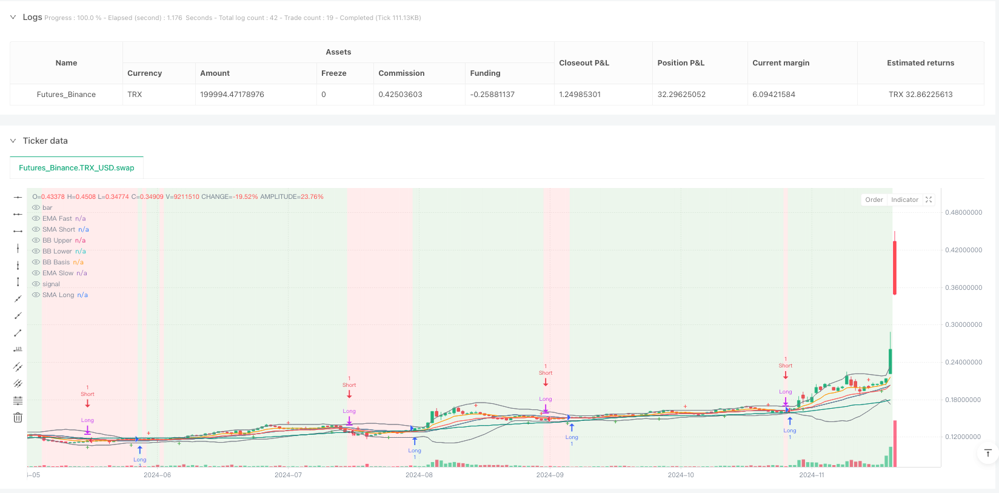
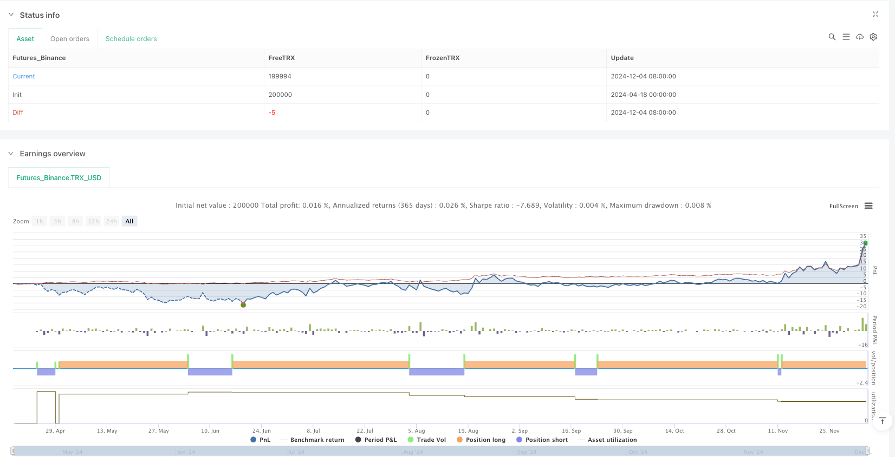

> Name

Multi-Indicator-Dynamic-Trend-Capture-and-Mean-Reversion-Strategy
> Author

ianzeng123

> Strategy Description





[trans]

#### Overview
The multi-indicator dynamic trend capturing and mean reversion strategy is a comprehensive trading system that integrates a variety of technical indicators for market analysis and automated trading decisions. This strategy integrates the advantages of trend tracking and mean reversion, identifying market trends through exponential moving averages (EMA) and simple moving averages (SMA), judging momentum with the relative strength indicator (RSI), monitoring volatility with Bollinger Bands (BB), and identifying market structures with support and resistance levels and ZigZag, forming a multi-dimensional trading decision-making framework. Its core logic revolves around trend confirmation, price momentum, overbought and oversold areas, and the position of price relative to the mean to build a complete multi-factor trading system.
#### Strategy Principle
The core principle of this strategy is based on the methodology of multi-indicator collaborative confirmation, which mainly includes the following key components:
1. **Trend Identification System**: Use the intersection of fast EMA (default 9 periods) and slow EMA (default 21 periods) to determine the short-term trend direction, and combine short-term SMA (default 20 periods) and long-term SMA (default 50 periods) to confirm the overall market trend, forming a multi-level trend filtering mechanism.
2. **Momentum Monitoring**: Use the RSI indicator (default 14 periods) to determine the overbought and oversold state of the market. Under long conditions, the RSI is required to be below 60 to avoid entering the market at an excessively high position; under short conditions, the RSI is required to be above 40 to avoid shorting at an excessively low position.
3. **Volatility Analysis**: Use Bollinger Bands (default period 20, 2 times standard deviation) to measure market volatility and identify potential breakthroughs. The position of price relative to the middle track (mean) of Bollinger Bands is a key component of entry signals.
4. **Market Structure Identification**: Combines Pivot highs/lows to mark potential support and resistance areas, and the ZigZag indicator to simplify price structure and help identify important swing highs and lows.
The entry conditions for bulls must be met at the same time: the fast EMA is greater than the slow EMA, the closing price is higher than the short-term SMA, the RSI is lower than 60, and the closing price is higher than the middle track of the Bollinger Bands. The entry conditions for shorts are the opposite: the fast EMA is smaller than the slow EMA, the closing price is lower than the short-term SMA, the RSI is higher than 40, and the closing price is lower than the middle track of the Bollinger Bands. The strategy uses opposing conditions as exit signals, that is, closing long positions when short conditions are triggered and closing short positions when long conditions are triggered.
#### Strategic Advantages
By in-depth analysis of the code implementation of this strategy, the following significant advantages can be summarized:
1. **Multiple confirmation mechanism**: By integrating multiple technical indicators, the strategy ensures that trading signals are confirmed in multiple dimensions, effectively reducing false signals and improving transaction quality.
2. **Strong adaptability**: This strategy uses moving averages of different periods and multiple types of indicators to adapt to different market environments. Whether it is a trending market or a oscillating market, it has corresponding analysis dimensions.
3. **Built-in risk management**: Through RSI overbought and oversold filtering and Bollinger Band mean reference, the strategy has a built-in risk control mechanism to avoid entering the market at a disadvantageous position.
4. **Visual aided decision-making**: The strategy provides rich visual elements, including trend background colors, support and resistance marks, and ZigZag high and low points, allowing traders to intuitively understand the market structure.
5. **Parameter Adjustability**: The parameters of all key indicators can be adjusted by input, allowing traders to optimize according to different market conditions and trading varieties.
6. **Complete entry and exit logic**: The strategy provides clear entry and exit conditions at the same time, forming a closed trading cycle and avoiding the common problem of only entry and lack of exit logic.
#### Strategy Risk
Although this strategy is comprehensively designed, it still has the following potential risks and limitations:
1. **Parameter sensitivity**: The strategy depends on the parameter settings of multiple technical indicators, and different parameter combinations may produce completely different results. Over-optimization may lead to overfitting and poor performance in future market environments. It is recommended to conduct robust backtesting and forward testing and avoid using parameters that are too specific.
2. **Market environment dependence**: In a market environment with severe fluctuations or rapid trend changes, trend confirmation based on moving averages may lag behind, resulting in delayed entry opportunities or missing key turning points. It is recommended to test strategy performance in different market environments.
3. **Signal Conflict**: Multi-indicator systems may produce conflicting signals in certain market situations, especially during market turning periods. The solution is to introduce higher level timeframe confirmation or add filters.
4. **Lack of stop loss mechanism**: The current strategy uses reverse signals as exit conditions, but there is no clear stop loss setting, which may lead to larger losses under extreme market conditions. It is recommended to add a stop loss mechanism based on a fixed percentage or ATR.
5. **Computational complexity**: The calculation and monitoring of multi-indicator strategies are relatively complex, which may increase the difficulty and potential errors of strategy execution. It is recommended to use automated systems to enforce policies and reduce human error.
#### Strategy optimization direction
Based on code analysis, this strategy can be optimized from the following directions:
1. **Adaptive parameters**: Change fixed indicator parameters to adaptive parameters, such as dynamically adjusting EMA and Bollinger Band parameters based on market volatility (ATR) to better adapt to different market environments. This allows the use of longer periods in high volatility environments and shorter periods in low volatility environments.
2. **Multiple time frame analysis**: Introduce trend confirmation of higher time frames, and only execute transactions when the trend direction of higher time frames is consistent. For example, only execute a long signal on the 4-hour chart when the daily trend is up.
3. **Stop Loss Optimization**: Add a dynamic stop loss mechanism based on ATR or key support and resistance levels to improve risk management capabilities. Consider using the previous ZigZag low as a long stop and the previous ZigZag high as a short stop.
4. **Trading volume filter**: Combined with trading volume indicators, such as OBV or volume-weighted moving average, to ensure that price movements are confirmed by trading volume and avoid false breakthroughs in low trading volume environments.
5. **Machine learning optimization**: Use machine learning algorithms to automatically find the optimal parameter combination, or predict the effectiveness of each indicator based on historical data, and dynamically adjust the weight of different indicators in decision-making.
6. **Market status classification**: Add a market status recognition module to distinguish trending markets and oscillating markets, and apply different trading logic in different market states. For example, when a volatile market is identified, stricter entry filtering can be added or a pure mean reversion strategy can be adjusted.
#### Summarize
The multi-indicator dynamic trend capturing and mean reversion strategy is a comprehensive trading system that combines multiple dimensions of technical analysis. It builds a multi-level trading decision-making framework by integrating EMA, SMA, RSI, Bollinger Bands and market structure analysis tools. The strategy provides enough flexibility to adapt to different market conditions while remaining systematic and disciplined.
The main advantage of this strategy lies in its multi-dimensional signal confirmation mechanism and complete trading logic, but it also faces challenges such as parameter sensitivity and market environment dependence. By introducing optimization directions such as adaptive parameters, multi-time frame analysis, enhanced risk management and market status classification, the strategy has the potential to further improve its stability and adaptability.
For traders, this strategy provides a good starting point, but it is recommended that necessary adjustments and optimizations are made based on personal risk appetite and trading goals. Most importantly, any strategy should be fully backtested and verified with a small amount of money before actual deployment to ensure its effectiveness in a real market environment. ||
#### Overview

The Multi-Indicator Dynamic Trend Capture and Mean Reversion Strategy is a comprehensive trading system that integrates multiple technical indicators for market analysis and automated trading decisions. This strategy combines the advantages of trend following and mean reversion by using Exponential Moving Averages (EMA), Simple Moving Averages (SMA) to identify market trends, Relative Strength Index (RSI) to assess momentum, Bollinger Bands (BB) to monitor volatility, and support/resistance levels and ZigZag to identify market structure, forming a multi-dimensional trading decision framework. Its core logic revolves around trend confirmation, price momentum, overbought/oversold regions, and price position relative to the mean, creating a complete multi-factor trading system.

#### Strategy Principles

The core principle of this strategy is based on a methodology of multiple indicator confirmation, mainly including the following key components:

1. **Trend Identification System**: Uses the crossover of Fast EMA (default 9 periods) and Slow EMA (default 21 periods) to determine short-term trend direction, while combining Short SMA (default 20 periods) and Long SMA (default 50 periods) to confirm overall market trends, forming a multi-layered trend filtering mechanism.

2. **Momentum Monitoring**: Employs the RSI indicator (default 14 periods) to judge market overbought/oversold conditions, requiring RSI below 60 for long positions to avoid entering at excessively high levels, and RSI above 40 for short positions to avoid shorting at excessively low levels.

3. **Volatility Analysis**: Uses Bollinger Bands (default 20 periods, 2 standard deviations) to measure market volatility and identify potential breakouts. The price position relative to the Bollinger middle band (mean) is a key component of entry signals.

4. **Market Structure Recognition**: Combines Pivot highs/lows to mark potential support and resistance areas, as well as the ZigZag indicator to simplify price structure, helping to identify important swing highs and lows.

Long entry conditions require simultaneous satisfaction of: Fast EMA greater than Slow EMA, closing price above Short SMA, RSI below 60, and closing price above the Bollinger middle band. Short entry conditions are the opposite: Fast EMA less than Slow EMA, closing price below Short SMA, RSI above 40, and closing price below the Bollinger middle band. The strategy uses opposing conditions as exit signals, i.e., exiting long positions when short conditions trigger, and exiting short positions when long conditions trigger.

#### Strategy Advantages

Through in-depth analysis of the strategy's code implementation, the following significant advantages can be summarized:

1. **Multiple Confirmation Mechanism**: By integrating multiple technical indicators, the strategy ensures that trading signals are confirmed from multiple dimensions, effectively reducing false signals and improving trading quality.

2. **Strong Adaptability**: The strategy utilizes moving averages of different periods and various types of indicators, allowing it to adapt to different market environments, whether trending or oscillating markets.

3. **Built-in Risk Management**: Through RSI overbought/oversold filtering and Bollinger Band mean reference, the strategy has built-in risk control mechanisms to avoid entering at unfavorable positions.

4. **Visual Decision Support**: The strategy provides rich visual elements, including trend background colors, support/resistance markers, and ZigZag highs/lows, allowing traders to intuitively understand market structure.

5. **Parameter Adjustability**: All key indicator parameters can be adjusted through inputs, allowing traders to optimize according to different market conditions and trading instruments.

6. **Complete Entry and Exit Logic**: The strategy provides clear entry and exit conditions simultaneously, forming a closed trading loop and avoiding the common problem of having only entry logic without exit logic.

#### Strategy Risks

Despite the comprehensive design of this strategy, there are still the following potential risks and limitations:

1. **Parameter Sensitivity**: The strategy relies on parameter settings of multiple technical indicators, and different parameter combinations may produce vastly different results. Excessive optimization may lead to overfitting, resulting in poor performance in future market environments. It is recommended to conduct robust backtesting and forward testing, avoiding the use of overly specific parameters.

2. **Market Environment Dependency**: In markets with violent fluctuations or rapid trend changes, trend confirmation based on moving averages may lag, leading to delayed entry timing or missing key turning points. It is recommended to test strategy performance under different market environments.

3. **Signal Conflicts**: Multi-indicator systems may produce contradictory signals in certain market situations, especially during market transitions. The solution is to introduce higher timeframe confirmation or add filtering conditions.

4. **Lack of Stop-Loss Mechanism**: The current strategy uses reverse signals as exit conditions but has no explicit stop-loss settings, which may lead to significant losses under extreme market conditions. It is recommended to add stop-loss mechanisms based on fixed percentages or ATR.

5. **Computational Complexity**: Multi-indicator strategies have relatively complex calculations and monitoring, which may increase the difficulty of strategy execution and potential for errors. It is recommended to use automated systems to execute the strategy, reducing human error.

#### Strategy Optimization Directions

Based on code analysis, this strategy can be optimized in the following directions:

1. **Adaptive Parameters**: Change fixed indicator parameters to adaptive ones, such as dynamically adjusting EMA and Bollinger Band parameters based on market volatility (ATR), to better adapt to different market environments. This allows for using longer periods in high volatility environments and shorter periods in low volatility environments.

2. **Multi-Timeframe Analysis**: Introduce higher timeframe trend confirmation, executing trades only when the trend direction in the higher timeframe is consistent. For example, only execute long signals on the 4-hour chart when the daily trend is upward.

3. **Stop-Loss Optimization**: Add dynamic stop-loss mechanisms based on ATR or key support/resistance levels to improve risk management capabilities. Consider using the previous ZigZag low as a stop-loss for long positions and the previous ZigZag high as a stop-loss for short positions.

4. **Volume Filtering**: Integrate volume indicators, such as OBV or volume-weighted moving averages, to ensure price movements are confirmed by trading volume, avoiding false breakouts in low volume environments.

5. **Machine Learning Optimization**: Use machine learning algorithms to automatically find optimal parameter combinations, or dynamically adjust the weight of different indicators in decision-making based on historical data predictions of each indicator's effectiveness.

6. **Market State Classification**: Add a market state recognition module to distinguish between trending and oscillating markets, applying different trading logic in different market states. For example, when identifying an oscillating market, more stringent entry filters can be added or the strategy can be adjusted to a pure mean reversion approach.

#### Summary

The Multi-Indicator Dynamic Trend Capture and Mean Reversion Strategy is a comprehensive trading system that combines multiple dimensions of technical analysis, building a multi-layered trading decision framework by integrating EMA, SMA, RSI, Bollinger Bands, and market structure analysis tools. This strategy provides sufficient flexibility to adapt to different market environments while maintaining systematicity and discipline.

The main advantages of this strategy lie in its multi-dimensional signal confirmation mechanism and complete trading logic, but it also faces challenges such as parameter sensitivity and market environment dependency. By introducing adaptive parameters, multi-timeframe analysis, enhanced risk management, and market state classification, this strategy has the potential to further improve its stability and adaptability.

For traders, this strategy provides a good starting point, but it is recommended to make necessary adjustments and optimizations according to personal risk preferences and trading objectives. Most importantly, any strategy should undergo thorough backtesting and small capital verification before actual deployment to ensure its effectiveness in real market environments.[/trans]


> Source (PineScript)

``` pinescript
/*backtest
start: 2024-04-18 00:00:00
end: 2024-12-05 00:00:00
period: 1d
basePeriod: 1d
exchanges: [{"eid":"Futures_Binance","currency":"TRX_USD"}]
*/

// This Pine Script® code is subject to the terms of the Mozilla Public License 2.0 at https://mozilla.org/MPL/2.0/
// © phoenixtradeteam

//@version=5
strategy("Phoenix Pro Strategy", overlay=true, max_lines_count=500, max_labels_count=500)

// === INPUTS === //
// Moving Averages
emaFastLen = input.int(9, "EMA Fast Length")
emaSlowLen = input.int(21, "EMA Slow Length")
smaShortLen = input.int(20, "SMA Short Length")
smaLongLen = input.int(50, "SMA Long Length")

// RSI
rsiLen = input.int(14, "RSI Period")
rsiOB = input.int(70, "RSI Overbought")
rsiOS = input.int(30, "RSI Oversold")

// Pivot High/Low
pivotLeft = input.int(5, "Pivot Left Bars")
pivotRight = input.int(5, "Pivot Right Bars")

// ZigZag
zigzagDev = input.float(5.0, "ZigZag Deviation %", step=0.1)

// Bollinger Bands
bbLength = input.int(20, "Bollinger Band Length")
bbMult = input.float(2.0, "Bollinger Band Multiplier")

// === CALCULATIONS === //
// MAs
emaFast = ta.ema(close, emaFastLen)
emaSlow = ta.ema(close, emaSlowLen)
smaShort = ta.sma(close, smaShortLen)
smaLong = ta.sma(close, smaLongLen)

// RSI
rsi = ta.rsi(close, rsiLen)

// Bollinger Bands
basis = ta.sma(close, bbLength)
deviation = bbMult * ta.stdev(close, bbLength)
upperBB = basis + deviation
lowerBB = basis - deviation

// Pivots
pivotHigh = ta.pivothigh(high, pivotLeft, pivotRight)
pivotLow = ta.pivotlow(low, pivotLeft, pivotRight)

// ZigZag
var float zigzagTop = na
var float zigzagBot = na
zigzagTop := (high >= high * (1 + zigzagDev / 100)) ? high : zigzagTop
zigzagBot := (low <= low * (1 - zigzagDev / 100)) ? low : zigzagBot

// === SIGNAL CONDITIONS === //
longCond = emaFast > emaSlow and close > smaShort and rsi < 60 and close > basis
shortCond = emaFast < emaSlow and close < smaShort and rsi > 40 and close < basis

// === STRATEGY EXECUTION === //
strategy.entry("Long", strategy.long, when=longCond)
strategy.close("Long", when=shortCond)
strategy.entry("Short", strategy.short, when=shortCond)
strategy.close("Short", when=longCond)

// === PLOTS === //
plot(emaFast, title="EMA Fast", color=color.orange)
plot(emaSlow, title="EMA Slow", color=color.red)
plot(smaShort, title="SMA Short", color=color.blue)
plot(smaLong, title="SMA Long", color=color.teal)

plot(upperBB, title="BB Upper", color=color.gray)
plot(lowerBB, title="BB Lower", color=color.gray)
plot(basis, title="BB Basis", color=color.gray)

plotshape(pivotHigh, title="Resistance", location=location.abovebar, style=shape.cross, color=color.red, size=size.tiny)
plotshape(pivotLow, title="Support", location=location.belowbar, style=shape.cross, color=color.green, size=size.tiny)

plot(zigzagTop, title="ZigZag High", color=color.fuchsia, linewidth=2)
plot(zigzagBot, title="ZigZag Low", color=color.aqua, linewidth=2)

// Background based on trend
bgcolor(emaFast > emaSlow ? color.new(color.green, 85) : emaFast < emaSlow ? color.new(color.red, 85) : na, title="Trend Background")
```

> Detail

https://www.fmz.com/strategy/491038

> Last Modified

2025-04-18 09:27:27
