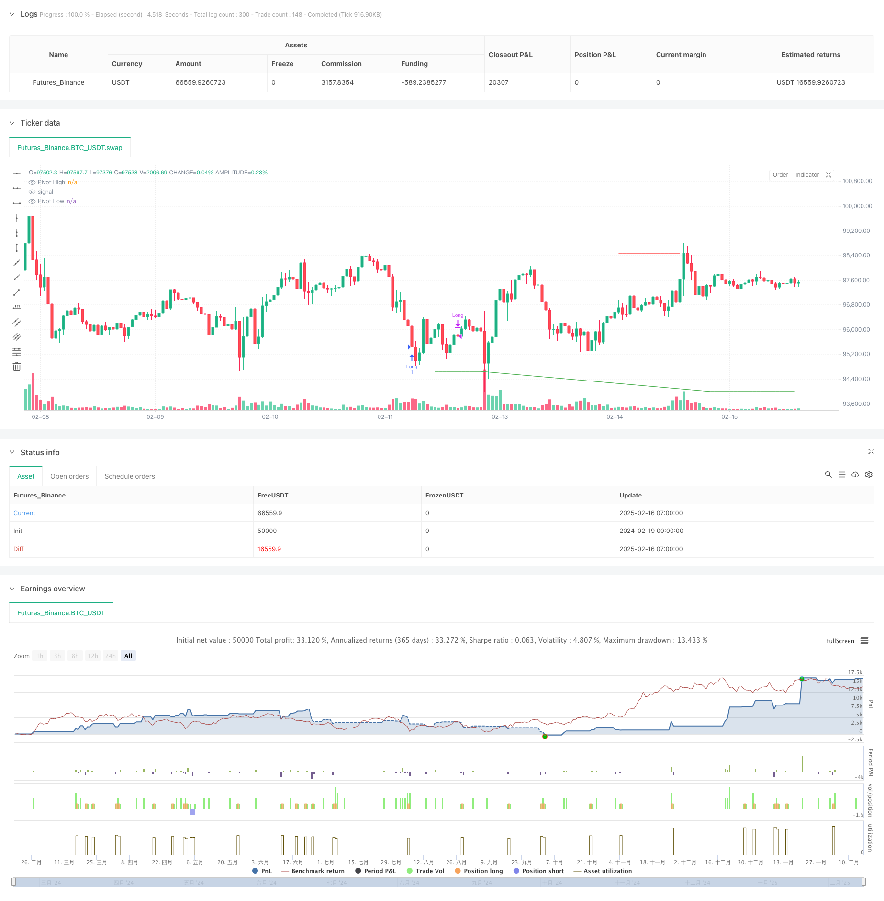

> Name

Multi-Indicator-Dynamic-Trend-Prediction-Trading-System
> Author

ChaoZhang

> Strategy Description



[trans]
#### Overview
This strategy is an intraday trading system based on multiple technical indicators, which comprehensively uses RSI indicators, stochastic indicators and pivot points for trend prediction and trading decisions. The system accurately captures market turning points by analyzing the overbought and oversold status of the market in multiple dimensions, combined with price support and resistance levels.
#### Strategy Principle
The strategy adopts a triple indicator verification mechanism:
1. Use the RSI indicator to monitor price momentum, and set the overbought interval of 70 and the oversold interval of 30 as preliminary screening conditions.
2. Use the %K and %D values of the Stochastic indicator to confirm the trend, and set 80 and 20 as key thresholds
3. Combine the pivot points of the daily cycle to determine support and resistance and provide price reference for transactions.
The triggering of trading signals must meet the following conditions at the same time:
- Long conditions: RSI is below 30 and Stochastic is below 20, while the price is above the pivot support level
- Short selling conditions: RSI is above 70 and Stochastic is above 80, while the price falls below the axis resistance level
- Conditions for closing positions: RSI or stochastic indicator returns to the 50 central axis level
#### Strategic Advantages
1. Multiple indicators cross-validation to effectively reduce false signals
2. Combine data analysis of different cycles to provide a more comprehensive market perspective
3. Set clear risk control thresholds and objectively quantify trading rules
4. Parameters can be flexibly adjusted according to market characteristics and have strong adaptability.
5. Applicable to both intraday trading and swing operations
#### Strategy Risk
1. Lag may occur during severe market fluctuations
2. There are relatively few opportunities for multiple indicators to meet the conditions at the same time.
3. Improper parameter settings may miss important trading opportunities
4. False signals are easily generated when the market moves sideways.
5. Continuous monitoring and timely adjustment of parameters are required
#### Strategy optimization direction
1. Introduce an adaptive parameter mechanism to dynamically adjust indicator parameters according to market volatility
2. Increase the dimension of trading volume analysis and improve signal reliability
3. Optimize the stop-loss and stop-profit mechanism to improve the efficiency of capital use
4. Add trend strength filter to reduce misoperation during sideways trading
5. Develop an intelligent parameter optimization system to realize self-evolution of strategies
#### Summary
This strategy builds a relatively complete trading decision-making system through multi-indicator collaborative analysis. The system integrates momentum indicators, volatility indicators and price level analysis to better grasp the main turning points of the market. Although there is a certain risk of hysteresis, through continuous optimization and improvement, the stability and reliability of the strategy are expected to be further improved. It is recommended that traders conduct sufficient backtest verification before using it in real trading, and adjust parameter settings according to specific market characteristics. ||
#### Overview
This strategy is an intraday trading system based on multiple technical indicators, combining RSI, Stochastic Oscillator, and Pivot Points for trend prediction and trading decisions. The system analyzes market overbought/oversold conditions through multiple dimensions and integrates price support/resistance levels to accurately capture market turning points.

#### Strategy Principles
The strategy employs a triple-indicator verification mechanism:
1. Uses RSI to monitor price momentum, setting overbought at 70 and oversold at 30 as primary filtering conditions
2. Applies Stochastic Oscillator's %K and %D values for trend confirmation, with 80 and 20 as key thresholds
3. Incorporates daily Pivot Points to determine support/resistance levels, providing price references for trading

Trade signals require the following conditions to be met simultaneously:
- Long entry: RSI below 30 and Stochastic below 20, with price above pivot support
- Short entry: RSI above 70 and Stochastic above 80, with price below pivot resistance
- Exit conditions: RSI or Stochastic returning to the 50 median level

#### Strategy Advantages
1. Multiple indicator cross-validation reduces false signals
2. Integration of different timeframe data provides a more comprehensive market perspective
3. Clear risk control thresholds with objective quantified trading rules
4. Flexible parameter adjustment capability for market adaptation
5. Suitable for both intraday and swing trading

#### Strategy Risks
1. Potential lag during extreme market volatility
2. Relatively fewer opportunities when all indicators must align
3. Improper parameter settings may miss important trading opportunities
4. False signals during sideways market conditions
5. Requires continuous monitoring and timely parameter adjustments

#### Optimization Directions
1. Implement adaptive parameter mechanisms based on market volatility
2. Add volume analysis dimension to improve signal reliability
3. Optimize stop-loss and take-profit mechanisms for better capital efficiency
4. Include trend strength filters to reduce false signals during consolidation
5. Develop intelligent parameter optimization system for strategy evolution

#### Summary
This strategy constructs a relatively complete trading decision system through multi-indicator collaborative analysis. The system integrates momentum indicators, volatility indicators, and price level analysis to effectively capture major market turning points. While there are some inherent lag risks, the strategy's stability and reliability can be further improved through continuous optimization and refinement. Traders are advised to conduct thorough backtesting before live implementation and adjust parameters according to specific market characteristics.[/trans]


> Source (PineScript)

``` pinescript
/*backtest
start: 2024-02-19 00:00:00
end: 2025-02-16 08:00:00
period: 1h
basePeriod: 1h
exchanges: [{"eid":"Futures_Binance","currency":"BTC_USDT"}]
*/

//@version=5
strategy("Intraday Leading Indicator Strategy", overlay=true)

// Inputs for the indicators
rsiLength = input.int(14, title="RSI Length")
rsiOverbought = input.int(70, title="RSI Overbought")
rsiOversold = input.int(30, title="RSI Oversold")

stochK = input.int(14, title="Stochastic %K Length")
stochD = input.int(3, title="Stochastic %D Smoothing")
stochOverbought = input.int(80, title="Stochastic Overbought")
stochOversold = input.int(20, title="Stochastic Oversold")

pivotTimeframe = input.timeframe("D", title="Pivot Points Timeframe")

// RSI Calculation
rsi = ta.rsi(close, rsiLength)

// Stochastic Calculation
k = ta.stoch(close, high, low, stochK)
d = ta.sma(k, stochD)

// Pivot Points Calculation
pivotHigh = request.security(syminfo.tickerid, pivotTimeframe, ta.pivothigh(high, 3, 3))
pivotLow = request.security(syminfo.tickerid, pivotTimeframe, ta.pivotlow(low, 3, 3))

// Entry Conditions
longCondition = rsi < rsiOversold and k < stochOversold and close > nz(pivotLow)
shortCondition = rsi > rsiOverbought and k > stochOverbought and close < nz(pivotHigh)

// Exit Conditions
exitLong = rsi > 50 or k > 50
exitShort = rsi < 50 or k < 50

// Execute Trades
if (longCondition)
    strategy.entry("Long", strategy.long)
if (shortCondition)
    strategy.entry("Short", strategy.short)

if (exitLong)
    strategy.close("Long")
if (exitShort)
    strategy.close("Short")

// Plot Pivot Levels
plot(pivotHigh, title="Pivot High", color=color.red, linewidth=1, style=plot.style_line)
plot(pivotLow, title="Pivot Low", color=color.green, linewidth=1, style=plot.style_line)

```

> Detail

https://www.fmz.com/strategy/482463

> Last Modified

2025-02-18 15:22:24
