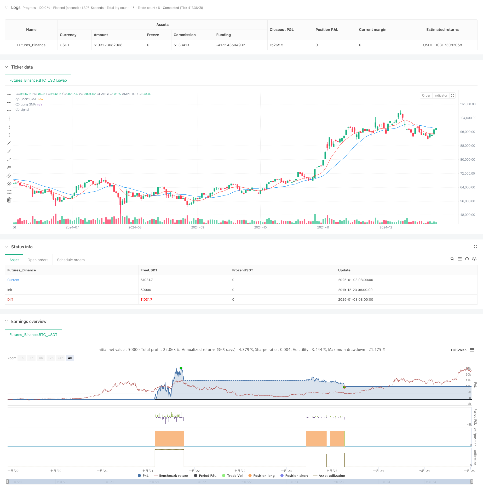

> Name

Multi-Indicator Dynamic Volatility Trading Strategy-Multi-Indicator-Dynamic-Volatility-Trading-Strategy
> Author

ChaoZhang

> Strategy Description



[trans]
#### Overview
This strategy is an intelligent trading system based on multiple technical indicators, which combines market signals from three dimensions: Moving Average (MA), Volume (Volume) and Volatility (ATR). It captures market opportunities through comprehensive analysis of price trends, trading activity and market volatility. The strategy uses the dual moving average system as the basis for judging the main trend, and also introduces trading volume and volatility as trading filter conditions, achieving multiple verifications of trading signals.
#### Strategy Principle
The core logic of the strategy is based on the following three dimensions:
1. Trend dimension: Use two simple moving averages (SMA) on the 9th and 21st to construct a dual moving average system, and determine the trend direction through golden crosses and dead crosses.
2. Trading volume dimension: Calculate the 21-day average trading volume, which requires the current trading volume to exceed 1.5 times the average to ensure sufficient market liquidity.
3. Volatility dimension: The 14-day ATR is used to measure market volatility, which requires the current volatility to be higher than its average value to ensure sufficient room for price changes.
Only when the conditions of these three dimensions are met at the same time, the strategy will issue a trading signal. This multiple filtering mechanism effectively improves the accuracy of transactions.
#### Strategic Advantages
1. High signal reliability: Through cross-validation of multiple technical indicators, the possibility of false breakthroughs is significantly reduced.
2. Strong adaptability: The strategy parameters can be flexibly adjusted according to different market environments and have good universal applicability.
3. Improved risk control: Through the double filtering of volatility and trading volume, trading risks are effectively controlled.
4. Clear execution logic: The strategy logic is simple and intuitive, easy to understand and maintain.
5. High degree of automation: Contains complete signal generation and alarm mechanisms, supporting automated transactions.
#### Strategy Risk
1. Lagging risk: The moving average has a certain lag, which may cause a slight delay in entry timing.
2. Risk of market shock: Frequent false signals may occur in a volatile market.
3. Parameter sensitivity: The strategy effect is more sensitive to parameter settings, and different market environments may require adjusting parameters.
4. Liquidity risk: In markets with small trading volumes, it may be difficult to meet trading conditions.
#### Strategy optimization direction
1. Introducing trend strength indicators: Consider adding ADX or DMI indicators to evaluate trend strength and improve the accuracy of trend judgment.
2. Optimize the stop-loss mechanism: It is recommended to add a dynamic stop-loss mechanism based on ATR to improve the flexibility of risk control.
3. Improve signal filtering: RSI and other indicators can be introduced to assist judgment and reduce false signals.
4. Increase position management: It is recommended to dynamically adjust the position size according to the volatility and optimize fund management.
5. Market sentiment factors: Consider introducing market sentiment indicators to improve the adaptability of the strategy to the market environment.
#### Summary
This strategy builds a complete trading decision-making system through the collaborative analysis of multiple technical indicators. The strategy design fully takes into account market characteristics such as trends, liquidity and volatility, and is highly practical and reliable. Through continuous optimization and improvement, this strategy is expected to maintain stable performance in various market environments. The modular design of the strategy also provides a good foundation for subsequent expansion, and can be flexibly adjusted and optimized according to actual needs.
|| 

#### Overview
This strategy is an intelligent trading system based on multiple technical indicators, combining signals from Moving Averages (MA), Volume, and Average True Range (ATR) to capture market opportunities through comprehensive analysis of price trends, trading activity, and market volatility. The strategy employs a dual moving average system as the primary trend indicator, while incorporating volume and volatility as trading filters to achieve multiple validations of trading signals.

#### Strategy Principle
The core logic is based on three dimensions:
1. Trend Dimension: Uses 9-day and 21-day Simple Moving Averages (SMA) to construct a dual MA system, identifying trend direction through golden and death crosses.
2. Volume Dimension: Calculates 21-day average volume, requiring current volume to exceed 1.5 times the average, ensuring sufficient market liquidity.
3. Volatility Dimension: Employs 14-day ATR to measure market volatility, requiring current volatility to be above its mean, ensuring adequate price movement potential.

Trading signals are generated only when conditions in all three dimensions are simultaneously satisfied, significantly improving trading accuracy through this multi-filter mechanism.

#### Strategy Advantages
1. High Signal Reliability: Cross-validation through multiple technical indicators significantly reduces false breakouts.
2. Strong Adaptability: Strategy parameters can be flexibly adjusted for different market environments.
3. Comprehensive Risk Control: Effective risk management through dual filtering of volatility and volume.
4. Clear Execution Logic: Simple and intuitive strategy logic, easy to understand and maintain.
5. High Automation Level: Includes complete signal generation and alert mechanisms, supporting automated trading.

#### Strategy Risks
1. Lag Risk: Moving averages have inherent lag, potentially causing delayed entry points.
2. Choppy Market Risk: May generate frequent false signals in range-bound markets.
3. Parameter Sensitivity: Strategy effectiveness is sensitive to parameter settings, requiring adjustment in different market environments.
4. Liquidity Risk: May struggle to meet trading conditions in markets with low volume.

#### Strategy Optimization Directions
1. Incorporate Trend Strength Indicators: Consider adding ADX or DMI indicators to improve trend assessment accuracy.
2. Optimize Stop-Loss Mechanism: Suggest implementing ATR-based dynamic stop-loss for more flexible risk control.
3. Enhance Signal Filtering: Consider introducing RSI for auxiliary judgment to reduce false signals.
4. Improve Position Management: Recommend dynamic position sizing based on volatility levels.
5. Market Sentiment Factors: Consider incorporating market sentiment indicators to enhance strategy adaptability.

#### Summary
This strategy constructs a comprehensive trading decision system through the synergistic analysis of multiple technical indicators. The design thoroughly considers market characteristics including trends, liquidity, and volatility, demonstrating strong practicality and reliability. Through continuous optimization and improvement, the strategy shows promise for maintaining stable performance across various market environments. Its modular design provides a solid foundation for future extensions, allowing flexible adjustments and optimizations based on actual needs.
[/trans]


> Source (PineScript)

``` pinescript
/*backtest
start: 2019-12-23 08:00:00
end: 2025-01-04 08:00:00
period: 1d
basePeriod: 1d
exchanges: [{"eid":"Futures_Binance","currency":"BTC_USDT"}]
*/

//@version=5
strategy("Advanced Trading Strategy", overlay=true)

// Parâmetros de entrada
shortPeriod = input.int(9, title="Short Period", minval=1)
longPeriod = input.int(21, title="Long Period", minval=1)
volumeThreshold = input.float(1.5, title="Volume Threshold Multiplier", minval=0.1)
volatilityPeriod = input.int(14, title="Volatility Period", minval=1)

// Cálculo das médias móveis
shortSMA = ta.sma(close, shortPeriod)
longSMA = ta.sma(close, longPeriod)

// Cálculo do volume médio
averageVolume = ta.sma(volume, longPeriod)

// Cálculo da volatilidade (ATR - Average True Range)
volatility = ta.atr(volatilityPeriod)

// Condições de compra e venda baseadas em médias móveis
maBuyCondition = ta.crossover(shortSMA, longSMA)
maSellCondition = ta.crossunder(shortSMA, longSMA)

// Verificação do volume
volumeCondition = volume > averageVolume * volumeThreshold

// Condição de volatilidade (volatilidade acima de um certo nível)
volatilityCondition = volatility > ta.sma(volatility, volatilityPeriod)

// Condições finais de compra e venda
buyCondition = maBuyCondition and volumeCondition and volatilityCondition
sellCondition = maSellCondition and volumeCondition and volatilityCondition

// Plotando as médias móveis
plot(shortSMA, title="Short SMA", color=color.red)
plot(longSMA, title="Long SMA", color=color.blue)

// Sinal de compra
if (buyCondition)
    strategy.entry("Buy", strategy.long)

// Sinal de venda
if (sellCondition)
    strategy.close("Buy")

// Plotando sinais no gráfico
plotshape(series=buyCondition, title="Buy Signal", location=location.belowbar, color=color.green, style=shape.labelup, text="BUY")
plotshape(series=sellCondition, title="Sell Signal", location=location.abovebar, color=color.red, style=shape.labeldown, text="SELL")

// Configurando alertas
alertcondition(buyCondition, title="Buy Alert", message="Buy Signal Triggered")
alertcondition(sellCondition, title="Sell Alert", message="Sell Signal Triggered")
```

> Detail

https://www.fmz.com/strategy/477532

> Last Modified

2025-01-06 11:47:06
