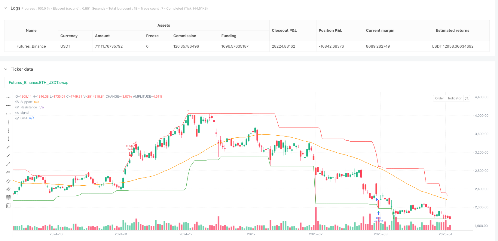
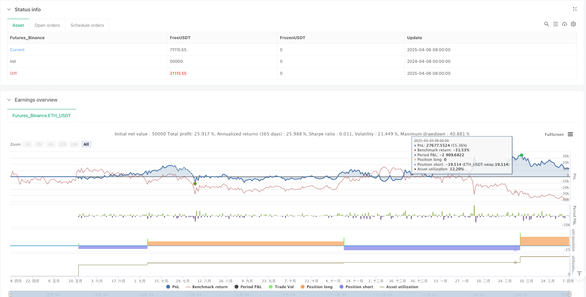

> Name

Multi-Indicator-Fusion-Support-Resistance-Volume-Filtered-Quantitative-Trading-Strategy
> Author

ianzeng123

> Strategy Description




[trans]

## Overview
This strategy is a multi-indicator quantitative trading system that combines the Simple Moving Average (SMA), the Relative Strength Index (RSI), and support/resistance levels to generate trading signals. This strategy also adds time filtering and transaction volume filtering mechanisms to improve the effectiveness of transactions. The core idea of ​​the strategy is to buy when the price is close to support and the RSI indicates oversold, and to sell when the price is close to resistance and the RSI indicates overbought. Additionally, it only executes trades within a specified time frame and can optionally only operate when trading volumes are above average, which helps ensure liquidity and validity of trades.
## Strategy Principle
The strategy is based on several classic technical analysis concepts and indicators:
1. **Simple Moving Average (SMA)**: Use the 50-period SMA to identify the overall direction of the market trend. SMA acts as a smoothing indicator for price, helping to reduce noise and show a clearer trend.
2. **Relative Strength Index (RSI)**: Uses the 14-period RSI to detect overbought and oversold conditions in the market. When the RSI is below 30, it is considered an oversold signal, and when it is above 70, it is considered an overbought signal.
3. **Support and resistance levels**: Calculated through a 30-period window, taking the lowest price and highest price during this period. These levels represent key areas where price may reverse.
4. **Transaction Logic**:
   - Buy signal: Triggered when price is close to support (no more than 1.02 times support) and RSI is below 30 (oversold)
   - Sell signal: triggered when the price is close to the resistance level (not lower than 0.98 times the resistance level) and the RSI is above 70 (overbought)
5. **Filter conditions**:
   - Time filtering: only trade within the date range specified by the user
   - Volume filtering: Option to only trade when volume is higher than 20-period average volume
This approach combines elements of trend following and reversal trading in an attempt to capture trading opportunities when price reaches extreme levels and displays potential reversal signals.
## Strategic Advantages
1. **Multi-Dimensional Signal Confirmation**: By combining multiple indicators (SMA, RSI, support/resistance), the strategy reduces the risk of false signals and only generates trading signals when multiple conditions are met simultaneously.
2. **Dynamic Support and Resistance**: The strategy uses rolling windows to calculate support and resistance levels, allowing these key price levels to automatically adjust as market conditions change.
3. **Flexible filtering mechanism**:
   - Time filtering allows trading within specific time periods, avoiding market periods that may be unstable or inefficient
   - Volume filtering ensures only trading with sufficient liquidity, reducing slippage and execution issues
4. **Clear Entry Conditions**: The strategy has clear entry rules, combined with price approaching key levels and overbought/oversold conditions, which helps capture opportunities at potential reversal points.
5. **Visual Assistance**: The strategy includes the drawing of SMA, support and resistance lines, and visual marking of buying and selling signals, allowing traders to intuitively understand market conditions and strategy signals.
6. **Alert function**: Built-in alert conditions enable traders to be notified when new signals are generated, facilitating real-time monitoring and trade execution.
## Strategy Risk
1. **False breakthrough risk**: A false breakthrough may occur when the price is close to a support or resistance level, and then quickly reverse, resulting in a false signal. Consider adding a confirmation mechanism, such as waiting for the price to stay near a support/resistance level for a certain period of time or adding additional confirmation indicators.
2. **Excessive Trading Risk**: In sideways markets or highly volatile markets, RSI may frequently cross overbought and oversold levels, resulting in excessive trading signals. This situation can be reduced by adjusting the RSI threshold or adding signal filtering conditions.
3. **Parameter sensitivity**: Strategy performance is highly dependent on the selected parameters (SMA cycle, RSI cycle, support/resistance window, etc.). Different markets and time frames may require different parameter settings, and robust backtesting and optimization are recommended.
4. **Single position management**: The current strategy lacks stop loss and profit strategies, which may lead to excessive losses when the market fluctuates violently. It is recommended to add stop loss strategy and position size management functions.
5. **Limitations of time filtering**: Fixed date range may lead to missing good trading opportunities outside the date range. Consider using a more dynamic time filtering approach, such as adaptive filtering based on market conditions.
## Strategy optimization direction
1. **Add stop loss and profit targets**:
   - Implement dynamic stop loss based on ATR (Average True Range)
   - Add profit targets based on support/resistance levels
   - These improvements will improve risk management capabilities, protect capital and lock in profits
2. **Optimization parameter adaptation**:
   - Realize dynamic adjustment of parameters, automatically adjust SMA, RSI cycles and support/resistance windows according to market volatility
   - This will allow the strategy to better adapt to different market conditions and asset classes
3. **Enhanced filtering mechanism**:
   - Add trend filtering, such as only going long when the price is above the SMA and short when the price is below the SMA
   - Added volatility filtering to avoid trading during periods of extreme volatility
   - These filters will improve trade quality and reduce false signals
4. **Add position management**:
   - Dynamically adjust position size based on volatility and signal strength
   - Implement step-by-step entry and exit strategies to reduce the impact of market noise
   - This will optimize capital utilization and control risk on every trade
5. **Integrated market sentiment indicators**:
   - Add other market sentiment indicators like MACD or Bollinger Bands
   - Analyze signal consistency across multiple timeframes
   - This will provide a more comprehensive view of the market and improve signal quality
## Summarize
The multi-indicator fusion support and resistance filtering quantitative trading strategy is a comprehensive trading system that combines SMA, RSI and dynamic support/resistance levels. By fusing multiple technical indicators and adding time and volume filters, this strategy attempts to capture trading opportunities at potential market reversal points while reducing false signals and unnecessary trades.
The biggest advantage of the strategy is its multi-dimensional signal confirmation and flexible filtering mechanism, which improves the quality of trading signals. However, it also faces challenges such as false breakthrough risk and parameter sensitivity. The strategy can be further optimized to improve performance and stability by adding a stop-loss mechanism, optimizing parameter adaptability, enhancing filters, and improving position management.
This strategy provides a solid starting point for traders looking to build a robust trading system based on technical analysis. By deeply understanding its principles and tailoring them to specific market needs, traders can develop a system that better suits their trading style and risk appetite. ||
## Overview

This strategy is a multi-indicator fusion quantitative trading system that combines Simple Moving Average (SMA), Relative Strength Index (RSI), and Support/Resistance levels to generate trading signals. The strategy also incorporates time filtering and volume filtering mechanisms to enhance trading effectiveness. The core concept is to buy when the price approaches support levels and RSI indicates oversold conditions, and to sell when the price approaches resistance levels and RSI indicates overbought conditions. Additionally, it only executes trades within a specified time range and can optionally operate only when volume is above average levels, which helps ensure liquidity and effectiveness of trades.

## Strategy Principles

The strategy is based on several classic technical analysis concepts and indicators:

1. **Simple Moving Average (SMA)**: Uses a 50-period SMA to identify the overall direction of market trends. SMA serves as a smoothing indicator for price, helping to reduce noise and display clearer trends.

2. **Relative Strength Index (RSI)**: Uses a 14-period RSI to detect overbought and oversold market conditions. RSI below 30 is considered an oversold signal, while above 70 is considered overbought.

3. **Support and Resistance Levels**: Calculated through a 30-period window, taking the lowest price and highest price during this period respectively. These levels represent key areas where price may reverse.

4. **Trading Logic**:
   - Buy Signal: Triggered when price approaches support (not exceeding 1.02 times the support) and RSI is below 30 (oversold)
   - Sell Signal: Triggered when price approaches resistance (not below 0.98 times the resistance) and RSI is above 70 (overbought)

5. **Filtering Conditions**:
   - Time Filter: Only trades within a user-specified date range
   - Volume Filter: Can choose to trade only when volume is higher than the 20-period average volume

This approach combines elements of trend following and reversal trading, attempting to capture trading opportunities when prices reach extreme levels and show potential reversal signals.

## Strategy Advantages

1. **Multi-dimensional Signal Confirmation**: By combining multiple indicators (SMA, RSI, Support/Resistance), the strategy reduces the risk of false signals, generating trading signals only when multiple conditions are simultaneously met.

2. **Dynamic Support and Resistance**: The strategy uses a rolling window to calculate support and resistance levels, allowing these key price levels to automatically adjust as market conditions change.

3. **Flexible Filtering Mechanisms**:
   - Time filtering allows trading during specific time periods, avoiding potentially unstable or inefficient market periods
   - Volume filtering ensures trading only under conditions of sufficient liquidity, reducing slippage and execution issues

4. **Clear Entry Conditions**: The strategy has clear entry rules, combining price proximity to key levels and overbought/oversold conditions, which helps capture opportunities at potential reversal points.

5. **Visual Assistance**: The strategy includes plotting of SMA, support and resistance lines, and visualization of buy and sell signals, allowing traders to intuitively understand market conditions and strategy signals.

6. **Alert Functionality**: Built-in alert conditions enable traders to be notified when new signals are generated, facilitating real-time monitoring and trade execution.

## Strategy Risks

1. **False Breakout Risk**: When price approaches support or resistance levels, false breakouts may occur, followed by quick reversals, leading to incorrect signals. Consider adding confirmation mechanisms, such as waiting for price to remain near support/resistance for a certain time or adding additional confirmation indicators.

2. **Overtrading Risk**: In ranging markets or highly volatile markets, RSI may frequently cross overbought and oversold levels, resulting in too many trading signals. This can be reduced by adjusting RSI thresholds or adding signal filtering conditions.

3. **Parameter Sensitivity**: Strategy performance is highly dependent on selected parameters (SMA period, RSI period, support/resistance window, etc.). Different markets and timeframes may require different parameter settings; robust backtesting and optimization are recommended.

4. **Single Position Management**: The current strategy lacks stop-loss and profit-taking strategies, which may lead to excessive losses during sharp market fluctuations. Adding stop-loss strategies and position sizing management is recommended.

5. **Limitations of Time Filtering**: Fixed date ranges may cause missed trading opportunities outside the date range. Consider using more dynamic time filtering methods, such as adaptive filtering based on market conditions.

## Strategy Optimization Directions

1. **Add Stop-Loss and Profit Targets**:
   - Implement dynamic stop-losses based on ATR (Average True Range)
   - Add profit targets based on support/resistance levels
   - These improvements will enhance risk management capabilities, protect capital, and lock in profits

2. **Optimize Parameter Adaptability**:
   - Implement dynamic adjustment of parameters, automatically adjusting SMA, RSI periods, and support/resistance windows based on market volatility
   - This will make the strategy better adapt to different market conditions and asset classes

3. **Enhance Filtering Mechanisms**:
   - Add trend filtering, such as only going long when price is above SMA, and short when below SMA
   - Add volatility filtering to avoid trading during periods of extreme volatility
   - These filters will improve trading quality and reduce false signals

4. **Add Position Management**:
   - Dynamically adjust position size based on volatility and signal strength
   - Implement stepped entry and exit strategies to reduce market noise impact
   - This will optimize capital utilization and control risk for each trade

5. **Integrate Market Sentiment Indicators**:
   - Add other market sentiment indicators such as MACD or Bollinger Bands
   - Analyze signal consistency across multiple timeframes
   - This will provide a more comprehensive market perspective and improve signal quality

## Summary

The Multi-Indicator Fusion Support-Resistance Volume-Filtered Quantitative Trading Strategy is a comprehensive trading system that combines SMA, RSI, and dynamic support/resistance levels. By integrating multiple technical indicators and adding time and volume filtering, the strategy attempts to capture trading opportunities at potential market reversal points while reducing false signals and unnecessary trades.

The strategy's greatest advantages lie in its multi-dimensional signal confirmation and flexible filtering mechanisms, which improve the quality of trading signals. However, it also faces challenges such as false breakout risks and parameter sensitivity. By adding stop-loss mechanisms, optimizing parameter adaptability, enhancing filters, and improving position management, the strategy can be further optimized to improve performance and stability.

For traders looking to build robust trading systems based on technical analysis, this strategy provides a solid starting point. By deeply understanding its principles and customizing it according to specific market needs, traders can develop systems that better suit their trading style and risk preferences.[/trans]


> Source (PineScript)

``` pinescript
/*backtest
start: 2024-04-08 00:00:00
end: 2025-04-07 00:00:00
period: 1d
basePeriod: 1d
exchanges: [{"eid":"Futures_Binance","currency":"ETH_USDT"}]
*/

//@version=5
strategy("SMA + RSI + S/R Strategy with Filters", overlay=true, default_qty_type=strategy.percent_of_equity, default_qty_value=100)

// === Input Settings ===
smaPeriod = input.int(50, title="SMA Period")
rsiPeriod = input.int(14, title="RSI Period")
srWindow = input.int(30, title="Support/Resistance Window")
volumeFilter = input.bool(true, title="Enable Volume Filter")
tradeOnlyAboveVolume = input.bool(true, title="Only trade when volume > avg")

// === Indicators ===
sma = ta.sma(close, smaPeriod)
rsi = ta.rsi(close, rsiPeriod)
support = ta.lowest(low, srWindow)
resistance = ta.highest(high, srWindow)
avgVolume = ta.sma(volume, 20)

// === Volume Filter ===
volumeCondition = not volumeFilter or (volume > avgVolume)

// === Signals ===
buySignal = (close <= support * 1.02) and (rsi < 30) and volumeCondition
sellSignal = (close >= resistance * 0.98) and (rsi > 70) and volumeCondition

// === Strategy Backtest ===
if buySignal
    strategy.entry("Buy", strategy.long)
if sellSignal
    strategy.entry("Sell", strategy.short)

// === Plot Lines ===
plot(sma, title="SMA", color=color.orange)
plot(support, title="Support", color=color.green)
plot(resistance, title="Resistance", color=color.red)

// === Plot Signals ===
plotshape(buySignal, title="Buy Signal", location=location.belowbar, color=color.lime, style=shape.triangleup, size=size.small)
plotshape(sellSignal, title="Sell Signal", location=location.abovebar, color=color.red, style=shape.triangledown, size=size.small)

// === Alerts ===
alertcondition(buySignal, title="Buy Alert", message="Buy Signal Triggered!")
alertcondition(sellSignal, title="Sell Alert", message="Sell Signal Triggered!")

```

> Detail

https://www.fmz.com/strategy/489731

> Last Modified

2025-04-08 09:46:04
