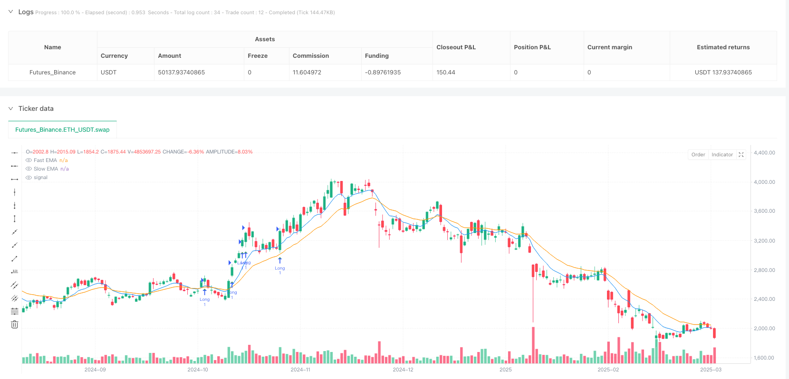
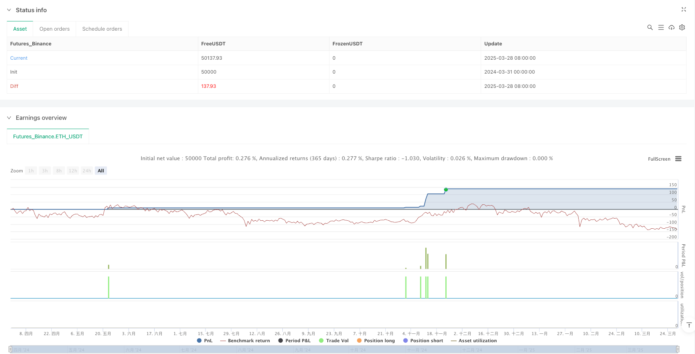

> Name

Multi-Indicator-Momentum-Breakout-Quantitative-Trading-Strategy
> Author

ianzeng123

> Strategy Description





[trans]

#### Overview
This strategy is a trend breakthrough quantitative trading strategy that combines multi-indicator linkage and is specially designed for high-volatility markets. This strategy cleverly integrates the exponential moving average (EMA), relative strength indicator (RSI), volume confirmation and true range (ATR)-based trailing stops to capture strong market breakouts while effectively avoiding false signals. The core idea is to look for opportunities to break through previous highs and significantly increase trading volume on the basis of confirming the upward trend, and protect funds and lock in profits through dynamic stop loss and trailing exit mechanisms.
#### Strategy Principle
The strategy operates on four key pillars:
1. **EMA Trend Confirmation**: Use the 9-period and 20-period EMA to confirm that the price is in a strong upward trend. When the fast EMA (9) is above the slow EMA (20) and is trending upward, it is considered a valid bullish signal.
2. **Price Breakout Confirmation**: The strategy requires that the current closing price must break through the highest price of the previous period while remaining above the fast EMA, which indicates that the price momentum is strong enough.
3. **Trading volume confirmation**: In order to avoid false breakthroughs with low liquidity, the strategy will only consider entry when the trading volume exceeds 1.5 times the 20-period average trading volume to ensure that the breakthrough is supported by sufficient market participation.
4. **RSI momentum filtering and divergence avoidance**: In addition to basic RSI momentum filtering (requiring RSI>50), the strategy also detects potential RSI bearish divergences, by comparing the lowest RSI value of the current 5 periods and the previous 5 periods with the corresponding price lowest point, effectively avoiding entry when the trend may reverse.
5. **ATR-based dynamic stop loss and trailing exit**: The strategy uses 14-period ATR to set a dynamic stop loss level (the lowest price of the previous period minus 0.5*ATR), and enables trailing stop loss (2*ATR) when the price remains above the fast EMA, optimizing fund management and maximizing profitability.
Entry conditions must be met at the same time: valid breakout, volume confirmation, trend confirmation and no bearish RSI divergence. This multi-layer filtering mechanism significantly improves the reliability of trading signals.
#### Strategic Advantages
1. **Capture explosive market with high accuracy**: By requiring triple verification of price breakthrough, trend confirmation and trading volume amplification, the strategy can accurately capture explosive market with sustained momentum rather than short-term price fluctuations.
2. **Effectively filter sideways and weak trends**: The EMA trend filtering mechanism ensures that the strategy only operates in clear upward trends, avoiding excessive trading signals when the market is sideways or the trend is unclear.
3. **Intelligent Risk Management System**: Dynamic stop loss based on ATR provides each transaction with protection tailored to market volatility, rather than using fixed values, allowing the strategy to remain adaptable in different volatile environments.
4. **Divergence detection avoids false breakouts**: Integrated RSI divergence detection is a key advantage of the strategy, helping to avoid entering the market when prices reach new highs but momentum has begun to weaken, effectively avoiding many potentially losing trades.
5. **Trailing stop loss to lock in profits**: The strategy not only focuses on the entry point, but also integrates an ATR-based trailing stop loss mechanism, which can effectively lock in existing profits while remaining loose enough to allow profits to grow.
#### Strategy Risk
1. **High Volatility Market Risk**: Although strategies are designed to capture momentum in highly volatile assets, extreme volatility can cause stop losses to be triggered quickly, especially if the market gapps or liquidity suddenly dries up. Solution: Consider adjusting the ATR multiplier when high volatility is expected, or avoid trading ahead of major news or events.
2. **Excessive trading risk**: Under certain market conditions, the strategy may generate too many trading signals, increasing transaction costs and diluting the overall effect. Solution: Consider adding additional trend strength filters or extending the holding period to reduce trading frequency.
3. **Limitations of Divergence Detection**: Although divergence detection can help avoid certain false breakouts, it can itself produce false signals, especially in sideways markets. Solution: Consider combining other confirmation indicators or increasing the sensitivity adjustment parameters of deviation detection.
4. **Parameter sensitivity**: The strategy uses multiple parameters (such as EMA period, ATR multiplier, etc.), and its optimal value may differ due to changes in market conditions. Solution: Backtest and optimize the strategy regularly, and even consider implementing an adaptive parameter system.
5. **Lack of market structure considerations**: Strategies based primarily on technical indicators rather than market structure (such as support/resistance levels) may underperform near important price levels. Solution: Consider integrating key price levels or market structure analysis as additional filters.
#### Strategy optimization direction
1. **Adaptive parameter system**: The current strategy uses fixed EMA, RSI and ATR parameters. You can consider implementing an adaptive parameter system to automatically adjust these parameters according to market volatility or trading sessions. Such optimization will improve the adaptability of the strategy in different market environments and reduce the risk of over-fitting.
2. **Enhanced Volume Analysis**: While the current strategy already includes basic volume confirmations, consider adding more complex volume analysis, such as volume trend consistency checks or volume weighted moving averages. This will improve the accuracy of judgments about true market participation.
3. **Multiple Time Frame Analysis**: Strategies can improve winning rates by integrating trend confirmation on higher time frames. For example, only looking for bullish breakout signals on the 5-minute chart when the daily trend is upward will effectively filter out weak signals that go against the general trend.
4. **Consider Market Volatility Cycles**: Markets often alternate between volatile and consolidation phases. Strategies can add a volatility indicator (such as historical volatility or Bollinger Band width) to determine the current market stage and adjust entry criteria and position sizing accordingly.
5. **Dynamic position management**: The current strategy uses a fixed fund management method. You can consider implementing a dynamic position management system based on market volatility, trend strength or historical winning rate. When the signal is stronger, the position will be increased, and vice versa, the position will be reduced, optimizing the risk-return ratio.
6. **Integrated machine learning model**: By using a machine learning model trained based on historical data to predict the probability of signal success, high-probability trading opportunities can be further screened and the overall performance of the strategy improved.
#### Summary
The multi-indicator linked trend breakout quantitative trading strategy is a well-designed trading system that effectively captures breakthrough opportunities in high-momentum markets by integrating multi-layer technical indicator confirmation (EMA trend, price breakthrough, volume confirmation, and RSI analysis). The outstanding feature of the strategy is its comprehensive risk management system, including divergence detection to avoid false breakouts and dynamic stop loss and trailing exit mechanisms based on ATR.
While the strategy performs well in capturing strong breakouts, there are still challenges with parameter sensitivity and market environment adaptability. The strategy has the potential to further improve its robustness and profitability by implementing recommended optimization directions such as an adaptive parameter system, enhanced volume analysis, multi-timeframe confirmations and dynamic position management.
For traders seeking to capture trend breakouts in high-volatility markets, this strategy provides a structured framework that balances aggressive opportunity capture with prudent risk management. However, as with any trading strategy, it is crucial to conduct adequate backtesting and parameter optimization before live trading. ||
#### Overview
This strategy is a multi-indicator momentum breakout quantitative trading system designed specifically for high-volatility markets. It cleverly integrates Exponential Moving Averages (EMA), Relative Strength Index (RSI), volume confirmation, and Average True Range (ATR)-based trailing stops to capture strong breakout movements while effectively avoiding false signals. The core concept is to seek opportunities that break above previous highs with significantly increased volume on a confirmed uptrend, while implementing dynamic stop-loss and trailing exit mechanisms to protect capital and lock in profits.

#### Strategy Principles
The strategy's operational mechanism is built on four key pillars:

1. **EMA Trend Confirmation**: Utilizes 9-period and 20-period EMAs to confirm the price is in a strong upward trend. When the fast EMA (9) is positioned above the slow EMA (20) and trending upward, it's considered a valid bullish signal.

2. **Price Breakout Confirmation**: The strategy requires the current closing price to break above the previous period's high while maintaining position above the fast EMA, indicating sufficient price momentum.

3. **Volume Confirmation**: To avoid low-liquidity false breakouts, the strategy only considers entry when volume exceeds 1.5 times the 20-period average volume, ensuring the breakout is supported by adequate market participation.

4. **RSI Momentum Filtering and Divergence Avoidance**: Beyond basic RSI momentum filtering (requiring RSI > 50), the strategy detects potential RSI bearish divergences by comparing current 5-period and previous 5-period RSI lows with corresponding price lows, effectively avoiding entry when the trend might reverse.

5. **ATR-Based Dynamic Stop-Loss and Trailing Exit**: The strategy employs a 14-period ATR to set dynamic stop-loss levels (previous period low minus 0.5*ATR) and enables trailing stops (2*ATR) when price maintains above the fast EMA, optimizing capital management and maximizing profitability.

Entry conditions must simultaneously satisfy: valid breakout, volume confirmation, trend confirmation, and no RSI bearish divergence. This multi-layered filtering mechanism significantly enhances the reliability of trading signals.

#### Strategy Advantages
1. **High-Precision Capture of Explosive Movements**: Through the triple verification of price breakout, trend confirmation, and volume increase, the strategy can precisely capture explosive movements with sustained momentum, rather than temporary price fluctuations.

2. **Effective Filtering of Sideways and Weak Trends**: The EMA trend filtering mechanism ensures the strategy only operates in clear uptrends, avoiding excessive trading signals during sideways markets or unclear trends.

3. **Intelligent Risk Management System**: ATR-based dynamic stop-losses provide customized protection for each trade based on market volatility, rather than using fixed values, allowing the strategy to maintain adaptability in different volatility environments.

4. **Divergence Detection Avoids False Breakouts**: The integrated RSI divergence detection is a key advantage, helping to avoid entry when price makes new highs but momentum has begun to weaken, effectively preventing many potential losing trades.

5. **Trailing Stops Lock in Profits**: The strategy not only focuses on entry points but also integrates an ATR-based trailing stop mechanism, which effectively locks in existing gains while remaining sufficiently loose to allow profits to grow.

#### Strategy Risks
1. **High-Volatility Market Risk**: Although the strategy is designed to capture momentum in high-volatility assets, extreme volatility may cause stop-losses to be quickly triggered, especially in cases of market gaps or sudden liquidity droughts. Solution: Consider adjusting ATR multipliers during high volatility expectations, or avoiding trading before major news or events.

2. **Overtrading Risk**: Under certain market conditions, the strategy may generate excessive trading signals, increasing trading costs and diluting overall effectiveness. Solution: Consider adding additional trend strength filters or extending holding periods to reduce trading frequency.

3. **Limitations of Divergence Detection**: While divergence detection helps avoid some false breakouts, it can itself generate false signals, especially in sideways markets. Solution: Consider combining other confirmation indicators or adding sensitivity adjustment parameters for divergence detection.

4. **Parameter Sensitivity**: The strategy uses multiple parameters (such as EMA periods, ATR multipliers, etc.), whose optimal values may vary with changing market conditions. Solution: Regularly backtest and optimize the strategy, or even implement an adaptive parameter system.

5. **Lack of Market Structure Consideration**: The strategy is primarily based on technical indicators rather than market structure (such as support/resistance levels), and may perform poorly near important price levels. Solution: Consider integrating key price levels or market structure analysis as additional filters.

#### Strategy Optimization Directions
1. **Adaptive Parameter System**: The current strategy uses fixed EMA, RSI, and ATR parameters; consider implementing an adaptive parameter system that automatically adjusts these parameters based on market volatility or trading sessions. Such optimization would enhance the strategy's adaptability in different market environments and reduce overfitting risk.

2. **Enhanced Volume Analysis**: Although the current strategy includes basic volume confirmation, consider adding more sophisticated volume analysis, such as volume trend consistency checks or volume-weighted moving averages. This would improve the accuracy of judging real market participation.

3. **Multi-Timeframe Analysis**: The strategy can improve win rates by integrating higher timeframe trend confirmation. For example, only looking for bullish breakout signals on a 5-minute chart when the daily trend is up would effectively filter out weak signals against the larger trend.

4. **Consider Market Volatility Cycles**: Markets typically alternate between volatile and consolidation phases. The strategy could add a volatility indicator (such as historical volatility or Bollinger Band width) to determine the current market phase and adjust entry criteria and position size accordingly.

5. **Dynamic Position Management**: The current strategy uses a fixed money management approach; consider implementing a dynamic position management system based on market volatility, trend strength, or historical win rates, increasing position size when signals are stronger and vice versa, optimizing the risk-reward ratio.

6. **Integrate Machine Learning Models**: By using machine learning models trained on historical data to predict signal success probability, the strategy can further screen for high-probability trading opportunities, improving overall performance.

#### Summary
The Multi-Indicator Momentum Breakout Quantitative Trading Strategy is a well-designed trading system that effectively captures breakout opportunities in high-momentum markets through multiple layers of technical indicator confirmation (EMA trend, price breakout, volume confirmation, and RSI analysis). The strategy's standout feature is its comprehensive risk management system, including divergence detection to avoid false breakouts and ATR-based dynamic stop-loss and trailing exit mechanisms.

While the strategy excels at capturing strong breakouts, challenges remain in parameter sensitivity and market environment adaptability. By implementing the suggested optimization directions, such as adaptive parameter systems, enhanced volume analysis, multi-timeframe confirmation, and dynamic position management, this strategy has the potential to further enhance its robustness and profitability.

For traders seeking to capture trend breakout opportunities in high-volatility markets, this strategy provides a structured framework that balances aggressive opportunity capture with prudent risk management. However, as with any trading strategy, thorough backtesting and parameter optimization before live trading are essential.[/trans]


> Source (PineScript)

``` pinescript
/*backtest
start: 2024-03-31 00:00:00
end: 2025-03-29 08:00:00
period: 1d
basePeriod: 1d
exchanges: [{"eid":"Futures_Binance","currency":"ETH_USDT"}]
*/

//@version=6
strategy("Enhanced First High Break Strategy v3", overlay=true, margin_long=100, margin_short=100)

// Input Parameters
emaFastLength = input.int(9, "Fast EMA Length")
emaSlowLength = input.int(20, "Slow EMA Length")
rsiLength = input.int(14, "RSI Length")
volumeAvgLength = input.int(20, "Volume Average Length")
atrLength = input.int(14, "ATR Length")

// Calculate Indicators
emaFast = ta.ema(close, emaFastLength)
emaSlow = ta.ema(close, emaSlowLength)
rsi = ta.rsi(close, rsiLength)
volAvg = ta.sma(volume, volumeAvgLength)
atr = ta.atr(atrLength)

// Pre-calculate lowest values (FIXED)
rsiLowCurrent = ta.lowest(rsi, 5)
rsiLowPrevious = ta.lowest(rsi[5], 5)
lowLowPrevious = ta.lowest(low[5], 5)

// Trend Conditions
bullishTrend = emaFast > emaSlow and emaFast > emaFast[1]
bearishDivergence = rsiLowCurrent > rsiLowPrevious and low < lowLowPrevious

// Entry Conditions
validBreakout = close > high[1] and close > emaFast
volumeConfirmation = volume > volAvg * 1.5
trendConfirmed = close > emaSlow and close[1] > emaSlow
rsiConfirmation = rsi > 50 and not bearishDivergence

// Final Entry Signal
entryCondition = validBreakout and volumeConfirmation and trendConfirmed

// Exit Conditions
stopLossPrice = low[1] - (atr * 0.50)
trailOffset = atr * 2

// Strategy Execution
if (entryCondition)
    strategy.entry("Long", strategy.long)
    strategy.exit("Exit", "Long", stop=stopLossPrice,trail_points=close > emaFast ? trailOffset : na,trail_offset=trailOffset)

// Plotting
plot(emaFast, "Fast EMA", color.new(color.blue, 0))
plot(emaSlow, "Slow EMA", color.new(color.orange, 0))
plotshape(entryCondition, style=shape.triangleup, color=color.green, location=location.belowbar)
```

> Detail

https://www.fmz.com/strategy/488846

> Last Modified

2025-03-31 11:11:28
