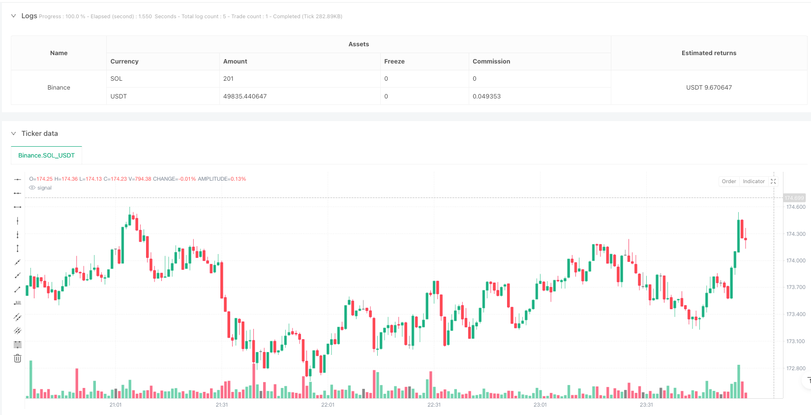
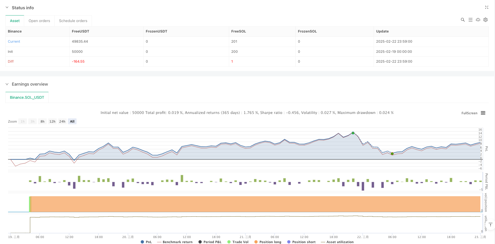

> Name

Multi-Indicator Momentum-Breakout-Trend-Trading-Strategy
> Author

ianzeng123

> Strategy Description





[trans]
#### Overview
This strategy is a multi-indicator combination strategy based on the William indicator (%R), the moving average trend indicator (MACD) and the exponential moving average (EMA). By judging the overbought and oversold status of the market, combined with the changing trend of the momentum indicator and moving average support, a complete trend following trading system is constructed. This strategy not only includes the generation of entry signals, but also designs a complete risk management mechanism.
#### Strategy Principle
The strategy is mainly based on the coordination of the following three core indicators:
1. The William indicator (%R) is used to identify overbought and oversold conditions in the market. When the indicator breaks upward from the oversold zone (below -80), it indicates that a bullish reversal signal may occur.
2. The MACD indicator confirms momentum changes through the intersection of the fast line and the slow line. When the MACD line crosses the signal line, it further confirms the upward momentum.
3. The 55-period EMA serves as a trend filter. Only when the price is above the EMA will long be considered, otherwise short selling will be considered.
The strategy will only open a position when the above three conditions are met at the same time. In addition, the strategy also incorporates a stop-profit and stop-loss mechanism based on the risk-benefit ratio, controlling the risk of each transaction by setting a fixed stop-loss percentage and risk-benefit ratio.
#### Strategic Advantages
1. Multi-indicator cross-validation: Through the combined use of William indicator, MACD and EMA triple indicators, the probability of false signals is greatly reduced.
2. Perfect risk control: A dynamic stop-profit and stop-loss mechanism is designed based on the risk-return ratio, and each transaction has clear risk control objectives.
3. Combination of trend tracking and reversal: It can not only capture overbought and oversold reversal opportunities, but also ensure compliance with the main trend direction through EMA
4. Strong parameter adjustability: the cycle parameters of the main indicators can be optimized and adjusted according to different market characteristics
#### Strategy Risk
1. Risk of volatile market: In a volatile market, false breakthrough signals may appear frequently, leading to continuous stop losses.
2. Slippage risk: When the market fluctuates violently, the actual transaction price may deviate greatly from the signal generating price.
3. Parameter sensitivity: The strategy effect is more sensitive to parameter settings, and different market environments may require different parameter combinations.
4. Signal lag: Because multiple indicators are used for confirmation, some of the best entry points for the market may be missed.
#### Strategy optimization direction
1. Dynamic parameter optimization: The parameters of each indicator can be automatically adjusted according to market volatility to improve strategy adaptability.
2. Market environment classification: Add a market environment identification module and use different parameter combinations under different market conditions.
3. Optimization of entry timing: You can increase auxiliary indicators such as trading volume to improve the accuracy of entry timing.
4. Improved risk management: You can consider adding a dynamic stop-loss mechanism to automatically adjust the stop-loss distance according to market fluctuations.
#### Summary
This strategy builds a relatively complete trend following trading system through the coordination of multiple technical indicators. The main characteristics of the strategy are high signal reliability and clear risk control, but there are also certain hysteresis and parameter sensitivity issues. There is room for further improvement of the strategy through the suggested optimization directions. When applying in real market, it is recommended to fully verify the parameter combination through backtesting and carry out targeted optimization based on market characteristics. ||
#### Overview
This strategy is a multi-indicator combination strategy based on Williams %R, Moving Average Convergence Divergence (MACD), and Exponential Moving Average (EMA). By assessing market overbought/oversold conditions, combined with momentum indicator trends and moving average support, it creates a complete trend-following trading system. The strategy includes both entry signal generation and comprehensive risk management mechanisms.

#### Strategy Principles
The strategy primarily relies on the coordination of three core indicators:
1. Williams %R is used to identify market overbought/oversold conditions, with a bullish reversal signal potentially occurring when the indicator breaks above the oversold zone (below -80)
2. MACD confirms momentum changes through crossovers of fast and slow lines, with additional confirmation when the MACD line crosses above the signal line
3. 55-period EMA serves as a trend filter, considering long positions only when price is above EMA, and vice versa

The strategy only opens positions when all three conditions are simultaneously met. Additionally, it incorporates a risk-reward based stop-loss and take-profit mechanism, controlling risk for each trade through fixed stop-loss percentages and risk-reward ratios.

#### Strategy Advantages
1. Multi-indicator cross-validation: The combination of Williams %R, MACD, and EMA significantly reduces the probability of false signals
2. Comprehensive risk control: Implements dynamic stop-loss and take-profit mechanisms based on risk-reward ratios, with clear risk control objectives for each trade
3. Combines trend-following and reversal: Captures overbought/oversold reversal opportunities while ensuring alignment with the main trend through EMA
4. Strong parameter adaptability: Period parameters for main indicators can be optimized for different market characteristics

#### Strategy Risks
1. Choppy market risk: False breakout signals may occur frequently in sideways markets, leading to consecutive losses
2. Slippage risk: Significant price differences between signal generation and actual execution may occur during high volatility
3. Parameter sensitivity: Strategy performance is sensitive to parameter settings, requiring different combinations for various market environments
4. Signal lag: The use of multiple indicators for confirmation may result in missing optimal entry points

#### Optimization Directions
1. Dynamic parameter optimization: Automatically adjust indicator parameters based on market volatility to improve adaptability
2. Market environment classification: Add market state recognition module to use different parameter combinations in different market conditions
3. Entry timing optimization: Include additional indicators like volume to improve entry timing accuracy
4. Risk management enhancement: Consider implementing dynamic stop-loss mechanisms that automatically adjust based on market volatility

#### Summary
The strategy constructs a relatively comprehensive trend-following trading system through the coordination of multiple technical indicators. Its main features are high signal reliability and clear risk control, though it faces some challenges with lag and parameter sensitivity. Through the suggested optimization directions, there is room for further improvement. For live trading implementation, it is recommended to thoroughly validate parameter combinations through backtesting and optimize specifically based on market characteristics.[/trans]


> Source (PineScript)

``` pinescript
/*backtest
start: 2025-02-19 00:00:00
end: 2025-02-23 00:00:00
period: 1m
basePeriod: 1m
exchanges: [{"eid":"Binance","currency":"SOL_USDT"}]
*/

//@version=5
strategy("Williams %R & MACD Swing Strategy", overlay=true)

// INPUTS
length_wpr = input(14, title="Williams %R Length")
overbought = input(-20, title="Overbought Level")
oversold = input(-80, title="Oversold Level")

// MACD Inputs
fastLength = input(12, title="MACD Fast Length")
slowLength = input(26, title="MACD Slow Length")
signalSmoothing = input(9, title="MACD Signal Smoothing")

// EMA for Trend Confirmation
ema_length = input(55, title="EMA Length")
ema55 = ta.ema(close, ema_length)

// INDICATORS
wpr = ta.wpr(length_wpr)
[macdLine, signalLine, _] = ta.macd(close, fastLength, slowLength, signalSmoothing)

// LONG ENTRY CONDITIONS
longCondition = ta.crossover(wpr, oversold) and ta.crossover(macdLine, signalLine) and close > ema55
if longCondition
    strategy.entry("Long", strategy.long)

// SHORT ENTRY CONDITIONS
shortCondition = ta.crossunder(wpr, overbought) and ta.crossunder(macdLine, signalLine) and close < ema55
if shortCondition
    strategy.entry("Short", strategy.short)

// RISK MANAGEMENT
riskRewardRatio = input(1.5, title="Risk-Reward Ratio")
stopLossPerc = input(2, title="Stop Loss %") / 100
takeProfitPerc = stopLossPerc * riskRewardRatio

longSL = strategy.position_avg_price * (1 - stopLossPerc)
longTP = strategy.position_avg_price * (1 + takeProfitPerc)

shortSL = strategy.position_avg_price * (1 + stopLossPerc)
shortTP = strategy.position_avg_price * (1 - takeProfitPerc)

strategy.exit("Take Profit / Stop Loss", from_entry="Long", loss=longSL, profit=longTP)
strategy.exit("Take Profit / Stop Loss", from_entry="Short", loss=shortSL, profit=shortTP)

```

> Detail

https://www.fmz.com/strategy/483496

> Last Modified

2025-02-24 09:18:48
