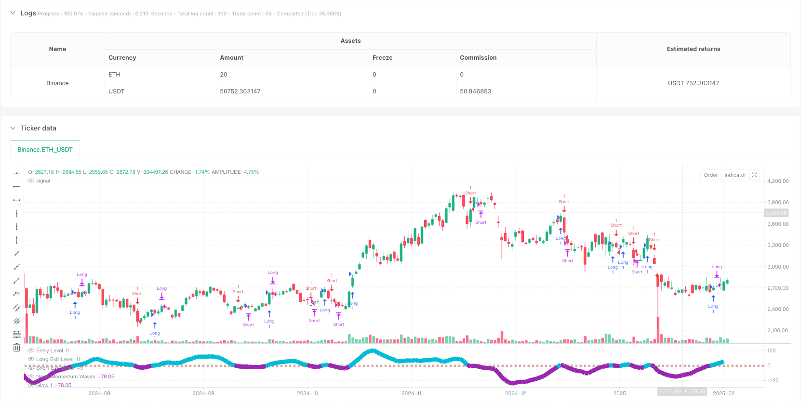
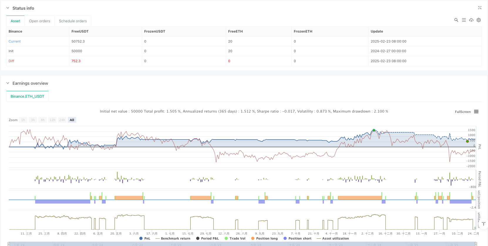

> Name

Multi-Indicator-Momentum-Wave-Trading-Strategy
> Author

ianzeng123

> Strategy Description





[trans]#### Overview
The Multi-Indicator Momentum Wave Trading Strategy is a momentum indicator system based on the modified MACD (Moving Average Convergence Divergence) calculation method, designed to help traders visualize market momentum changes and potential direction changes. This strategy calculates momentum from the difference between two exponential moving averages (EMA) and combines it with the visual enhancement of a neon effect to make momentum waves more intuitively visible. This approach helps traders identify areas of increasing or weakening momentum that may align with market trends or reversal points. This strategy adds customized threshold levels and intuitive visualization effects to the traditional MACD, providing a new perspective and method for technical analysis.
#### Strategy Principle
The core principles of this strategy are based on an innovative combination of momentum calculations and visual representation. The specific implementation method is as follows:
1. Basics of momentum calculation:
   - Measure short and long-term momentum using fast EMA (12 periods) and slow EMA (26 periods)
   - The signal line uses the 20-period EMA of the MACD difference to smooth fluctuations
   - Histogram (momentum wave) represents the difference between the MACD value and the signal line
2. Interpretation of momentum changes:
   - Increasing Momentum: When the histogram rises and is above the zero line, it may indicate that the uptrend is strengthening
   - Decreasing Momentum: When the histogram drops below the zero line, it may indicate a weakening trend or increased downward momentum.
   - Potential exhaustion point: User-definable custom threshold level (default: ±10) to highlight areas of significant strength or weakness in momentum
3. Trading signal generation:
   - Long entry: when the histogram crosses the entry level from below (default is 0)
   - Short entry: when the histogram crosses the entry level from above (default is 0)
   - Long exit: when a long position is held and the histogram crosses the long exit level (default is 11)
   - Short exit: when a short position is held and the histogram crosses the short exit level (default -9)
4. Visual enhancement design:
   - Neon effects are created through multiple layers of drawing with different opacity, improving the clarity of momentum changes
   -Aqua waves highlight upward momentum, purple waves represent downward momentum
   - Horizontal reference lines mark zero line and user-defined thresholds to improve interpretability
Code analysis shows that the strategy uses PineScript's ta.ema function to calculate the exponential moving average, and uses the color.new function to create color levels with different transparency to achieve a neon effect. The logic of the entire strategy is clear, and everything from momentum calculation to trading signal generation is clearly defined and implemented.
#### Strategic Advantages
1. Enhanced visualization:
   - Neon wave format provides clearer visual clues than the standard MACD histogram
   - Dynamic color changes (aqua and purple) visually differentiate between upward and downward momentum
   - The halo effect created by multi-layer drawing enhances the visibility of waves and makes momentum changes easier to identify
2. Flexible parameter settings:
   - Users can customize fast, slow and signal line lengths to adapt to different market environments
   - Adjustable entry and exit thresholds, allowing traders to tailor strategies to their own risk appetite
   - The use of different transparency layers enhances the wave effect while keeping the diagram clear
3. Multifunctional application scenarios:
   - Can be used to identify periods of increasing or weakening momentum and assist in trend confirmation
   - Suitable for different time frames and can be adjusted from short-term trading to long-term investment
   - Can be combined with other technical indicators and analysis methods to form a complete trading system
4. Momentum-based decision-making framework:
   - Provide clear entry and exit rules to reduce subjective judgments
   - Visualization of momentum changes helps understand market structure and potential turning points
   - Helps identify overbought or oversold areas with well-defined threshold levels
In the code implementation, the strategy uses the ta.crossover and ta.crossunder functions to accurately capture cross signals, and uses the strategy.entry and strategy.close functions to automatically execute transactions. This provides traders with a systematic approach to executing momentum-based strategies.
#### Strategy Risk
1. Signal delay problem:
   - EMA-based calculations are inherently lagging and may result in signal delays in rapidly changing markets
   - In highly volatile markets, entry and exit signals may appear after the price has moved significantly
   - Solution: Consider reducing the length of the EMA period or combining it with other leading indicators to capture the turning point in advance.
2. False breakthrough risk:
   - In a consolidating market, the momentum indicator may generate false signals crossing the zero line multiple times
   - Improperly set thresholds may result in exiting a favorable position too early or exiting an unfavorable position too late
   - Solution: Add confirmation mechanisms, such as price pattern confirmation or transaction volume analysis, to reduce the impact of false signals
3. Parameter optimization trap:
   - Over-optimizing specific parameters may result in a strategy that performs well on historical data but fails in real-time markets
   - Different market environments (trending market vs range market) may require different parameter settings
   - Solution: Use the walk-forward testing method to verify the robustness of parameters and avoid overfitting.
4. Risk of relying on a single indicator:
   - The strategy relies mainly on momentum indicators and ignores trading volume, fundamental factors and price pattern confirmation
   - Pure momentum strategies may underperform under certain market conditions
   - Solution: Build a multi-indicator system that combines price action, volume and other technical indicators to enhance decision-making reliability
5. Lack of fund management:
   - Although initial_capital is set in the code, it lacks specific position size control and risk management mechanisms.
   - Solution: Add a dynamic position adjustment function to adjust the capital ratio of each transaction based on market volatility or account size
Code analysis shows that while the strategy provides clear entry and exit rules, it lacks risk management parameters (such as capital ratio limits per trade or maximum drawdown control), which are important additional components that need to be added.
#### Strategy optimization direction
1. Enhance signal confirmation mechanism:
   - Added trading volume confirmation function, which requires a corresponding increase in trading volume when momentum signals appear.
   - Integrated price pattern recognition algorithms, such as support/resistance breakout confirmation
   - Principle: Multiple confirmations can reduce false signals and improve strategy reliability
2. Dynamic parameter adjustment:
   - Implement adaptive parameter adjustment based on market volatility, using longer periods during high volatility periods and shorter periods during low volatility periods
   - Add market environment recognition function to automatically distinguish trends and consolidation markets and adjust strategy parameters
   - Principle: Different market environments require different parameter settings to obtain the best performance
3. Enhanced risk management:
   - Added stop loss function based on ATR (average true range) to protect funds from large adverse fluctuations
   - Implement a dynamic position adjustment mechanism to adjust position size based on signal strength and market volatility
   - Add maximum drawdown control, suspend trading when the preset drawdown limit is reached
   - Principle: Sound risk management is the key to long-term profitability, protecting capital and improving risk-adjusted returns
4. Multi-time frame analysis:
   - Add a multi-time frame confirmation mechanism to ensure that the trend of the larger time frame is consistent with the direction of the entry signal
   - Implement time frame correlation analysis and consider the momentum status of different time frames in trading decisions
   - Principle: Multi-timeframe consistency can reduce counter-trend trading and increase winning rates
5. Machine learning enhancement:
   - Integrate machine learning algorithms to optimize parameter selection and adjust parameters in real time based on historical performance and market conditions
   - Added pattern recognition capabilities to identify specific patterns with predictive value in momentum waves
   - Principle: Machine learning can discover complex patterns and relationships that are difficult for humans to detect, and improve strategy adaptability
Through code analysis, existing strategies use fixed parameters and simple cross conditions for trading decisions. These suggested optimization directions will significantly enhance the robustness and adaptability of the strategy, especially under different market conditions.
#### Summarize
The multi-indicator momentum wave trading strategy is an innovative technical analysis tool that provides traders with an intuitive way to understand changes in market dynamics through a combination of momentum calculations and visual enhancements. This strategy is based on the improved MACD calculation principle and adds the visual performance of neon effects to make momentum waves more clearly visible.
The main advantages of this strategy are its enhanced visualization, flexible parameter settings and clear trading signal generation mechanism. Through a combination of different colors and transparency, the strategy can visually differentiate between upward and downward movements, helping traders more easily identify potential trend changes and turning points.
However, the strategy also has some risks, including signal delays, false breakthrough risks, parameter optimization traps and single indicator dependence. In order to mitigate these risks, it is recommended to add confirmation mechanisms, realize dynamic parameter adjustment, strengthen risk management, adopt multi-time frame analysis and consider machine learning enhancement and other optimization directions.
It is important to note that this strategy should be used as part of a wider trading system rather than on its own. Combined with other technical indicators, fundamental analysis and sound fund management principles, a more comprehensive and reliable trading system can be constructed. With continued testing, optimization and risk management, this strategy has the potential to become a valuable asset in a trader's toolbox. || #### Overview
The Multi-Indicator Momentum Wave Trading Strategy is a momentum-based indicator system that builds upon a modified MACD (Moving Average Convergence Divergence) calculation method, designed to help traders visualize market momentum changes and potential directional shifts. This strategy calculates momentum through the difference between two Exponential Moving Averages (EMAs) and incorporates visual enhancements with a neon effect, making momentum waves more intuitively visible. This approach helps traders identify areas of increasing or decreasing momentum, potentially aligning with market trends or reversal points. The strategy adds customized threshold levels and intuitive visualization effects to the traditional MACD foundation, providing a new perspective and methodology for technical analysis.

#### Strategy Principles

The core principles of this strategy are built on an innovative combination of momentum calculation and visual representation. The specific implementation includes:

1. Momentum Calculation Basis:
   - Uses a fast EMA (12-period) and a slow EMA (26-period) to measure short-term and long-term momentum
   - The signal line employs a 20-period EMA of the MACD difference to smooth fluctuations
   - The histogram (momentum wave) represents the divergence between the MACD value and the signal line

2. Momentum Change Interpretation:
   - Momentum Increasing: When the histogram rises and is positioned above the zero line, it may indicate strengthening upward movement
   - Momentum Decreasing: When the histogram declines and is positioned below the zero line, it may indicate weakening trends or strengthening downward momentum
   - Potential Exhaustion Points: Users can define custom threshold levels (default: ±10) to highlight periods when momentum is significantly strong or weak

3. Trade Signal Generation:
   - Long Entry: When the histogram crosses above the entry level (default is 0)
   - Short Entry: When the histogram crosses below the entry level (default is 0)
   - Long Exit: When holding a long position and the histogram crosses above the long exit level (default is 11)
   - Short Exit: When holding a short position and the histogram crosses below the short exit level (default is -9)

4. Visual Enhancement Design:
   - The neon effect is created through multiple layers of plots with different opacities, enhancing the clarity of momentum changes
   - Aqua-colored waves highlight upward momentum, while purple waves represent downward momentum
   - Horizontal reference lines mark the zero line and user-defined thresholds to improve interpretability

Code analysis shows that the strategy utilizes PineScript's ta.ema function to calculate exponential moving averages and employs the color.new function to create color layers with different opacities, achieving the neon light effect. The entire strategy logic is clear, with well-defined and implemented processes from momentum calculation to trade signal generation.

#### Strategy Advantages

1. Enhanced Visualization:
   - The neon wave format provides clearer visual cues than standard MACD histograms
   - Dynamic color changes (aqua and purple) intuitively distinguish between upward and downward momentum
   - The halo effect created by multi-layered plots enhances the visibility of waves, making momentum changes easier to identify

2. Flexible Parameter Settings:
   - Users can customize fast, slow, and signal line lengths to adapt to different market environments
   - Adjustable entry and exit thresholds allow traders to customize the strategy according to their risk preferences
   - The use of different opacity layers enhances the wave effect while maintaining chart clarity

3. Versatile Application Scenarios:
   - Can be used to identify periods of strengthening or weakening momentum, aiding trend confirmation
   - Applicable to different timeframes, adaptable for both short-term trading and long-term investment
   - Can be combined with other technical indicators and analytical methods to form a complete trading system

4. Momentum-Based Decision Framework:
   - Provides clear entry and exit rules, reducing subjective judgment
   - The visualization of momentum changes helps understand market structure and potential turning points
   - Assists in identifying overbought or oversold areas through clearly defined threshold levels

In the code implementation, the strategy utilizes ta.crossover and ta.crossunder functions to precisely capture crossing signals, and uses strategy.entry and strategy.close functions to execute trades automatically, providing traders with a systematic approach to implementing momentum-based strategies.

#### Strategy Risks

1. Signal Delay Issues:
   - EMA-based calculations inherently have lag, which may lead to delayed signals in rapidly changing markets
   - In highly volatile markets, entry and exit signals may appear after prices have already moved significantly
   - Solution: Consider reducing EMA period lengths or incorporating other leading indicators to capture turning points earlier

2. False Breakout Risk:
   - In ranging markets, momentum indicators may generate false signals with multiple zero-line crossovers
   - Improper threshold settings may lead to prematurely exiting favorable positions or exiting unfavorable positions too late
   - Solution: Add confirmation mechanisms, such as price pattern confirmation or volume analysis, to reduce the impact of false signals

3. Parameter Optimization Trap:
   - Over-optimizing specific parameters may result in strategies that perform well on historical data but fail in real-time markets
   - Different market environments (trending markets vs. ranging markets) may require different parameter settings
   - Solution: Use walk-forward testing methods to validate parameter robustness and avoid overfitting

4. Single Indicator Dependency Risk:
   - The strategy primarily relies on momentum indicators, ignoring volume, fundamental factors, and price pattern confirmation
   - Pure momentum strategies may underperform in certain market conditions
   - Solution: Build multi-indicator systems, combining price action, volume, and other technical indicators to enhance decision reliability

5. Lack of Money Management:
   - Although initial_capital is set in the code, there is a lack of specific position size control and risk management mechanisms
   - Solution: Add dynamic position adjustment functionality, adjusting the capital ratio for each trade based on market volatility or account size

Code analysis indicates that while the strategy provides clear entry and exit rules, it lacks risk management parameters (such as capital ratio limits per trade or maximum drawdown control), which are important components that need to be added.

#### Strategy Optimization Directions

1. Enhanced Signal Confirmation Mechanism:
   - Add volume confirmation functionality, requiring volume to increase accordingly when momentum signals appear
   - Integrate price pattern recognition algorithms, such as support/resistance breakout confirmation
   - Rationale: Multiple confirmations can reduce false signals and increase strategy reliability

2. Dynamic Parameter Adjustment:
   - Implement adaptive parameter adjustments based on market volatility, using longer periods during high volatility and shorter periods during low volatility
   - Add market environment recognition functionality to automatically distinguish between trending and ranging markets and adjust strategy parameters
   - Rationale: Different market environments require different parameter settings for optimal performance

3. Risk Management Enhancement:
   - Add ATR (Average True Range) based stop-loss functionality to protect capital from significant adverse movements
   - Implement dynamic position adjustment mechanisms, adjusting position size based on signal strength and market volatility
   - Add maximum drawdown control, pausing trading when preset drawdown limits are reached
   - Rationale: Comprehensive risk management is key to long-term profitability, protecting capital and improving risk-adjusted returns

4. Multi-Timeframe Analysis:
   - Add multi-timeframe confirmation mechanisms to ensure that larger timeframe trends align with entry signal directions
   - Implement timeframe correlation analysis, considering momentum states across different timeframes in trading decisions
   - Rationale: Multi-timeframe consistency can reduce counter-trend trading and improve win rates

5. Machine Learning Enhancement:
   - Integrate machine learning algorithms to optimize parameter selection, adjusting parameters in real-time based on historical performance and market conditions
   - Add pattern recognition functionality to identify specific patterns in momentum waves with predictive value
   - Rationale: Machine learning can discover complex patterns and relationships difficult for humans to detect, improving strategy adaptability

Through code analysis, the existing strategy uses fixed parameters and simple crossing conditions for trading decisions. These suggested optimization directions would significantly enhance the strategy's robustness and adaptability, especially under different market conditions.

#### Summary

The Multi-Indicator Momentum Wave Trading Strategy is an innovative technical analysis tool that combines momentum calculation with visual enhancement to provide traders with an intuitive method for understanding market dynamics changes. The strategy is based on modified MACD calculation principles and incorporates neon effect visual representation, making momentum waves more clearly visible.

The main advantages of this strategy lie in its enhanced visualization effects, flexible parameter settings, and clear trade signal generation mechanisms. Through combinations of different colors and opacities, the strategy can intuitively distinguish between upward and downward momentum, helping traders more easily identify potential trend changes and turning points.

However, the strategy also has some risks, including signal delay issues, false breakout risks, parameter optimization traps, and single indicator dependency problems. To mitigate these risks, it is recommended to add confirmation mechanisms, implement dynamic parameter adjustments, strengthen risk management, adopt multi-timeframe analysis, and consider machine learning enhancements.

It is worth noting that this strategy should be used as part of a broader trading system rather than in isolation. By combining it with other technical indicators, fundamental analysis, and sound money management principles, a more comprehensive and reliable trading system can be constructed. Through continuous testing, optimization, and risk management, this strategy has the potential to become a valuable asset in a trader's toolbox.[/trans]


> Source (PineScript)

``` pinescript
/*backtest
start: 2024-02-27 00:00:00
end: 2025-02-24 08:00:00
period: 1d
basePeriod: 1d
exchanges: [{"eid":"Binance","currency":"ETH_USDT"}]
*/

//@version=5
strategy("Neon Momentum Waves Strategy", overlay=false, initial_capital=100000, currency=currency.USD)

// User inputs for momentum parameters
fast_length    = input(12, "Fast Length")
slow_length    = input(26, "Slow Length")
signal_length  = input(20, "Signal Length")

// User inputs for trade entries/exits
entry_level    = input(0, "Entry Level (Zero Line)")
long_exit_level  = input(11, "Long Exit Level")
short_exit_level = input(-9, "Short Exit Level")

// Calculate MACD-like momentum waves
macd   = ta.ema(close, fast_length) - ta.ema(close, slow_length)
signal = ta.ema(macd, signal_length)
hist   = macd - signal

// Define colors for neon effect
aqua   = color.new(color.aqua, 0)      // Aqua for positive momentum
purple = color.new(color.purple, 0)    // Purple for negative momentum
dynamic_color = hist >= 0 ? aqua : purple

// Plot momentum waves with neon effect
plot(hist, title="Neon Momentum Waves", color=dynamic_color, linewidth=3)
plot(hist, title="Glow 1", color=color.new(dynamic_color, 80), linewidth=10)
plot(hist, title="Glow 2", color=color.new(dynamic_color, 80), linewidth=7)
plot(hist, title="Glow 3", color=color.new(dynamic_color, 90), linewidth=4)
plot(hist, title="Glow 4", color=color.new(dynamic_color, 90), linewidth=1)

// Plot the entry level (zero line) and exit levels for reference
hline(entry_level, "Entry Level", color=color.gray)
hline(long_exit_level, "Long Exit Level", color=color.green)
hline(short_exit_level, "Short Exit Level", color=color.red)

// Strategy logic

// Long Entry: when hist crosses above the entry level (default 0)
longCondition = ta.crossover(hist, entry_level)
if (longCondition)
    strategy.entry("Long", strategy.long)

// Short Entry: when hist crosses below the entry level (default 0)
shortCondition = ta.crossunder(hist, entry_level)
if (shortCondition)
    strategy.entry("Short", strategy.short)

// Long Exit: exit long position when hist crosses above the long exit level (default 10)
longExit = strategy.position_size > 0 and ta.crossover(hist, long_exit_level)
if (longExit)
    strategy.close("Long", comment="Long Exit")

// Short Exit: exit short position when hist crosses below the short exit level (default -10)
shortExit = strategy.position_size < 0 and ta.crossunder(hist, short_exit_level)
if (shortExit)
    strategy.close("Short", comment="Short Exit")

```

> Detail

https://www.fmz.com/strategy/483794

> Last Modified

2025-02-26 10:30:20
