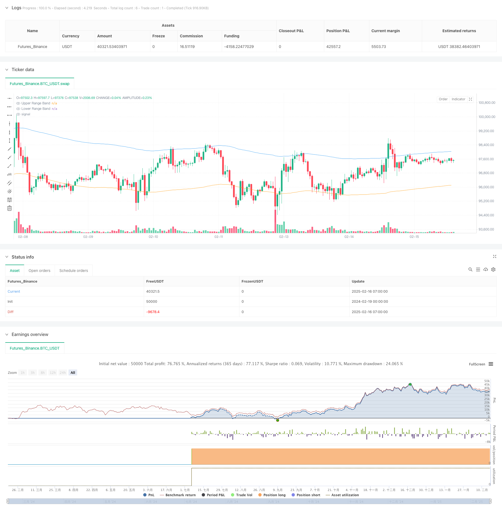

> Name

Multi-Indicator-Momentum-and-Volume-Based-Trend-Reversal-Strategy based on momentum and volume
> Author

ChaoZhang

> Strategy Description



[trans]
#### Overview
This strategy is a trend reversal trading system that combines momentum indicators (MACD, RSI) and volume filters. By introducing the Range Filter to monitor price fluctuations, we can accurately capture the top and bottom of the market. The strategy adds a trading volume confirmation mechanism to traditional technical indicators, effectively improving the reliability of trading signals.
#### Strategy Principle
The strategy uses multiple indicator verification methods for trading:
1. The MACD indicator is used to capture changes in price momentum and confirm trend turning points through the intersection of fast and slow lines.
2. The RSI indicator monitors the overbought and oversold state of the market and looks for potential reversal opportunities when RSI reaches its extreme value.
3. The range filter ensures that trades occur at positions that deviate significantly from the trend by calculating a smooth range band of price
4. The trading volume filter requires that trading signals must be confirmed by high volume to improve the reliability of the signal.
The collaborative triggering mechanism of multiple conditions is as follows:
- Long conditions: MACD golden cross + RSI is in the oversold area + price is below the lower track + trading volume exceeds the average
- Short selling conditions: MACD dead cross + RSI is in the overbought area + price is above the upper track + trading volume exceeds the average
#### Strategic Advantages
1. Cross-validation of multiple indicators improves the accuracy of signals and effectively reduces the interference of false signals.
2. The introduction of the range filter ensures that transactions occur at positions where prices deviate significantly, increasing potential profit margins.
3. The trading volume confirmation mechanism avoids misjudgments in low liquidity environments and enhances the reliability of transactions.
4. Strategy parameters can be flexibly adjusted to adapt to the characteristics of different market environments and trading varieties.
5. Clear signal generation logic facilitates real-time monitoring and backtest analysis
#### Strategy Risk
1. Strict requirements on multiple conditions may result in missing some potential trading opportunities.
2. Frequent trading signals may occur in a volatile market, increasing transaction costs.
3. The selection of parameters requires sufficient market experience and historical data support.
4. In extreme market environments, the effectiveness of technical indicators may be affected.
Risk control suggestions:
- It is recommended to carry out sufficient parameter optimization and backtest verification
- Consider introducing a stop-loss and take-profit mechanism
- Pay attention to changes in the market environment and adjust strategy parameters in a timely manner
#### Strategy optimization direction
1. Introduce an adaptive parameter mechanism to dynamically adjust indicator parameters according to market volatility
2. Add a market environment identification module and adopt different signal filtering rules under different market conditions.
3. Optimize the volume filter and consider introducing volume pattern analysis
4. Add price pattern recognition function to provide more reversal confirmation signals
5. Develop intelligent fund management modules to optimize position size and risk control
#### Summary
This strategy establishes a relatively complete trend reversal trading system through the coordination of multiple technical indicators. The core advantage of the strategy lies in its strict signal filtering mechanism and flexible parameter adjustment space. Through continuous optimization and improvement, the strategy is expected to maintain stable performance in various market environments. In practical applications, it is recommended that investors make targeted adjustments to strategy parameters based on their own risk preferences and market experience. ||
#### Overview
This strategy is a trend reversal trading system that combines momentum indicators (MACD, RSI) with a volume filter. By introducing a Range Filter to monitor price fluctuations, it achieves precise capture of market tops and bottoms. The strategy incorporates a volume confirmation mechanism on top of traditional technical indicators, effectively improving the reliability of trading signals.

#### Strategy Principle
The strategy employs multiple indicator verification for trading:
1. MACD indicator captures momentum changes in price, confirming trend reversal points through crossovers
2. RSI monitors market overbought/oversold conditions, seeking potential reversals at extreme values
3. Range Filter calculates smoothed price bands to ensure trades occur at significant trend deviations
4. Volume Filter requires trading signals to be confirmed by increased volume, enhancing signal reliability

Multiple condition trigger mechanism works as follows:
- Long conditions: MACD golden cross + RSI in oversold zone + Price below lower band + Volume above average
- Short conditions: MACD death cross + RSI in overbought zone + Price above upper band + Volume above average

#### Strategy Advantages
1. Cross-validation of multiple indicators improves signal accuracy, effectively reducing false signal interference
2. Range Filter ensures trades occur at significant price deviations, increasing potential profit margins
3. Volume confirmation mechanism prevents misjudgments in low liquidity environments, enhancing trade reliability
4. Strategy parameters can be flexibly adjusted to adapt to different market conditions and trading instruments
5. Clear signal generation logic facilitates real-time monitoring and backtesting analysis

#### Strategy Risks
1. Strict multiple conditions may cause missed trading opportunities
2. May generate frequent trading signals in ranging markets, increasing transaction costs
3. Parameter selection requires substantial market experience and historical data support
4. Technical indicators' effectiveness may be affected in extreme market conditions

Risk control suggestions:
- Recommend thorough parameter optimization and backtesting verification
- Consider implementing stop-loss and take-profit mechanisms
- Monitor market environment changes and adjust strategy parameters accordingly

#### Strategy Optimization Directions
1. Introduce adaptive parameter mechanisms to dynamically adjust indicator parameters based on market volatility
2. Add market environment recognition module to apply different signal filtering rules in different market states
3. Optimize volume filter by considering volume pattern analysis
4. Add price pattern recognition functionality to provide additional reversal confirmation signals
5. Develop intelligent money management module to optimize position sizing and risk control

#### Summary
The strategy establishes a relatively comprehensive trend reversal trading system through the coordination of multiple technical indicators. Its core advantages lie in its strict signal filtering mechanism and flexible parameter adjustment space. Through continuous optimization and improvement, the strategy shows promise in maintaining stable performance across various market conditions. In practical application, investors are advised to adjust strategy parameters according to their risk preferences and market experience.[/trans]


> Source (PineScript)

``` pinescript
/*backtest
start: 2024-02-19 00:00:00
end: 2025-02-16 08:00:00
period: 1h
basePeriod: 1h
exchanges: [{"eid":"Futures_Binance","currency":"BTC_USDT"}]
*/

//@version=6
strategy("MACD & RSI with Range and Volume Filter", overlay=true)

// Inputs for MACD
fastLength = input.int(12, title="MACD Fast Length")
slowLength = input.int(26, title="MACD Slow Length")
signalLength = input.int(9, title="MACD Signal Length")

// Inputs for RSI
rsiLength = input.int(14, title="RSI Length")
rsiOverbought = input.int(80, title="RSI Overbought Level")
rsiOversold = input.int(40, title="RSI Oversold Level")

// Inputs for Range Filter
rangePeriod = input.int(100, minval=1, title="Range Filter Period")
rangeMultiplier = input.float(3.0, minval=0.1, title="Range Filter Multiplier")

// Inputs for Volume Filter
volumeMA_Period = input.int(20, minval=1, title="Volume MA Period")

// MACD Calculation
[macdLine, signalLine, _] = ta.macd(close, fastLength, slowLength, signalLength)

// RSI Calculation
rsi = ta.rsi(close, rsiLength)

// Smooth Average Range
smoothRange(src, period, multiplier) =>
    avgRange = ta.ema(math.abs(src - src[1]), period)
    ta.ema(avgRange, period * 2 - 1) * multiplier

smoothedRange = smoothRange(close, rangePeriod, rangeMultiplier)
rangeFilter = ta.ema(close, rangePeriod)
upperBand = rangeFilter + smoothedRange
lowerBand = rangeFilter - smoothedRange

// Range Filter Conditions
priceAboveRange = close > upperBand
priceBelowRange = close < lowerBand

// Volume Filter
volumeMA = ta.sma(volume, volumeMA_Period)
highVolume = volume > volumeMA

// Buy and Sell Conditions with Range and Volume Filter
buyCondition = ta.crossover(macdLine, signalLine) and rsi < rsiOversold and priceBelowRange and highVolume
sellCondition = ta.crossunder(macdLine, signalLine) and rsi > rsiOverbought and priceAboveRange and highVolume

// Strategy Execution
if (buyCondition)
    strategy.entry("Buy", strategy.long)
if (sellCondition)
    strategy.entry("Sell", strategy.short)

// Alerts for Buy and Sell Signals
alertcondition(buyCondition, title="Buy Signal", message="Buy Signal Triggered")
alertcondition(sellCondition, title="Sell Signal", message="Sell Signal Triggered")

// Plot Buy and Sell Signals
plotshape(buyCondition, title="Buy Signal", text="Buy", style=shape.labelup, location=location.belowbar, color=color.new(color.green, 0))
plotshape(sellCondition, title="Sell Signal", text="Sell", style=shape.labeldown, location=location.abovebar, color=color.new(color.red, 0))

// Plot Range Filter Bands
plot(upperBand, color=color.new(color.blue, 50), title="Upper Range Band")
plot(lowerBand, color=color.new(color.orange, 50), title="Lower Range Band")

```

> Detail

https://www.fmz.com/strategy/482431

> Last Modified

2025-02-18 14:04:30
