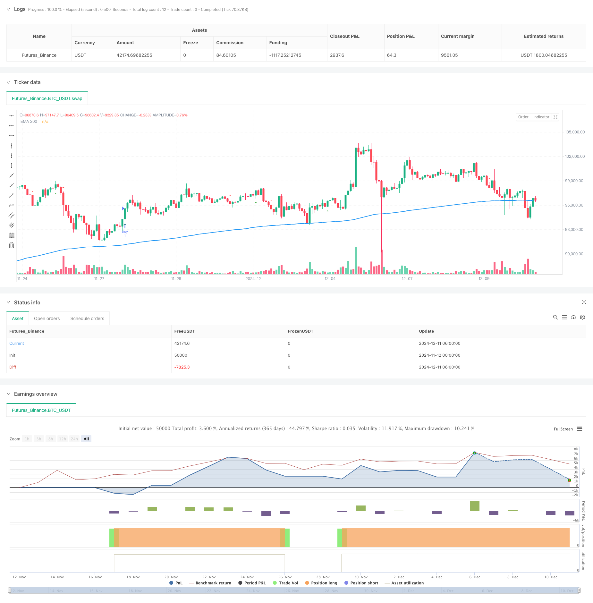

> Name

Multi-Indicator-Synergistic-Trend-Following-Strategy-with-Dynamic-Stop-Loss-System
> Author

ChaoZhang

> Strategy Description



[trans]
#### Overview
This strategy is a trend following trading system that combines multiple technical indicators. It integrates market signals from multiple dimensions such as Moving Average (EMA), Volatility Tracking (ATR), Volume Trend (PVT) and Momentum Oscillator (Ninja), and improves the accuracy of trading through signal synergy. The strategy adopts a dynamic stop-loss mechanism to strictly control risks while tracking the trend.
#### Strategy Principle
The core logic of the strategy is built on four main pillars:
1. Use the 200-period EMA as the basis for judging the main trend, and divide the market into two states: long and short.
2. The Chandelier Exit system based on ATR determines the turning point of the trend by tracking the highest and lowest prices and combining it with volatility.
3. The PVT indicator is used to confirm the validity of the price trend by combining price changes with trading volume.
4. The Ninja Oscillator captures changes in market momentum by comparing short-term and medium-term moving averages
The generation of trading signals needs to meet the following conditions:
- Long: The price stands above 200EMA, and Chandelier Exit has a buy signal, and the PVT or Ninja indicator confirms
- Short: The price stands below the 200EMA, and a sell signal appears on Chandelier Exit, and the PVT or Ninja indicator confirms
#### Strategic Advantages
1. Multi-indicator collaborative confirmation greatly reduces the risk of false breakthroughs
2. Combines market information from multiple dimensions such as trend, volatility, trading volume and momentum.
3. Adopt a dynamic stop-loss mechanism that can automatically adjust the stop-loss position according to market fluctuations
4. Systematic trading rules reduce the interference caused by subjective judgments
5. Have a good risk control mechanism, and each transaction has a clear stop loss level
#### Strategy Risk
1. Frequent false signals may occur in volatile markets
2. The multiple confirmation mechanism may cause a slight delay in entry timing.
3. When the market reverses rapidly, the stop loss position may be relatively loose
4. Parameter optimization may have the risk of overfitting
5. A larger capital buffer is needed to withstand drawdowns
#### Strategy optimization direction
1. Introduce a market environment identification mechanism and use different parameter combinations under different market conditions.
2. Increase the dimension of transaction volume analysis and optimize the position management system
3. Consider adding a dynamic parameter adjustment mechanism based on volatility
4. Optimize the weight distribution between multiple indicators
5. Introduce time filters to avoid periods of greater market volatility
#### Summary
This strategy builds a relatively complete trading system through multi-indicator collaboration and dynamic stop loss mechanisms. The core advantage of the strategy lies in its multi-dimensional signal confirmation mechanism and strict risk control. Although there is a certain risk of hysteresis and false signals, through continuous optimization and improvement, this strategy is expected to maintain stable performance in different market environments. It is recommended that traders conduct sufficient backtesting and parameter optimization before using it in real trading. ||
#### Overview
This strategy is a trend following trading system that combines multiple technical indicators. It integrates market signals from various dimensions including Moving Average (EMA), Volatility Tracking (ATR), Volume Trend (PVT), and Momentum Oscillator (Ninja) to improve trading accuracy. The strategy employs a dynamic stop-loss mechanism to strictly control risk while tracking trends.

#### Strategy Principles
The core logic is built on four main pillars:
1. Using 200-period EMA as the primary trend determination basis, dividing the market into bullish and bearish states
2. Chandelier Exit system based on ATR, determining trend turning points by tracking highs and lows combined with volatility
3. PVT indicator combining price changes with volume to confirm price trend validity
4. Ninja oscillator capturing market momentum changes by comparing short-term and medium-term moving averages

Trading signals are generated under the following conditions:
- Long: Price above 200EMA, Chandelier Exit shows buy signal, confirmed by either PVT or Ninja indicator
- Short: Price below 200EMA, Chandelier Exit shows sell signal, confirmed by either PVT or Ninja indicator

#### Strategy Advantages
1. Multi-indicator synergistic confirmation significantly reduces false breakout risks
2. Incorporates market information from multiple dimensions including trend, volatility, volume, and momentum
3. Dynamic stop-loss mechanism automatically adjusts stop positions based on market volatility
4. Systematic trading rules reduce interference from subjective judgments
5. Robust risk control mechanism with clear stop-loss levels for each trade

#### Strategy Risks
1. May generate frequent false signals in ranging markets
2. Multiple confirmation mechanisms might lead to slightly delayed entries
3. Stop-loss positions may be relatively loose during rapid market reversals
4. Parameter optimization may risk overfitting
5. Requires substantial capital buffer to withstand drawdowns

#### Strategy Optimization Directions
1. Introduce market environment recognition mechanism to use different parameter combinations in different market states
2. Add trading volume analysis dimension to optimize position management system
3. Consider adding volatility-based dynamic parameter adjustment mechanism
4. Optimize weight distribution among multiple indicators
5. Introduce time filters to avoid periods of high market volatility

#### Summary
This strategy constructs a relatively complete trading system through multi-indicator synergy and dynamic stop-loss mechanism. Its core advantages lie in multi-dimensional signal confirmation and strict risk control. While there are risks of lag and false signals, through continuous optimization and improvement, the strategy has the potential to maintain stable performance across different market environments. Traders are advised to conduct thorough backtesting and parameter optimization before live trading.[/trans]


> Source (PineScript)

``` pinescript
/*backtest
start: 2024-11-12 00:00:00
end: 2024-12-11 08:00:00
period: 2h
basePeriod: 2h
exchanges: [{"eid":"Futures_Binance","currency":"BTC_USDT"}]
*/

//@version=5
strategy("Triple Indicator Strategy", shorttitle="TIS", overlay=true)

// --- Inputs ---
var string calcGroup = "Calculation Parameters"
atrLength = input.int(22, title="ATR Period", group=calcGroup)
atrMult = input.float(3.0, title="ATR Multiplier", step=0.1, group=calcGroup)
emaLength = input.int(200, title="EMA Length", group=calcGroup)

// --- ATR and EMA Calculations ---
atr = atrMult * ta.atr(atrLength)
ema200 = ta.ema(close, emaLength)

// --- Chandelier Exit Logic ---
longStop = ta.highest(high, atrLength) - atr
shortStop = ta.lowest(low, atrLength) + atr

var int dir = 1
dir := close > shortStop ? 1 : close < longStop ? -1 : dir

buySignal = dir == 1 and dir[1] == -1
sellSignal = dir == -1 and dir[1] == 1

// --- Price Volume Trend (PVT) ---
pvt = ta.cum((close - close[1]) / close[1] * volume)
pvtSignal = ta.ema(pvt, 21)
pvtBuy = ta.crossover(pvt, pvtSignal)
pvtSell = ta.crossunder(pvt, pvtSignal)

// --- Ninja Indicator ---
ninjaOsc = (ta.ema(close, 3) - ta.ema(close, 13)) / ta.ema(close, 13) * 100
ninjaSignal = ta.ema(ninjaOsc, 24)
ninjaBuy = ta.crossover(ninjaOsc, ninjaSignal)
ninjaSell = ta.crossunder(ninjaOsc, ninjaSignal)

// --- Strategy Conditions ---
longCondition = buySignal and close > ema200 and (pvtBuy or ninjaBuy)
shortCondition = sellSignal and close < ema200 and (pvtSell or ninjaSell)

if longCondition
    strategy.entry("Buy", strategy.long)
    strategy.exit("Exit Long", "Buy", stop=low - atr)

if shortCondition
    strategy.entry("Sell", strategy.short)
    strategy.exit("Exit Short", "Sell", stop=high + atr)

// --- Plotting ---
plot(ema200, title="EMA 200", color=color.blue, linewidth=2)
plotshape(buySignal, title="Chandelier Buy", location=location.belowbar, color=color.green, style=shape.triangleup, size=size.small)
plotshape(sellSignal, title="Chandelier Sell", location=location.abovebar, color=color.red, style=shape.triangledown, size=size.small)

// --- Labels for Buy/Sell with price ---
if buySignal
    label.new(bar_index, low, "Buy: " + str.tostring(close), color=color.green, style=label.style_label_up, yloc=yloc.belowbar, size=size.small)

if sellSignal
    label.new(bar_index, high, "Sell: " + str.tostring(close), color=color.red, style=label.style_label_down, yloc=yloc.abovebar, size=size.small)

// --- Alerts ---
alertcondition(longCondition, title="Buy Alert", message="Buy Signal Triggered!")
alertcondition(shortCondition, title="Sell Alert", message="Sell Signal Triggered!")
```

> Detail

https://www.fmz.com/strategy/474978

> Last Modified

2024-12-13 11:45:19
