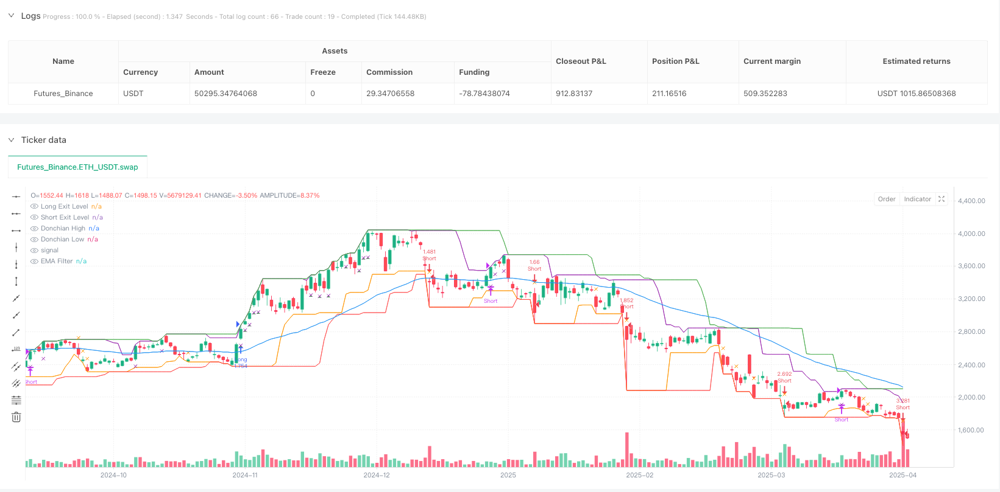
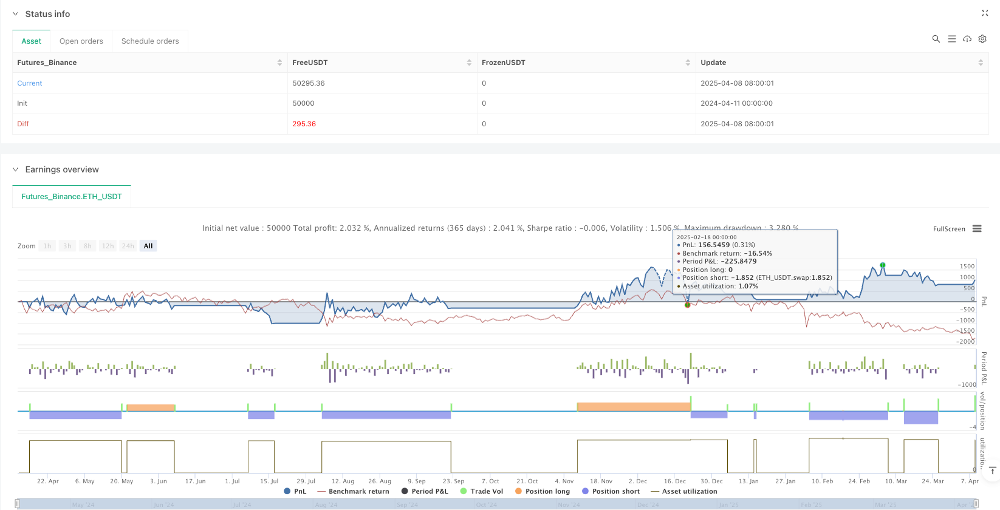

> Name

Multi-Indicator Trend Breakout Dynamic Stop-Loss Quantitative Trading Strategy-Multi-Indicator-Trend-Breakout-Strategy-with-Dynamic-Stop-Loss
> Author

ianzeng123

> Strategy Description





[trans]

#### Overview
The multi-indicator trend breakout dynamic stop-loss quantitative trading strategy is a modern trading system based on the Donchian Channel breakout principle, inspired by Curtis Faith's "Way of the Turtle Trading Rules". This strategy is specially optimized to adapt to the high volatility and frequent false breakout characteristics of the all-weather trading market. The system integrates multiple technical indicators as filter conditions, including exponential moving average (EMA) trend confirmation, relative strength index (RSI) momentum verification, adaptive true range (ATR) stop-loss mechanism, and optional volatility and volume filters, thus building a comprehensive and flexible trading framework.
#### Strategy Principle
The core principle of this strategy is to capture the trend movement after the price breaks through the historical high and low points, while applying a multi-layer filtering mechanism to reduce the risk of false breakthroughs and premature entry. The specific implementation logic is as follows:
1. The entry signal is based on the breakthrough of the Donchian Channel (default 20 periods), that is, go long when the price breaks through the highest point of the previous 20 periods, and go short when it breaks through the lowest point.
2. Trend filtering uses the 50-period EMA to ensure that you only place orders in the direction of the trend - only long when the price is above the EMA, and only short when the price is below the EMA.
3. Momentum confirmation is achieved through the 14-period RSI. When the RSI is greater than 50, the long momentum is confirmed, and when the RSI is less than 50, the short momentum is confirmed.
4. The intelligent stop loss mechanism adopts dynamic adjustment of volatility based on ATR, with the default value being 1.5 times the ATR distance, allowing the stop loss to automatically adjust with market volatility.
5. The exit strategy combines the double protection of Tang Qian channel reverse breakthrough (10 cycles) and ATR stop loss, which not only protects profits but also limits losses.
6. The optional volatility filter requires the current ATR to be above its 20-period SMA to avoid low-volatility range trading.
7. The optional volume filter requires current volume to be above its 20-period SMA to ensure adequate market participation.
When the strategy is executed, the system will automatically calculate all conditions, open a position only when all entry conditions are met, and immediately set a dynamic stop loss based on ATR. The strategy automatically closes the position when the price hits the reverse channel or stop loss level.
#### Strategic Advantages
An in-depth analysis of the code structure and logic of this strategy can summarize the following significant advantages:
1. **Strong trend adaptability**: Through the combination of Donchian Channel and EMA, the strategy can effectively capture trends in various time frames and automatically adapt to different market environments.
2. **Multi-layer filtering mechanism**: Integrate multi-dimensional filtering conditions of EMA, RSI, volatility and trading volume to significantly reduce false breakthrough signals and improve trading quality.
3. **Intelligent Risk Management**: The dynamic stop-loss mechanism based on ATR enables the strategy to automatically adjust the stop-loss distance according to the current market volatility, achieving an intelligent balance between risk and return.
4. **Highly Configurable**: All key parameters are customizable, allowing traders to flexibly adjust strategies according to different market conditions and personal risk preferences.
5. **Double exit protection**: A double insurance mechanism that combines trend reversal signals (channel reverse breakthroughs) and absolute stop loss levels, which can not only effectively lock in profits, but also strictly control risks.
6. **Adaptive Commission Model**: Built-in realistic commission calculation (default 0.045%) to ensure that the backtest results are closer to the actual trading situation.
7. **Visual trading signals**: The strategy provides comprehensive graphical instructions, including entry and exit signals and various indicator lines, to help traders intuitively understand trading logic and market conditions.
#### Strategy Risk
Although this strategy is comprehensively designed, there are still the following potential risks and limitations:
1. **Range Range Risk**: Despite multiple filtering mechanisms, in long-term sideways markets, the strategy may still produce consecutive small losing trades. The solution is to increase the volatility threshold or introduce additional market structure judgment indicators.
2. **Parameter sensitivity**: Different parameter combinations have a greater impact on strategy performance, especially channel length and EMA period selection. It is recommended to find the optimal parameter combination through historical data backtesting and conduct forward verification.
3. **Systemic Risk Exposure**: Under severe market fluctuations or the impact of major events, the price may jump significantly beyond the stop loss level, resulting in actual losses exceeding expectations. It is recommended to set a maximum risk exposure and limit the proportion of funds in a single transaction.
4. **Slippage and Liquidity Risk**: Slippage and liquidity issues are not considered in the code. In real transactions, especially in small-market capitalization assets, you may face execution price deviations. It is recommended to increase slippage simulation and adjust entry volume for low liquidity markets.
5. **Over-optimization risk**: Over-optimizing parameters may cause the strategy to only adapt to historical data and lose future adaptability. It is recommended to use out-of-sample testing and robustness analysis to verify the generalizability of the parameters.
#### Strategy optimization direction
Based on code analysis, the following are the directions in which this strategy can be further optimized:
1. **Adaptive parameter adjustment**: Introduce an adaptive mechanism to dynamically adjust the channel length and filtering conditions according to the market status (high/low volatility period, trend/shock period) to improve the adaptability of the strategy in different market environments.
2. **Multiple time frame confirmation**: Add a higher time frame trend confirmation mechanism to ensure that the trading direction is consistent with the main trend and reduce the risk of counter-trend trading.
3. **Dynamic Position Management**: The current strategy uses a fixed proportion of fund management (10%), which can be optimized to a volatility adjustment position model based on ATR, increasing positions during low volatility periods and reducing positions during high volatility periods, optimizing the risk-return ratio.
4. **Advanced exit mechanism**: Implement a partial profit mechanism, such as closing positions in batches after reaching a certain profit target, which not only ensures that the general trend is captured, but also locks in part of the profits in a timely manner.
5. **Market Status Classification**: Introduce a market status judgment mechanism (such as volatility analysis or trend strength analysis), and apply different parameter sets in different market status to further reduce losses in volatile markets.
6. **Machine Learning Enhancement**: Combined with machine learning algorithms to optimize parameter selection and entry timing judgment, especially using pattern recognition technology to reduce false breakthrough transactions.
7. **Sentiment Indicator Integration**: Introduce market sentiment indicators such as abnormal trading volume and abnormal price fluctuations to help identify potential trend turning points and adjust position strategies in advance.
#### Summary
The multi-indicator trend breakout dynamic stop-loss quantitative trading strategy is a comprehensive trading system that combines traditional turtle trading rules with modern technical analysis. By integrating Donchian channel breakout, EMA trend confirmation, RSI momentum verification and ATR dynamic stop loss, this strategy builds a trading framework that can capture the main trend while effectively managing risk.
The biggest advantage of the strategy is its multi-layer filtering mechanism and intelligent risk management system, which significantly improves the reliability of traditional breakthrough systems. By providing highly configurable parameters and clear entry and exit rules, this strategy is suitable for both experienced traders to fine-tune, and for novices as a good starting point for systematic trading.
Although any trading strategy has risks and limitations, the solid framework and clear optimization path provided by this strategy provide traders with a powerful tool to build a reliable quantitative trading system in different market environments. By continuously optimizing and adapting to market changes, this strategy has the potential to become a long-term stable and profitable trading system. ||
#### Overview
The Multi-Indicator Trend Breakout Strategy with Dynamic Stop-Loss is a modernized trading system based on Donchian Channel breakout principles, inspired by Curtis Faith's "Way of the Turtle." This strategy has been specifically optimized to adapt to the high volatility and frequent false breakouts characteristic of 24/7 trading markets. The system integrates multiple technical indicators as filtering conditions, including Exponential Moving Average (EMA) trend confirmation, Relative Strength Index (RSI) momentum verification, Adaptive True Range (ATR) stop-loss mechanism, and optional volatility and volume filters, creating a comprehensive and flexible trading framework.
#### Strategy Principles
The core principle of this strategy is to capture trending price movements after breakouts of historical high and low points, while applying multiple filtering mechanisms to reduce the risk of false breakouts and premature entries. The specific implementation logic is as follows:

1. Entry signals are based on Donchian Channel breakouts (default 20 periods), going long when price breaks above the highest point of the previous 20 periods, and short when breaking below the lowest point.
2. Trend filtering uses a 50-period EMA, ensuring trades only in the direction of the trend - only long positions when price is above the EMA, only short positions when below.
3. Momentum confirmation is implemented through a 14-period RSI, confirming bullish momentum when RSI is greater than 50, and bearish momentum when less than 50.
4. The intelligent stop-loss mechanism employs volatility-based dynamic adjustment using ATR, defaulting to a distance of 1.5 times ATR, allowing stop-losses to automatically adjust with market volatility.
5. The exit strategy combines reverse breakouts of the Donchian Channel (10 periods) with ATR stop-losses for dual protection, both preserving profits and limiting losses.
6. An optional volatility filter requires the current ATR to be above its 20-period SMA, avoiding trades in low volatility ranges.
7. An optional volume filter requires the current volume to be above its 20-period SMA, ensuring sufficient market participation.

When executing the strategy, the system automatically calculates all conditions, only opening positions when all entry conditions are met, and immediately setting ATR-based dynamic stop-loss levels. The strategy automatically closes positions when the price reaches either the reverse channel or the stop-loss level.

#### Strategy Advantages
Through deep analysis of the strategy's code structure and logic, the following significant advantages can be summarized:

1. **Strong Trend Adaptability**: Through the combination of Donchian Channels and EMA, the strategy can effectively capture trends across various timeframes and automatically adapt to different market environments.

2. **Multi-layer Filtering Mechanism**: By integrating EMA, RSI, volatility, and volume as multi-dimensional filtering conditions, the strategy significantly reduces false breakout signals and improves trade quality.

3. **Intelligent Risk Management**: The ATR-based dynamic stop-loss mechanism allows the strategy to automatically adjust stop-loss distances according to current market volatility, achieving an intelligent balance between risk and reward.

4. **High Configurability**: All key parameters can be customized, allowing traders to flexibly adjust the strategy according to different market conditions and personal risk preferences.

5. **Dual Exit Protection**: The combination of trend reversal signals (channel reverse breakouts) and absolute stop-loss levels provides dual insurance, effectively locking in profits while strictly controlling risk.

6. **Adaptive Commission Model**: Built-in realistic commission calculation (default 0.045%) ensures backtesting results more closely approximate actual trading situations.

7. **Visualized Trading Signals**: The strategy provides comprehensive graphical indicators, including entry and exit signals and various indicator lines, helping traders intuitively understand trading logic and market conditions.

#### Strategy Risks
Despite the strategy's comprehensive design, the following potential risks and limitations exist:

1. **Range-bound Market Risk**: Despite multiple filtering mechanisms, in long-term sideways markets, the strategy may still produce consecutive small losing trades. The solution is to increase volatility thresholds or introduce additional market structure assessment indicators.

2. **Parameter Sensitivity**: Different parameter combinations significantly impact strategy performance, especially the selection of channel length and EMA periods. It is recommended to seek optimal parameter combinations through historical data backtesting and forward validation.

3. **Systemic Risk Exposure**: During severe market volatility or major event shocks, prices may gap significantly beyond stop-loss levels, causing actual losses to exceed expectations. It is recommended to set maximum risk exposure limits and restrict the percentage of funds per trade.

4. **Slippage and Liquidity Risk**: The code does not account for slippage and liquidity issues; in live trading, especially with small-cap assets, execution price deviations may occur. It is recommended to add slippage simulation and adjust entry volume for low-liquidity markets.

5. **Overoptimization Risk**: Excessive parameter optimization may cause the strategy to only adapt to historical data while losing future adaptability. Sample-out testing and robustness analysis are recommended to verify parameter universality.

#### Strategy Optimization Directions
Based on code analysis, the following are directions for further optimization of this strategy:

1. **Adaptive Parameter Adjustment**: Introduce adaptive mechanisms to dynamically adjust channel length and filtering conditions based on market state (high/low volatility periods, trending/ranging periods), improving the strategy's adaptability across different market environments.

2. **Multi-timeframe Confirmation**: Add trend confirmation mechanisms from higher timeframes to ensure trading direction aligns with the major trend, reducing counter-trend trading risk.

3. **Dynamic Position Management**: The current strategy uses fixed proportion fund management (10%) and could be optimized to an ATR-based volatility-adjusted position model, increasing positions during low volatility periods and decreasing during high volatility periods, optimizing the risk-reward ratio.

4. **Advanced Exit Mechanisms**: Implement partial profit-taking mechanisms, such as closing positions in batches when reaching certain profit targets, both capturing major trends and securing partial profits promptly.

5. **Market State Classification**: Introduce market state determination mechanisms (such as volatility analysis or trend strength analysis) to apply different parameter sets in different market states, further reducing losses in ranging markets.

6. **Machine Learning Enhancement**: Combine machine learning algorithms to optimize parameter selection and entry timing judgments, especially using pattern recognition technology to reduce false breakout trades.

7. **Sentiment Indicator Integration**: Introduce market sentiment indicators such as volume anomalies and price volatility anomalies to help identify potential trend turning points and adjust position strategies in advance.

#### Summary
The Multi-Indicator Trend Breakout Strategy with Dynamic Stop-Loss is a comprehensive trading system that fuses traditional Turtle Trading rules with modern technical analysis. By integrating Donchian Channel breakouts, EMA trend confirmation, RSI momentum verification, and ATR dynamic stop-losses, this strategy builds a trading framework that both captures major trends and effectively manages risk.

The strategy's greatest advantage lies in its multi-layer filtering mechanism and intelligent risk management system, significantly improving the reliability of traditional breakout systems. By providing highly configurable parameters and clear entry and exit rules, this strategy is suitable both for experienced traders making fine adjustments and for beginners as a good starting point for systematic trading.

Although all trading strategies have risks and limitations, the solid framework and clear optimization paths provided by this strategy offer traders a powerful tool for building reliable quantitative trading systems across different market environments. Through continuous optimization and adaptation to market changes, this strategy has the potential to become a long-term stable profitable trading system.[/trans]


> Source (PineScript)

``` pinescript
/*backtest
start: 2024-04-11 00:00:00
end: 2025-04-09 08:00:00
period: 1d
basePeriod: 1d
exchanges: [{"eid":"Futures_Binance","currency":"ETH_USDT"}]
*/

//@version=5
strategy("Donchian Breakout Strategy", overlay=true, default_qty_type=strategy.percent_of_equity, default_qty_value=10, commission_type=strategy.commission.percent, commission_value=0.045)

// === Inputs ===
entryLen = input.int(20, "Donchian Entry Length", minval=1)
exitLen = input.int(10, "Donchian Exit Length", minval=1)
atrLength = input.int(14, "ATR Length", minval=1)
atrMult = input.float(1.5, "ATR Stop Multiplier", minval=0.1)
emaLen = input.int(50, "EMA Trend Filter Length")

useLongs = input.bool(true, "Enable Longs")
useShorts = input.bool(true, "Enable Shorts")
useVolatilityFilter = input.bool(true, "Use Volatility Filter (ATR must be above SMA of ATR)")
useVolumeFilter = input.bool(false, "Use Volume Filter (Volume above SMA)")

volSmaLen = input.int(20, "Volume SMA Length")
volatilitySmaLen = input.int(20, "ATR SMA Length")

// === Time Filter for Backtest ===
startDate = timestamp("2025-01-01 00:00 +0000")
if (time < startDate)
    strategy.cancel_all()

// === Indicators ===
highestHigh = ta.highest(high, entryLen)
lowestLow = ta.lowest(low, entryLen)
exitLong = ta.lowest(low, exitLen)
exitShort = ta.highest(high, exitLen)

atr = ta.atr(atrLength)
atrSMA = ta.sma(atr, volatilitySmaLen)
volatilityPass = not useVolatilityFilter or (atr > atrSMA)

volSMA = ta.sma(volume, volSmaLen)
volumePass = not useVolumeFilter or (volume > volSMA)

ema = ta.ema(close, emaLen)

// === Entry Conditions ===
longCondition = useLongs and close > highestHigh[1] and close > ema and ta.rsi(close, 14) > 50 and volatilityPass and volumePass
shortCondition = useShorts and close < lowestLow[1] and close < ema and ta.rsi(close, 14) < 50 and volatilityPass and volumePass

// === Exit Conditions ===
longExit = close < exitLong[1]
shortExit = close > exitShort[1]

// === ATR-Based Stop Loss ===
longStop = close - atr * atrMult
shortStop = close + atr * atrMult

// === Entry Execution ===
if (longCondition)
    strategy.entry("Long", strategy.long)
    strategy.exit("Long Exit", from_entry="Long", stop=longStop)

if (shortCondition)
    strategy.entry("Short", strategy.short)
    strategy.exit("Short Exit", from_entry="Short", stop=shortStop)

// === Exit Execution ===
if (strategy.position_size > 0 and longExit)
    strategy.close("Long")

if (strategy.position_size < 0 and shortExit)
    strategy.close("Short")

// === Plotting ===
plot(highestHigh, title="Donchian High", color=color.green)
plot(lowestLow, title="Donchian Low", color=color.red)
plot(exitLong, title="Long Exit Level", color=color.orange)
plot(exitShort, title="Short Exit Level", color=color.purple)
plot(ema, title="EMA Filter", color=color.blue)

// === Visual Debug ===
plotshape(longCondition, title="Long Entry", location=location.belowbar, color=color.green, style=shape.triangleup, size=size.small)
plotshape(shortCondition, title="Short Entry", location=location.abovebar, color=color.red, style=shape.triangledown, size=size.small)
plotshape(longExit, title="Long Exit", location=location.abovebar, color=color.orange, style=shape.xcross, size=size.tiny)
plotshape(shortExit, title="Short Exit", location=location.belowbar, color=color.purple, style=shape.xcross, size=size.tiny)

```

> Detail

https://www.fmz.com/strategy/490057

> Last Modified

2025-04-11 11:01:00
