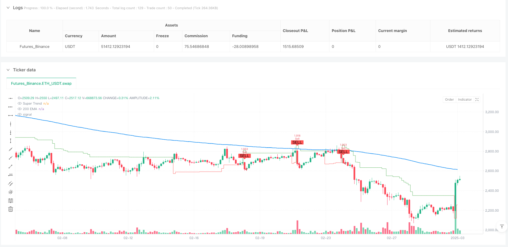
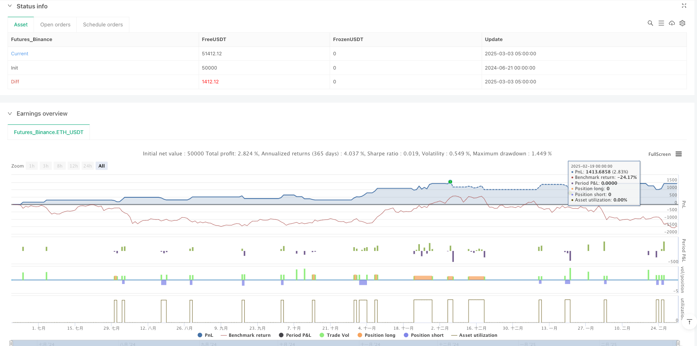

> Name

Multi-Indicator Trend Confirmation Dynamic Take Profit and Stop Loss Trading Strategy-Multi-Indicator-Trend-Confirmation-Dynamic-Risk-Management-Trading-Strategy
> Author

ianzeng123

> Strategy Description





[trans]# Overview
This is a quantitative trading strategy based on multiple indicator confirmations. The core indicator is the SuperTrend, combined with the 200-day exponential moving average (EMA) as trend confirmation, the relative strength index (RSI) as momentum confirmation, and dynamically set stop loss and take profit levels through the average true range (ATR). The strategy uses a multi-layer filtering mechanism to ensure the reliability of trading signals while protecting funds through a flexible risk management system. The strategy design follows the principle of trend tracking and is collaboratively verified by multiple indicators to improve the success rate of transactions.
# Strategy principle
The core principle of this strategy is to filter out low-quality trading signals through collaborative confirmation of multiple layers of indicators while dynamically managing risks:
1. **SuperTrend signal identification**:
   - Identify price breakouts with the SuperTrend indicator (ATR-based trend following indicator)
   - The basis for a buy signal when price breaks above the supertrend line upwards
   - Basics of a sell signal when price breaks below the supertrend line
2. **Trend confirmation mechanism**:
   - Use the 200-day EMA to confirm medium to long-term trend direction
   - The buying condition requires that the price must be above the EMA to ensure that it follows the upward trend.
   - The selling condition requires that the price must be below the EMA to ensure that it follows the downward trend.
3. **Momentum Confirmation Filter**:
   - Verify market momentum with RSI indicator
   - A buy signal requires an RSI greater than 50, confirming upward momentum
   - A sell signal requires RSI to be less than 50, confirming downward momentum
   - You can choose whether to enable RSI filtering function
4. **Dynamic Risk Management**:
   - Dynamically set stop loss positions based on ATR to adapt to market volatility
   - Stop loss for buy trade is set to: current price - (ATR multiplier × ATR value)
   - Stop loss for sell trades is set to: current price + (ATR multiplier × ATR value)
5. **Risk-return ratio control**:
   - Set take-profit targets through fixed multiplier relationships
   - The take-profit level is automatically calculated based on the stop-loss distance, and the default risk-reward ratio is 1:2
The strategy trading logic is clear: the transaction will only be executed when SuperTrend gives a signal and both trend direction (EMA) and market momentum (RSI optional) conditions are met. After entering the market, the system will automatically set stop loss and take profit levels based on the current market volatility to ensure the effectiveness of risk management.
#Strategic advantage
1. **Multiple confirmation filtering mechanism**:
   - Confirmed by SuperTrend, EMA and RSI triple indicators to effectively reduce false signals
   - Multiple layers of filtering ensure you only trade in high-probability trend environments
   - Can significantly reduce losing trades in volatile markets
2. **Adaptive Market Volatility**:
   - ATR-based stop loss settings can automatically adapt to fluctuations in different market conditions
   - Automatically expand the stop loss distance during periods of high volatility, and automatically narrow the stop loss distance during periods of low volatility
   - Avoids the problems of premature exit or excessive risk caused by fixed stop loss
3. **Improved risk management**:
   - Automatically set stop loss and take profit for each transaction, no need for manual monitoring
   - Ensure a good risk-reward ratio through proportional control (default 1:2)
   - Systematic risk control reduces emotional interference
4. **Strategy parameters are flexible and adjustable**:
   - All key parameters can be customized to suit different markets and personal risk preferences
   - You can selectively enable or disable RSI filtering and adjust the strictness of the policy
   - ATR multiplier and take-profit ratio can be optimized according to different market characteristics
5. **Visual trading signals**:
   - The strategy provides clear graphical indicators and trading signal markers
   - The color change of the super trend line visually displays the market trend status
   - Buy and sell signals are clearly marked with arrows to facilitate backtesting analysis
6. **Proper fund management**:
   - By default, each transaction uses a fixed proportion (10%) of the total account value instead of a fixed number of contracts
   - Automatically adjust position size as account size changes to achieve compound interest effect
   - Avoids the capital management problems that may arise from fixed lot trading
#Strategy risk
1. **Lagging reaction to trend turning points**:
   - Both SuperTrend and EMA are lagging indicators and may not respond in time at trend turning points.
   - May face larger retracement in sharp reversal market
   - Mitigation methods: Consider adding short-term momentum indicators or volatility breakout detection mechanisms
2. **Poor market performance due to sideways fluctuations**:
   - The strategy design is based on the concept of trend tracking, which may cause frequent entry and exit in sideways markets without a clear trend.
   - A volatile market may result in consecutive losing trades
   - Mitigation methods: Increase trend strength filtering or pause trading when choppy markets are identified
3. **Fixed RSI threshold limitations**:
   - Using a fixed RSI threshold (50) may not work in all market environments
   - In some skewed markets, RSI remains in the high or low zone for a long time
   - Mitigation method: Consider using adaptive RSI thresholds or RSI change rates rather than absolute levels
4. **Risk of stop loss setting**:
   - Although dynamic stop loss based on ATR has advantages, it may be set too wide in extremely volatile markets
   - A black swan event may directly break the stop loss level
   - Mitigation method: increase the maximum stop loss limit or set up a volatility anomaly detection mechanism
5. **Risk of over-optimization**:
   - The strategy has multiple adjustable parameters, and there is a risk of overfitting historical data.
   - The optimized parameter combination may not be suitable for future markets
   - Mitigation method: Use step-by-step forward testing or segmented verification of parameter robustness
6. **Fund Management Considerations**:
   - Defaulting to 10% of your account may be too risky in some situations
   - Continuous losses may have a greater impact on funds
   - Mitigation method: Adjust position ratio based on strategy backtest performance and personal risk tolerance
# Strategy optimization direction
1. **Increase market environment adaptability**:
   - Develop market type identification function to distinguish trending markets and oscillating markets
   - Dynamically adjust trading parameters in different market environments
   - Reason: Improve the adaptability of strategies under various market conditions and reduce false signals in volatile markets
2. **Introduction of dynamic parameter adjustment**:
   - Automatically adjust SuperTrend factors based on market volatility
   - High volatility markets increase the factor value, low volatility markets reduce the factor value
   - Reason: Avoid the limitations caused by fixed parameters and improve the strategy's ability to respond to market changes
3. **Optimize RSI application**:
   - Replace RSI fixed thresholds with dynamic thresholds or trendline breakouts
   - Consider RSI divergence signals as a secondary indicator
   - Reason: Improve the effectiveness of the RSI indicator in different market environments and increase the robustness of the strategy
4. **Improving the risk management system**:
   - Increased maximum tolerance of retracement control
   - Implement dynamic position adjustment based on volatility
   - Introduce compound stop loss strategy (trailing stop + fixed stop loss)
   - Reason: Multi-level risk control can better protect funds and improve long-term viability
5. **Add time filtering mechanism**:
   -Add trading time window restrictions to avoid low liquidity periods
   - Consider intraday fluctuation pattern analysis
   - Reason: Avoid generating signals during adverse trading periods, improve execution quality and reduce slippage
6. **Enhanced signal quality assessment**:
   - Develop signal strength scoring system, integrating multiple indicators
   - Dynamically adjust position size based on signal quality
   - Reason: Distinguish high-quality and low-quality signals and improve capital allocation efficiency
7. **Consider adding a machine learning component**:
   - Use machine learning methods to optimize parameter combinations
   - Explore the use of neural networks to predict signal reliability
   - Reason: Modern algorithms can mine market patterns that traditional technical indicators cannot capture.
# Summarize
The multi-indicator trend confirmation dynamic stop-profit and stop-loss trading strategy is a quantitative trading system with a complete structure and clear logic. It is confirmed by the triple indicators of SuperTrend, EMA and RSI to form reliable trading signals, while using the dynamic risk management mechanism based on ATR to control the risk of each transaction.
The core advantage of this strategy is that the multi-layer filtering mechanism reduces false signals, the adaptive stop loss setting can cope with different market fluctuation environments, and the complete risk management system ensures the safety of funds. The strategy parameter design is flexible and adjustable, and users can customize it according to different market characteristics and personal risk preferences.
However, the strategy also has inherent risks such as delayed reaction to trend turning points and poor market performance during sideways fluctuations. Future optimization directions may consider adding market environment identification functions, realizing dynamic parameter adjustment, improving RSI application methods, strengthening risk management systems, and adding signal quality assessment mechanisms, etc.
Overall, this is a comprehensive strategy system that balances signal quality and risk control and is suitable for traders who prefer trend following. Through continuous optimization and improvement, this strategy has the potential to become a long-term stable and profitable trading system. || # Overview
This is a quantitative trading strategy based on multiple indicator confirmations, with the SuperTrend indicator as the core component, combined with the 200-day Exponential Moving Average (EMA) for trend confirmation, Relative Strength Index (RSI) for momentum confirmation, and Average True Range (ATR) for dynamically setting stop-loss and take-profit levels. The strategy employs a multi-layered filtering mechanism to ensure the reliability of trading signals while protecting capital through a flexible risk management system. The strategy design follows trend-following principles, using multiple indicators for collaborative verification to improve trade success rates.

# Strategy Principles

The core principle of this strategy is to filter out low-quality trading signals through multi-layered indicator confirmation while dynamically managing risk:

1. **SuperTrend Signal Identification**:
   - Uses the SuperTrend indicator (an ATR-based trend-following indicator) to identify price breakouts
   - Generates basic buy signals when price breaks above the SuperTrend line
   - Generates basic sell signals when price breaks below the SuperTrend line

2. **Trend Confirmation Mechanism**:
   - Uses 200-day EMA to confirm medium to long-term trend direction
   - Buy conditions require price to be above the EMA, ensuring alignment with uptrends
   - Sell conditions require price to be below the EMA, ensuring alignment with downtrends

3. **Momentum Confirmation Filter**:
   - Verifies market momentum using the RSI indicator
   - Buy signals require RSI greater than 50, confirming upward momentum
   - Sell signals require RSI less than 50, confirming downward momentum
   - RSI filtering can be optionally enabled or disabled

4. **Dynamic Risk Management**:
   - Dynamically sets stop-loss positions based on ATR, adapting to market volatility
   - Buy trade stop-loss is set at: Current price - (ATR multiplier × ATR value)
   - Sell trade stop-loss is set at: Current price + (ATR multiplier × ATR value)

5. **Risk-Reward Ratio Control**:
   - Sets take-profit targets using a fixed multiplier relationship
   - Take-profit levels are automatically calculated based on stop-loss distance, with a default risk-reward ratio of 1:2

The strategy's trading logic is clear: trades are executed only when SuperTrend gives a signal and simultaneously meets trend direction (EMA) and market momentum (optional RSI) conditions. After entry, the system automatically sets stop-loss and take-profit levels based on current market volatility, ensuring effective risk management.

# Strategy Advantages

1. **Multiple Confirmation Filtering Mechanism**:
   - Effectively reduces false signals through triple confirmation with SuperTrend, EMA, and RSI
   - Multi-layered filtering ensures trading only in high-probability trend environments
   - Significantly reduces losing trades in choppy markets

2. **Adaptation to Market Volatility**:
   - ATR-based stop-loss settings automatically adapt to volatility in different market conditions
   - Automatically widens stop-loss distance during high volatility periods and narrows it during low volatility periods
   - Avoids the problems of premature exits or excessive risk caused by fixed stop-losses

3. **Comprehensive Risk Management**:
   - Automatically sets stop-loss and take-profit for each trade, eliminating the need for manual monitoring
   - Ensures favorable risk-reward ratios through proportional control (default 1:2)
   - Systematic risk control reduces emotional interference

4. **Flexible Strategy Parameters**:
   - All key parameters can be customized to adapt to different markets and personal risk preferences
   - RSI filtering can be optionally enabled or disabled to adjust strategy strictness
   - ATR multipliers and take-profit ratios can be optimized according to different market characteristics

5. **Visualization of Trading Signals**:
   - Strategy provides clear graphical indicators and trade signal markers
   - SuperTrend line color changes intuitively display market trend status
   - Buy and sell signals are clearly marked with arrows for backtesting analysis

6. **Rational Capital Management**:
   - By default, each trade uses a fixed percentage of the account equity (10%) rather than a fixed contract quantity
   - Position sizes automatically adjust with changes in account size, achieving compound growth
   - Avoids potential capital management issues associated with fixed lot trading

# Strategy Risks

1. **Delayed Reaction at Trend Reversal Points**:
   - Both SuperTrend and EMA are lagging indicators that may not respond promptly at trend reversal points
   - May face significant drawdowns in rapidly reversing markets
   - Mitigation: Consider adding short-term momentum indicators or volatility breakout detection mechanisms

2. **Poor Performance in Sideways Markets**:
   - The strategy design is based on trend-following principles and may result in frequent entries and exits in sideways markets with no clear trend
   - May produce consecutive losing trades in choppy markets
   - Mitigation: Add trend strength filtering or pause trading when sideways markets are identified

3. **Limitations of Fixed RSI Threshold**:
   - Using a fixed RSI threshold (50) may not be suitable for all market environments
   - In certain biased markets, RSI may remain in high or low zones for extended periods
   - Mitigation: Consider using adaptive RSI thresholds or RSI rate of change rather than absolute levels

4. **Stop-Loss Setting Risks**:
   - Although dynamic stop-losses based on ATR have advantages, they may be set too wide in extremely volatile markets
   - Black swan events may directly breach stop-loss levels
   - Mitigation: Add maximum stop-loss limits or implement volatility anomaly detection mechanisms

5. **Over-Optimization Risk**:
   - The strategy has multiple adjustable parameters, creating a risk of overfitting historical data
   - Optimized parameter combinations may not be applicable to future markets
   - Mitigation: Use step-forward testing or segmented validation to ensure parameter robustness

6. **Capital Management Considerations**:
   - Using a default 10% account equity per trade may be too risky in some situations
   - Consecutive losses could significantly impact capital
   - Mitigation: Adjust position sizing based on strategy backtest performance and personal risk tolerance

# Strategy Optimization Directions

1. **Enhance Market Environment Adaptability**:
   - Develop market type identification functionality to distinguish between trending and ranging markets
   - Dynamically adjust trading parameters in different market environments
   - Rationale: Improve strategy adaptability across various market conditions and reduce false signals in ranging markets

2. **Implement Dynamic Parameter Adjustments**:
   - Automatically adjust SuperTrend factors based on market volatility
   - Increase factor values in high-volatility markets and decrease them in low-volatility markets
   - Rationale: Avoid limitations of fixed parameters and improve strategy responsiveness to market changes

3. **Optimize RSI Application Method**:
   - Replace fixed RSI thresholds with dynamic thresholds or trendline breakouts
   - Consider RSI divergence signals as auxiliary indicators
   - Rationale: Enhance RSI indicator effectiveness across different market environments and increase strategy robustness

4. **Enhance Risk Management System**:
   - Add maximum drawdown control
   - Implement volatility-based dynamic position sizing
   - Introduce compound stop-loss strategies (trailing stops + fixed stops)
   - Rationale: Multi-level risk control can better protect capital and improve long-term survival ability

5. **Add Time Filtering Mechanism**:
   - Add trading time window restrictions to avoid low liquidity periods
   - Consider intraday volatility pattern analysis
   - Rationale: Avoid generating signals during unfavorable trading sessions, improve execution quality, and reduce slippage

6. **Enhance Signal Quality Assessment**:
   - Develop a signal strength scoring system integrating multiple indicators
   - Dynamically adjust position sizes based on signal quality
   - Rationale: Differentiate between high and low-quality signals and improve capital allocation efficiency

7. **Consider Adding Machine Learning Components**:
   - Use machine learning methods to optimize parameter combinations
   - Explore using neural networks to predict signal reliability
   - Rationale: Modern algorithms can uncover market patterns that traditional technical indicators cannot capture

# Summary

The Multi-Indicator Trend Confirmation Dynamic Risk Management Trading Strategy is a well-structured, logically sound quantitative trading system. It forms reliable trading signals through triple confirmation with SuperTrend, EMA, and RSI indicators, while controlling risk for each trade using an ATR-based dynamic risk management mechanism.

The core advantages of this strategy lie in its multi-layered filtering mechanism that reduces false signals, adaptive stop-loss settings that handle different market volatility environments, and comprehensive risk management system that ensures capital protection. The strategy parameters are designed to be flexible and adjustable, allowing users to customize according to different market characteristics and personal risk preferences.

However, the strategy also has inherent risks such as delayed reactions at trend reversal points and poor performance in sideways markets. Future optimization directions may include adding market environment identification functionality, implementing dynamic parameter adjustments, improving RSI application methods, enhancing the risk management system, and adding signal quality assessment mechanisms.

Overall, this is a comprehensive strategy system that balances signal quality and risk control, suitable for traders who prefer trend following. Through continuous optimization and improvement, this strategy has the potential to become a long-term, consistently profitable trading system.[/trans]


> Source (PineScript)

``` pinescript
/*backtest
start: 2024-06-21 00:00:00
end: 2025-03-03 08:00:00
period: 3h
basePeriod: 3h
exchanges: [{"eid":"Futures_Binance","currency":"ETH_USDT"}]
*/

//@version=6
strategy("Super Trend with EMA, RSI & Signals", overlay=true, default_qty_type=strategy.percent_of_equity, default_qty_value=10)

// Super Trend Indicator
atrLength = input.int(10, title="ATR Length")
factor = input.float(3.0, title="Super Trend Multiplier")
[st, direction] = ta.supertrend(factor, atrLength)

// 200 EMA for Trend Confirmation
emaLength = input.int(200, title="EMA Length")
ema200 = ta.ema(close, emaLength)

// RSI for Momentum Confirmation
rsiLength = input.int(14, title="RSI Length")
rsi = ta.rsi(close, rsiLength)
useRSIFilter = input.bool(true, title="Use RSI Filter?")
rsiThreshold = 50

// Buy & Sell Conditions
buyCondition = ta.crossover(close, st) and close > ema200 and (not useRSIFilter or rsi > rsiThreshold)
sellCondition = ta.crossunder(close, st) and close < ema200 and (not useRSIFilter or rsi < rsiThreshold)

// Stop Loss & Take Profit (Based on ATR)
atrMultiplier = input.float(1.5, title="ATR Stop Loss Multiplier")
atrValue = ta.atr(atrLength)
stopLossBuy = close - (atrMultiplier * atrValue)
stopLossSell = close + (atrMultiplier * atrValue)
takeProfitMultiplier = input.float(2.0, title="Take Profit Multiplier")
takeProfitBuy = close + (takeProfitMultiplier * (close - stopLossBuy))
takeProfitSell = close - (takeProfitMultiplier * (stopLossSell - close))

// Execute Trades
if buyCondition
    strategy.entry("Buy", strategy.long)
    strategy.exit("Take Profit Buy", from_entry="Buy", limit=takeProfitBuy, stop=stopLossBuy)

if sellCondition
    strategy.entry("Sell", strategy.short)
    strategy.exit("Take Profit Sell", from_entry="Sell", limit=takeProfitSell, stop=stopLossSell)

// Plot Indicators
plot(ema200, title="200 EMA", color=color.blue, linewidth=2)
plot(st, title="Super Trend", color=(direction == 1 ? color.green : color.red), style=plot.style_stepline)

// Plot Buy & Sell Signals as Arrows
plotshape(series=buyCondition, location=location.belowbar, color=color.green, style=shape.labelup, title="Buy Signal", text="BUY")
plotshape(series=sellCondition, location=location.abovebar, color=color.red, style=shape.labeldown, title="Sell Signal", text="SELL")

```

> Detail

https://www.fmz.com/strategy/484921

> Last Modified

2025-03-05 10:19:52
