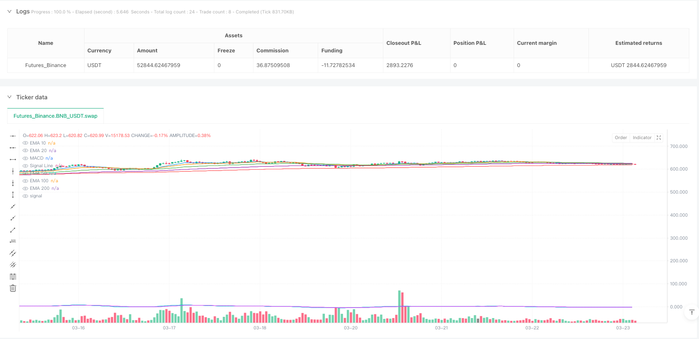
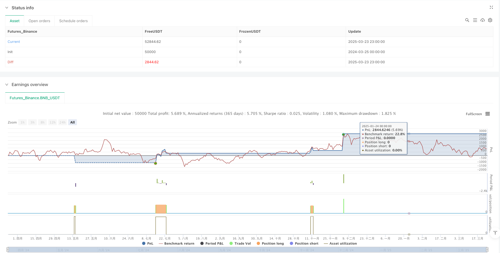

> Name

Multi-Indicator Trend Confirmation High-Profit-Quantitative-Trading-Strategy
> Author

ianzeng123

> Strategy Description





[trans]

### Overview
This strategy is a comprehensive quantitative trading system that aims to capture strong market trends and achieve high returns through multi-level indicator confirmation and strict trading condition screening. The core logic is based on the collaborative confirmation mechanism of multiple indicators, including five exponential moving averages (EMA) of different periods, the relative strength index (RSI), the moving average convergence and divergence indicator (MACD), and trading volume analysis. Combined with market trend judgment, a complete multi-dimensional analysis framework is formed. The strategy adopts a high entry threshold to ensure transaction quality, and at the same time sets conservative stop loss and aggressive take profit ratios to achieve high return targets under risk control.
### Strategy Principles
The technical implementation of the strategy is based on the comprehensive judgment of multiple indicator systems:
1. **Multi-period moving average system**: It uses 5 exponential moving averages with different periods (10, 20, 50, 100, 200) to form a complete trend analysis system from short-term to long-term. Entry signals require price to be above all medium and long-term moving averages, ensuring trading in a strong trend.
2. **Trend Confirmation Mechanism**: By calculating the midpoint of the highest price and lowest price within a 50-period period, we can determine the macro trend direction of the current market and only conduct transactions in the corresponding direction when the trend is clear.
3. **Momentum and Divergence Analysis**: Use the RSI indicator to monitor market momentum, only go long when the RSI is in the strong area (>55), and go short when the RSI is in the weak area (<45), to avoid contrarian trading.
4. **Signal Confirmation System**: Use MACD Golden Cross/Death Cross as additional trading confirmation conditions to ensure the consistency of momentum and trend.
5. **Volume and price combined analysis**: Introduce trading volume conditions, requiring that the trading volume when a trading signal appears must be higher than 1.5 times the 20-day average trading volume, and screen out strong breakthroughs with market recognition.
The entry conditions are based on all the above indicators. Only when the short-term moving average (EMA10) crosses the medium-term moving average (EMA20), and the price is above all medium and long-term moving averages, the RSI is greater than 55, the market is in an upward trend, the MACD shows a golden cross, and the trading volume is enlarged, the long signal will be triggered. Exit conditions, on the other hand, ensure entry quality and multiple confirmations.
### Strategic Advantages
By deeply analyzing the code, this strategy offers the following significant advantages:
1. **Multiple filtering mechanism**: Through the collaborative confirmation of multiple independent indicators, the probability of false signals is greatly reduced and the accuracy of transactions is improved.
2. **Adapt to the market environment**: The strategy has a built-in market trend judgment mechanism and only trades in favorable market environments to avoid frequent transactions and losses in volatile market conditions.
3. **Risk-return ratio optimization**: 2% stop loss and 100% take-profit are set, and the risk-return ratio is 1:50. Even if the winning rate is not high, the long-term expected value may still be positive.
4. **Volume and price combined verification**: Through the verification of trading volume conditions, it is ensured that transactions occur at moments of high market participation, increasing the reliability of breakthroughs.
5. **Visual analysis support**: The strategy provides a wealth of visual indicators, including graphical displays of moving averages and MACD indicators for each period, to facilitate real-time monitoring and judgment by traders.
6. **Fund Management Optimization**: The strategy defaults to using 30% of the total account value for transactions, which avoids the risks caused by excessive leverage while ensuring sufficient positions.
### Strategy Risk
Although this strategy has multiple advantages, there are still potential risks:
1. **Over-optimization risk**: The strategy uses many conditions for filtering, which may lead to overfitting of historical data, and the performance in the real trading environment may not be as good as the backtest results. The solution is to conduct adequate backtest verification under different time periods and market environments.
2. **Signal scarcity problem**: Strict entry conditions may result in fewer trading signals, and in some market environments, trading opportunities may not be available for a long time. You can consider appropriately relaxing certain conditions or adding other trading strategies as a supplement.
3. **The take-profit target is too high**: The 100% take-profit target set may be difficult to achieve in actual transactions, resulting in the failure of most transactions to achieve expected returns. It is recommended to dynamically adjust the profit-taking level according to different market environments.
4. **Moving average hysteresis**: The strategy uses a large number of moving average indicators. These indicators are lagging in nature and may miss the best entry opportunity or delay exit. Consider introducing some leading indicators to balance this shortcoming.
5. **Lack of retracement control**: The strategy does not set a maximum retracement limit or a floating loss closing mechanism, and you may face large losses when the market reverses quickly. It is recommended to add dynamic stop loss or set a maximum retracement limit.
### Strategy optimization direction
Based on an in-depth analysis of the strategy, the following are possible optimization directions:
1. **Dynamic parameter adjustment**: An adaptive parameter mechanism can be introduced to automatically adjust the EMA cycle, RSI threshold and trading volume multiple according to market volatility, so that the strategy can better adapt to different market environments.
2. **Building and closing positions in batches**: Improve the current one-time position opening model to achieve batch opening and profit taking, which can not only reduce the risk of a single price point, but also lock in part of the profit.
3. **Added market status classification**: Refine the judgment of market trends and divide the market status into multiple states such as strong rise, weak rise, range oscillation, weak fall, and strong fall. Different trading parameters are used for different states.
4. **Integrated volatility indicators**: Introduce volatility indicators such as ATR (average true volatility) to dynamically adjust stop loss positions and position sizes to achieve more sophisticated risk management.
5. **Optimize fund management**: Adjust the fund proportion of each transaction based on the Kelly formula or fixed risk model, instead of using a fixed 30% of account funds, to achieve more scientific fund management.
6. **Add time filtering**: Introduce trading time filtering to avoid periods of high volatility but unclear direction and improve transaction quality.
7. **Introduce machine learning models**: Consider using machine learning methods such as decision trees or neural networks to dynamically evaluate the reliability of current trading signals based on historical data as additional trading filtering conditions.
### Summarize
This quantitative trading strategy builds a comprehensive trading decision-making system through the collaborative confirmation of multiple indicators. The core advantage of the strategy lies in the strict signal filtering mechanism and clear trading logic, which helps capture high-quality trading opportunities in strong trending markets. Through five different periods of EMA, RSI momentum indicator, MACD trend confirmation and trading volume verification, a multi-level protection network is formed, which effectively reduces the possibility of wrong transactions.
However, the strategy also has potential problems such as over-optimization and signal scarcity, which require continuous monitoring and adjustment in practical applications. Future optimization directions should focus on improving the adaptability of the strategy, including introducing dynamic parameters, batch trading, optimizing fund management, and integrating more dimensions of market information.
By combining trend tracking and multi-indicator confirmation methods, this strategy provides traders with a quantitative trading framework that balances risk and return, and is particularly suitable for application in market environments with clear directionality. ||
### Overview

This strategy is a comprehensive quantitative trading system that aims to capture strong market trends and achieve high returns through multi-level indicator confirmation and strict trading condition filtering. The core logic is based on a collaborative confirmation mechanism of multiple indicators, including five Exponential Moving Averages (EMAs) of different periods, Relative Strength Index (RSI), Moving Average Convergence Divergence (MACD), and volume analysis, combined with market trend judgment to form a complete multi-dimensional analysis framework. The strategy employs a high entry threshold to ensure trade quality, while setting conservative stop-loss and aggressive take-profit ratios to achieve high returns under controlled risk.

### Strategy Principles

The technical implementation of the strategy is based on comprehensive judgment from a multi-indicator system:

1. **Multi-period Moving Average System**: Uses 5 different period (10, 20, 50, 100, 200) exponential moving averages, forming a complete trend analysis system from short to long term. Entry signals require price to be above all medium and long-term moving averages, ensuring trading in strong trends.

2. **Trend Confirmation Mechanism**: Determines the macro trend direction of the current market by calculating the midpoint between the highest and lowest prices within 50 periods, only trading in the corresponding direction when the trend is clear.

3. **Momentum and Divergence Analysis**: Uses the RSI indicator to monitor market momentum, only going long when RSI is in the strong zone (>55) and short when in the weak zone (<45), avoiding counter-trend trading.

4. **Signal Confirmation System**: Uses MACD golden cross/death cross as additional trade confirmation conditions, ensuring consistency of momentum and trend.

5. **Volume-Price Combined Analysis**: Introduces volume conditions, requiring the volume when trading signals appear to be at least 1.5 times higher than the 20-day average volume, filtering out strong breakouts with market recognition.

Entry conditions combine all the above indicators, triggering a long signal only when the short-term moving average (EMA10) crosses above the medium-term moving average (EMA20), price is above all medium and long-term moving averages, RSI is greater than 55, market is in an uptrend, MACD shows a golden cross, and volume expands. Exit conditions are the opposite, ensuring entry quality and multiple confirmations.

### Strategy Advantages

Through in-depth code analysis, this strategy has the following significant advantages:

1. **Multiple Filtering Mechanisms**: The collaborative confirmation of multiple independent indicators greatly reduces the probability of false signals and improves trading precision.

2. **Market Environment Adaptation**: The strategy has a built-in market trend judgment mechanism, trading only in favorable market environments, avoiding frequent trading and losses in oscillating markets.

3. **Optimized Risk-Reward Ratio**: Sets a 2% stop-loss and 100% take-profit, with a risk-reward ratio of 1:50, meaning that even with a lower win rate, the long-term expected value can still be positive.

4. **Volume-Price Validation**: Through volume condition validation, ensures that trading occurs at moments of high market participation, increasing the reliability of breakouts.

5. **Visual Analysis Support**: The strategy provides rich visualization of indicators, including graphical display of various period moving averages and MACD indicators, facilitating real-time monitoring and judgment by traders.

6. **Capital Management Optimization**: The strategy uses 30% of the account value by default for trading, ensuring sufficient position while avoiding the risk of excessive leverage.

### Strategy Risks

Despite its multiple advantages, the strategy still has the following potential risks:

1. **Over-optimization Risk**: The strategy uses numerous conditions for filtering, which may lead to overfitting historical data, and its performance in live trading may not match backtesting results. The solution is to conduct thorough backtesting validation across different time periods and market environments.

2. **Signal Scarcity Problem**: Strict entry conditions may lead to fewer trading signals, potentially resulting in long periods without trading opportunities in certain market environments. Consider appropriately relaxing certain conditions or adding other trading strategies as supplements.

3. **Excessively High Take-Profit Target**: The 100% take-profit target set may be difficult to achieve in actual trading, causing most trades to fail to achieve expected returns. It is recommended to dynamically adjust take-profit levels according to different market environments.

4. **Moving Average Lag**: The strategy heavily uses moving average indicators, which inherently have lag, potentially missing optimal entry points or delaying exits. Consider introducing some leading indicators to balance this disadvantage.

5. **Lack of Drawdown Control**: The strategy does not set maximum drawdown limits or floating loss closing mechanisms, potentially facing significant losses in rapid market reversals. Adding dynamic stop-loss or setting maximum drawdown limits is recommended.

### Strategy Optimization Directions

Based on deep analysis of the strategy, the following are potential optimization directions:

1. **Dynamic Parameter Adjustment**: Introduce adaptive parameter mechanisms to automatically adjust EMA periods, RSI thresholds, and volume multiples based on market volatility, allowing the strategy to better adapt to different market environments.

2. **Phased Position Building and Closing**: Improve the current one-time position building model to implement phased position building and phased take-profit, reducing the risk at single price points while securing partial profits.

3. **Enhanced Market State Classification**: Refine market trend judgment by classifying market states into strong uptrend, weak uptrend, range-bound, weak downtrend, and strong downtrend, applying different trading parameters for different states.

4. **Integration of Volatility Indicators**: Introduce volatility indicators such as ATR (Average True Range) for dynamic adjustment of stop-loss positions and position sizes, achieving more refined risk management.

5. **Optimized Capital Management**: Adjust the proportion of funds for each trade based on the Kelly formula or fixed risk model, rather than consistently using 30% of account funds, implementing more scientific capital management.

6. **Addition of Time Filtering**: Introduce trading time filtering to avoid periods with high volatility but unclear direction, improving trade quality.

7. **Introduction of Machine Learning Models**: Consider using machine learning methods such as decision trees or neural networks to dynamically assess the reliability of current trading signals based on historical data, serving as additional trade filtering conditions.

### Summary

This quantitative trading strategy builds a comprehensive trading decision system through multi-indicator collaborative confirmation. The core advantages of the strategy lie in its strict signal filtering mechanism and clear trading logic, helping to capture high-quality trading opportunities in strong trend markets. Through five EMAs of different periods, RSI momentum indicator, MACD trend confirmation, and volume verification, it forms a multi-layered safety net, effectively reducing the possibility of erroneous trades.

However, the strategy also has potential issues such as over-optimization and signal scarcity, requiring continuous monitoring and adjustment in practical applications. Future optimization directions should focus on improving the strategy's adaptability, including introducing dynamic parameters, phased trading, optimizing capital management, and integrating more dimensions of market information.

By combining trend following with multi-indicator confirmation methods, this strategy provides traders with a quantitative trading framework that balances risk and return, particularly suitable for application in market environments with clear directionality.[/trans]


> Source (PineScript)

``` pinescript
/*backtest
start: 2024-03-25 00:00:00
end: 2025-03-24 00:00:00
period: 1h
basePeriod: 1h
exchanges: [{"eid":"Futures_Binance","currency":"BNB_USDT"}]
*/

//@version=5
strategy("Solana Max Profit Strategy", overlay=true, default_qty_type=strategy.percent_of_equity, default_qty_value=30)

// Definition of Exponential Moving Averages (EMAs)
ema10 = ta.ema(close, 10)
ema20 = ta.ema(close, 20)
ema50 = ta.ema(close, 50)
ema100 = ta.ema(close, 100)
ema200 = ta.ema(close, 200)

// Relative Strength Index (RSI)
rsi = ta.rsi(close, 14)

// MACD for confirmation
[macdLine, signalLine, _] = ta.macd(close, 12, 26, 9)

// Volume for trend validation
vol_ma = ta.sma(volume, 20)
strong_volume = volume > vol_ma * 1.5

// Market trend identification
higher_high = ta.highest(high, 50)
lower_low = ta.lowest(low, 50)
trend = close > (higher_high + lower_low) / 2 ? 1 : -1

// Optimized Buy Conditions
long_condition = ta.crossover(ema10, ema20) and close > ema50 and close > ema100 and close > ema200 and rsi > 55 and trend == 1 and ta.crossover(macdLine, signalLine) and strong_volume

// Optimized Sell Conditions
short_condition = ta.crossunder(ema10, ema20) and close < ema50 and close < ema100 and close < ema200 and rsi < 45 and trend == -1 and ta.crossunder(macdLine, signalLine) and strong_volume

// Execution of trades
if long_condition
    strategy.entry("Buy", strategy.long)

if short_condition
    strategy.close("Buy")

// Adjusted Stop Loss and Take Profit
stop_loss = close * 0.98  // Risk reduction
profit_target = close * 2.0  // Maximizing gains
strategy.exit("Take Profit", from_entry="Buy", limit=profit_target, stop=stop_loss)

// Visual signals
plot(ema10, color=color.blue, title="EMA 10")
plot(ema20, color=color.orange, title="EMA 20")
plot(ema50, color=color.green, title="EMA 50")
plot(ema100, color=color.purple, title="EMA 100")
plot(ema200, color=color.red, title="EMA 200")
plot(macdLine, color=color.aqua, title="MACD")
plot(signalLine, color=color.fuchsia, title="Signal Line")

```

> Detail

https://www.fmz.com/strategy/488128

> Last Modified

2025-03-25 11:36:57
