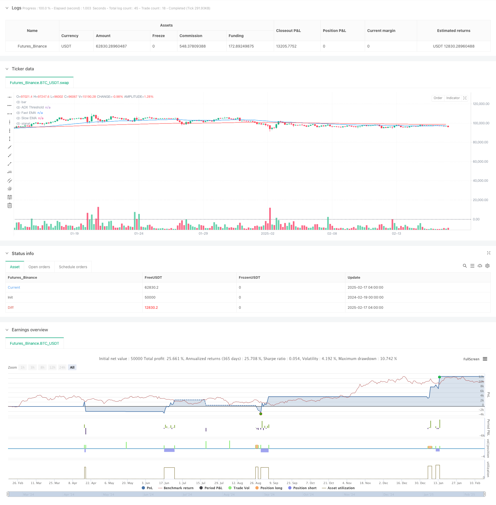

> Name

Multi-Indicator-Trend-Following-Enhanced-Quantitative-Trading-Strategy
> Author

ChaoZhang

> Strategy Description



[trans]
#### Overview
This strategy is a trend following strategy based on multiple technical indicators. It integrates multiple technical indicators such as the Moving Average (EMA), the Average Trend Index (ADX) and the Relative Strength Index (RSI), and combines multiple time frame analysis methods. The strategy mainly confirms the trend direction through the intersection of fast and slow EMA, uses ADX to filter trend strength, and uses RSI to judge market momentum, thereby conducting high-frequency trading on the 1-minute chart. The backtest results show that this strategy has a winning rate of 76.92% and a profit factor of 1.819, showing good profitability.
#### Strategy Principle
Strategy operation is based on the following core mechanisms:
1. Use the 50-period and 200-period EMA to identify the trend direction, and confirm the entry signal through the intersection of the fast line and the slow line.
2. Use the ADX indicator (14 periods) to evaluate the trend strength, and only enter the market when ADX is greater than 25 to avoid market shocks.
3. Conduct momentum analysis based on the RSI indicator (14 periods). Consider going long when the RSI is lower than 30 and short when the RSI is higher than 70.
4. Introduce EMA analysis of the 4-hour time frame and enhance the reliability of trend judgment through multi-time frame confirmation.
5. Set dynamic stop-profit and stop-loss. When going long, the stop-profit is located at 5% of the entry price, and the stop-loss is located at 2%; when going short, the corresponding inverse is set.
#### Strategic Advantages
1. Multi-indicator cross-validation significantly improves signal reliability
2. Have a complete risk control mechanism, including dynamic stop loss and volatility-based position management
3. Use multi-time frame analysis to effectively reduce the risk of false breakthroughs
4. High winning rate and moderate profit-loss ratio, with good expected returns
5. The strategy logic is clear and easy to understand and maintain.
#### Strategy Risk
1. Rapid and severe market fluctuations may cause stop loss to become ineffective
2. Sideways market fluctuations may result in frequent transactions and increase transaction costs.
3. The EMA indicator itself has hysteresis and may miss the best entry opportunity.
4. Multiple indicators can produce conflicting signals
5. 1-minute cycle trading requires higher execution speed and may face the risk of slippage
#### Strategy optimization direction
1. Optimize ADX smoothing parameters to improve trend identification accuracy
2. Introduce dynamic position management based on ATR to better adapt to market fluctuations
3. Increase the dimension of trading volume analysis and improve signal reliability
4. Consider adding market environment classification and using different parameter combinations under different market conditions.
5. You can try to integrate machine learning algorithms and optimize parameter selection
#### Summary
This strategy builds a robust trend tracking system through the synergy of multiple technical indicators. While maintaining a high winning rate, the strategy has achieved considerable returns through a complete risk control mechanism. Although there is some room for optimization, the overall performance is satisfactory and is especially suitable for traders who pursue steady returns. ||
#### Overview
This strategy is a trend-following system that integrates multiple technical indicators including Exponential Moving Average (EMA), Average Directional Index (ADX), and Relative Strength Index (RSI), combined with multi-timeframe analysis. The strategy primarily uses fast and slow EMA crossovers to confirm trend direction, ADX for trend strength filtering, and RSI for momentum analysis, operating on a 1-minute chart for high-frequency trading. Backtesting results show a win rate of 76.92% and a profit factor of 1.819, demonstrating strong profitability.

#### Strategy Principles
The strategy operates based on the following core mechanisms:
1. Uses 50-period and 200-period EMAs to identify trend direction, confirming entry signals through fast and slow line crossovers
2. Employs ADX indicator (14-period) to evaluate trend strength, entering only when ADX is above 25 to avoid choppy markets
3. Incorporates RSI indicator (14-period) for momentum analysis, considering long positions when RSI is below 30 and short positions above 70
4. Introduces 4-hour timeframe EMA analysis to enhance trend confirmation through multi-timeframe analysis
5. Implements dynamic take-profit and stop-loss levels, with take-profit at 5% and stop-loss at 2% for long positions, reversed for shorts

#### Strategy Advantages
1. Multiple indicator cross-validation significantly improves signal reliability
2. Comprehensive risk management including dynamic stop-loss and volatility-based position sizing
3. Multi-timeframe analysis effectively reduces false breakout risks
4. High win rate and moderate risk-reward ratio providing good expected returns
5. Clear strategy logic that is easy to understand and maintain

#### Strategy Risks
1. Rapid market movements may render stop-losses ineffective
2. Ranging markets may generate frequent trades, increasing transaction costs
3. EMA indicators have inherent lag, potentially missing optimal entry points
4. Multiple indicators may generate conflicting signals
5. 1-minute timeframe trading requires high execution speed, facing potential slippage risks

#### Strategy Optimization Directions
1. Optimize ADX smoothing parameters to improve trend identification accuracy
2. Implement ATR-based dynamic position sizing for better volatility adaptation
3. Add volume analysis dimension to enhance signal reliability
4. Consider market environment classification for different parameter sets under various market conditions
5. Explore machine learning integration for parameter optimization

#### Summary
This strategy constructs a robust trend-following system through the synergy of multiple technical indicators. While maintaining a high win rate, it achieves considerable returns through comprehensive risk management mechanisms. Although there is room for optimization, the overall performance is satisfactory, particularly suitable for traders seeking steady returns.[/trans]


> Source (PineScript)

``` pinescript
/*backtest
start: 2024-02-19 00:00:00
end: 2025-02-17 08:00:00
period: 4h
basePeriod: 4h
exchanges: [{"eid":"Futures_Binance","currency":"BTC_USDT"}]
*/

//@version=5
strategy("Enhanced Trend Following Strategy", overlay=true, default_qty_type=strategy.percent_of_equity, default_qty_value=200)

// === INPUTS ===
emaFastLength = input(50, title="Fast EMA Length")
emaSlowLength = input(200, title="Slow EMA Length")
adxLength = input(14, title="ADX Length")
adxSmoothing = input(14, title="ADX Smoothing")
adxThreshold = input(25, title="ADX Threshold")
rsiLength = input(14, title="RSI Length")
rsiOverbought = input(70, title="RSI Overbought Level")
rsiOversold = input(30, title="RSI Oversold Level")

// === INDICATORS ===
emaFast = ta.ema(close, emaFastLength)
emaSlow = ta.ema(close, emaSlowLength)
[dip, dim, adxValue] = ta.dmi(adxLength, adxSmoothing)
rsiValue = ta.rsi(close, rsiLength)

// === MULTI-TIMEFRAME EMA ===
emaFastHTF = request.security(syminfo.tickerid, "240", ta.ema(close, emaFastLength))
emaSlowHTF = request.security(syminfo.tickerid, "240", ta.ema(close, emaSlowLength))

// === CONDITIONS ===
bullishTrend = ta.crossover(emaFast, emaSlow) and adxValue > adxThreshold and rsiValue > rsiOversold
bearishTrend = ta.crossunder(emaFast, emaSlow) and adxValue > adxThreshold and rsiValue < rsiOverbought

// === TRADE EXECUTION ===
if (bullishTrend)
    strategy.entry("Long", strategy.long)
    strategy.exit("TakeProfit_Long", from_entry="Long", limit=close * 1.05, stop=close * 0.98)

if (bearishTrend)
    strategy.entry("Short", strategy.short)
    strategy.exit("TakeProfit_Short", from_entry="Short", limit=close * 0.95, stop=close * 1.02)

// === PLOT INDICATORS ===
plot(emaFast, color=color.blue, title="Fast EMA")
plot(emaSlow, color=color.red, title="Slow EMA")
hline(adxThreshold, "ADX Threshold", color=color.gray, linestyle=hline.style_dotted)

bgcolor(bullishTrend ? color.green : bearishTrend ? color.red : na, transp=90)

// === ALERTS ===
alertcondition(bullishTrend, title="Buy Signal", message="A bullish trend detected!")
alertcondition(bearishTrend, title="Sell Signal", message="A bearish trend detected!")

// === STRATEGY SETTINGS ===
strategy.close("Long", when=rsiValue > rsiOverbought)
strategy.close("Short", when=rsiValue < rsiOversold)

```

> Detail

https://www.fmz.com/strategy/482602

> Last Modified

2025-02-19 11:30:19
