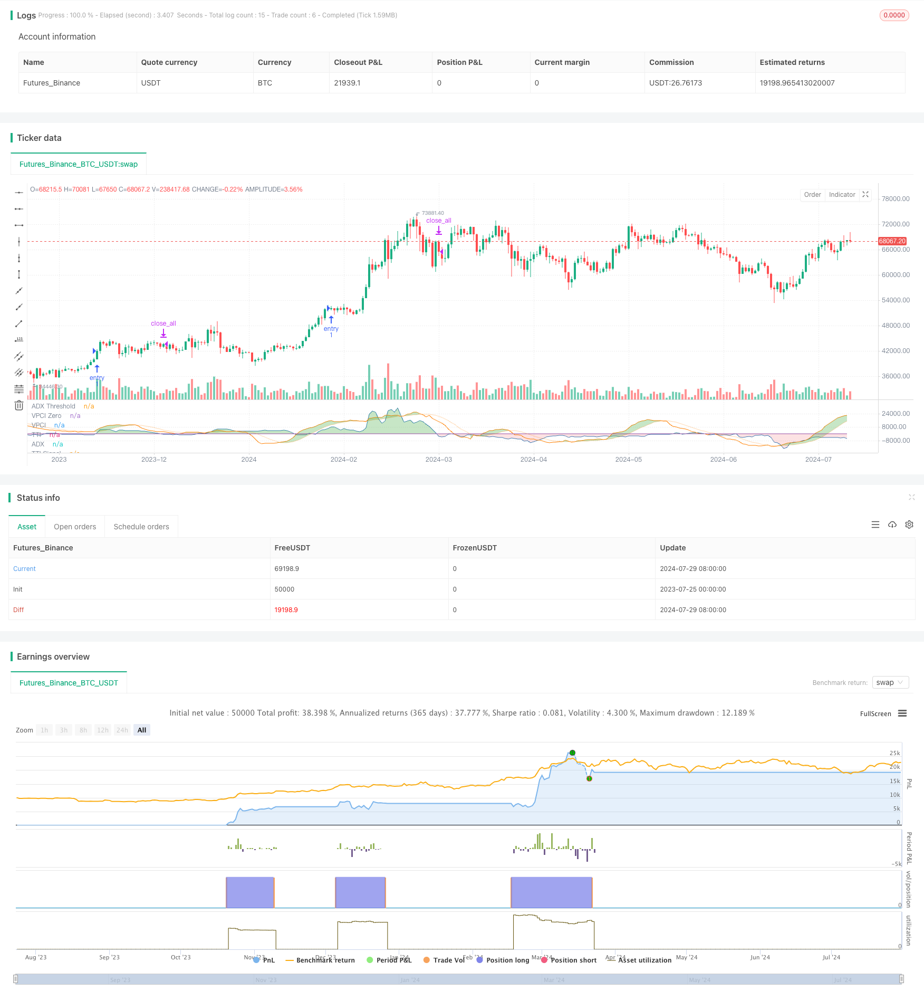

> Name

Multi-Indicator-Trend-Following-with-Volume-Confirmation-Strategy
> Author

ChaoZhang

> Strategy Description


[trans]

#### Overview
This strategy is a trend following system that combines multiple technical indicators and is designed to capture strong trends in the market through comprehensive analysis of price and volume data. This strategy is mainly based on three core indicators: average trend index (ADX), trend thrust indicator (TTI) and volume price confirmation indicator (VPCI), and uses their synergy to identify potential trend opportunities and make trading decisions.
The core idea of ​​the strategy is to use ADX to confirm the existence and strength of the trend, use TTI to determine the direction and momentum of the trend, and finally use VPCI to verify whether the price trend is supported by trading volume. Only when these three indicators meet specific conditions at the same time, the strategy will issue an entry signal. This multiple confirmation mechanism is designed to improve the accuracy and reliability of transactions and reduce the occurrence of false signals.
#### Strategy Principle
1. ADX (Average Trend Index):
   - Used to measure the strength of a market trend, regardless of trend direction.
   - When ADX is greater than 30, a strong trend is considered present.
2. TTI (Trend Thrust Indicator):
   - Similar to MACD, but incorporates volume weights.
   - Determine trend direction and strength by comparing fast and slow volume weighted moving averages (VWMA).
   - When the TTI line is above the signal line, it indicates an uptrend.
3. VPCI (Volume Price Confirmation Index):
   - Combines price and volume data to confirm whether price movements are supported by volume.
   - When VPCI is greater than 0, it means that the price trend is confirmed by trading volume.
Strategy logic:
- Entry conditions: ADX > 30 and TTI > Signal Line and VPCI > 0
- Exit conditions: VPCI < 0
This design ensures that entries are only entered if there is a strong trend (confirmed by ADX), the trend direction is upward (confirmed by TTI), and the price action is supported by volume (confirmed by VPCI). When volume no longer supports the price trend (VPCI < 0), the strategy will immediately close the position to protect the profits earned.
#### Strategic Advantages
1. Multiple confirmation mechanism: By comprehensively considering trend strength, direction and trading volume support, the risk of misjudgment is greatly reduced and the reliability of transactions is improved.
2. Dynamically adapt to the market: Strategies can be dynamically adjusted according to changes in market conditions and are suitable for different market environments.
3. Volume integration: Taking volume factors into consideration provides a more comprehensive market perspective and helps identify more reliable trading opportunities.
4. Risk management: Through the real-time monitoring of VPCI, you can exit in time when the trading volume support weakens and effectively control risks.
5. Flexibility: Strategy parameters can be optimized according to different markets and trading varieties, and have strong adaptability.
6. Trend catching ability: Focus on catching strong trends and have the potential to make larger profits.
#### Strategy Risk
1. Hysteresis: Technical indicators inherently have a certain degree of lag, which may lead to less than ideal timing for entry or exit.
2. Excessive trading: In a highly volatile market, frequent trading signals may be generated, increasing transaction costs.
3. False breakthrough risk: During the initial breakthrough stage after sideways consolidation, false signals may appear.
4. Trend reversal risk: When a strong trend ends, the strategy may not be able to identify it in time, leading to a retracement.
5. Parameter sensitivity: Strategy performance may be more sensitive to parameter settings, and inappropriate parameters may lead to poor performance.
6. Market adaptability: Strategies may perform better in certain market environments and perform less well in other environments.
Risk Mitigation Methods:
- Introduce additional filters such as trend line analysis or support/resistance level consideration.
- Implement stricter risk management measures such as setting stop losses and profit targets.
- Conduct extensive backtesting and parameter optimization to find optimal settings.
- Consider applying strategies on different time frames to increase the reliability of your signals.
#### Strategy optimization direction
1. Dynamic parameter adjustment:
   - Implementation: Automatically adjust the parameters of ADX, TTI and VPCI according to market volatility.
   - Reason: Improve the strategy's adaptability to different market conditions and enhance performance stability.
2. Multi-time frame analysis:
   - Implementation: Combine longer and shorter timeframe signals.
   - Reason: Provide a more comprehensive market perspective, reduce false signals, and increase the reliability of transactions.
3. Machine learning integration:
   - Implementation: Use machine learning algorithms to optimize parameter selection and signal generation.
   - Reason: Improve the adaptability and prediction accuracy of the strategy and reduce human bias.
4. Sentiment indicator integration:
   - Implementation: Add market sentiment indicators such as VIX or option implied volatility.
   - Reason: Capture changes in market sentiment and predict possible trend changes in advance.
5. Adaptive filter:
   - Implementation: Dynamically adjust signal filtering criteria based on market conditions.
   - Reason: Maintain the effectiveness of strategies in different market environments and reduce over-trading.
6. Enhanced risk management:
   - Implementation: Introducing dynamic stop loss and profit target setting.
   - Reason: Better control risks and optimize fund management.
7. Multi-variety correlation analysis:
   - Implementation: Consider the correlation between different trading products.
   - Reason: To spread risks and identify more reliable trading opportunities.
#### Summarize
The multi-indicator trend following and volume confirmation strategy is a comprehensive trading system that combines three powerful technical indicators, ADX, TTI and VPCI, to capture strong trends in the market and conduct effective risk management. The core advantage of this strategy is its multiple confirmation mechanism, which greatly improves the reliability of trading signals by taking into account trend strength, direction and volume support simultaneously.
However, there are potential risks in any trading strategy, and this strategy is no exception. Key risks include indicator lag, the potential for over-trading, and adaptability issues in specific market environments. In order to mitigate these risks, it is recommended that traders conduct adequate backtesting, parameter optimization, and combine other analysis tools and risk management techniques.
Through the proposed optimization directions, such as dynamic parameter adjustment, multi-time frame analysis and the integration of machine learning, this strategy has the potential to further improve its performance and adaptability. These optimizations not only enhance the robustness of the strategy but also allow it to better adapt to changing market conditions.
Overall, the multi-indicator trend following and volume confirmation strategy provides traders with a powerful tool for identifying and exploiting market trends. Through continued optimization and prudent risk management, this strategy has the potential to generate stable returns across a variety of market conditions. However, users should always keep in mind that there is no perfect trading strategy and continuous learning, adaptation and risk management are crucial to long-term success.
|| 

#### Overview

This strategy is a trend-following system that combines multiple technical indicators, designed to capture strong market trends through comprehensive analysis of price and volume data. The strategy is primarily based on three core indicators: the Average Directional Index (ADX), the Trend Thrust Indicator (TTI), and the Volume Price Confirmation Indicator (VPCI). These indicators work in synergy to identify potential trend opportunities and make trading decisions.

The core idea of the strategy is to use ADX to confirm the existence and strength of a trend, TTI to determine the direction and momentum of the trend, and finally VPCI to verify whether the price movement is supported by volume. The strategy only generates an entry signal when all three indicators simultaneously meet specific conditions. This multi-confirmation mechanism aims to improve the accuracy and reliability of trades while reducing the occurrence of false signals.

#### Strategy Principles

1. ADX (Average Directional Index):
   - Used to measure the strength of a market trend, regardless of its direction.
   - A strong trend is considered to exist when ADX is greater than 30.

2. TTI (Trend Thrust Indicator):
   - Similar to MACD, but incorporates volume weighting.
   - Determines trend direction and strength by comparing fast and slow volume-weighted moving averages (VWMA).
   - An uptrend is indicated when the TTI line is above the signal line.

3. VPCI (Volume Price Confirmation Indicator):
   - Combines price and volume data to confirm whether price movements are supported by volume.
   - A VPCI greater than 0 indicates that the price movement is confirmed by volume.

Strategy Logic:
- Entry Condition: ADX > 30 AND TTI > Signal Line AND VPCI > 0
- Exit Condition: VPCI < 0

This design ensures that entries are only made when there is a strong trend (confirmed by ADX), the trend direction is upward (confirmed by TTI), and the price movement is supported by volume (confirmed by VPCI). The strategy immediately closes positions when volume no longer supports the price movement (VPCI < 0), to protect gained profits.

#### Strategy Advantages

1. Multi-confirmation mechanism: By considering trend strength, direction, and volume support comprehensively, the risk of misjudgment is greatly reduced, enhancing trade reliability.

2. Dynamic market adaptation: The strategy can adjust dynamically according to changing market conditions, making it suitable for various market environments.

3. Volume integration: Incorporating volume factors provides a more comprehensive market perspective, helping to identify more reliable trading opportunities.

4. Risk management: Through real-time monitoring of VPCI, the strategy can exit timely when volume support weakens, effectively controlling risk.

5. Flexibility: Strategy parameters can be optimized for different markets and trading instruments, demonstrating strong adaptability.

6. Trend capture capability: By focusing on capturing strong trends, the strategy has the potential to generate significant profits.

#### Strategy Risks

1. Lag: Technical indicators inherently have some lag, which may lead to less than ideal entry or exit timing.

2. Overtrading: In highly volatile markets, frequent trading signals may be generated, increasing transaction costs.

3. False breakout risk: False signals may occur in the initial breakout phase after a period of consolidation.

4. Trend reversal risk: The strategy may not identify the end of a strong trend in a timely manner, leading to drawdowns.

5. Parameter sensitivity: Strategy performance may be sensitive to parameter settings, and inappropriate parameters may lead to poor performance.

6. Market adaptability: The strategy may perform better in certain specific market environments while underperforming in others.

Risk mitigation methods:
- Introduce additional filters, such as trend line analysis or support/resistance considerations.
- Implement stricter risk management measures, such as setting stop-losses and profit targets.
- Conduct extensive backtesting and parameter optimization to find the best settings.
- Consider applying the strategy across different time frames to improve signal reliability.

#### Strategy Optimization Directions

1. Dynamic parameter adjustment:
   - Implementation: Automatically adjust ADX, TTI, and VPCI parameters based on market volatility.
   - Reason: Improve the strategy's adaptability to different market conditions and enhance performance stability.

2. Multi-timeframe analysis:
   - Implementation: Incorporate signals from longer and shorter time frames.
   - Reason: Provide a more comprehensive market perspective, reduce false signals, and increase trade reliability.

3. Machine learning integration:
   - Implementation: Use machine learning algorithms to optimize parameter selection and signal generation.
   - Reason: Improve strategy adaptability and prediction accuracy, reduce human bias.

4. Sentiment indicator integration:
   - Implementation: Add market sentiment indicators such as VIX or option implied volatility.
   - Reason: Capture changes in market sentiment, predict potential trend changes in advance.

5. Adaptive filters:
   - Implementation: Dynamically adjust signal filtering criteria based on market conditions.
   - Reason: Maintain strategy effectiveness in different market environments, reduce overtrading.

6. Enhanced risk management:
   - Implementation: Introduce dynamic stop-loss and profit target settings.
   - Reason: Better control risk and optimize capital management.

7. Multi-instrument correlation analysis:
   - Implementation: Consider correlations between different trading instruments.
   - Reason: Diversify risk, identify more reliable trading opportunities.

#### Conclusion

The Multi-Indicator Trend Following with Volume Confirmation Strategy is a comprehensive trading system that aims to capture strong market trends and implement effective risk management by combining three powerful technical indicators: ADX, TTI, and VPCI. The core strength of this strategy lies in its multi-confirmation mechanism, which significantly improves the reliability of trading signals by simultaneously considering trend strength, direction, and volume support.

However, like any trading strategy, this one is not without potential risks. The main risks include the lag of indicators, the possibility of overtrading, and adaptability issues in certain market environments. To mitigate these risks, it is recommended that traders conduct thorough backtesting, parameter optimization, and combine other analytical tools and risk management techniques.

Through the proposed optimization directions, such as dynamic parameter adjustment, multi-timeframe analysis, and the integration of machine learning, the strategy has the potential to further enhance its performance and adaptability. These optimizations can not only improve the robustness of the strategy but also enable it to better adapt to constantly changing market environments.

Overall, the Multi-Indicator Trend Following with Volume Confirmation Strategy provides traders with a powerful tool for identifying and capitalizing on market trends. With continuous optimization and careful risk management, the strategy has the potential to generate consistent returns across various market conditions. However, users should always keep in mind that there is no perfect trading strategy, and continuous learning, adaptation, and risk management are crucial for long-term success.

[/trans]


> Source (PineScript)

``` pinescript
/*backtest
start: 2023-07-25 00:00:00
end: 2024-07-30 00:00:00
period: 1d
basePeriod: 1h
exchanges: [{"eid":"Futures_Binance","currency":"BTC_USDT"}]
*/

// This Pine Script™ code is subject to the terms of the Mozilla Public License 2.0 at https://mozilla.org/MPL/2.0/
// © PineCodersTASC

//  TASC Issue: August 2024 - Vol. 42
//     Article: Volume Confirmation For A Trend System.
//              The Trend Thrust Indicator And
//              Volume Price Confirmation Indicator.
//  Article By: Buff Pelz Dormeier
//    Language: TradingView's Pine Script™ v5
// Provided By: PineCoders, for tradingview.com


//@version=5
string title = "TASC 2024.08 Volume Confirmation For A Trend System"
string stitle = "VCTS"
strategy(title, stitle, false)


// Input
lenADX  = input.int(14, "ADX Length", 1)
smt     = input.int(14, "ADX Smoothing", 1, 50)
fastTTI = input.int(13, "TTI Fast Average", 1)
slowTTI = input.int(26, "TTI Slow Average", 1)
smtTTI  = input.int(9,  "TTI Signal Length", 1)
shortVP = input.int(5,  "VPCI Short-Term Average", 1)
longVP  = input.int(25, "VPCI Long-Term Average", 1)


// Functions
// ADX
adx(lenADX, smt) =>
    upDM   =  ta.change(high)
    dwDM   = -ta.change(low)
    pDM    = na(upDM) ? na : upDM > dwDM and upDM > 0 ? upDM : 0
    mDM    = na(dwDM) ? na : dwDM > upDM and dwDM > 0 ? dwDM : 0
    ATR    = ta.atr(lenADX)
    pDI    = fixnan(100 * ta.rma(pDM, lenADX) / ATR)
    mDI    = fixnan(100 * ta.rma(mDM, lenADX) / ATR)
    ADX    = 100*ta.rma(math.abs((pDI - mDI)  / (pDI + mDI)), smt)
    ADX

// TTI
// See also: https://www.tradingview.com/script/B6a7HzVn/
tti(price, fast, slow) =>
    fastMA = ta.vwma(price, fast)  
    slowMA = ta.vwma(price, slow)  
    VWMACD = fastMA - slowMA 
    vMult  = math.pow((fastMA / slowMA), 2) 
    VEFA   = fastMA * vMult 
    VESA   = slowMA / vMult
    TTI    = VEFA - VESA
    signal = ta.sma(TTI, smtTTI)
    [TTI, signal]

// VPCI
// See also: https://www.tradingview.com/script/lmTqKOsa-Indicator-Volume-Price-Confirmation-Indicator-VPCI/
vpci(long, short) =>
    VPC    = ta.vwma(close, long)  - ta.sma(close, long)
    VPR    = ta.vwma(close, short) / ta.sma(close, short)
    VM     = ta.sma(volume, short) / ta.sma(volume, long)
    VPCI   = VPC * VPR * VM
    VPCI


// Calculations
float ADX     = adx(lenADX, smt)
[TTI, signal] = tti(close, fastTTI, slowTTI) 
float VPCI    = vpci(longVP, shortVP)


// Plot
col1  = #4daf4a50
col2  = #e41a1c20
col0  = #ffffff00
adxL1 = plot(ADX,    "ADX", #984ea3)
adxL0 = plot(30,     "ADX Threshold", #984ea350)
ttiL1 = plot(TTI,    "TTI", #ff7f00)
ttiL0 = plot(signal, "TTI Signal", #ff7f0050)
vpcL1 = plot(VPCI*10,"VPCI", #377eb8)
vpcL0 = plot(0,      "VPCI Zero", #377eb850)
fill(adxL1, adxL0, ADX > 30 ? col1 : col0)
fill(ttiL1, ttiL0, TTI > signal ? col1 : col0)
fill(vpcL1, vpcL0, VPCI > 0 ? col1 : col2)


// Strategy entry/exit rules 
if ADX > 30
    if TTI > signal
        if VPCI > 0
            strategy.entry("entry", strategy.long)
if VPCI < 0
    strategy.close_all("exit")

```

> Detail

https://www.fmz.com/strategy/458248

> Last Modified

2024-07-31 11:43:53
