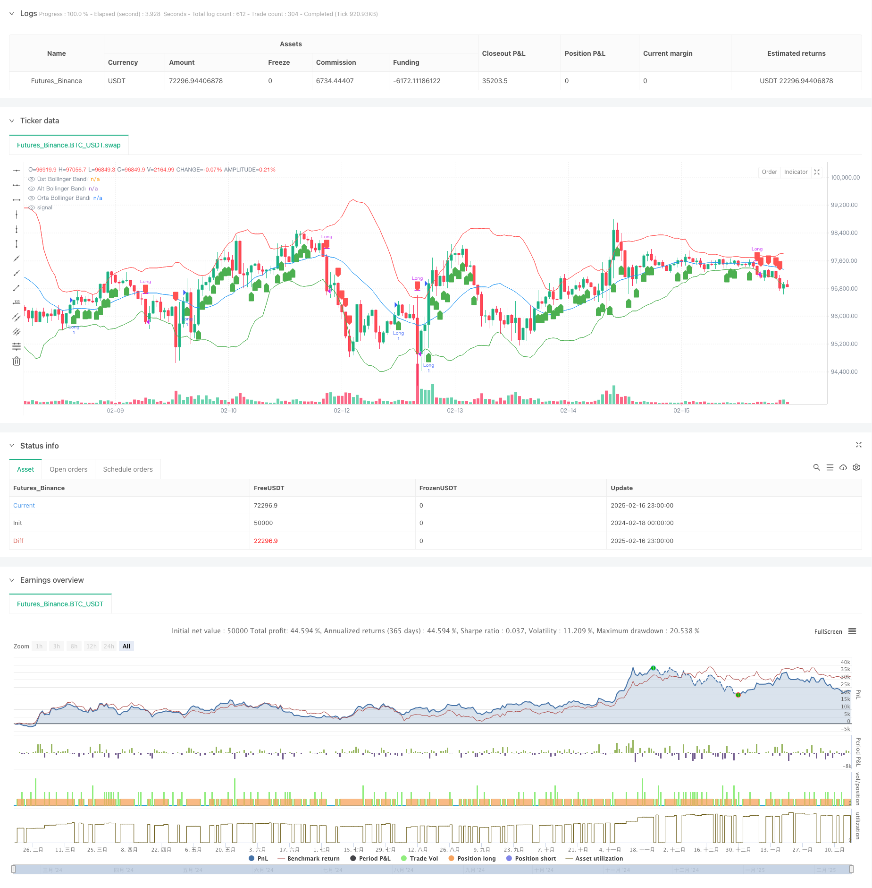

> Name

Multi-Indicator Trend Momentum Trading Strategy A-Comprehensive-Quantitative-Trading-System-Based-on-Bollinger-Bands-RSI-and-OBV
> Author

ChaoZhang

> Strategy Description



[trans]
#### Overview
This strategy is a trend following and momentum trading system based on multiple technical indicators. It combines three major technical indicators: Bollinger Bands, Relative Strength Index (RSI) and Energy Wave Indicator (OBV) to identify market trends and trading opportunities by analyzing price fluctuations, momentum and trading volume. The strategy adopts a medium- and long-term position holding method, entering the market to go long when the market shows an obvious upward trend and the momentum is strong, and closing the position when the price falls below the lower Bollinger Band.
#### Strategy Principle
The core logic of the strategy is based on the following three aspects:
1. Use Bollinger Bands (BB) to determine the price trend - when the price is above the middle track of Bollinger Bands, it indicates that the upward trend has been established. The Bollinger Band parameters are set to the 20-day moving average and 2 times the standard deviation.
2. Use the Relative Strength Index (RSI) to confirm price momentum - RSI greater than 50 indicates that the price has upward momentum. The RSI parameter is set to the 14th.
3. Use the Power Wave Indicator (OBV) to verify volume support - the 10-day exponential moving average of OBV is rising, indicating that volume is matching the price increase.
Entry signals need to meet the following requirements at the same time: the price is higher than the middle track of the Bollinger Bands, the RSI is greater than 50, and the OBV trend is upward.
The exit signal is: the price falls below the Bollinger Bands.
#### Strategic Advantages
1. Cross-validation of multiple technical indicators to improve signal reliability
2. Analyze the market based on the three dimensions of price, momentum and trading volume
3. Use trend following strategies to capture large-scale market trends
4. Clear exit conditions and effectively control retracement risks
5. Reasonable selection of indicator parameters to avoid over-optimization
#### Strategy Risk
1. Volatile markets may cause losses due to frequent trading
2. A large retracement may form in the early stage of trend reversal
3. A sharp drop in the market may cause slippage losses
4. Volume indicator may not work in some markets
5. Fixed parameter settings may not be suitable for all market environments
#### Strategy optimization direction
1. Add market environment classification and use different parameters in different markets
2. Introduce a stop-loss mechanism to control the risk of a single transaction
3. Optimize the exit mechanism and lock in some profits in advance
4. Add transaction volume filter to avoid false breakthroughs
5. Add volatility adaptive mechanism and dynamically adjust parameters
#### Summary
This strategy is a robust trend tracking system that can effectively capture market trend opportunities through the combined use of multiple technical indicators. The strategy logic is clear, the parameter settings are reasonable, and it has good practicality. Through the suggested optimization direction, the stability and profitability of the strategy can be further improved. When applying for real offer, it is recommended to make corresponding adjustments according to specific market characteristics and capital scale. ||
#### Overview
This strategy is a trend-following and momentum trading system based on multiple technical indicators. It combines Bollinger Bands (BB), Relative Strength Index (RSI), and On-Balance Volume (OBV) to identify market trends and trading opportunities by analyzing price movements, momentum, and trading volume. The strategy adopts a medium to long-term holding approach, entering long positions when the market shows a clear upward trend with strong momentum and exiting when the price breaks below the lower Bollinger Band.

#### Strategy Principles
The core logic of the strategy is based on three aspects:
1. Using Bollinger Bands (BB) to determine price trends - When price is above the middle band, it confirms an upward trend. BB parameters are set to 20-day moving average and 2 standard deviations.
2. Using Relative Strength Index (RSI) to confirm price momentum - RSI above 50 indicates upward momentum. RSI parameter is set to 14 days.
3. Using On-Balance Volume (OBV) to verify volume support - Rising 10-day exponential moving average of OBV shows volume confirms price increases.

Entry signals require simultaneous satisfaction of: price above BB middle band, RSI above 50, and upward OBV trend.
Exit signal is: price breaking below the lower BB band.

#### Strategy Advantages
1. Multiple technical indicators cross-validation improves signal reliability
2. Combines price, momentum, and volume analysis
3. Trend-following approach captures major market moves
4. Clear exit conditions effectively control drawdown risk
5. Reasonable indicator parameters avoid over-optimization

#### Strategy Risks
1. Potential losses from frequent trading in choppy markets
2. Significant drawdowns possible during trend reversals
3. Slippage losses in sharp decline scenarios
4. Volume indicators may be ineffective in certain markets
5. Fixed parameters may not adapt to all market conditions

#### Strategy Optimization Directions
1. Add market environment classification for different parameter sets
2. Implement stop-loss mechanisms to control single trade risk
3. Optimize exit mechanism to lock in partial profits
4. Add volume filters to avoid false breakouts
5. Incorporate volatility adaptation for dynamic parameter adjustment

#### Summary
This strategy is a robust trend-following system that effectively captures market trends through the coordinated use of multiple technical indicators. The strategy logic is clear, with reasonable parameter settings and good practicality. Through the suggested optimization directions, the strategy's stability and profitability can be further improved. When applying to live trading, it is recommended to make appropriate adjustments based on specific market characteristics and capital scale.[/trans]


> Source (PineScript)

``` pinescript
/*backtest
start: 2024-02-18 00:00:00
end: 2025-02-17 00:00:00
period: 1h
basePeriod: 1h
exchanges: [{"eid":"Futures_Binance","currency":"BTC_USDT"}]
*/

// This Pine Script™ code is subject to the terms of the Mozilla Public License 2.0 at https://mozilla.org/MPL/2.0/
// © ahmetkaratas4238

//@version=5
strategy("İstanbul Stratejisi", overlay=true)

// Bollinger Bantları Hesaplamaları
bbLength = 20
bbMult = 2.0
basis = ta.sma(close, bbLength)
dev = bbMult * ta.stdev(close, bbLength)
upperBand = basis + dev
lowerBand = basis - dev

// RSI Hesaplamaları
rsiLength = 14
rsi = ta.rsi(close, rsiLength)
rsiThreshold = 50

// OBV Hesaplaması
obv = ta.cum(volume * math.sign(ta.change(close)))  // ta.cum yerine ta.cumulative kullanılmalı
obvTrend = ta.ema(obv, 10) > ta.ema(obv[1], 10)  // OBV'nin yükseliş trendinde olup olmadığını kontrol eder

// ALIM ŞARTLARI
buyCondition = close > basis and rsi > rsiThreshold and obvTrend

// SATIM ŞARTI
sellCondition = close < lowerBand

// Alım İşlemi Aç
if buyCondition
    strategy.entry("Long", strategy.long)

// Satım İşlemi Yap (Pozisyon Kapat)
if sellCondition
    strategy.close("Long")

// Bollinger Bantlarını Göster
plot(upperBand, title="Üst Bollinger Bandı", color=color.red)
plot(lowerBand, title="Alt Bollinger Bandı", color=color.green)
plot(basis, title="Orta Bollinger Bandı", color=color.blue)

// Alım ve Satım Sinyallerini İşaretle
plotshape(series=buyCondition, location=location.belowbar, color=color.green, style=shape.labelup, title="Alım Sinyali")
plotshape(series=sellCondition, location=location.abovebar, color=color.red, style=shape.labeldown, title="Satım Sinyali")


```

> Detail

https://www.fmz.com/strategy/482464

> Last Modified

2025-02-18 15:24:56
