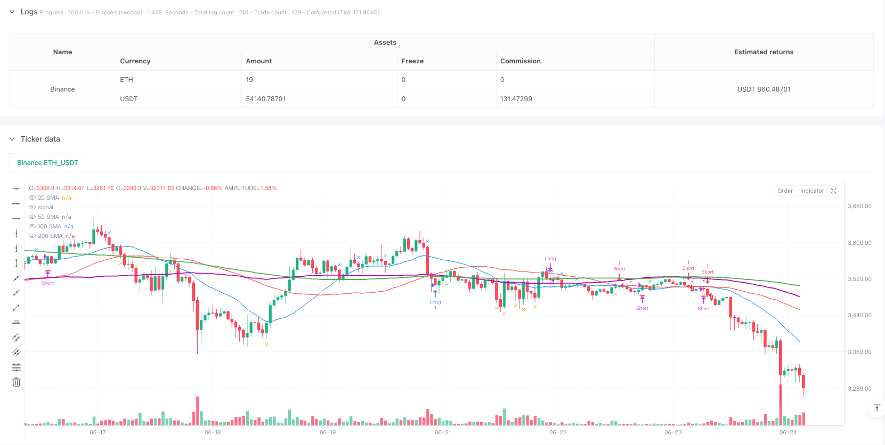
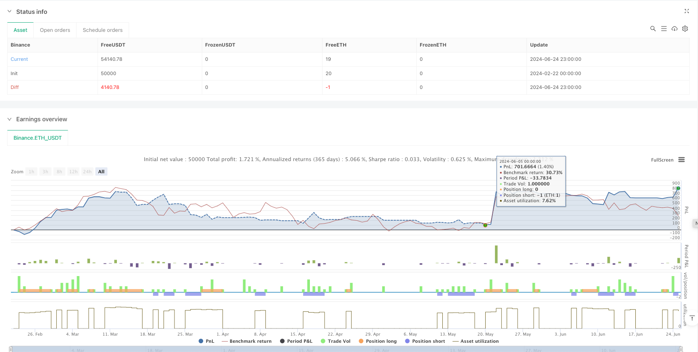

> Name

Multi-Layer-Moving-Average-Cross-Precise-Timing-Trend-Following-Strategy
> Author

ianzeng123

> Strategy Description





[trans]
#### Overview
This strategy is a multi-level moving average (SMA) based trend following system combined with precise tick crossover detection technology. It determines market trends through the hierarchical relationship of 20, 50, 100 and 200-period moving averages, and uses the intersection of real-time prices with the moving averages to trigger trading signals. The strategy design fully considers the universality of different time zones and trading periods, and can run on charts of various time periods.
#### Strategy Principle
The strategy adopts a three-layer trend filtering mechanism, requiring the 50-period moving average to be above the 100-period moving average, and the 100-period moving average to be above the 200-period moving average to confirm an upward trend, and vice versa to confirm a downward trend. The entry signal is based on the intersection of price and the 50-period moving average, using split data to achieve accurate cross detection, and determining the timing of the crossover by comparing the current price behavior with the position of the previous K-line. The exit signal is determined by the relationship between the price and the 20-period moving average. When the price breaks through the 20-period moving average, a closing signal is triggered.
#### Strategic Advantages
1. Accurate cross detection mechanism improves the accuracy of trading timing
2. The trend confirmation method of multi-layer moving average can effectively filter out false signals
3. The strategy has good time zone adaptability and can be used in any market around the world
4. The entry and exit logic is unified and clear, making it easy to understand and execute.
5. Can be applied to charts of multiple time periods and has strong universality
#### Strategy Risk
1. Frequent false signals may occur in a volatile market, leading to over-trading.
2. The moving average itself has hysteresis and may miss important turning points.
3. In rapidly volatile markets, split cross detection may generate too many signals
4. Multi-layer trend filtering may result in missing some potential trading opportunities
5. Fixed exit conditions may lead to larger retracements during severe fluctuations
#### Strategy optimization direction
1. Introduce volatility indicators to dynamically adjust entry and exit conditions and improve the adaptability of the strategy to the market environment.
2. Increase the transaction volume confirmation mechanism and improve the reliability of cross signals
3. Design a dynamic stop-loss mechanism to better control risks
4. Add market structure analysis to optimize the accuracy of trend judgment.
5. Develop an adaptive parameter optimization mechanism to improve the stability of the strategy
#### Summary
This is a trend following strategy with a complete structure and clear logic. Through the use of multi-layer moving averages, it not only ensures the reliability of the signal, but also achieves effective tracking of the trend. The strategy is designed with practicality and universality in mind and is suitable for use in different market environments. Through further optimization and improvement, this strategy is expected to achieve better performance in actual transactions.
|| 

#### Overview
This strategy is a trend following system based on multiple Simple Moving Averages (SMA) combined with precise tick cross detection technology. It determines market trends through the hierarchical relationship of 20, 50, 100, and 200-period moving averages, and triggers trading signals using real-time price crosses with moving averages. The strategy is designed to be universally applicable across different time zones and trading sessions, capable of running on charts of various timeframes.

#### Strategy Principle
The strategy employs a three-layer trend filtering mechanism, requiring the 50-period moving average to be above the 100-period moving average, which in turn must be above the 200-period moving average to confirm an uptrend, and vice versa for a downtrend. Entry signals are based on price crosses with the 50-period moving average, using tick data for precise cross detection by comparing current price action with the previous bar's position. Exit signals are determined by the relationship between price and the 20-period moving average, triggering position closure when price breaks through the 20-period moving average.

#### Strategy Advantages
1. Precise cross detection mechanism improves the accuracy of trading timing
2. Multi-layer moving average trend confirmation effectively filters false signals
3. Strategy has good timezone adaptability and can be used in any global market
4. Entry and exit logic is unified and clear, easy to understand and execute
5. Applicable to multiple timeframe charts, demonstrating strong universality

#### Strategy Risks
1. May generate frequent false signals in ranging markets, leading to overtrading
2. Moving averages have inherent lag, potentially missing important turning points
3. Tick cross detection may produce excessive signals in highly volatile markets
4. Multi-layer trend filtering might miss some potential trading opportunities
5. Fixed exit conditions may result in larger drawdowns during severe volatility

#### Strategy Optimization Directions
1. Introduce volatility indicators to dynamically adjust entry and exit conditions
2. Add volume confirmation mechanism to enhance cross signal reliability
3. Design dynamic stop-loss mechanism for better risk control
4. Incorporate market structure analysis to optimize trend judgment accuracy
5. Develop adaptive parameter optimization mechanism to improve strategy stability

#### Summary
This is a well-structured trend following strategy with clear logic that ensures signal reliability and effective trend tracking through the coordinated use of multiple moving averages. The strategy's design considers practicality and universality, making it suitable for use in different market environments. Through further optimization and refinement, this strategy has the potential to achieve better performance in actual trading.
[/trans]


> Source (PineScript)

``` pinescript
/*backtest
start: 2024-02-22 00:00:00
end: 2024-06-25 00:00:00
period: 1h
basePeriod: 1h
exchanges: [{"eid":"Binance","currency":"ETH_USDT"}]
*/

//@version=5
strategy("Multi-SMA Strategy - Core Signals", overlay=true)

// ———— Universal Inputs ———— //
int smaPeriod1 = input(20, "Fast SMA")
int smaPeriod2 = input(50, "Medium SMA")
bool useTickCross = input(true, "Use Tick-Precise Crosses")

// ———— Timezone-Neutral Calculations ———— //
sma20 = ta.sma(close, smaPeriod1)
sma50 = ta.sma(close, smaPeriod2)
sma100 = ta.sma(close, 100)
sma200 = ta.sma(close, 200)

// ———— Tick-Precise Cross Detection ———— //
golden_cross = useTickCross ? 
  (high >= sma50 and low[1] < sma50[1]) : 
  ta.crossover(sma20, sma50)

death_cross = useTickCross ? 
  (low <= sma50 and high[1] > sma50[1]) : 
  ta.crossunder(sma20, sma50)

// ———— Trend Filter ———— //
uptrend = sma50 > sma100 and sma100 > sma200
downtrend = sma50 < sma100 and sma100 < sma200

// ———— Entry Conditions ———— //
longCondition = golden_cross and uptrend
shortCondition = death_cross and downtrend

// ———— Exit Conditions ———— //
exitLong = ta.crossunder(low, sma20)
exitShort = ta.crossover(high, sma20)

// ———— Strategy Execution ———— //
strategy.entry("Long", strategy.long, when=longCondition)
strategy.entry("Short", strategy.short, when=shortCondition)
strategy.close("Long", when=exitLong)
strategy.close("Short", when=exitShort)

// ———— Clean Visualization ———— //
plot(sma20, "20 SMA", color.new(color.blue, 0))
plot(sma50, "50 SMA", color.new(color.red, 0))
plot(sma100, "100 SMA", color.new(#B000B0, 0), linewidth=2)
plot(sma200, "200 SMA", color.new(color.green, 0), linewidth=2)

// ———— Signal Markers ———— //
plotshape(longCondition,  "Long Entry", shape.triangleup, location.belowbar, color.green, 0)
plotshape(shortCondition, "Short Entry", shape.triangledown, location.abovebar, color.red, 0)
plotshape(exitLong,  "Long Exit", shape.xcross, location.abovebar, color.blue, 0)
plotshape(exitShort, "Short Exit", shape.xcross, location.belowbar, color.orange, 0)
```

> Detail

https://www.fmz.com/strategy/483122

> Last Modified

2025-02-21 14:32:49
