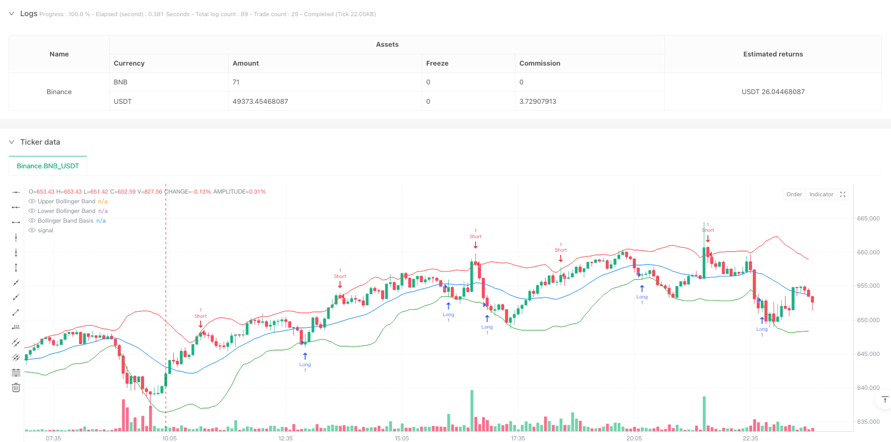
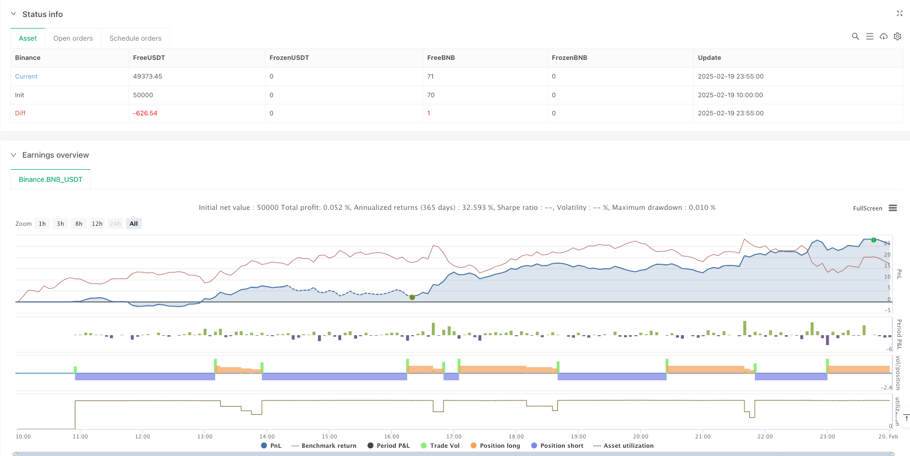

> Name

Multi-Level-Bollinger-Bands-Mean-Reversion-Trading-Strategy
> Author

ianzeng123

> Strategy Description





[trans]
#### Overview
This is a trading strategy based on the Bollinger Bands mean reversion principle, which achieves batch profits through multiple take-profit levels. The strategy trades when the price breaks out of the Bollinger Bands and then returns, and sets 5 different take-profit levels to gradually reduce positions. At the same time, dynamic stop loss is set to control risks. The strategy can run within a customized trading period and supports adding positions.
#### Strategy Principle
The strategy is based on the 20-period Bollinger Bands indicator and uses 2 times the standard deviation as the fluctuation range. When the price breaks through the lower band from below and closes within the band, a long signal is triggered; when the price breaks through the upper band from above and closes within the band, a short signal is triggered. After entering the market, the strategy adopts a five-level take-profit mechanism, setting take-profit points at 0.5%, 1%, 1.5%, 2% and 2.5% respectively, and closing 20% ​​of the position at each take-profit point. The last level of take profit is set at the relative Bollinger Band position. Also set a 1% stop loss to control risk.
#### Strategic Advantages
1. Adopting a multi-level profit-taking mechanism can obtain more profits when the trend continues, while ensuring that part of the profits are realized.
2. Support adding positions when the trading direction is correct to improve profitability
3. Use Bollinger Bands as dynamic support and resistance levels to adapt to market fluctuations
4. Trading periods can be customized to avoid interference during non-trading periods
5. Set up a stop-loss mechanism to effectively control risks
#### Strategy Risk
1. False breakthrough signals may be triggered frequently in highly volatile markets.
2. You may miss greater profit opportunities in fast trending markets
3. The position-adding mechanism may lead to greater losses when the market reverses
4. Multiple take-profit orders may not be fully executed due to insufficient liquidity.
It is recommended to adapt to different market environments by adjusting Bollinger Band parameters and take-profit and stop-loss ratios.
#### Strategy optimization direction
1. Introduce trading volume indicators as signal filtering conditions to improve the reliability of breakthroughs
2. Dynamically adjust the stop-profit and stop-loss positions based on volatility
3. Add trend filter indicators to avoid counter-trend trading in strong trends
4. Optimize the logic of adding positions and set the maximum position limit
5. Consider adding a trailing stop function to better protect profits
#### Summary
This strategy captures mean reversion opportunities through the Bollinger Bands indicator, and uses multi-level take-profit and dynamic stop-loss to manage risk. The advantage of the strategy lies in its flexible position management and risk control mechanism, but you need to pay attention to the adaptability of the market environment when using it. By adding additional filtering indicators and optimizing take-profit and stop-loss parameters, the stability and profitability of the strategy can be further improved. ||
#### Overview
This is a mean reversion trading strategy based on Bollinger Bands with multiple take-profit levels. The strategy enters trades when price rebounds after breaking the bands, with 5 different take-profit levels for gradual position reduction. It implements dynamic stop-loss for risk control and can operate during custom trading sessions with position adding capability.

#### Strategy Principle
The strategy uses 20-period Bollinger Bands with 2 standard deviations as the volatility range. Long signals are triggered when price breaks below the lower band and closes inside, while short signals occur when price breaks above the upper band and closes inside. After entry, the strategy employs a 5-level take-profit mechanism, setting profit targets at 0.5%, 1%, 1.5%, 2%, and 2.5%, each closing 20% of the position. The final take-profit is set at the opposite Bollinger Band. A 1% stop-loss is implemented for risk control.

#### Strategy Advantages
1. Multi-level take-profit mechanism captures extended trends while securing partial profits
2. Supports position adding when trade direction is correct, enhancing profit potential
3. Uses Bollinger Bands as dynamic support/resistance levels, adapting to market volatility
4. Customizable trading sessions to avoid off-hours interference
5. Implements stop-loss mechanism for effective risk control

#### Strategy Risks
1. May trigger frequent false breakout signals in highly volatile markets
2. Could miss larger profit opportunities in rapid trend movements
3. Position adding mechanism may lead to larger losses during market reversals
4. Multiple take-profit orders may not fully execute due to insufficient liquidity
Recommend adjusting Bollinger Band parameters and profit/loss ratios for different market conditions.

#### Optimization Directions
1. Incorporate volume indicators as signal filters to improve breakout reliability
2. Dynamically adjust take-profit and stop-loss levels based on volatility
3. Add trend filtering indicators to avoid counter-trend trading in strong trends
4. Optimize position adding logic with maximum position limits
5. Consider adding trailing stop-loss functionality for better profit protection

#### Summary
The strategy captures mean reversion opportunities using Bollinger Bands, employing multiple take-profit levels and dynamic stop-loss for risk management. Its strengths lie in flexible position management and risk control mechanisms, but market environment compatibility must be considered. Strategy stability and profitability can be further enhanced by adding additional filtering indicators and optimizing profit/loss parameters.[/trans]


> Source (PineScript)

``` pinescript
/*backtest
start: 2025-02-19 10:00:00
end: 2025-02-20 00:00:00
period: 5m
basePeriod: 5m
exchanges: [{"eid":"Binance","currency":"BNB_USDT"}]
*/

//@version=5
strategy("Bollinger Band Reentry Strategy", overlay=true)

// Inputs
bbLength = input.int(20, title="Bollinger Band Length")
bbMult = input.float(2.0, title="Bollinger Band Multiplier")
stopLossPerc = input.float(1.0, title="Stop Loss (%)") / 100
tp1Perc = input.float(0.5, title="Take Profit 1 (%)") / 100
tp2Perc = input.float(1.0, title="Take Profit 2 (%)") / 100
tp3Perc = input.float(1.5, title="Take Profit 3 (%)") / 100
tp4Perc = input.float(2.0, title="Take Profit 4 (%)") / 100
tp5Perc = input.float(2.5, title="Take Profit 5 (%)") / 100
allowAddToPosition = input.bool(true, title="Allow Adding to Position")
customSession = input.timeframe("0930-1600", title="Custom Trading Session")

// Calculate Bollinger Bands
basis = ta.sma(close, bbLength)
dev = ta.stdev(close, bbLength)
upperBB = basis + bbMult * dev
lowerBB = basis - bbMult * dev

// Plot Bollinger Bands
plot(upperBB, color=color.red, title="Upper Bollinger Band")
plot(lowerBB, color=color.green, title="Lower Bollinger Band")
plot(basis, color=color.blue, title="Bollinger Band Basis")

// Entry Conditions
longCondition = (ta.crossover(close, lowerBB) or (low < lowerBB and close > lowerBB)) and time(timeframe.period, customSession)
shortCondition = (ta.crossunder(close, upperBB) or (high > upperBB and close < upperBB)) and time(timeframe.period, customSession)

// Execute Trades
if (longCondition)
    strategy.entry("Long", strategy.long, when=allowAddToPosition or strategy.position_size == 0)
if (shortCondition)
    strategy.entry("Short", strategy.short, when=allowAddToPosition or strategy.position_size == 0)

// Take-Profit and Stop-Loss Levels for Long Trades
if (strategy.position_size > 0)
    strategy.exit("TP1", "Long", limit=strategy.position_avg_price * (1 + tp1Perc), qty=strategy.position_size * 0.2) // Take 20% profit
    strategy.exit("TP2", "Long", limit=strategy.position_avg_price * (1 + tp2Perc), qty=strategy.position_size * 0.2)
    strategy.exit("TP3", "Long", limit=strategy.position_avg_price * (1 + tp3Perc), qty=strategy.position_size * 0.2)
    strategy.exit("TP4", "Long", limit=strategy.position_avg_price * (1 + tp4Perc), qty=strategy.position_size * 0.2)
    strategy.exit("TP5", "Long", limit=upperBB, qty=strategy.position_size * 0.2) // Take final 20% at opposite band
    strategy.exit("Stop Loss", "Long", stop=strategy.position_avg_price * (1 - stopLossPerc))

// Take-Profit and Stop-Loss Levels for Short Trades
if (strategy.position_size < 0)
    strategy.exit("TP1", "Short", limit=strategy.position_avg_price * (1 - tp1Perc), qty=strategy.position_size * 0.2)
    strategy.exit("TP2", "Short", limit=strategy.position_avg_price * (1 - tp2Perc), qty=strategy.position_size * 0.2)
    strategy.exit("TP3", "Short", limit=strategy.position_avg_price * (1 - tp3Perc), qty=strategy.position_size * 0.2)
    strategy.exit("TP4", "Short", limit=strategy.position_avg_price * (1 - tp4Perc), qty=strategy.position_size * 0.2)
    strategy.exit("TP5", "Short", limit=lowerBB, qty=strategy.position_size * 0.2)
    strategy.exit("Stop Loss", "Short", stop=strategy.position_avg_price * (1 + stopLossPerc))

// Alerts
alertcondition(longCondition, title="Long Signal", message="Price closed inside Bollinger Band from below.")
alertcondition(shortCondition, title="Short Signal", message="Price closed inside Bollinger Band from above.")

```

> Detail

https://www.fmz.com/strategy/483086

> Last Modified

2025-02-21 13:06:24
