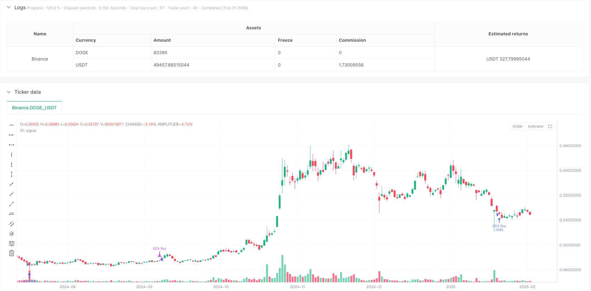
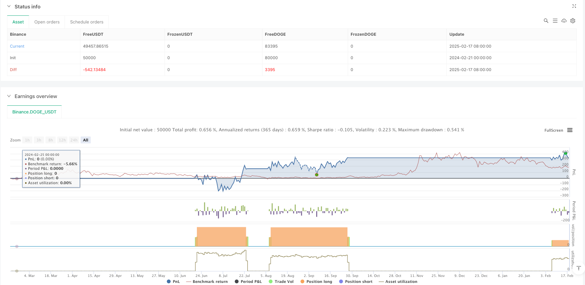

> Name

Multi-Level-Dynamic-Cost-Averaging-Swing-Trading-Strategy-Based-on-RSI-and-ATR
> Author

ianzeng123

> Strategy Description





[trans]
#### Overview
This strategy is a multi-level dynamic cost equalization (DCA) trading system that combines the Relative Strength Index (RSI) and the Average True Range (ATR). It mainly builds positions in batches by identifying oversold conditions in the market, and uses ATR to dynamically adjust the take-profit position to achieve profits from band operations. The strategy has the characteristics of risk diversification, cost optimization and stable returns.
#### Strategy Principle
The strategy operates at the 4-hour or daily level, and the core logic includes the following aspects:
1. The entry signal is based on the oversold judgment when RSI is lower than 30, and a maximum of 4 batches of positions are allowed.
2. The amount of each position is based on the total risk limit of US$200, and the position size is dynamically calculated based on 2 times ATR.
3. Position management uses dynamic average cost tracking to calculate the average price after multiple positions are opened in real time.
4. The take-profit is set to 3 times ATR above the average price, and can be adjusted adaptively according to market volatility.
5. Real-time display of average price and take-profit position through mark lines for easy visual tracking
#### Strategic Advantages
1. Precise risk control - precise risk control of a single transaction is achieved through preset risk amounts and dynamic adjustment of ATR.
2. Flexible opening of positions - the batch opening mechanism can not only reduce costs but also fully seize opportunities.
3. Intelligent take-profit - dynamic take-profit based on ATR not only ensures profits but also adapts to market fluctuations
4. Strong visualization - the real-time display of the average price line and take-profit line provides intuitive trading reference
5. Good adaptability - strategy parameters can be flexibly adjusted according to different market characteristics
#### Strategy Risk
1. Continuous oversold risk - continued market decline may lead to excessive position openings
Solution: Strictly enforce the maximum number of positions and set a stop loss if necessary
2. Risks of setting a take-profit - too high a take-profit multiple may lead to missed profit opportunities
Solution: Dynamically adjust ATR multiples based on market characteristics
3. Fund management risk - opening positions in batches may occupy too much funds
Solution: Set risk limits and position size appropriately
#### Strategy optimization direction
1. Optimization of entry signals
- Add trend judgment indicators to avoid premature opening of positions in strong declines
- Combined with trading volume indicators to improve the reliability of oversold judgments
2. Perfect stop-profit mechanism
- Introduce trailing stop mechanism to better lock in profits
- Consider taking profits in batches to increase profit-making flexibility
3. Enhanced risk control
- Added overall retracement control
- Optimize fund allocation algorithm
#### Summary
This strategy achieves a trading system that combines risk control and stable returns through the combination of RSI and ATR indicators. The batch opening mechanism provides the possibility of cost optimization, while the dynamic take-profit design ensures reasonable realization of profits. Although there are some potential risks, through reasonable parameter settings and implementation of optimization directions, the overall performance of the strategy will be further improved. ||
#### Overview
This strategy is a multi-level dynamic cost averaging (DCA) trading system that combines the Relative Strength Index (RSI) and Average True Range (ATR). It primarily identifies oversold market conditions for staged position building while using ATR to dynamically adjust take-profit levels for swing trading profits. The strategy features risk diversification, cost optimization, and stable returns.

#### Strategy Principles
The strategy operates on 4-hour or daily timeframes, with core logic including:
1. Entry signals based on RSI below 30 indicating oversold conditions, allowing up to 4 staged entries
2. Position sizing based on $200 total risk amount, calculating holdings dynamically using 2x ATR
3. Position management using dynamic average cost tracking, calculating real-time average price after multiple entries
4. Take-profit set at 3x ATR above average price, adapting to market volatility
5. Real-time display of average price and take-profit levels through marker lines for visual tracking

#### Strategy Advantages
1. Precise Risk Control - Achieves exact control of single trade risk through preset risk amount and ATR adjustment
2. Flexible Position Building - Staged entry mechanism reduces cost while fully capturing opportunities
3. Intelligent Take-Profit - Dynamic take-profit based on ATR ensures profits while adapting to market volatility
4. Strong Visualization - Real-time display of average price and take-profit lines provides intuitive trading reference
5. Good Adaptability - Strategy parameters can be flexibly adjusted for different market characteristics

#### Strategy Risks
1. Continuous Oversold Risk - Sustained market decline may lead to excessive entries
Solution: Strictly enforce maximum entry limit, set stop-loss when necessary
2. Take-Profit Setting Risk - Excessive take-profit multiplier may miss profit opportunities
Solution: Dynamically adjust ATR multiplier based on market characteristics
3. Capital Management Risk - Staged entries may occupy excessive capital
Solution: Set reasonable risk limits and position sizes

#### Strategy Optimization Directions
1. Entry Signal Optimization
- Add trend judgment indicators to avoid early entries in strong downtrends
- Incorporate volume indicators to improve oversold judgment reliability
2. Take-Profit Mechanism Improvement
- Introduce trailing stop mechanism for better profit locking
- Consider staged profit-taking for increased flexibility
3. Risk Control Enhancement
- Add overall drawdown control
- Optimize capital allocation algorithm

#### Summary
The strategy achieves a trading system balancing risk control and stable returns through the combination of RSI and ATR indicators. The staged entry mechanism provides cost optimization possibilities, while the dynamic take-profit design ensures reasonable profit realization. Although some potential risks exist, the strategy's overall performance will be further improved through appropriate parameter settings and implementation of optimization directions.[/trans]


> Source (PineScript)

``` pinescript
/*backtest
start: 2024-02-21 00:00:00
end: 2025-02-18 08:00:00
period: 1d
basePeriod: 1d
exchanges: [{"eid":"Binance","currency":"DOGE_USDT"}]
*/

//@version=6
strategy("DCA-Based Swing Strategy (Risk $200) with Signals", overlay=true)

// === Main Indicators ===
// RSI for identifying oversold conditions
rsi = ta.rsi(close, 14)

// ATR for volatility estimation
atr = ta.atr(14)

// === Strategy Parameters ===
// Risk management
riskPerTrade = 200                       // Total risk ($200)
atrRisk = 2 * atr                        // Risk in dollars per buy (2 ATR)
positionSize = riskPerTrade / atrRisk    // Position size (shares)

// DCA Parameters
maxEntries = 4                           // Maximum of 4 buys
takeProfitATR = 3                        // Take profit: 3 ATR

// === Position Management ===
var float avgEntryPrice = na             // Average entry price
var int entryCount = 0                   // Number of buys
var line takeProfitLine = na             // Take profit line
var line avgPriceLine = na               // Average entry price line

// === Buy and Sell Conditions ===
buyCondition = rsi < 30 and entryCount < maxEntries  // Buy when oversold
if (buyCondition)
    strategy.entry("DCA Buy", strategy.long, qty=positionSize)
    
    // Update the average entry price
    avgEntryPrice := na(avgEntryPrice) ? close : (avgEntryPrice * entryCount + close) / (entryCount + 1)
    entryCount += 1

    // Display "BUY" signal on the chart
    label.new(bar_index, low, "BUY", style=label.style_label_up, color=color.green, textcolor=color.white, size=size.normal)

    // Update lines for average entry price and take profit
    if (not na(takeProfitLine))
        line.delete(takeProfitLine)
    if (not na(avgPriceLine))
        line.delete(avgPriceLine)
    takeProfitPrice = avgEntryPrice + takeProfitATR * atr


// Sell condition: Take profit = 3 ATR from average entry price
takeProfitPrice = avgEntryPrice + takeProfitATR * atr
if (close >= takeProfitPrice and entryCount > 0)
    strategy.close("DCA Buy")
    
    // Reset parameters after closing
    avgEntryPrice := na
    entryCount := 0

    // Remove lines after selling
    if (not na(takeProfitLine))
        line.delete(takeProfitLine)
    if (not na(avgPriceLine))
        line.delete(avgPriceLine)

```

> Detail

https://www.fmz.com/strategy/482909

> Last Modified

2025-02-27 17:22:25
