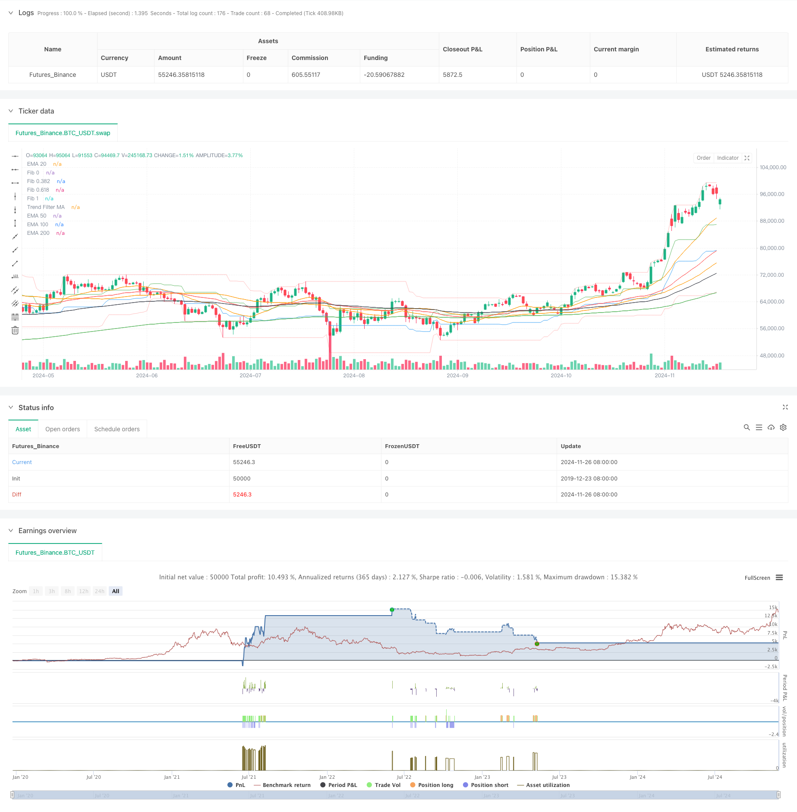

> Name

Multi-Level Fibonacci Moving Average Trend Following Strategy-Multi-Level-Fibonacci-EMA-Trend-Following-Strategy
> Author

ChaoZhang

> Strategy Description



[trans]
#### Overview
This strategy is a trend following trading system that combines Fibonacci retracements, multiple exponential moving averages, and volume. The strategy identifies potential trading opportunities by analyzing price positions at different Fibonacci retracement levels (0, 0.382, 0.618, 1), combined with trend confirmation from multi-period EMA (20/50/100/200), and filtering through volume thresholds. The system is designed with a complete risk management mechanism, including fixed percentage stop loss and take profit settings.
#### Strategy Principle
The core logic of the strategy is based on a multi-level technical analysis method:
1. Use 30 periods as the lookback interval to calculate Fibonacci retracement levels and establish a support and resistance framework for price movement.
2. Build a multi-level trend confirmation system through the exponential moving average of the 20/50/100/200 period
3. When the price is close to the Fibonacci 0.382 level and the trading volume is greater than the threshold, if the price is above the moving average, a long signal is triggered.
4. When the price is close to the Fibonacci 0.618 level and the trading volume is greater than the threshold, if the price is below the moving average, a short signal is triggered.
5. Set up a percentage-based take-profit and stop-loss mechanism, which are 6% and 3% respectively.
#### Strategic Advantages
1. Multi-dimensional analysis: combines the three dimensions of price form, trend and trading volume to improve the reliability of signals
2. Improved risk management: Clear stop-profit and stop-loss conditions are set to effectively control the risk of each transaction.
3. Full trend confirmation: Using a multiple moving average system can more accurately determine the strength and direction of the trend.
4. Strict signal filtering: it is required to meet price, moving average and trading volume conditions at the same time to reduce the probability of false breakthroughs
5. High degree of visualization: the entry and exit points are clearly marked through the labeling system to facilitate analysis and optimization.
#### Strategy Risk
1. Shock market risk: Frequent false signals may occur in a sideways shock market. It is recommended to add oscillator filtering.
2. Slippage risk: Under the restrictions of trading volume conditions, you may face execution slippage, and the trading volume threshold needs to be adjusted according to the actual situation.
3. Fund management risk: A fixed percentage stop loss may not be flexible enough in some cases. It is recommended to dynamically adjust it based on volatility.
4. Trend dependence: The strategy performs better in an obvious trend, but may suffer continuous losses during the trend transition period.
5. Parameter sensitivity: The combination of multiple parameters increases the risk of overfitting and requires backtest verification in different time periods.
#### Strategy optimization direction
1. Dynamic stop loss optimization: It is recommended to introduce the ATR indicator to dynamically adjust the stop loss distance to improve the adaptability to market fluctuations.
2. Quantify trend strength: You can add trend strength indicators such as ADX to increase positions during strong trends and reduce transactions during weak trends.
3. Deepening of trading volume analysis: It is recommended to add trading volume moving average and abnormal trading volume analysis to improve the accuracy of trading volume analysis.
4. Optimize entry timing: You can combine it with RSI and other oscillator indicators to look for overbought and oversold opportunities in the direction of the trend.
5. Improved position management: It is recommended to dynamically adjust the position ratio based on trend strength and market volatility.
#### Summary
This is a well-designed multi-level trend tracking strategy that builds a three-dimensional analysis framework by combining classic technical analysis tools. The advantage of the strategy lies in the rigor of signal confirmation and the completeness of risk management, but at the same time, attention must be paid to performance in volatile markets. Through the suggested optimization directions, especially improvements in dynamic risk management and trend intensity quantification, the stability and profitability of the strategy are expected to be further improved. ||
#### Overview
This strategy is a trend-following trading system that combines Fibonacci retracements, multiple exponential moving averages, and volume analysis. It identifies potential trading opportunities by analyzing price positions at different Fibonacci retracement levels (0, 0.382, 0.618, 1), confirming trends with multi-period EMAs (20/50/100/200), and filtering through volume thresholds. The system includes a comprehensive risk management mechanism with fixed percentage stop-loss and take-profit settings.

#### Strategy Principles
The core logic is based on multi-level technical analysis:
1. Uses a 30-period lookback window to calculate Fibonacci retracement levels, establishing support and resistance framework
2. Constructs a multi-level trend confirmation system using 20/50/100/200 period exponential moving averages
3. Triggers long signals when price approaches the 0.382 Fibonacci level with volume above threshold and price above moving averages
4. Triggers short signals when price approaches the 0.618 Fibonacci level with volume above threshold and price below moving averages
5. Implements percentage-based take-profit and stop-loss mechanisms at 6% and 3% respectively

#### Strategy Advantages
1. Multi-dimensional Analysis: Combines price patterns, trends, and volume for improved signal reliability
2. Comprehensive Risk Management: Clear stop-loss and take-profit conditions effectively control risk per trade
3. Thorough Trend Confirmation: Multiple moving average system accurately judges trend strength and direction
4. Strict Signal Filtering: Requires simultaneous satisfaction of price, moving average, and volume conditions
5. High Visualization: Clear label system marks entry and exit points for analysis and optimization

#### Strategy Risks
1. Sideways Market Risk: May generate frequent false signals in ranging markets, consider adding oscillator filters
2. Slippage Risk: Volume conditions may lead to execution slippage, requires volume threshold adjustment
3. Money Management Risk: Fixed percentage stops may lack flexibility, consider dynamic adjustment based on volatility
4. Trend Dependency: Strategy performs well in clear trends but may face consecutive losses during trend transitions
5. Parameter Sensitivity: Multiple parameter combinations increase overfitting risk, requires backtesting across timeframes

#### Optimization Directions
1. Dynamic Stop-Loss: Implement ATR indicator for dynamic stop-loss adjustment and improved market volatility adaptation
2. Trend Strength Quantification: Add ADX or similar indicators to adjust position sizing based on trend strength
3. Enhanced Volume Analysis: Include volume moving averages and abnormal volume analysis
4. Entry Timing Optimization: Incorporate RSI or similar oscillators for overbought/oversold opportunities in trend direction
5. Position Management: Implement dynamic position sizing based on trend strength and market volatility

#### Summary
This is a well-designed multi-level trend following strategy that builds a comprehensive analysis framework using classic technical analysis tools. Its strengths lie in the rigorous signal confirmation and complete risk management, while attention needs to be paid to performance in ranging markets. Through the suggested optimizations, particularly in dynamic risk management and trend strength quantification, the strategy's stability and profitability can be further enhanced.[/trans]


> Source (PineScript)

``` pinescript
/*backtest
start: 2019-12-23 08:00:00
end: 2024-11-27 08:00:00
period: 1d
basePeriod: 1d
exchanges: [{"eid":"Futures_Binance","currency":"BTC_USDT"}]
*/

//@version=5
strategy("ALD Fib Ema SAKALAM", overlay=true)

// Inputs
lookback = input.int(30, title="Lookback Period for Fibonacci", minval=10)
volumeThreshold = input.float(500000, title="24h Volume Threshold", step=50000)
stopLossPct = input.float(3.0, title="Stop Loss %", minval=0.5)
takeProfitPct = input.float(6.0, title="Take Profit %", minval=1.0)
maLength = input.int(50, title="Trend Filter MA Length", minval=1)

// Moving Average (Trend Filter)
ma = ta.sma(close, maLength)

// High and Low for Fibonacci Levels
var float swingHigh = na
var float swingLow = na

if bar_index > lookback
    swingHigh := ta.highest(high, lookback)
    swingLow := ta.lowest(low, lookback)

// Fibonacci Levels Calculation
fib0 = swingLow
fib1 = swingHigh
fib382 = swingHigh - 0.382 * (swingHigh - swingLow)
fib618 = swingHigh - 0.618 * (swingHigh - swingLow)

// 24-hour Volume Calculation
volume24h = ta.sma(volume, 24)

// Plot Fibonacci Levels
plot(fib0, title="Fib 0", color=color.new(color.red, 80))
plot(fib382, title="Fib 0.382", color=color.new(color.green, 50))
plot(fib618, title="Fib 0.618", color=color.new(color.blue, 50))
plot(fib1, title="Fib 1", color=color.new(color.red, 80))
plot(ma, title="Trend Filter MA", color=color.orange)

// Entry Condition: Buy Signal
longCondition = (close <= fib382) and (volume24h > volumeThreshold) and (close > ma)
if (longCondition)
    strategy.entry("Buy", strategy.long)
    label.new(bar_index, low, "BUY", style=label.style_label_up, color=color.green, textcolor=color.white)

// Exit Conditions
takeProfitPrice = strategy.position_avg_price * (1 + takeProfitPct / 100)
stopLossPrice = strategy.position_avg_price * (1 - stopLossPct / 100)

// Place Exit Orders
strategy.exit("Take Profit/Stop Loss", from_entry="Buy", limit=takeProfitPrice, stop=stopLossPrice)

// Add Labels for Exits
if (strategy.position_size > 0)
    if (high >= takeProfitPrice)
        label.new(bar_index, high, "EXIT (Take Profit)", style=label.style_label_down, color=color.blue, textcolor=color.white)

    if (low <= stopLossPrice)
        label.new(bar_index, low, "EXIT (Stop Loss)", style=label.style_label_down, color=color.red, textcolor=color.white)

// Short Selling Conditions
shortCondition = (close >= fib618) and (volume24h > volumeThreshold) and (close < ma)
if (shortCondition)
    strategy.entry("Sell", strategy.short)
    label.new(bar_index, high, "SELL", style=label.style_label_down, color=color.red, textcolor=color.white)

// Short Exit Conditions
if (strategy.position_size < 0)
    strategy.exit("Short Take Profit/Stop Loss", from_entry="Sell", limit=strategy.position_avg_price * (1 - takeProfitPct / 100), stop=strategy.position_avg_price * (1 + stopLossPct / 100))

// Add EMA 20/50/100/200
shortest = ta.ema(close, 20)
short = ta.ema(close, 50)
longer = ta.ema(close, 100)
longest = ta.ema(close, 200)

plot(shortest, color=color.orange, title="EMA 20")
plot(short, color=color.red, title="EMA 50")
plot(longer, color=color.black, title="EMA 100")
plot(longest, color=color.green, title="EMA 200")


```

> Detail

https://www.fmz.com/strategy/473358

> Last Modified

2024-11-29 15:09:56
