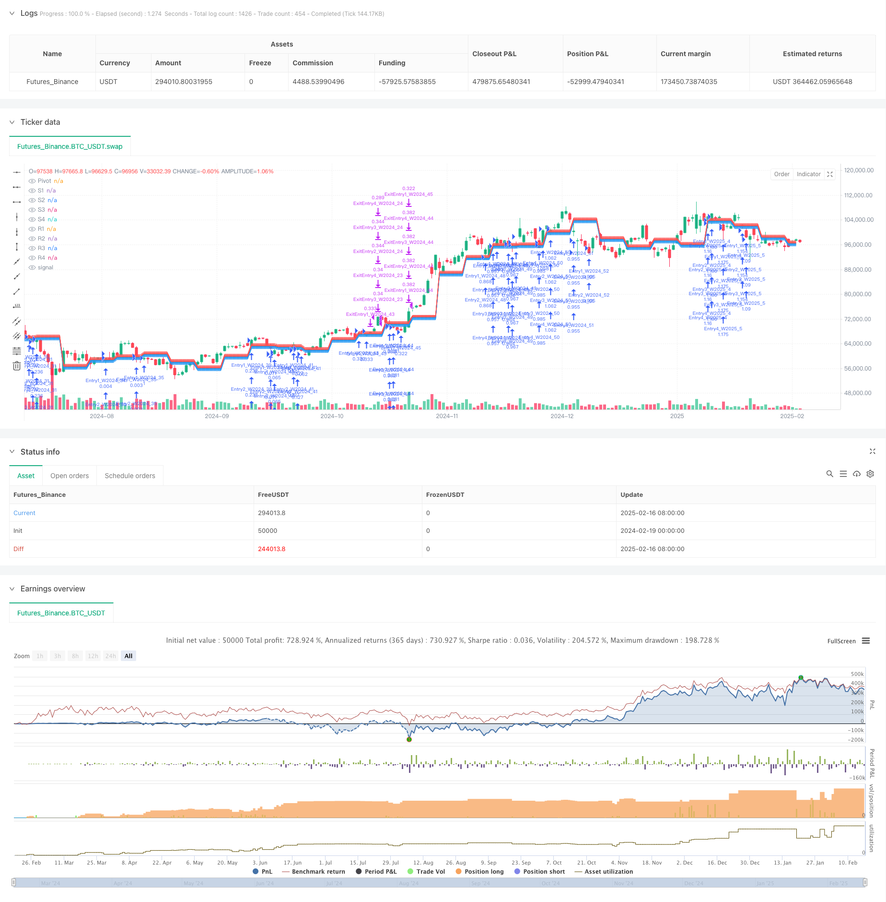

> Name

Multi-level support and resistance weekly trading strategy based on mean reversion-Multi-Level-Support-Resistance-Weekly-Mean-Reversion-Trading-Strategy
> Author

ChaoZhang

> Strategy Description



[trans]
#### Overview
This strategy is a mean reversion trading system based on weekly pivot points. It determines trade entry and exit points by calculating weekly support (S1-S4) and resistance (R1-R4) levels. The strategy adopts a step-by-step position building method, making multiple purchases at different support levels and taking profits at the corresponding resistance levels. This method makes full use of the volatility characteristics of the market and performs well in sideways and volatile markets.
#### Strategy Principle
The core of the strategy is to calculate the pivot point for this week through the highest price, lowest price and closing price of the previous week, and then determine multiple support and resistance levels based on the preset point distance. Buy when the price hits a support level and set a profit target at the corresponding resistance level. The specific calculation formula is:
Pivot point = (last week’s highest price + last week’s lowest price + last week’s closing price) / 3
The strategy allows up to 4 positions to be held at the same time, with each position corresponding to different support and resistance levels. All positions are recalculated at the beginning of each week with new trading levels. This design not only ensures the continuity of transactions, but also adapts to market changes.
#### Strategic Advantages
1. Transaction logic is clear and easy to understand and execute
2. Adopt a step-by-step position building method to reduce the risk of a single transaction
3. Use weekly level support and resistance levels to reduce the impact of intraday noise
4. The strategy can flexibly adjust parameters according to different market characteristics.
5. Control risk through percentage position
6. There is no time limit for forced liquidation, giving transactions sufficient profit margins.
#### Strategy Risk
1. Failure to set a stop loss may lead to a larger retracement in a strong trending market.
2. Multiple positions may occupy more funds
3. False signals may appear in highly volatile markets
4. Improper setting of support levels may lead to unreasonable positioning of positions.
In order to reduce risks, it is recommended to add a trend filter and only open positions in upward trends; at the same time, you can set a dynamic stop loss based on ATR.
#### Strategy optimization direction
1. Add a trading volume confirmation mechanism to improve the reliability of entry signals
2. Introduce technical indicators such as RSI to filter overbought and oversold
3. Develop a multi-time period confirmation mechanism to reduce false signals
4. Optimize the position management system and dynamically adjust the number of positions based on market fluctuations
5. Increase correlation analysis to avoid opening positions in highly correlated markets at the same time
#### Summary
This is a mean reversion strategy based on the classic technical analysis theory, which captures trading opportunities through the breakthrough and fall of weekly support and resistance levels. The strategy design is simple and flexible, suitable for application in volatile markets. Through reasonable parameter optimization and risk management, this strategy can maintain stable performance in different market environments. It is recommended that traders fully test parameter settings before using them in real markets, and make appropriate adjustments according to specific market characteristics. ||
#### Overview
This strategy is a mean reversion trading system based on weekly pivot points. It determines entry and exit points by calculating weekly support (S1-S4) and resistance (R1-R4) levels. The strategy employs a stepped position building approach, executing multiple buys at different support levels and taking profits at corresponding resistance levels. This method effectively utilizes market volatility characteristics and performs well in range-bound markets.

#### Strategy Principles
The core mechanism calculates the pivot point for the current week using the previous week's high, low, and closing prices, then determines multiple support and resistance levels based on preset point distances. Buys are executed when price touches support levels, with profit targets set at corresponding resistance levels. The specific formula is:
Pivot Point = (Previous Week's High + Previous Week's Low + Previous Week's Close) / 3
The strategy allows up to 4 concurrent positions, each corresponding to different support and resistance levels. All positions are recalculated at the beginning of each week. This design ensures trading continuity while adapting to market changes.

#### Strategy Advantages
1. Clear trading logic that is easy to understand and execute
2. Stepped position building approach reduces single trade risk
3. Weekly level support/resistance reduces daily noise impact
4. Parameters can be flexibly adjusted for different markets
5. Risk control through percentage-based position sizing
6. No time-based forced exits, allowing sufficient profit potential

#### Strategy Risks
1. Absence of stop-loss may lead to significant drawdowns in trending markets
2. Multiple positions may tie up substantial capital
3. False signals may occur in highly volatile markets
4. Improper support level settings may result in suboptimal entry positions
To mitigate risks, consider adding trend filters to only enter during uptrends and implementing dynamic ATR-based stop-losses.

#### Optimization Directions
1. Add volume confirmation mechanism to improve entry signal reliability
2. Incorporate technical indicators like RSI for overbought/oversold filtering
3. Develop multiple timeframe confirmation to reduce false signals
4. Optimize position management system with dynamic position sizing based on volatility
5. Include correlation analysis to avoid simultaneous positions in highly correlated markets

#### Summary
This is a mean reversion strategy based on classical technical analysis theory, capturing trading opportunities through weekly support and resistance level breakouts and reversals. The strategy design is concise yet flexible, suitable for markets with significant volatility. Through proper parameter optimization and risk management, this strategy can maintain stable performance across different market environments. Traders are advised to thoroughly test parameter settings and make appropriate adjustments based on specific market characteristics before live trading.[/trans]


> Source (PineScript)

``` pinescript
/*backtest
start: 2024-02-19 00:00:00
end: 2025-02-17 00:00:00
period: 1d
basePeriod: 1d
exchanges: [{"eid":"Futures_Binance","currency":"BTC_USDT"}]
*/

// This Pine Script™ code is subject to the terms of the Mozilla Public License 2.0 at https://mozilla.org/MPL/2.0/
// © ViZiV

//@version=5
strategy("Weekly Pivot Strategy, Created by ViZiV", overlay=true, pyramiding=50, initial_capital=100000, default_qty_type=strategy.percent_of_equity, default_qty_value=25, dynamic_requests=true)

// This is my first COMPLETED strategy, go easy on me :) - Feel free to imrprove upon this script by adding more features if you feel up to the task. Im 100% confiedent there are better coders than me :) I'm still learning.

// This is a LONG ONLY SWING STRATEGY (Patience REQUIRED) that being said, you can go short at you're own discretion. I prefer to use on NQ / US100 / USTech 100 but not limited to it. Im sure it can work in most markets. "You'll need to change settings to suit you're market".

// IMPORTANT NOTE: "default_qty_type=strategy.percent_of_equity" Can be changed to "Contacts" within the properties tab which allow you to see backtest of other markets. Reccomend 1 contract but it comes to preference.

// Inputs for support/resistance distances (Defined by Points). // IMPORTANT NOTE: Completely user Defined. Figure out best settings for what you're trading. Each market is different with different characteristics. Up to you to figure out YOU'RE market volatility for better results. 
s1_offset = input.float(155, "S1 Distance", step=1)
s2_offset = input.float(310, "S2 Distance", step=1)
s3_offset = input.float(465, "S3 Distance", step=1)
s4_offset = input.float(775, "S4 Distance", step=1)
r1_offset = input.float(155, "R1 Distance", step=1)
r2_offset = input.float(310, "R2 Distance", step=1)
r3_offset = input.float(465, "R3 Distance", step=1)
r4_offset = input.float(775, "R4 Distance", step=1)

// Weekly pivot calculation
var float pivot = na
var float s1 = na
var float s2 = na
var float s3 = na
var float s4 = na
var float r1 = na
var float r2 = na
var float r3 = na
var float r4 = na

// Get weekly data (Pivot Calculation)
prevWeekHigh = request.security(syminfo.tickerid, "W", high[1], lookahead=barmerge.lookahead_on)
prevWeekLow = request.security(syminfo.tickerid, "W", low[1], lookahead=barmerge.lookahead_on)
prevWeekClose = request.security(syminfo.tickerid, "W", close[1], lookahead=barmerge.lookahead_on)

// Track active trades
var array<string> entry_ids = array.new<string>(0)
var array<float> profit_targets = array.new<float>(0)

// Update weekly levels
isNewWeek = ta.change(time("W")) != 0
if isNewWeek or na(pivot)
    pivot := (prevWeekHigh + prevWeekLow + prevWeekClose) / 3
    s1 := pivot - s1_offset
    s2 := pivot - s2_offset
    s3 := pivot - s3_offset
    s4 := pivot - s4_offset
    r1 := pivot + r1_offset
    r2 := pivot + r2_offset
    r3 := pivot + r3_offset
    r4 := pivot + r4_offset

// Plot current week's levels
plot(pivot, "Pivot", color=color.gray, linewidth=2)
plot(s1, "S1", color=color.blue, linewidth=1)
plot(s2, "S2", color=color.blue, linewidth=1)
plot(s3, "S3", color=color.blue, linewidth=1)
plot(s4, "S4", color=color.blue, linewidth=1)
plot(r1, "R1", color=color.red, linewidth=1)
plot(r2, "R2", color=color.red, linewidth=1)
plot(r3, "R3", color=color.red, linewidth=1)
plot(r4, "R4", color=color.red, linewidth=1)

// Function to create unique trade entries
checkEntry(level, target, entryNumber) =>
    currentWeek = str.tostring(year(time)) + "_" + str.tostring(weekofyear(time))
    entryId = "Entry" + str.tostring(entryNumber) + "_W" + currentWeek
    
    if low <= level and not array.includes(entry_ids, entryId)
        array.push(entry_ids, entryId)
        array.push(profit_targets, target)
        strategy.entry(entryId, strategy.long)
        strategy.exit("Exit" + entryId, entryId, limit=target)

// Check all entry levels
checkEntry(s1, r1, 1)
checkEntry(s2, r2, 2)
checkEntry(s3, r3, 3)
checkEntry(s4, r4, 4)

// Clean up completed trades using while loop
i = array.size(entry_ids) - 1
while i >= 0
    entryId = array.get(entry_ids, i)
    target = array.get(profit_targets, i)
    
    if high >= target
        array.remove(entry_ids, i)
        array.remove(profit_targets, i)
    i := i - 1
```

> Detail

https://www.fmz.com/strategy/482506

> Last Modified

2025-02-18 18:04:15
