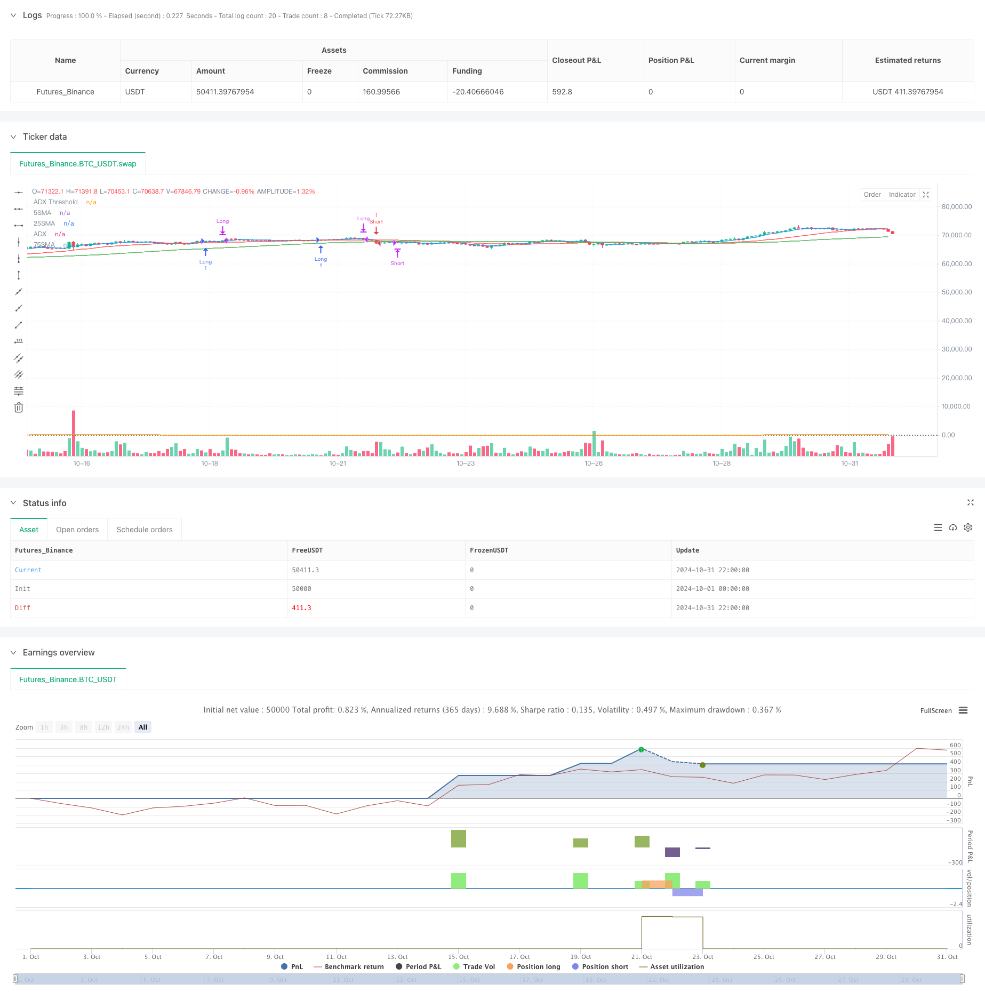

> Name

Multi-MA-Trend-Strength-Capture-with-Momentum-Profit-Taking-Strategy
> Author

ChaoZhang

> Strategy Description



[trans]
#### Overview
This strategy is a trend following strategy based on a multiple moving average system, which combines trend strength confirmation and volatility capture mechanisms. The strategy uses the 5-period, 25-period and 75-period triple moving average system as the core, screens strong trends through the ADX indicator, and integrates a rapid fluctuation monitoring system to achieve timely profit taking. This multi-level trading mechanism can effectively identify market trends and trade at the right time.
#### Strategy Principle
Strategy operation is based on three core mechanisms:
1. Multiple moving average system: Use the intersection of 5SMA and 25SMA as the main entry signal, and the 75SMA as a trend filter to ensure that the trading direction is consistent with the main trend.
2. Confirmation of trend strength: Use the ADX indicator and require the ADX value to be greater than 20 to ensure that transactions are only conducted when the trend is clear.
3. Fluctuation monitoring system: By monitoring the range of price changes (0.6% threshold), profits can be locked in time when severe fluctuations occur.
Specific trading rules:
- Bull entry: 5SMA crosses above 25SMA, and the price is above 75SMA, ADX>20
- Short entry: 5SMA crosses below 25SMA, and the price is below 75SMA, ADX>20
- Exit conditions: Severe fluctuations of more than 0.6%, or reverse entry signals
#### Strategic Advantages
1. Multiple confirmation mechanism: Through the cooperation of multiple moving averages and ADX indicators, the risk of false breakthroughs is significantly reduced
2. Trend adaptability: capable of adaptive adjustment in different market environments, suitable for medium and long-term trend trading
3. Improved risk control: Through the fluctuation monitoring system, profits can be stopped in a timely manner when the market fluctuates violently.
4. Clear and simple logic: The strategy logic is intuitive and easy to understand and maintain.
5. Parameter adjustability: Key parameters such as moving average period and ADX threshold can be adjusted according to market characteristics
#### Strategy Risk
1. Volatile market risk: Frequent false signals may occur in a volatile market.
2. Lagging risk: The moving average system has a certain lag and may miss the best entry opportunity.
3. Fluctuation detection sensitivity: The 0.6% fluctuation threshold needs to be optimized according to different market characteristics.
4. Trend reversal risk: You may suffer a large retracement when the trend suddenly reverses.
5. Parameter dependence: The strategy effect is greatly affected by parameter selection.
#### Strategy optimization direction
1. Introduce adaptive parameters:
   - Dynamically adjust the moving average period based on market volatility
   - Use ATR to dynamically adjust fluctuation detection thresholds
2. Enhance trend confirmation mechanism:
   - Integrate other trend indicators such as MACD
   - Added transaction volume confirmation mechanism
3. Optimize take profit and stop loss:
   - Implement dynamic stop loss position setting
   - Optimize position management based on risk-return ratio
4. Market environment classification:
   - Add market environment identification mechanism
   - Use different parameters for different market conditions
#### Summary
This strategy builds a complete trading system through three dimensions: multiple moving average system, trend strength confirmation and fluctuation monitoring. The core advantage of the strategy lies in its multi-level confirmation mechanism and flexible risk control system. Through the provided optimization suggestions, the strategy can further improve its adaptability and stability. In practical applications, it is recommended that traders optimize parameters according to specific market characteristics and use them in combination with reasonable fund management strategies. ||
#### Overview
This strategy is a trend-following system based on multiple moving averages, combining trend strength confirmation and volatility capture mechanisms. It utilizes a triple moving average system of 5, 25, and 75 periods as its core, filters strong trends through the ADX indicator, and integrates a rapid volatility monitoring system for timely profit-taking. This multi-layered trading mechanism effectively identifies market trends and executes trades at appropriate times.

#### Strategy Principle
The strategy operates on three core mechanisms:
1. Multiple MA System: Uses 5SMA and 25SMA crossover as primary entry signals, with 75SMA as a trend filter to ensure trade direction aligns with the main trend.
2. Trend Strength Confirmation: Utilizes ADX indicator, requiring ADX values above 20 to ensure trading only in clear trends.
3. Volatility Monitoring System: Monitors price movement magnitude (0.6% threshold) to lock in profits during intense volatility.

Specific trading rules:
- Long Entry: 5SMA crosses above 25SMA, price above 75SMA, ADX>20
- Short Entry: 5SMA crosses below 25SMA, price below 75SMA, ADX>20
- Exit Conditions: Sudden moves exceeding 0.6% or opposing entry signals

#### Strategy Advantages
1. Multiple Confirmation Mechanism: Significantly reduces false breakout risks through multiple MAs and ADX
2. Trend Adaptability: Self-adapts to different market environments, suitable for medium to long-term trend trading
3. Comprehensive Risk Control: Timely profit-taking during market volatility through monitoring system
4. Clear Logic: Strategy logic is intuitive, easy to understand and maintain
5. Parameter Adjustability: Key parameters like MA periods and ADX threshold can be adjusted based on market characteristics

#### Strategy Risks
1. Choppy Market Risk: May generate frequent false signals in ranging markets
2. Lag Risk: MA system has inherent lag, potentially missing optimal entry points
3. Volatility Detection Sensitivity: 0.6% threshold needs optimization for different markets
4. Trend Reversal Risk: May face significant drawdown during sudden trend reversals
5. Parameter Dependency: Strategy performance heavily influenced by parameter selection

#### Strategy Optimization Directions
1. Introduce Adaptive Parameters:
   - Dynamically adjust MA periods based on market volatility
   - Use ATR for dynamic volatility detection threshold

2. Enhanced Trend Confirmation:
   - Integrate additional trend indicators like MACD
   - Add volume confirmation mechanism

3. Optimize Profit/Loss Taking:
   - Implement dynamic stop-loss positioning
   - Optimize position management based on risk-reward ratio

4. Market Environment Classification:
   - Add market environment identification mechanism
   - Apply different parameters for different market states

#### Summary
The strategy builds a complete trading system through multiple moving averages, trend strength confirmation, and volatility monitoring dimensions. Its core advantages lie in its multi-level confirmation mechanism and flexible risk control system. Through the provided optimization suggestions, the strategy can further enhance its adaptability and stability. In practical application, traders are advised to optimize parameters according to specific market characteristics and combine with reasonable money management strategies.[/trans]


> Source (PineScript)

``` pinescript
/*backtest
start: 2024-10-01 00:00:00
end: 2024-10-31 23:59:59
period: 2h
basePeriod: 2h
exchanges: [{"eid":"Futures_Binance","currency":"BTC_USDT"}]
*/

//@version=5
strategy("5SMA-25SMA Crossover Strategy with ADX Filter and Sudden Move Profit Taking", overlay=true)

// パラメータの設定
sma5 = ta.sma(close, 5)
sma25 = ta.sma(close, 25)
sma75 = ta.sma(close, 75)

// ADXの計算
length = 14
tr = ta.tr(true)
plus_dm = ta.rma(math.max(ta.change(high), 0), length)
minus_dm = ta.rma(math.max(-ta.change(low), 0), length)
tr_sum = ta.rma(tr, length)
plus_di = 100 * plus_dm / tr_sum
minus_di = 100 * minus_dm / tr_sum
dx = 100 * math.abs(plus_di - minus_di) / (plus_di + minus_di)
adx = ta.rma(dx, length)

// ロングとショートのエントリー条件
longCondition = ta.crossover(sma5, sma25) and close > sma75 and adx > 20
shortCondition = ta.crossunder(sma5, sma25) and close < sma75 and adx > 20

// 急激な変動を検知する条件（ここでは、前のローソク足に比べて0.6%以上の値動きがあった場合）
suddenMove = math.abs(ta.change(close)) > close[1] * 0.006

// ポジション管理
if (longCondition)
    strategy.entry("Long", strategy.long)
if (shortCondition)
    strategy.entry("Short", strategy.short)

// 急激な変動があった場合、ポジションを利益確定（クローズ）する
if (strategy.position_size > 0 and suddenMove)
    strategy.close("Long")
if (strategy.position_size < 0 and suddenMove)
    strategy.close("Short")

// エグジット条件
if (strategy.position_size > 0 and shortCondition)
    strategy.close("Long")
if (strategy.position_size < 0 and longCondition)
    strategy.close("Short")

// SMAとADXのプロット
plot(sma5, color=color.blue, title="5SMA")
plot(sma25, color=color.red, title="25SMA")
plot(sma75, color=color.green, title="75SMA")
plot(adx, color=color.orange, title="ADX")
hline(20, "ADX Threshold", color=color.gray, linestyle=hline.style_dotted)

```

> Detail

https://www.fmz.com/strategy/471725

> Last Modified

2024-11-12 17:18:26
