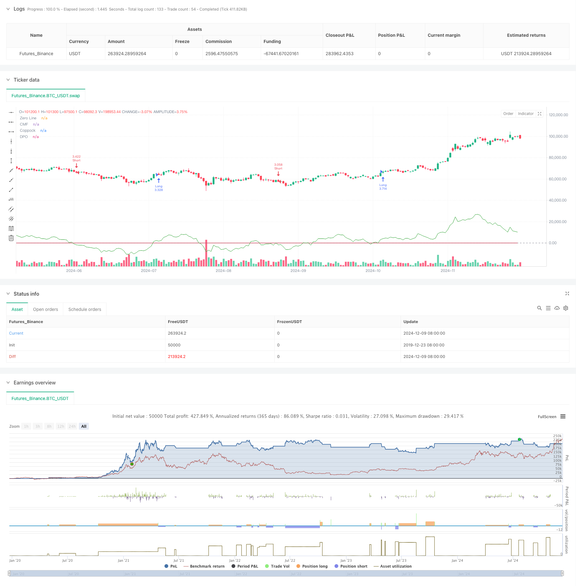

> Name

Multi-Market-Adaptive-Multi-Indicator-Trend-Following-Strategy
> Author

ChaoZhang

> Strategy Description



[trans]
#### Overview
This is an adaptive trend following strategy based on a combination of multiple technical indicators that can automatically adjust parameters according to different market characteristics. This strategy comprehensively uses the Capital Flow Index (CMF), the Detrended Price Oscillator (DPO) and the Coppock Index to capture market trends, and uses volatility adjustment factors to adapt to the characteristics of different markets. The strategy has a complete position management and risk control system, and can dynamically adjust the transaction scale according to market volatility.
#### Strategy Principles
The core logic of the strategy is to confirm the trend direction and trading timing through the cooperation of multiple indicators. Specifically:
1. Use the CMF indicator to measure capital flow and determine market sentiment.
2. Use the DPO indicator to eliminate the impact of long-term trends and focus on short- and medium-term price fluctuations.
3. Use the improved Coppock indicator to capture trend turning points
4. A trading signal will be generated when the three indicators confirm together
5. Dynamically calculate stop loss and take profit positions through ATR
6. Automatically adjust leverage and volatility parameters according to different market characteristics (stocks, foreign exchange, futures)
#### Strategic Advantages
1. Multi-indicator cross-validation can effectively filter out false signals
2. Strong adaptability and can be applied to different market environments
3. Complete position management system, dynamically adjust positions according to volatility
4. It has a stop-loss and stop-profit mechanism to control risks while protecting profits.
5. Support simultaneous trading of multiple varieties to spread risks
6. The transaction logic is clear and easy to maintain and optimize.
#### Strategy Risk
1. The multi-indicator system may have hysteresis and miss opportunities in fast market conditions.
2. Excessive parameter optimization may lead to overfitting
3. Market switching periods may produce false signals
4. Too tight a stop loss setting may lead to frequent stop losses.
5. Transaction costs will affect strategy returns
It is recommended to manage risk by:
- Regularly check parameter validity
- Monitor position performance in real time
- Reasonably control leverage ratio
- Set maximum drawdown limit
#### Strategy optimization direction
1. Introduce market volatility status judgment and use different parameter combinations in different volatility environments
2. Add more market characteristic identification indicators to improve strategy adaptability
3. Optimize the stop loss and take profit mechanism, consider using trailing stop loss
4. Develop an automatic parameter optimization system and adjust parameters regularly
5. Add transaction cost analysis module
6. Add a risk warning mechanism
#### Summary
This strategy is a relatively complete trend tracking system. Through the cooperation of multiple indicators and a risk control mechanism, it can ensure returns while also controlling risks well. The strategy is highly scalable and has a lot of room for optimization. It is recommended to start with a small scale in real trading and gradually increase the transaction size, while continuously monitoring the strategy performance and adjusting parameters in a timely manner.
|| 

#### Overview
This is an adaptive trend following strategy based on multiple technical indicators that automatically adjusts parameters according to different market characteristics. The strategy combines the Chaikin Money Flow (CMF), Detrended Price Oscillator (DPO), and Coppock Curve to capture market trends, with volatility adjustment factors to adapt to different market features. It includes a comprehensive position management and risk control system that dynamically adjusts trading size based on market volatility.

#### Strategy Principles
The core logic of the strategy is to confirm trend direction and trading timing through multiple indicator cooperation:
1. Uses CMF indicator to measure money flow and judge market sentiment
2. Employs DPO to eliminate long-term trend influence and focus on medium-short term price fluctuations
3. Adopts modified Coppock indicator to capture trend turning points
4. Generates trading signals only when all three indicators confirm
5. Dynamically calculates stop-loss and take-profit levels using ATR
6. Automatically adjusts leverage and volatility parameters based on different market characteristics (stocks, forex, futures)

#### Strategy Advantages
1. Multiple indicator cross-validation effectively filters false signals
2. Strong adaptability suitable for different market environments
3. Comprehensive position management system with dynamic position sizing based on volatility
4. Includes stop-loss and take-profit mechanisms to control risk while protecting profits
5. Supports multiple instrument trading for risk diversification
6. Clear trading logic that's easy to maintain and optimize

#### Strategy Risks
1. Multiple indicator system may have lag in fast-moving markets
2. Parameter optimization may lead to overfitting
3. False signals may occur during market regime changes
4. Tight stop-loss settings may result in frequent stops
5. Trading costs will impact strategy returns
Risk management recommendations:
- Regular parameter validity checks
- Real-time position monitoring
- Proper leverage control
- Maximum drawdown limits

#### Optimization Directions
1. Introduce market volatility state judgment to use different parameter sets in different volatility environments
2. Add more market characteristic identification indicators to improve strategy adaptability
3. Optimize stop-loss and take-profit mechanisms, consider implementing trailing stops
4. Develop automatic parameter optimization system for periodic adjustment
5. Add trading cost analysis module
6. Implement risk warning mechanism

#### Summary
This strategy is a comprehensive trend following system that balances returns and risk through multiple indicators and risk control mechanisms. The strategy has strong extensibility with significant room for optimization. It is recommended to start with small scale in live trading, gradually increase trading size, while continuously monitoring strategy performance and adjusting parameters timely.[/trans]


> Source (PineScript)

``` pinescript
/*backtest
start: 2019-12-23 08:00:00
end: 2024-12-10 08:00:00
period: 1d
basePeriod: 1d
exchanges: [{"eid":"Futures_Binance","currency":"BTC_USDT"}]
*/

//@version=5
strategy("Multi-Market Adaptive Trading Strategy", overlay=true, default_qty_type=strategy.percent_of_equity, default_qty_value=10)

// Input parameters
i_market_type = input.string("Crypto", "Market Type", options=["Forex", "Crypto", "Futures"])
i_risk_percent = input.float(1, "Risk Per Trade (%)", minval=0.1, maxval=100, step=0.1)
i_volatility_adjustment = input.float(1.0, "Volatility Adjustment", minval=0.1, maxval=5.0, step=0.1)
i_max_position_size = input.float(5.0, "Max Position Size (%)", minval=1.0, maxval=100.0, step=1.0)
i_max_open_trades = input.int(3, "Max Open Trades", minval=1, maxval=10)

// Indicator Parameters
i_cmf_length = input.int(20, "CMF Length", minval=1)
i_dpo_length = input.int(21, "DPO Length", minval=1)
i_coppock_short = input.int(11, "Coppock Short ROC", minval=1)
i_coppock_long = input.int(14, "Coppock Long ROC", minval=1)
i_coppock_wma = input.int(10, "Coppock WMA", minval=1)
i_atr_length = input.int(14, "ATR Length", minval=1)

// Market-specific Adjustments
volatility_factor = i_market_type == "Forex" ? 0.1 : i_market_type == "Futures" ? 1.5 : 1.0
volatility_factor *= i_volatility_adjustment
leverage = i_market_type == "Forex" ? 100.0 : i_market_type == "Futures" ? 20.0 : 3.0

// Calculate Indicators
mf_multiplier = ((close - low) - (high - close)) / (high - low)
mf_volume = mf_multiplier * volume
cmf = ta.sma(mf_volume, i_cmf_length) / ta.sma(volume, i_cmf_length)

dpo_offset = math.floor(i_dpo_length / 2) + 1
dpo = close - ta.sma(close, i_dpo_length)[dpo_offset]

roc1 = ta.roc(close, i_coppock_short)
roc2 = ta.roc(close, i_coppock_long)
coppock = ta.wma(roc1 + roc2, i_coppock_wma)

atr = ta.atr(i_atr_length)

// Define Entry Conditions
long_condition = cmf > 0 and dpo > 0 and coppock > 0 and ta.crossover(coppock, 0)
short_condition = cmf < 0 and dpo < 0 and coppock < 0 and ta.crossunder(coppock, 0)

// Calculate Position Size
account_size = strategy.equity
risk_amount = math.min(account_size * (i_risk_percent / 100), account_size * (i_max_position_size / 100))
position_size = (risk_amount / (atr * volatility_factor)) * leverage

// Execute Trades
if (long_condition and strategy.opentrades < i_max_open_trades)
    sl_price = close - (atr * 2 * volatility_factor)
    tp_price = close + (atr * 3 * volatility_factor)
    strategy.entry("Long", strategy.long, qty=position_size)
    strategy.exit("Long Exit", "Long", stop=sl_price, limit=tp_price)

if (short_condition and strategy.opentrades < i_max_open_trades)
    sl_price = close + (atr * 2 * volatility_factor)
    tp_price = close - (atr * 3 * volatility_factor)
    strategy.entry("Short", strategy.short, qty=position_size)
    strategy.exit("Short Exit", "Short", stop=sl_price, limit=tp_price)

// Plot Indicators
plot(cmf, color=color.blue, title="CMF")
plot(dpo, color=color.green, title="DPO")
plot(coppock, color=color.red, title="Coppock")
hline(0, "Zero Line", color=color.gray)

// Alerts
alertcondition(long_condition, title="Long Entry", message="Potential Long Entry Signal")
alertcondition(short_condition, title="Short Entry", message="Potential Short Entry Signal")

// // Performance reporting
// if barstate.islastconfirmedhistory
//     label.new(bar_index, high, text="Strategy Performance:\nTotal Trades: " + str.tostring(strategy.closedtrades) + 
//               "\nWin Rate: " + str.tostring(strategy.wintrades / strategy.closedtrades * 100, "#.##") + "%" +
//               "\nProfit Factor: " + str.tostring(strategy.grossprofit / strategy.grossloss, "#.##"))
```

> Detail

https://www.fmz.com/strategy/474850

> Last Modified

2024-12-12 15:23:28
