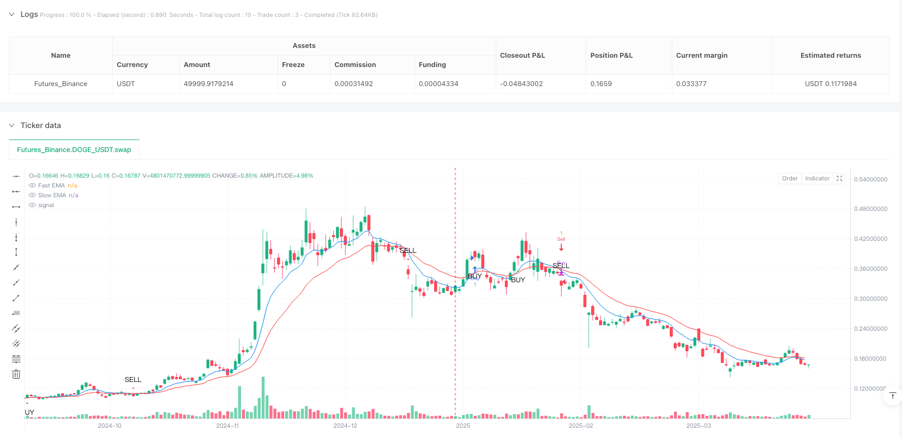
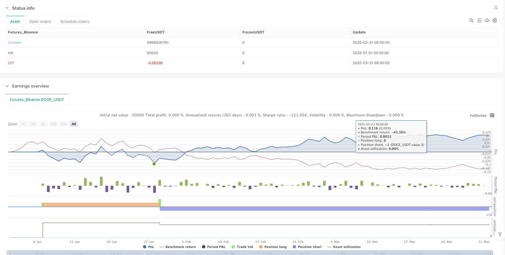

> Name

Multi-Momentum-Indicator-Trend-Tracking-Quantitative-Trading-Strategy
> Author

ianzeng123

> Strategy Description





[trans]

#### Overview
The multi-momentum index trend tracking quantitative trading strategy is a compound quantitative trading method that combines the exponential moving average (EMA), the relative strength index (RSI) and the moving average convergence divergence indicator (MACD). This strategy aims to improve the accuracy and reliability of trading signals by integrating multiple technical indicators, and is especially suitable for short-term and mid-term trading in high-volatility markets.
#### Strategy Principle
The core principle of this strategy is joint verification of multiple indicators:
1. Use fast EMA (9 periods) and slow EMA (21 periods) to determine trend direction and momentum changes
2. Confirm market momentum and overbought and oversold conditions through RSI (14 period)
3. Use the MACD indicator to verify the momentum and direction of the trend
Specific trading signal generation rules:
- When the fast EMA crosses the slow EMA, RSI > 50, and the MACD line is above the signal line, a buy signal is generated
- When the fast EMA crosses the slow EMA, RSI < 50, and the MACD line is below the signal line, a sell signal is generated
#### Strategic Advantages
1. Joint verification of multiple indicators significantly reduces the risk of false signals
2. Dynamically capture changes in market trends and have strong adaptability
3. Adjustable parameters to flexibly respond to different market environments
4. The signal generation logic is clear and easy to understand and implement.
5. Suitable for short-term and mid-term trading in highly volatile markets
#### Strategy Risk
1. Frequent invalid transactions may occur in sideways markets
2. Improper selection of indicator parameters may lead to reduced trading efficiency
3. Failure to consider transaction costs and slippage effects
4. There are limitations to the stability of strategies in a single market environment
#### Strategy optimization direction
1. Introduce additional filtering conditions, such as trading volume confirmation
2. Add stop loss and take profit mechanisms
3. Dynamically adjust EMA, RSI and MACD parameters
4. Develop parameter adaptation algorithms based on machine learning
5. Introduce more indicators for judging the market environment
#### Summarize
The multi-momentum indicator trend tracking quantitative trading strategy builds a relatively robust trading signal generation system by integrating three key technical indicators: EMA, RSI and MACD. This strategy not only maintains sufficient flexibility, but also has strong risk control capabilities, providing quantitative traders with a trading plan worthy of in-depth study.
|| 

#### Overview

The Multi-Momentum Indicator Trend Tracking Quantitative Trading Strategy is a composite quantitative trading method that combines Exponential Moving Average (EMA), Relative Strength Index (RSI), and Moving Average Convergence Divergence (MACD). By integrating multiple technical indicators, the strategy aims to improve the accuracy and reliability of trading signals, particularly suitable for short and medium-term trading in high-volatility markets.

#### Strategy Principle

The core principle of this strategy is multi-indicator joint verification:
1. Use fast EMA (9 periods) and slow EMA (21 periods) to judge trend direction and momentum changes
2. Confirm market momentum and overbought/oversold states through RSI (14 periods)
3. Verify trend momentum and direction using MACD indicator

Specific signal generation rules:
- When fast EMA crosses above slow EMA, RSI > 50, and MACD line is above signal line, generate a buy signal
- When fast EMA crosses below slow EMA, RSI < 50, and MACD line is below signal line, generate a sell signal

#### Strategy Advantages

1. Multi-indicator joint verification significantly reduces false signal risk
2. Dynamically capture market trend changes with strong adaptability
3. Adjustable parameters, flexible for different market environments
4. Clear signal generation logic, easy to understand and implement
5. Suitable for short and medium-term trading in high-volatility markets

#### Strategy Risks

1. Potential frequent invalid trades in range-bound markets
2. Inappropriate indicator parameter selection may reduce trading efficiency
3. Does not consider transaction costs and slippage
4. Limited stability in single market environment

#### Strategy Optimization Directions

1. Introduce additional filtering conditions, such as volume confirmation
2. Add stop-loss and take-profit mechanisms
3. Dynamically adjust EMA, RSI, and MACD parameters
4. Develop machine learning-based parameter adaptive algorithms
5. Introduce more market environment judgment indicators

#### Summary

The Multi-Momentum Indicator Trend Tracking Quantitative Trading Strategy builds a relatively robust trading signal generation system by integrating three key technical indicators: EMA, RSI, and MACD. The strategy maintains sufficient flexibility while possessing strong risk control capabilities, providing quantitative traders with a trading solution worth in-depth research.[/trans]


> Source (PineScript)

``` pinescript
/*backtest
start: 2025-01-01 00:00:00
end: 2025-04-01 00:00:00
period: 1d
basePeriod: 1d
exchanges: [{"eid":"Futures_Binance","currency":"DOGE_USDT"}]
*/

//@version=6
strategy("EMA + RSI + MACD Strategy", overlay=true)

// Input for EMA Lengths
emaFastLength = input(9, title="Fast EMA Length")
emaSlowLength = input(21, title="Slow EMA Length")

// RSI Settings
rsiLength = input(14, title="RSI Length")
rsiOverbought = input(70, title="RSI Overbought Level")
rsiOversold = input(30, title="RSI Oversold Level")

// MACD Settings
[macdLine, signalLine, _] = ta.macd(close, 12, 26, 9)

// Calculate EMAs
emaFast = ta.ema(close, emaFastLength)
emaSlow = ta.ema(close, emaSlowLength)

// Calculate RSI
rsi = ta.rsi(close, rsiLength)

// Plot EMAs
plot(emaFast, title="Fast EMA", color=color.blue, linewidth=1)
plot(emaSlow, title="Slow EMA", color=color.red, linewidth=1)

// Buy and Sell Conditions
bullishCrossover = ta.crossover(emaFast, emaSlow) and rsi > 50 and macdLine > signalLine
bearishCrossover = ta.crossunder(emaFast, emaSlow) and rsi < 50 and macdLine < signalLine

// Plot Buy and Sell Signals
plotshape(series=bullishCrossover, title="BuySignal", location=location.belowbar, color=color.green, style=shape.triangleup, size=size.small, text="BUY")
plotshape(series=bearishCrossover, title="SellSignal", location=location.abovebar, color=color.red, style=shape.triangledown, size=size.small, text="SELL")

// Strategy Execution
if bullishCrossover
    strategy.entry("Buy", strategy.long)

if bearishCrossover
    strategy.close("Buy")
    strategy.entry("Sell", strategy.short)

```

> Detail

https://www.fmz.com/strategy/489198

> Last Modified

2025-04-02 16:19:35
