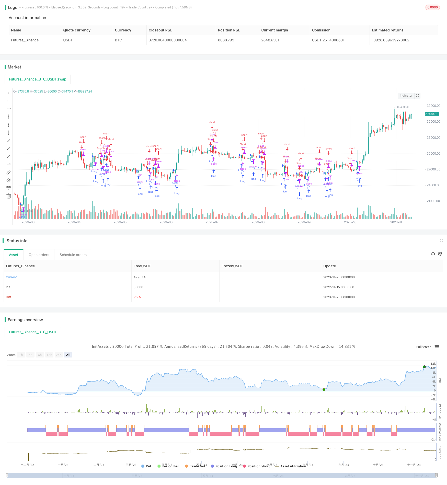

> Name

Multi-Moving-Average-Breakout-Strategy
> Author

ChaoZhang

> Strategy Description



[trans]

### Overview
This strategy uses breakouts and retracements of multiple moving averages to generate trading signals. When the price breaks above the upward moving average, go long; when the price falls below the downward moving average, go short.
### Strategy Principles
The code uses four moving averages of different periods - the 21-day line, the 50-day line, the 100-day line and the 200-day line. When the price breaks above these moving averages, you enter the market to go long, and when the price falls below these moving averages, you enter the market to go short. In addition, the strategy also sets stop loss and take profit levels. Specifically, the stop loss position is set near the lowest price of the previous K line, and the take profit position is set to 3 times the distance from the lowest price to the highest price of the previous K line.
The core idea of ​​this strategy is to use moving averages to determine price trends. When the price breaks through the upward moving average, it means that it is in an upward trend and you should go long; when the price falls below the downward moving average, it means that it is in a downward trend and you should go short. By using multiple moving averages with different periods, the trend can be judged more accurately, and trading signals can also be verified through the consistency of the trend.
### Advantage Analysis
The main advantages of this strategy are:
1. Use multiple moving averages to effectively filter out false signals
2. Set up a stop-loss and stop-profit strategy to limit a single loss
3. Simple operation and easy to implement
### Risk Analysis
The main risks of this strategy are:
1. The moving average strategy is prone to misalignment, thus missing the price reversal point.
2. Breakthrough false signals may cause losses
3. Improper stop-loss and stop-profit settings may increase losses.
These risks can be reduced by adjusting moving average parameters and optimizing stop-loss and take-profit strategies.
### Optimization direction
This strategy can be optimized from the following aspects:
1. Test moving average combinations with more periods to find the best parameters
2. Add other indicators for judgment to avoid false breakthroughs
3. Optimize stop-loss and take-profit strategies to achieve a better risk-return ratio
4. Adjust parameters under different market conditions to make the strategy more robust
### Summarize
Overall, this strategy is a typical trend following strategy. The advantage is that the ideas are clear and easy to understand and implement; the disadvantage is that it is easy to produce false signals. The strategy can be made more effective by optimizing parameters and adding other indicators. This strategy is suitable for medium and long-term positions, and can also be used as a component of short-term trading strategies.
||

### Overview

This strategy generates trading signals based on the breakthrough and callback of multiple moving average lines. It goes long when the price breaks through the upward moving average line and goes short when the price falls below the downward moving average line.  

### Strategy Logic

The code uses 4 moving average lines with different periods - 21-day, 50-day, 100-day and 200-day. It enters long positions when the price breaks through these MA lines and enters short positions when the price falls below these MA lines. In addition, stop loss and take profit levels are set in the strategy. Specifically, the stop loss is set near the lowest point of the previous candle, and the take profit is set at 3 times the distance between the lowest point and the highest point of the previous candle.

The core idea of this strategy is to judge the trend using moving averages. When the price breaks through the upward MA lines, it indicates an upward trend so should go long. When the price falls below the downward MA lines, it indicates a downward trend so should go short. Using multiple MA lines with different periods can judge the trend more accurately and also verify trading signals through consistency of the trend.

### Advantage Analysis 

The main advantages of this strategy are:

1. Using multiple MAs can effectively filter false signals
2. Setting stop loss and take profit can limit single loss  
3. Simple to implement

### Risk Analysis

The main risks of this strategy are:

1. MA strategies are prone to misalignment, thus missing price reversal points  
2. Breakthrough false signals may cause losses
3. Improper stop loss and take profit settings may amplify losses

These risks can be reduced by adjusting MA parameters and optimizing stop loss and take profit.

### Optimization

This strategy can be optimized in the following aspects:

1. Test more MA combinations to find optimal parameters  
2. Add other indicators to avoid false breakouts
3. Optimize stop loss and take profit for better risk-reward ratio 
4. Adjust parameters for different market conditions to make the strategy more robust

### Summary

In general, this is a typical trend following strategy. The advantages are clear logic and easy to understand and implement. The disadvantage is prone to false signals. The strategy can be improved by parameter tuning and adding other indicators. It is suitable for medium-to-long term holding and can also be used as a component of short-term trading strategies.

[/trans]


> Source (PineScript)

``` pinescript
/*backtest
start: 2022-11-15 00:00:00
end: 2023-11-21 00:00:00
period: 1d
basePeriod: 1h
exchanges: [{"eid":"Futures_Binance","currency":"BTC_USDT"}]
*/

//@version=5
strategy("DolarBasar by AlperDursun", shorttitle="DOLARBASAR", overlay=true)

// Input for Moving Averages
ma21 = ta.sma(close, 21)
ma50 = ta.sma(close, 50)
ma100 = ta.sma(close, 100)
ma200 = ta.sma(close, 200)

// Calculate the lowest point of the previous candle for stop loss
lowestLow = ta.lowest(low, 2)

// Calculate the highest point of the previous candle for stop loss
highestHigh = ta.highest(high, 2)

// Calculate take profit levels
takeProfitLong = lowestLow - 3 * (lowestLow - highestHigh)
takeProfitShort = highestHigh + 3 * (lowestLow - highestHigh)

// Entry Conditions
longCondition = ta.crossover(close, ma21) or ta.crossover(close, ma50) or ta.crossover(close, ma100) or ta.crossover(close, ma200)
shortCondition = ta.crossunder(close, ma21) or ta.crossunder(close, ma50) or ta.crossunder(close, ma100) or ta.crossunder(close, ma200)

// Stop Loss Levels
stopLossLong = lowestLow * 0.995
stopLossShort = highestHigh * 1.005

// Exit Conditions
longExitCondition = low < stopLossLong or high > takeProfitLong
shortExitCondition = high > stopLossShort or low < takeProfitShort

if (longCondition)
    strategy.entry("Long", strategy.long)

if (shortCondition)
    strategy.entry("Short", strategy.short)

if (longExitCondition)
    strategy.exit("Long Exit", from_entry="Long", stop=stopLossLong, limit=takeProfitLong)

if (shortExitCondition)
    strategy.exit("Short Exit", from_entry="Short", stop=stopLossShort, limit=takeProfitShort)

```

> Detail

https://www.fmz.com/strategy/432874

> Last Modified

2023-11-22 13:41:38
