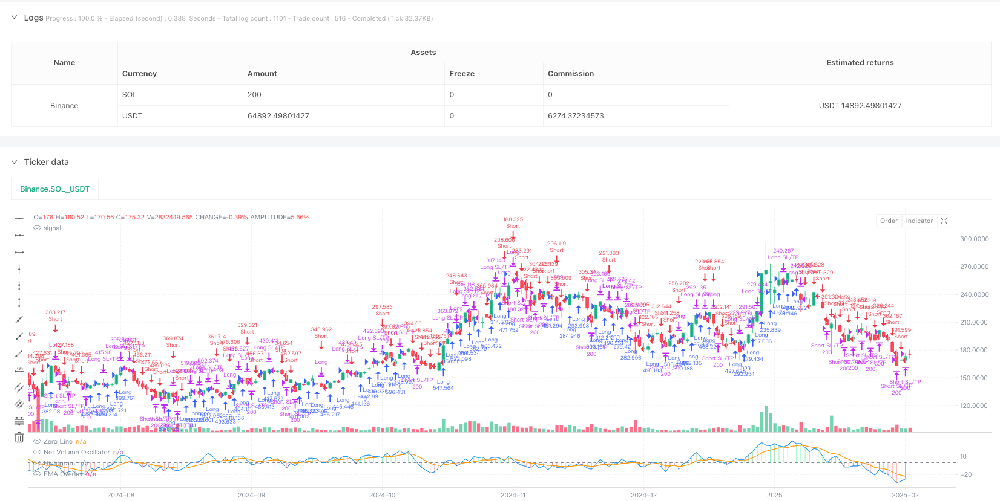
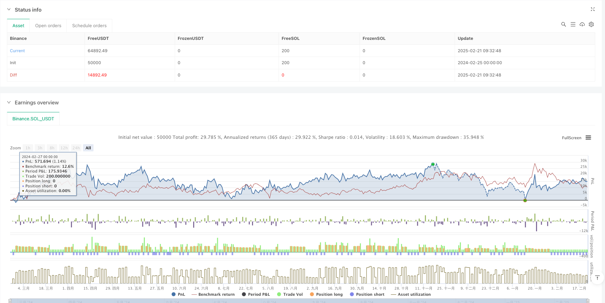

> Name

Multi-Moving-Average-Net-Volume-Oscillator-Trend-Reversal-Trading-Strategy
> Author

ianzeng123

> Strategy Description





[trans]
#### Overview
This strategy is a trend following system based on volume and price changes that predicts market direction by calculating the Net Volume Oscillator (NVO). The strategy combines a variety of moving average types (EMA, WMA, SMA, HMA), and determines the market trend by comparing the positional relationship between the oscillator and its EMA overlay line, and trades at the appropriate time. The strategy also incorporates stop-loss and take-profit mechanisms to control risk and lock in profits.
#### Strategy Principle
The core of the strategy is to judge market sentiment by calculating the daily net trading volume shock value. The specific calculation steps are as follows:
1. Calculate the price range multiplier: Calculate a multiplier between 0-1 based on the highest price, lowest price and closing price of the day
2. Calculate effective upside and downside volume: weight volume based on price movement direction and multiplier
3. Calculate net trading volume: subtract effective falling trading volume from effective rising trading volume
4. Apply selected moving average: Smooth the net volume data
5. Calculate the EMA overlay line: as a reference line for trend judgment
6. Calculate the rate of change (ROC): used to determine changes in trend strength
The generation of trading signals is based on the following rules:
- Long conditions: The oscillator crosses the EMA overlay line
- Short selling conditions: The oscillator crosses the EMA overlay line
- Stop loss: price stop loss based on percentage
- Take Profit: Price take profit based on percentage
#### Strategic Advantages
1. Multi-dimensional analysis: combines market information from three dimensions: price, trading volume and trend change rate
2. High flexibility: supports multiple moving average types and can be adjusted according to different market characteristics
3. Perfect risk management: including stop-loss and stop-profit mechanisms, which can effectively control risks
4. Strong visualization effect: display trend intensity changes through histograms to facilitate understanding of market status
5. Strong adaptability: through parametric design, it can adapt to different market environments and trading varieties
#### Strategy Risk
1. Trend reversal risk: Frequent false signals may occur in volatile markets
2. Lagging risk: The moving average itself has a certain lag, which may lead to less than ideal entry and exit timings.
3. Parameter sensitivity: Different parameter combinations may lead to large differences in strategy performance
4. Market environment dependence: may perform poorly in certain market environments
5. Technical limitations: Relying only on technical indicators without considering fundamental factors
Risk control suggestions:
- Suggest parameter optimization under different market environments
- Can be combined with other technical indicators for signal confirmation
- Appropriately adjust stop-loss and take-profit parameters to adapt to different market volatility
#### Strategy optimization direction
1. Optimization of signal confirmation mechanism:
   - Added trading volume confirmation conditions
   - Added trend strength filter
   -Introducing volatility adaptive mechanism
2. Risk management optimization:
   - Implement dynamic stop loss mechanism
   - Added fund management module
   - Introducing a batch opening and reduction mechanism
3. Parameter optimization:
   - Develop adaptive parameter adjustment mechanism
   - Implement parameter switching based on market environment
   - Add machine learning model for parameter optimization
#### Summary
This strategy builds a relatively complete trend following trading system by comprehensively analyzing trading volume and price data. The main feature of the strategy is that it combines a variety of technical indicators and provides flexible parameter configuration options. Although there are certain risks, through reasonable risk control and continuous optimization, this strategy is expected to achieve stable returns in actual transactions. It is recommended that traders conduct sufficient backtesting before using it in real trading, and adjust parameters appropriately according to specific market conditions.
|| 

#### Overview
This strategy is a trend-following system based on volume and price movements, using the Net Volume Oscillator (NVO) to predict market direction. It combines multiple types of moving averages (EMA, WMA, SMA, HMA) and generates trading signals by comparing the oscillator's position relative to its EMA overlay. The strategy includes stop-loss and take-profit mechanisms for risk management.

#### Strategy Principles
The core mechanism calculates daily net volume oscillator values to gauge market sentiment. The calculation process includes:
1. Price range multiplier calculation: Based on daily high, low, and closing prices
2. Effective up/down volume calculation: Volume weighted by price movement direction and multiplier
3. Net volume calculation: Effective up volume minus effective down volume
4. Application of selected moving average: Smoothing the net volume data
5. EMA overlay calculation: Reference line for trend determination
6. Rate of Change (ROC) calculation: For trend strength analysis

Trading signals are generated based on:
- Long entry: Oscillator crosses above EMA overlay
- Short entry: Oscillator crosses below EMA overlay
- Stop-loss: Percentage-based price stops
- Take-profit: Percentage-based profit targets

#### Strategy Advantages
1. Multi-dimensional analysis: Combines price, volume, and trend rate of change
2. High flexibility: Supports multiple moving average types for different market characteristics
3. Comprehensive risk management: Includes stop-loss and take-profit mechanisms
4. Strong visualization: Histogram display of trend strength changes
5. High adaptability: Parameterized design for different market conditions

#### Strategy Risks
1. Trend reversal risk: May generate false signals in choppy markets
2. Lag risk: Moving averages have inherent lag, potentially affecting entry/exit timing
3. Parameter sensitivity: Different parameter combinations may lead to varying performance
4. Market environment dependency: May underperform in certain market conditions
5. Technical limitations: Relies solely on technical indicators, ignoring fundamentals

Risk control suggestions:
- Optimize parameters for different market environments
- Consider additional technical indicators for confirmation
- Adjust stop-loss and take-profit parameters based on market volatility

#### Strategy Optimization Directions
1. Signal confirmation optimization:
   - Add volume confirmation conditions
   - Implement trend strength filters
   - Introduce volatility adaptation mechanisms

2. Risk management optimization:
   - Develop dynamic stop-loss mechanisms
   - Add position sizing module
   - Implement scaled entry/exit mechanisms

3. Parameter optimization:
   - Develop adaptive parameter adjustment mechanisms
   - Implement market condition-based parameter switching
   - Add machine learning models for parameter optimization

#### Summary
This strategy builds a comprehensive trend-following trading system through integrated analysis of volume and price data. Its main features include the combination of multiple technical indicators and flexible parameter configuration options. While certain risks exist, the strategy shows potential for stable returns through proper risk control and continuous optimization. Traders are advised to conduct thorough backtesting and adjust parameters according to specific market conditions before live trading.[/trans]


> Source (PineScript)

``` pinescript
/*backtest
start: 2024-02-25 00:00:00
end: 2025-02-22 08:00:00
period: 1d
basePeriod: 1d
exchanges: [{"eid":"Binance","currency":"SOL_USDT"}]
*/

//@version=5
strategy("EMA-Based Net Volume Oscillator with Trend Change", shorttitle="NVO Trend Change", overlay=false, initial_capital=100000, default_qty_type=strategy.percent_of_equity, default_qty_value=100)

// Input parameters
maType = input.string("WMA", "Moving Average Type", options=["WMA", "EMA", "SMA", "HMA"])
maLength = input.int(21, "MA Length", minval=1)
emaOverlayLength = input.int(9, "EMA Overlay Length", minval=1)
oscillatorMultiplier = input.float(1.0, "Oscillator Multiplier", minval=0.1, step=0.1)
showHistogram = input.bool(true, "Show Histogram")

stopLossPerc = input.float(1.0, "Stop Loss (%)", tooltip="Set 999 to disable")
takeProfitPerc = input.float(2.0, "Take Profit (%)", tooltip="Set 999 to disable")

// Calculate Net Volume Oscillator
priceRange = high - low
multiplier = priceRange > 0 ? (close - low) / priceRange : 0.5
var float effectiveUpVol = 0.0
var float effectiveDownVol = 0.0

if close > close[1]
    effectiveUpVol := volume * multiplier
    effectiveDownVol := volume * (1 - multiplier)
else if close < close[1]
    effectiveUpVol := volume * multiplier
    effectiveDownVol := volume * (1 - multiplier)
else
    effectiveUpVol := 0.0
    effectiveDownVol := 0.0

netVolume = effectiveUpVol - effectiveDownVol
dailyNetOscillator = volume > 0 ? (netVolume / volume) * 100 : 0

// Apply selected Moving Average
var float oscillator = na
if maType == "WMA"
    oscillator := ta.wma(dailyNetOscillator, maLength) * oscillatorMultiplier
else if maType == "EMA"
    oscillator := ta.ema(dailyNetOscillator, maLength) * oscillatorMultiplier
else if maType == "SMA"
    oscillator := ta.sma(dailyNetOscillator, maLength) * oscillatorMultiplier
else if maType == "HMA"
    oscillator := ta.hma(dailyNetOscillator, maLength) * oscillatorMultiplier

// EMA Overlay
emaOverlay = ta.ema(oscillator, emaOverlayLength)

// Rate of Change (ROC) for Oscillator
roc = ta.roc(oscillator, 1)  // 1-period rate of change

// Trading logic
longCondition = oscillator > emaOverlay
shortCondition = oscillator < emaOverlay

// Exit conditions
exitLong = oscillator < emaOverlay and strategy.position_size > 0
exitShort = oscillator > emaOverlay and strategy.position_size < 0

// Execute trades
if longCondition and strategy.position_size <= 0
    strategy.entry("Long", strategy.long)
if exitLong
    strategy.close("Long")

if shortCondition and strategy.position_size >= 0
    strategy.entry("Short", strategy.short)
if exitShort
    strategy.close("Short")

// Stop Loss and Take Profit
stopLossLong = stopLossPerc != 999 ? strategy.position_avg_price * (1 - stopLossPerc/100) : na
takeProfitLong = takeProfitPerc != 999 ? strategy.position_avg_price * (1 + takeProfitPerc/100) : na

stopLossShort = stopLossPerc != 999 ? strategy.position_avg_price * (1 + stopLossPerc/100) : na
takeProfitShort = takeProfitPerc != 999 ? strategy.position_avg_price * (1 - takeProfitPerc/100) : na

if (not na(stopLossLong) and not na(takeProfitLong) and strategy.position_size > 0)
    strategy.exit("Long SL/TP", "Long", stop=stopLossLong, limit=takeProfitLong)

if (not na(stopLossShort) and not na(takeProfitShort) and strategy.position_size < 0)
    strategy.exit("Short SL/TP", "Short", stop=stopLossShort, limit=takeProfitShort)

// Plotting
plot(oscillator, "Net Volume Oscillator", color.blue)
plot(emaOverlay, "EMA Overlay", color.orange)
hline(0, "Zero Line", color.gray)

// Histogram with Trend Change Visualization
var color histogramColor = na
if oscillator > 0
    histogramColor := roc >= 0 ? color.new(color.green, 70) : color.new(color.lime, 70)  // Green for bullish, light green for weakening
else if oscillator < 0
    histogramColor := roc >= 0 ? color.new(color.red, 70) : color.new(color.maroon, 70)  // Red for bearish, light red for weakening

plot(showHistogram ? oscillator : na, style=plot.style_histogram, color=histogramColor, title="Histogram")
```

> Detail

https://www.fmz.com/strategy/483519

> Last Modified

2025-02-27 16:46:30
