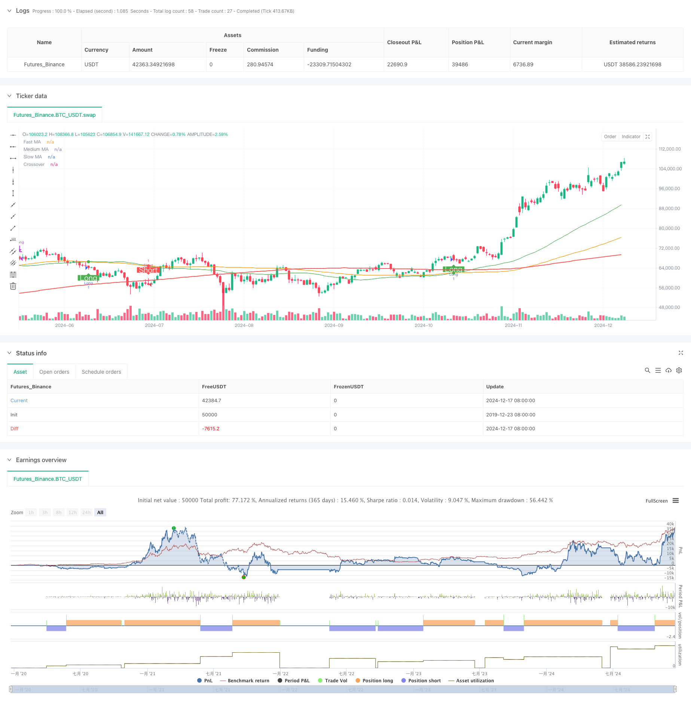

> Name

Multi-Moving-Average-Trend-Following-Trading-Strategy
> Author

ChaoZhang

> Strategy Description



[trans]
#### Overview
This strategy is a trend following system based on multiple moving averages. It uses three simple moving averages with different periods (50, 100, 200), and captures market trend opportunities through the cross signals of the fast moving average and the medium-term moving average, combined with the trend confirmation of the slow moving average. The design concept of this strategy is in line with the classic trading idea of ​​"trend following" and improves the reliability of signals through the combination of moving averages in multiple time frames.
#### Strategy Principle
The core logic of the strategy is based on the following key elements:
1. Use three simple moving averages (SMA) with different periods: fast (50 periods), medium (100 periods) and slow (200 periods)
2. Trigger conditions for entry signals:
   - Long entry: the fast line crosses the middle line and the price is above the slow line
   - Short entry: the fast line crosses the middle line and the price is below the slow line
3. Generation of exit signals:
   - Long position closing: the fast line crosses the middle line
   - Short position closing: the fast line crosses the middle line
4. Use slow moving averages as trend filters to improve the quality of trading signals
#### Strategic Advantages
1. The system has strong stability: using triple moving average cross-validation, it can effectively filter out false signals
2. Improved risk control: use slow moving averages as trend confirmation to reduce the probability of counter-trend transactions
3. Wide adaptability: the strategy can be applied to different time periods and market environments
4. Clear operating rules: entry and exit signals are clear and easy to execute
5. Good visualization effect: through color marking and graphic annotation, the trading signals are intuitive and clear
#### Strategy Risk
1. Lagging risk: The moving average is essentially a lagging indicator and may miss the starting point of the market.
2. Not applicable to volatile markets: Frequent false signals may be generated during the sideways consolidation phase.
3. Fund return risk: The entry point may be far away from the starting point of the trend, which affects the efficiency of fund utilization.
4. Stop loss control: The strategy lacks a clear stop loss mechanism and requires additional risk control measures.
#### Strategy optimization direction
1. Introduce volatility indicators: combine with volatility indicators such as ATR to optimize entry timing and position management
2. Add trend strength filtering: trend strength indicators such as ADX can be added to improve the quality of trading signals
3. Improve the stop loss mechanism: design a dynamic stop loss based on volatility to protect existing profits
4. Optimize parameter adaptation: dynamically adjust moving average parameters according to different market cycles
5. Increase trading volume confirmation: combine with trading volume indicators to improve signal reliability
#### Summary
This strategy is a classic trend following system. Through the use of multiple moving averages, it not only ensures the reliability of the signal, but also effectively grasps the main trend. Although there is a certain lag, it can become a robust trading system through reasonable optimization and risk management. The core advantage of the strategy lies in the stability of the system and the clarity of the operation, which is suitable as the basic framework for medium and long-term trend trading. ||
#### Overview
This strategy is a trend following system based on multiple moving averages. It utilizes three Simple Moving Averages (SMA) with different periods (50, 100, 200) to capture trending opportunities through crossover signals between the fast and medium MAs, combined with trend confirmation from the slow MA. The strategy design aligns with classic trend following principles, enhancing signal reliability through multi-timeframe moving average combinations.

#### Strategy Principles
The core logic is based on the following key elements:
1. Three SMAs with different periods: Fast (50), Medium (100), and Slow (200)
2. Entry signal conditions:
   - Long entry: Fast MA crosses above Medium MA with price above Slow MA
   - Short entry: Fast MA crosses below Medium MA with price below Slow MA
3. Exit signal generation:
   - Long exit: Fast MA crosses below Medium MA
   - Short exit: Fast MA crosses above Medium MA
4. Slow MA serves as a trend filter to improve trading signal quality

#### Strategy Advantages
1. Strong system stability: Triple MA cross-verification effectively filters false signals
2. Comprehensive risk control: Trend confirmation through Slow MA reduces counter-trend trading probability
3. Wide adaptability: Applicable to different timeframes and market conditions
4. Clear operational rules: Entry and exit signals are well-defined and easy to execute
5. Good visualization: Trade signals are intuitive through color coding and graphical annotations

#### Strategy Risks
1. Lag risk: Moving averages are inherently lagging indicators, may miss early trend moves
2. Ineffective in ranging markets: May generate frequent false signals during consolidation phases
3. Capital efficiency risk: Entry points may be far from trend inception, affecting capital utilization
4. Stop-loss control: Lacks explicit stop-loss mechanisms, requires additional risk control measures

#### Optimization Directions
1. Incorporate volatility indicators: Integrate ATR for optimizing entry timing and position sizing
2. Add trend strength filtering: Include ADX for improving trading signal quality
3. Enhance stop-loss mechanism: Design dynamic stops based on volatility to protect profits
4. Optimize parameter adaptability: Dynamically adjust MA parameters based on market cycles
5. Add volume confirmation: Incorporate volume indicators to enhance signal reliability

#### Summary
This strategy represents a classic trend following system that ensures signal reliability and effective trend capture through multiple moving averages. While it has inherent lag, proper optimization and risk management can make it a robust trading system. Its core strengths lie in system stability and operational clarity, making it suitable as a foundation for medium to long-term trend trading.[/trans]


> Source (PineScript)

``` pinescript
/*backtest
start: 2019-12-23 08:00:00
end: 2024-12-18 08:00:00
period: 1d
basePeriod: 1d
exchanges: [{"eid":"Futures_Binance","currency":"BTC_USDT"}]
*/

//@version=6
strategy("MA Cross Strategy", overlay=true)

// Input untuk periode Moving Average dan warna label
fastLength = input.int(50, minval=1, title="Fast MA Length")
mediumLength = input.int(100, minval=1, title="Medium MA Length")
slowLength = input.int(200, minval=1, title="Slow MA Length")
longLabelColor = input.color(color.green, "Long Label Color")
shortLabelColor = input.color(color.red, "Short Label Color")

// Hitung Moving Average
fastMA = ta.sma(close, fastLength)
mediumMA = ta.sma(close, mediumLength)
slowMA = ta.sma(close, slowLength)

// Kondisi untuk buy dan sell
longCondition = ta.crossover(fastMA, mediumMA) and close >= slowMA
shortCondition = ta.crossunder(fastMA, mediumMA) and close <= slowMA

// Plot Moving Average
plot(fastMA, color=color.green, linewidth=1, title="Fast MA")
plot(mediumMA, color=color.orange, linewidth=1, title="Medium MA")
plot(slowMA, color=color.red, linewidth=2, title="Slow MA")

// Plot penanda crossover dengan warna dinamis
plot(ta.cross(fastMA, mediumMA) and (longCondition or shortCondition) ? mediumMA : na, 
     color=longCondition ? color.green : color.red, 
     style=plot.style_circles, linewidth=4, title="Crossover")
     
// Plot label saat kondisi entry terpenuhi
plotshape(longCondition, title="Long", location=location.belowbar, style=shape.labelup, size=size.normal, color=color.green, textcolor=color.white, text="Long")
plotshape(shortCondition, title="Short", location=location.abovebar, style=shape.labeldown, size=size.normal, color=color.red, textcolor=color.white, text="Short")

// Strategi
if longCondition
    strategy.entry("Long", strategy.long)
if shortCondition
    strategy.entry("Short", strategy.short)

// Exit strategy (berdasarkan crossover MA)
if ta.crossunder(fastMA, mediumMA) and strategy.position_size > 0
    strategy.close("Long")
if ta.crossover(fastMA, mediumMA) and strategy.position_size < 0
    strategy.close("Short")
```

> Detail

https://www.fmz.com/strategy/475619

> Last Modified

2024-12-20 15:52:25
