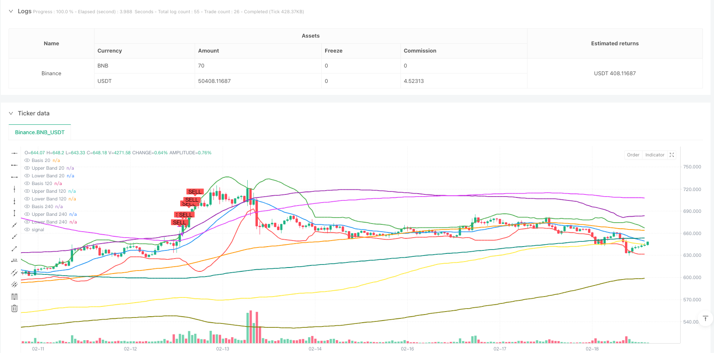
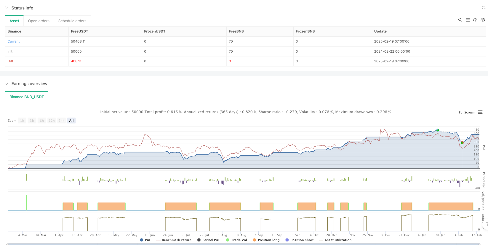

> Name

Multi-Period-Bollinger-Bands-Crossover-Trend-Following-Strategy
> Author

ianzeng123

> Strategy Description





[trans]
#### Overview
This is a trend following strategy based on Triple Bollinger Bands. The strategy identifies overbought and oversold market conditions by combining Bollinger Bands of different periods (20, 120 and 240) and generates trading signals when the price breaks through the three Bollinger Bands. This combination of multi-period Bollinger Bands can effectively filter false signals and improve the accuracy of trading.
#### Strategy Principle
The strategy uses Bollinger Bands with three different periods (20, 120 and 240 periods), each of which consists of a middle track (SMA) and an upper and lower track (2 times the standard deviation). When the price breaks through the lower rails of three Bollinger Bands at the same time, it indicates that the market may be oversold, and the system sends a long signal; when the price breaks through the upper rails of three Bollinger Bands at the same time, it indicates that the market may be overbought, and the system sends a closing signal. By observing Bollinger Bands across multiple time periods, you can better confirm the strength and sustainability of the market trend.
#### Strategic Advantages
1. Multiple confirmation mechanism: Using Bollinger Bands of three different periods as filters can effectively reduce false signals.
2. Trend following ability: Through the dynamic adjustment characteristics of Bollinger Bands, the strategy can adapt to different market environments.
3. Clear risk control: Bollinger Bands themselves are statistically significant and provide a clear reference position for entry and exit.
4. Parameter adjustability: The strategy provides parameter settings for the Bollinger Band cycle and multiples, which can be optimized according to different market characteristics.
#### Strategy Risk
1. Sideways market risk: Frequent false signals may occur in volatile markets, leading to excessive trading.
2. Lagging risk: Due to the use of a longer period moving average, the best entry opportunity may be missed at the turning point of the trend.
3. Fund management risk: If you do not set a suitable stop loss position, you may suffer large losses during violent fluctuations.
4. Parameter dependence: The optimal parameters may vary greatly under different market environments and require regular optimization.
#### Strategy optimization direction
1. Introducing volume-price relationship indicators: Trading volume can be added as an auxiliary indicator to improve the reliability of signals.
2. Optimize the stop loss mechanism: It is recommended to add a trailing stop loss or ATR stop loss to better control risks.
3. Add trend confirmation indicators: It can be combined with other trend indicators (such as MACD, DMI, etc.) for cross-validation.
4. Dynamic parameter adjustment: The parameters of Bollinger Bands can be automatically adjusted according to market volatility to improve strategy adaptability.
5. Improve signal filtering: You can add trading time filtering, volatility filtering and other conditions to reduce false signals.
#### Summary
This is a trend following strategy based on multi-period Bollinger Bands, which confirms trading signals through the intersection of triple Bollinger Bands, and has strong reliability and adaptability. The core advantage of the strategy lies in the multiple confirmation mechanism and clear risk control system, but it is also necessary to pay attention to performance and parameter optimization in volatile markets. By adding volume-price relationship analysis, improving stop-loss mechanisms and dynamic parameter adjustments and other optimization directions, the stability and profitability of the strategy can be further improved. ||
#### Overview
This is a trend-following strategy based on triple Bollinger Bands. The strategy identifies market overbought and oversold conditions by combining Bollinger Bands of different periods (20, 120, and 240) and generates trading signals when prices break through all three bands. This combination of multi-period Bollinger Bands effectively filters false signals and improves trading accuracy.

#### Strategy Principle
The strategy utilizes three Bollinger Bands with different periods (20, 120, and 240), each consisting of a middle band (SMA) and upper/lower bands (2 standard deviations). When the price breaks below all three lower bands simultaneously, it indicates potential oversold conditions, triggering a long signal. When the price breaks above all three upper bands, it indicates potential overbought conditions, triggering a position close signal. By observing Bollinger Bands across multiple timeframes, the strategy better confirms trend strength and persistence.

#### Strategy Advantages
1. Multiple confirmation mechanism: Using three different period Bollinger Bands as filters effectively reduces false signals.
2. Trend following capability: Through the dynamic adjustment characteristics of Bollinger Bands, the strategy can adapt to different market environments.
3. Clear risk control: Bollinger Bands have statistical significance, providing clear reference points for entry and exit.
4. Parameter adjustability: The strategy offers parameter settings for Bollinger Band periods and multipliers, allowing optimization for different market characteristics.

#### Strategy Risks
1. Sideways market risk: May generate frequent false signals in oscillating markets, leading to overtrading.
2. Lag risk: Due to the use of longer-period moving averages, may miss optimal entry points at trend turning points.
3. Money management risk: Without proper stop-loss placement, may suffer significant losses during violent fluctuations.
4. Parameter dependency: Optimal parameters may vary significantly across different market environments, requiring periodic optimization.

#### Strategy Optimization Directions
1. Introduce volume-price relationship indicators: Add trading volume as an auxiliary indicator to improve signal reliability.
2. Optimize stop-loss mechanism: Recommend adding trailing stops or ATR-based stops for better risk control.
3. Add trend confirmation indicators: Consider combining with other trend indicators (like MACD, DMI) for cross-validation.
4. Dynamic parameter adjustment: Automatically adjust Bollinger Band parameters based on market volatility to improve strategy adaptability.
5. Improve signal filtering: Add trading time filters, volatility filters, and other conditions to reduce false signals.

#### Summary
This is a trend-following strategy based on multi-period Bollinger Bands, confirming trading signals through triple Bollinger Band crossovers, with strong reliability and adaptability. The strategy's core advantages lie in its multiple confirmation mechanism and clear risk control system, but attention must be paid to its performance in oscillating markets and parameter optimization issues. Through incorporating volume-price analysis, improving stop-loss mechanisms, and dynamic parameter adjustments, the strategy's stability and profitability can be further enhanced.[/trans]


> Source (PineScript)

``` pinescript
/*backtest
start: 2024-02-22 00:00:00
end: 2025-02-19 08:00:00
period: 1h
basePeriod: 1h
exchanges: [{"eid":"Binance","currency":"BNB_USDT"}]
*/

//@version=5
strategy(title="Bollinger Bands Strategy (Buy Below, Sell Above)", shorttitle="BB Strategy", overlay=true)

// Bollinger Bands parameters
length1 = input(20, title="BB Length 20")
mult1 = input(2.0, title="BB Multiplier 20")
length2 = input(120, title="BB Length 120")
mult2 = input(2.0, title="BB Multiplier 120")
length3 = input(240, title="BB Length 240")
mult3 = input(2.0, title="BB Multiplier 240")

// Calculate the basis (simple moving average) and deviation for each Bollinger Band
basis1 = ta.sma(close, length1)
dev1 = mult1 * ta.stdev(close, length1)
upper1 = basis1 + dev1
lower1 = basis1 - dev1

basis2 = ta.sma(close, length2)
dev2 = mult2 * ta.stdev(close, length2)
upper2 = basis2 + dev2
lower2 = basis2 - dev2

basis3 = ta.sma(close, length3)
dev3 = mult3 * ta.stdev(close, length3)
upper3 = basis3 + dev3
lower3 = basis3 - dev3

// Buy Condition: Price is below all three lower bands
buyCondition = close < lower1 and close < lower2 and close < lower3

// Sell Condition: Price is above all three upper bands
sellCondition = close > upper1 and close > upper2 and close > upper3

// Plot Buy and Sell signals with arrows
plotshape(buyCondition, style=shape.labelup, location=location.belowbar, color=color.green, text="BUY", size=size.small)
plotshape(sellCondition, style=shape.labeldown, location=location.abovebar, color=color.red, text="SELL", size=size.small)

// Strategy orders for buy and sell
if (buyCondition)
    strategy.entry("Buy", strategy.long)

if (sellCondition)
    strategy.close("Buy")  // Close the long position for a sell signal

// Plotting the Bollinger Bands without filling the area
plot(basis1, color=color.blue, title="Basis 20", linewidth=2)
plot(upper1, color=color.green, title="Upper Band 20", linewidth=2)
plot(lower1, color=color.red, title="Lower Band 20", linewidth=2)

plot(basis2, color=color.orange, title="Basis 120", linewidth=2)
plot(upper2, color=color.purple, title="Upper Band 120", linewidth=2)
plot(lower2, color=color.yellow, title="Lower Band 120", linewidth=2)

plot(basis3, color=color.teal, title="Basis 240", linewidth=2)
plot(upper3, color=color.fuchsia, title="Upper Band 240", linewidth=2)
plot(lower3, color=color.olive, title="Lower Band 240", linewidth=2)

```

> Detail

https://www.fmz.com/strategy/483087

> Last Modified

2025-02-27 17:02:33
