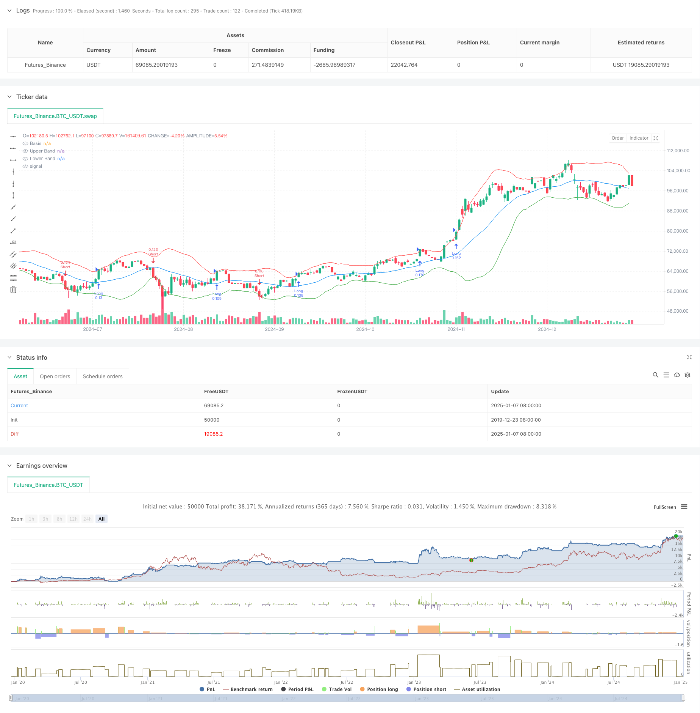

> Name

Multi-Period-Bollinger-Bands-Trend-Breakout-Strategy-with-Volatility-Risk-Control-Model
> Author

ChaoZhang

> Strategy Description



[trans]
#### Overview
This strategy is a trend following system that combines Bollinger Bands, volatility, and risk management. It mainly captures trend opportunities by monitoring price breaks through the upper and lower rails of Bollinger Bands, and at the same time dynamically adjusts position size in combination with ATR to achieve precise risk control. The strategy also adds an identification mechanism for the market consolidation period to effectively filter out false signals in the volatile market.
#### Strategy Principle
The strategy operates based on the following core logic:
1. Use the 20-period moving average as the middle rail of the Bollinger Bands, and calculate the upper and lower rails with 2 times the standard deviation.
2. Identify whether the market is in a consolidation period by comparing the current Bollinger Band width with its moving average.
3. During the non-consolidation period, open a long position when the price breaks through the upper track, and open a short position when it breaks through the lower track.
4. Use the 14-period ATR to dynamically calculate the stop-loss position, and set the take-profit position based on a risk-return ratio of 2:1.
5. Automatically calculate the position size of each transaction based on the 1% risk limit of the total account value and the ATR value.
#### Strategic Advantages
1. Strong adaptability - Bollinger Bands will automatically adjust the bandwidth according to market volatility to adapt to different market environments.
2. Improved risk control - dynamically adjust positions through percentage risk limits and ATR to effectively control the risk of each transaction.
3. High signal quality - Filter out low-quality signals by identifying consolidation periods and improve your winning rate.
4. Complete closed-loop trading - a complete trading system including entry, take-profit, stop-loss and position management.
5. Clear operating rules - The rules for signal generation, position calculation, etc. are clear and easy to execute.
#### Strategy Risk
1. Trend reversal risk - you may suffer large losses when a strong trend suddenly reverses.
2. Impact of slippage - During periods of severe volatility, you may face greater slippage costs.
3. Risk of false breakthrough - Even with the consolidation period filtering, you may still encounter false breakthroughs.
4. Fund efficiency - Frequent transactions may occur in volatile markets, increasing transaction costs.
5. Parameter sensitivity - The choice of Bollinger Band parameters and risk control parameters will significantly affect strategy performance.
#### Strategy optimization direction
1. Add trend confirmation indicator - can be combined with other trend indicators such as MACD or RSI for signal confirmation.
2. Optimize the judgment during the consolidation period - information such as trading volume can be introduced to improve the accuracy of the judgment during the consolidation period.
3. Dynamically adjust parameters - automatically adjust Bollinger Bands and ATR parameters based on market volatility.
4. Improve the stop loss mechanism - the trailing stop loss function can be added to better protect profits.
5. Add time filtering - Consider adding trading time windows to avoid periods of low liquidity.
#### Summary
This strategy captures trends through Bollinger Band breakthroughs and incorporates a complete risk control system. Its advantages are strong adaptability and controllable risks, but you still need to pay attention to the risks of false breakthroughs and trend reversals. There is room for further improvement of the strategy by adding trend confirmation indicators and optimizing parameter adjustment mechanisms. Overall, this is a trend following strategy with clear logic and strong practicality. ||
#### Overview
This strategy is a trend following system that combines Bollinger Bands, volatility metrics, and risk management. It captures trending opportunities by monitoring price breakouts beyond Bollinger Bands while dynamically adjusting position sizes using ATR for precise risk control. The strategy also incorporates a consolidation period detection mechanism to effectively filter false signals in ranging markets.

#### Strategy Principles
The strategy operates based on the following core logic:
1. Uses a 20-period moving average as the middle band of Bollinger Bands, with upper and lower bands at 2 standard deviations.
2. Identifies market consolidation periods by comparing current Bollinger Band width to its moving average.
3. During non-consolidation periods, enters long positions on upper band breakouts and short positions on lower band breakouts.
4. Utilizes 14-period ATR to dynamically calculate stop-loss levels and sets take-profit levels based on a 2:1 risk-reward ratio.
5. Automatically calculates position sizes for each trade based on 1% account risk limit and ATR value.

#### Strategy Advantages
1. High Adaptability - Bollinger Bands automatically adjust width based on market volatility, adapting to different market conditions.
2. Comprehensive Risk Control - Effectively controls risk per trade through percentage risk limits and dynamic position sizing using ATR.
3. High Signal Quality - Filters low-quality signals by identifying consolidation periods, improving win rate.
4. Complete Trading System - Includes entry, exit, and position management components.
5. Clear Operating Rules - Clear rules for signal generation and position calculation, easy to execute.

#### Strategy Risks
1. Trend Reversal Risk - May suffer significant losses during sudden trend reversals.
2. Slippage Impact - May face significant slippage costs during highly volatile periods.
3. False Breakout Risk - False breakouts may still occur despite consolidation filtering.
4. Capital Efficiency - May generate frequent trades in ranging markets, increasing transaction costs.
5. Parameter Sensitivity - Strategy performance significantly affected by choice of Bollinger Bands and risk control parameters.

#### Optimization Directions
1. Add Trend Confirmation Indicators - Can incorporate other trend indicators like MACD or RSI for signal confirmation.
2. Improve Consolidation Detection - Can introduce volume information to enhance consolidation period detection accuracy.
3. Dynamic Parameter Adjustment - Automatically adjust Bollinger Bands and ATR parameters based on market volatility.
4. Enhanced Stop-Loss Mechanism - Can add trailing stop-loss functionality for better profit protection.
5. Add Time Filters - Consider adding trading time windows to avoid low liquidity periods.

#### Summary
This strategy captures trends through Bollinger Bands breakouts while incorporating a comprehensive risk control system. Its strengths lie in high adaptability and controlled risk, though attention must be paid to false breakouts and trend reversal risks. The strategy has room for further improvement through adding trend confirmation indicators and optimizing parameter adjustment mechanisms. Overall, it represents a logically sound and practical trend following strategy.[/trans]


> Source (PineScript)

``` pinescript
/*backtest
start: 2019-12-23 08:00:00
end: 2025-01-08 08:00:00
period: 1d
basePeriod: 1d
exchanges: [{"eid":"Futures_Binance","currency":"BTC_USDT"}]
*/

//@version=5
strategy("Bollinger Bands Breakout Strategy", overlay=true)

// Input parameters
length = input(20, title="Bollinger Bands Length")
stdDev = input(2.0, title="Standard Deviation")
riskRewardRatio = input(2.0, title="Risk/Reward Ratio")
atrLength = input(14, title="ATR Length")
riskPercentage = input(1.0, title="Risk Percentage per Trade")

// Calculate Bollinger Bands
basis = ta.sma(close, length)
dev = stdDev * ta.stdev(close, length)
upperBand = basis + dev
lowerBand = basis - dev

// Calculate ATR for position sizing
atr = ta.atr(atrLength)

// Plot Bollinger Bands
plot(basis, color=color.blue, title="Basis")
plot(upperBand, color=color.red, title="Upper Band")
plot(lowerBand, color=color.green, title="Lower Band")

// Market Consolidation Detection
isConsolidating = (upperBand - lowerBand) < ta.sma(upperBand - lowerBand, length) * 0.5

// Breakout Conditions
longCondition = ta.crossover(close, upperBand) and not isConsolidating
shortCondition = ta.crossunder(close, lowerBand) and not isConsolidating

// Risk Management: Calculate position size
equity = strategy.equity
riskAmount = equity * (riskPercentage / 100)
positionSize = riskAmount / (atr * riskRewardRatio)

// Execute trades with risk management
if (longCondition)
    strategy.entry("Long", strategy.long, qty=positionSize)
    strategy.exit("Take Profit", from_entry="Long", limit=close + atr * riskRewardRatio, stop=close - atr)

if (shortCondition)
    strategy.entry("Short", strategy.short, qty=positionSize)
    strategy.exit("Take Profit", from_entry="Short", limit=close - atr * riskRewardRatio, stop=close + atr)

// Alert conditions for breakouts
alertcondition(longCondition, title="Long Breakout", message="Long breakout detected!")
alertcondition(shortCondition, title="Short Breakout", message="Short breakout detected!")

```

> Detail

https://www.fmz.com/strategy/477945

> Last Modified

2025-01-10 15:12:13
