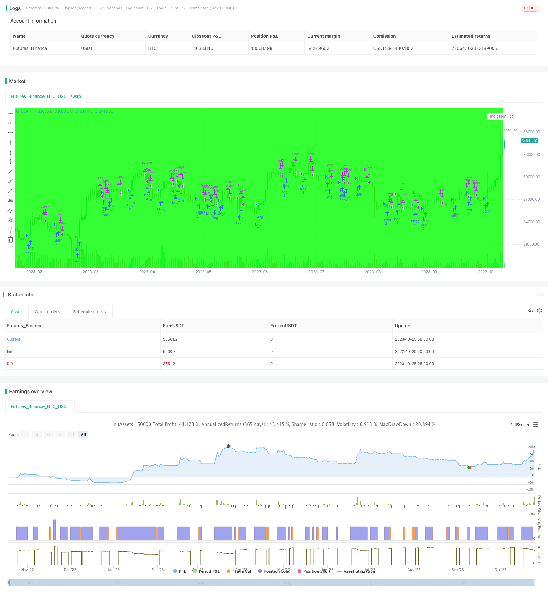

> Name

Multi-Period-Dynamic-Moving-Average-Strategy
> Author

ChaoZhang

> Strategy Description



[trans]


This strategy achieves the generation of trading signals by dynamically selecting different types of moving averages and combining multiple time periods.
### Strategy Principles
This strategy allows you to select five moving average indicators: SMA, EMA, TEMA, WMA, and HMA, and set the period length of the moving average. The strategy dynamically draws different types of moving averages based on the selection. When the closing price rises and breaks the moving average, go long; when the closing price falls and breaks the moving average, go short.
Specifically, the strategy first defines the backtest period based on input parameters. Then calculate five moving average indicators:
- SMA simple moving average
- EMA exponential moving average
- TEMA Three Exponential Moving Average
- WMA weighted moving average
- HMA Hull Moving Average
Based on the selection, draw the corresponding moving average. When the closing price is higher than the moving average, go long; when the closing price is lower than the moving average, go short.
By combining different types of moving averages, this strategy can smooth price data, filter market noise, and generate more reliable trading signals. The length of the moving average period is allowed to be customized, and trading can be conducted based on the trends of different periods.
### Strategic Advantages
- Use a variety of moving average indicators in combination to achieve high reliability
- The moving average period can be customized, suitable for different period operations
- Dynamic switching of moving average types, flexible optimization parameters
- Simple and intuitive trend following strategy, easy to implement
### Strategy Risk
- The moving average lags behind and the turning point of the trend may be missed.
- Fixed parameters are prone to over-fitting, and the actual effect may be weaker than backtesting
- Actively go long in the long phase, and actively go short in the short phase, which can easily affect the efficiency of capital use.
Risks can be reduced by optimizing:
- Combine with other indicators to determine trends and determine more accurate entry opportunities
- Real offer optimization parameters, adjusting the moving average cycle to adapt to different market environments
- Optimize position management and appropriately adjust positions according to fund size and risk control
### Optimization direction
This strategy can be optimized from the following directions:
1. Add other indicator filters to form more stable trading signals
For example, a volume energy indicator can be added to generate trading signals only when trading volume is enlarged, thereby filtering out some false breakthroughs.
2. Optimize entry and exit logic
You can set up a channel, and enter the market only when the price breaks through the channel; set a stop loss line, and close the position after the price touches the stop loss line. This can reduce unnecessary losses.
3. Dynamically adjust the moving average period
The moving average period can be dynamically adjusted according to market conditions, using long-period moving averages when the trend is more obvious, and short-period moving averages during consolidation.
4. Optimize fund management strategies
The position size can be adjusted according to the retracement situation, reducing the position during the retracement, and appropriately increasing the position when making profits.
### Summarize
This strategy combines the application of multiple moving average indicators and multiple time periods to form a relatively stable trend following effect. There is a large space for strategy optimization, and improvements can be made in terms of entry filtering, exit methods, parameter optimization, etc., so that the strategy can achieve better results in real trading.
||

This strategy dynamically selects different types of moving averages across multiple timeframes to generate trading signals. 

### Strategy Logic

The strategy allows selecting from SMA, EMA, TEMA, WMA and HMA moving averages, with customizable period lengths. Different types of moving averages will be plotted dynamically based on selection. It goes long when the closing price breaks above the moving average, and goes short when the closing price breaks below.

Specifically, the strategy first defines the backtest period based on input parameters. It then calculates five types of moving averages:

- SMA Simple Moving Average
- EMA Exponential Moving Average
- TEMA Triple Exponential Moving Average  
- WMA Weighted Moving Average
- HMA Hull Moving Average

The corresponding moving average is plotted based on selection. It goes long when the closing price is above the moving average, and goes short when below.

By combining different types of moving averages, the strategy can smooth price data and filter out market noise to generate more reliable trading signals. Customizable period lengths allow trading different trends across timeframes.

### Advantages

- Combines multiple moving averages for greater reliability 
- Customizable periods suit different trading timeframes
- Dynamic switching of averages allows flexible optimization
- Simple and intuitive trend following suitable for beginners

### Risks

- Lagging of moving averages may miss trend turning points
- Overfitting with fixed parameters, underperformance in live trading likely
- Aggressive long/short signals impact capital usage efficiency 

Risks can be reduced by:

- Adding other indicators to determine entries more precisely 
- Real-trade optimization of parameters for different market regimes
- Optimizing position sizing based on account size and risk management

### Enhancement Opportunities

The strategy can be improved in several aspects:

1. Add other filters for more stable signals

   e.g. volume indicators to avoid false breakouts without volume confirmation.

2. Optimize entry and exit logic

   Set price channels and stop losses to reduce unnecessary losses.

3. Dynamic moving average periods

   Use longer periods in strong trends and shorter periods during consolidations.

4. Improve money management

   Adjust position sizes based on drawdowns and profit taking.

### Conclusion

The strategy combines various moving averages across timeframes to generate relatively stable trend following effects. With ample room for optimizations in entries, exits, parameters and money management, it can be improved for better real-world performance.

[/trans]

> Strategy Arguments


|Argument|Default|Description|
|----|----|----|
|v_input_1|100000000|Buy quantity|
|v_input_2|2017|Backtest Start Year|
|v_input_3|true|Backtest Start Month|
|v_input_4|true|Backtest Start Day|
|v_input_5|false|Backtest Start Hour|
|v_input_6|false|Backtest Start Minute|
|v_input_7|2099|Backtest Stop Year|
|v_input_8|true|Backtest Stop Month|
|v_input_9|30|Backtest Stop Day|
|v_input_10|true|Color Background?|
|v_input_11|0|Select MA: SMA|EMA|TEMA|WMA|HMA|
|v_input_12|7|Period|


> Source (PineScript)

``` pinescript
/*backtest
start: 2022-10-20 00:00:00
end: 2023-10-26 00:00:00
period: 1d
basePeriod: 1h
exchanges: [{"eid":"Futures_Binance","currency":"BTC_USDT"}]
*/

//@version=3
strategy("MA_strategy ", shorttitle="MA_strategy", overlay=true, initial_capital=100000)

qty = input(100000000, "Buy quantity")

testStartYear = input(2017, "Backtest Start Year")
testStartMonth = input(1, "Backtest Start Month")
testStartDay = input(1, "Backtest Start Day")
testStartHour = input(0, "Backtest Start Hour")
testStartMin = input(0, "Backtest Start Minute")

testPeriodStart = timestamp(testStartYear,testStartMonth,testStartDay,testStartHour,testStartMin)

testStopYear = input(2099, "Backtest Stop Year")
testStopMonth = input(1, "Backtest Stop Month")
testStopDay = input(30, "Backtest Stop Day")
testPeriodStop = timestamp(testStopYear,testStopMonth,testStopDay,0,0)


testPeriodBackground = input(title="Color Background?", type=bool, defval=true)
testPeriodBackgroundColor = testPeriodBackground and (time >= testPeriodStart) and (time <= testPeriodStop) ? #00FF00 : na
bgcolor(testPeriodBackgroundColor, transp=97)

testPeriod() =>
    time >= testPeriodStart and time <= testPeriodStop ? true : false


ma1 = input( "SMA",title="Select MA", options=["SMA", "EMA","TEMA", "WMA","HMA"])


len1 = input(7, minval=1, title="Period")

s=sma(close,len1)

e=ema(close,len1)


xEMA1 = ema(close, len1)
xEMA2 = ema(xEMA1, len1)
xEMA3 = ema(xEMA2, len1)
t = 3 * xEMA1 - 3 * xEMA2 + xEMA3


f_hma(_src, _length)=>
    _return = wma((2 * wma(_src, _length / 2)) - wma(_src, _length), round(sqrt(_length)))

h = f_hma(close, len1)

w = wma(close, len1)

ma = ma1 == "SMA"?s:ma1=="EMA"?e:ma1=="WMA"?w:ma1=="HMA"?h:ma1=="TEMA"?t:na

buy= close>ma
sell= close<ma

alertcondition(buy, title='buy', message='buy')
alertcondition(sell, title='sell', message='sell')

ordersize=floor(strategy.equity/close)

if testPeriod()
    strategy.entry("long",strategy.long,ordersize,when=buy)
    strategy.close("long", when = sell )


    
  


```

> Detail

https://www.fmz.com/strategy/430366

> Last Modified

2023-10-27 16:07:16
