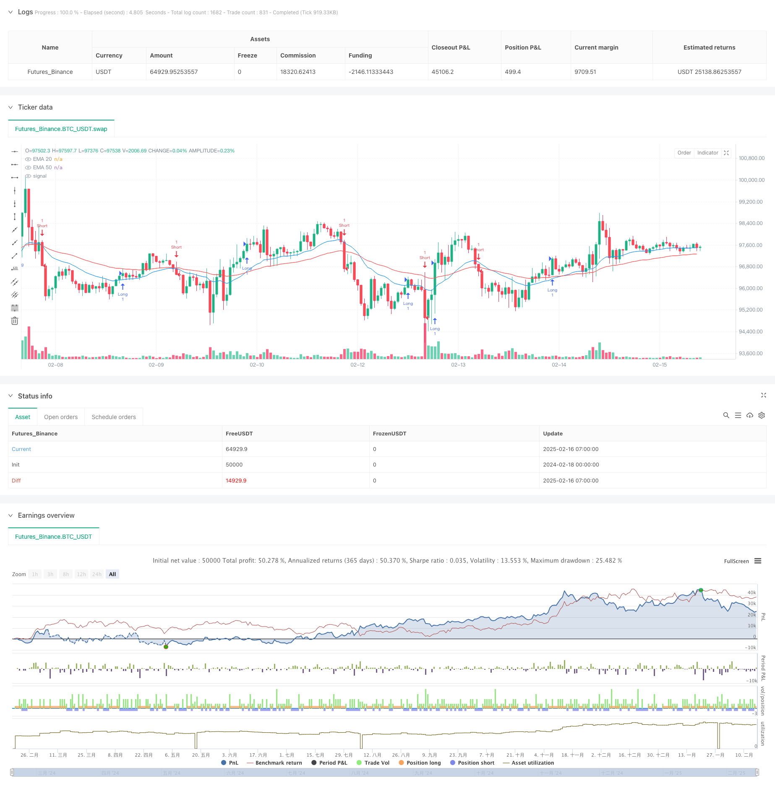

> Name

Hybrid trading strategy that combines multi-period moving average trend tracking with support and resistance system-Multi-Period-EMA-Trend-Following-with-Support-Resistance-Hybrid-Trading-System
> Author

ChaoZhang

> Strategy Description



[trans]
#### Overview
This strategy is a hybrid trading system that combines multiple technical analysis indicators. It mainly relies on the moving average system (EMA) to judge market trends, while combining the support and resistance (SR) levels as entry signals, and using the true range of fluctuations (ATR) for risk control. The strategy uses dynamic stop loss settings, which can adaptively adjust the stop loss position according to market volatility.
#### Strategy Principle
Strategy operations are based on the following core components:
1. Trend determination system - Use the spatial relationship and difference between the 20-period and 50-period exponential moving averages (EMA) to determine the trend strength
2. Breakout Signal System - Build support and resistance levels through 9 periods of high and low prices
3. Risk control system - using 14-period ATR to dynamically adjust the stop loss distance
4. The entry logic contains two conditions:
   - Price breaks through support and resistance levels
   - In trend and price in the correct moving average direction
5. The exit logic is based on the dynamic stop loss of ATR, and the stop loss distance is 10 times of ATR.
#### Strategic Advantages
1. Multi-dimensional confirmation - combine trend tracking and breakout trading to improve signal reliability
2. Strong adaptability - dynamically adjust stop loss through ATR to adapt to different market environments
3. Perfect risk control - There is a clear stop loss mechanism, and the stop loss will be adjusted with market fluctuations
4. High degree of systematization - clear trading rules and not affected by subjective judgment
5. Good scalability - the core framework is stable and easy to add new trading rules
#### Strategy Risk
1. Volatile market risk - Frequent false signals may occur in sideways markets
2. Slippage risk - Breakout trades may face greater slippage during periods of high volatility
3. Risk of stop loss range - setting the ATR multiple too large may lead to a larger retracement
4. Risk of signal delay - there is a certain lag in the moving average system
5. Parameter sensitivity - the settings of multiple parameters need to be fully tested and optimized
#### Strategy optimization direction
1. Signal filtering optimization
   - Added transaction volume confirmation mechanism
   - Introduced volatility filter
   - Combined with more technical indicators for verification
2. Optimization of warehouse management
   - Implement dynamic position management
   - Adjust position size based on volatility
   - Add batch opening mechanism
3. Stop loss optimization
   -Introduction of trailing stop loss
   - Optimize ATR multiplier setting
   - Add profit protection mechanism
#### Summary
This strategy builds a complete trading system by combining multiple mature technical analysis methods. Its core advantage lies in the system's adaptability and risk control capabilities. Through continuous optimization and improvement, the strategy is expected to maintain stable performance in different market environments. It is recommended that traders conduct sufficient historical data testing and parameter optimization before using it in real trading. ||
#### Overview
This strategy is a hybrid trading system that combines multiple technical analysis indicators. It primarily uses the Exponential Moving Average (EMA) system to determine market trends, while incorporating Support and Resistance (SR) levels for entry signals and Average True Range (ATR) for risk control. The strategy employs dynamic stop-loss settings that can adaptively adjust based on market volatility.

#### Strategy Principles
The strategy operates based on the following core components:
1. Trend Determination System - Uses the spatial relationship and difference between 20-period and 50-period EMAs to judge trend strength
2. Breakthrough Signal System - Constructs support and resistance levels using 9-period high and low prices
3. Risk Control System - Uses 14-period ATR to dynamically adjust stop-loss distances
4. Entry logic includes two conditions:
   - Price breaks through support/resistance levels
   - In trend and price is in the correct EMA direction
5. Exit logic based on ATR dynamic stop-loss, with stop distance set at 10 times ATR

#### Strategy Advantages
1. Multi-dimensional Confirmation - Combines trend following and breakout trading for improved signal reliability
2. Strong Adaptability - Dynamically adjusts stops through ATR, adapting to different market environments
3. Comprehensive Risk Control - Has clear stop-loss mechanisms that adjust with market volatility
4. High Systematization - Clear trading rules, unaffected by subjective judgment
5. Good Scalability - Stable core framework, easy to add new trading rules

#### Strategy Risks
1. Oscillation Market Risk - May generate frequent false signals in sideways markets
2. Slippage Risk - Breakout trades may face significant slippage during high volatility
3. Stop-Loss Range Risk - Large ATR multiplier settings may lead to significant drawdowns
4. Signal Delay Risk - Moving average system has inherent lag
5. Parameter Sensitivity - Multiple parameters require thorough testing and optimization

#### Strategy Optimization Directions
1. Signal Filtering Optimization
   - Add volume confirmation mechanism
   - Introduce volatility filters
   - Integrate more technical indicators for verification

2. Position Management Optimization
   - Implement dynamic position management
   - Adjust position size based on volatility
   - Add staged position building mechanism

3. Stop-Loss Optimization
   - Introduce trailing stops
   - Optimize ATR multiplier settings
   - Add profit protection mechanism

#### Summary
This strategy constructs a complete trading system by combining multiple mature technical analysis methods. Its core advantages lie in system adaptability and risk control capabilities. Through continuous optimization and improvement, the strategy shows promise in maintaining stable performance across different market environments. Traders are advised to conduct thorough historical data testing and parameter optimization before live trading.[/trans]


> Source (PineScript)

``` pinescript
/*backtest
start: 2024-02-18 00:00:00
end: 2025-02-16 08:00:00
period: 1h
basePeriod: 1h
exchanges: [{"eid":"Futures_Binance","currency":"BTC_USDT"}]
*/

//@version=6
strategy("Multi-Strategy Trader v1 by SUNNY GUHA +91 9836021040 / www.oiesu.com", overlay=true)

// Basic Inputs
supResLookback = input.int(9, "Support/Resistance Lookback")
atrPeriod = input.int(14, "ATR Period")
stopMultiplier = input.float(10.0, "Stop Loss ATR Multiplier")

// Technical Indicators
atr = ta.atr(atrPeriod)
highestHigh = ta.highest(high, supResLookback)
lowestLow = ta.lowest(low, supResLookback)
ema20 = ta.ema(close, 20)
ema50 = ta.ema(close, 50)

// Basic Strategy Rules
isTrending = math.abs(ema20 - ema50) > atr
longSignal = close > highestHigh[1] or (isTrending and ema20 > ema50 and close > ema20)
shortSignal = close < lowestLow[1] or (isTrending and ema20 < ema50 and close < ema20)

// Entry Logic
if longSignal and strategy.position_size <= 0
    strategy.entry("Long", strategy.long)

if shortSignal and strategy.position_size >= 0
    strategy.entry("Short", strategy.short)

// Stop Loss Logic
longStopPrice = close - (atr * stopMultiplier)
shortStopPrice = close + (atr * stopMultiplier)

// Exit Logic
if strategy.position_size > 0
    strategy.exit("Long Exit", "Long", stop=longStopPrice)
if strategy.position_size < 0
    strategy.exit("Short Exit", "Short", stop=shortStopPrice)

// Basic Plotting
plot(ema20, "EMA 20", color.blue)
plot(ema50, "EMA 50", color.red)

```

> Detail

https://www.fmz.com/strategy/482477

> Last Modified

2025-02-18 15:52:46
