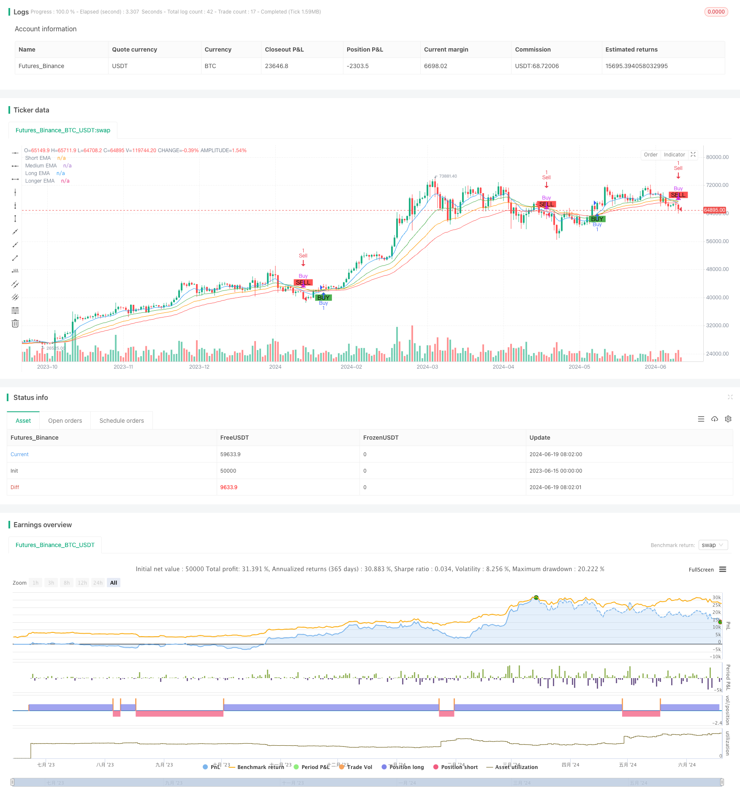

> Name

Multi-Period-Exponential-Moving-Average-Crossover-Strategy-with-Options-Trading-Suggestion-System
> Author

ChaoZhang

> Strategy Description



[trans]

#### Overview
This strategy is a trading system based on multi-period exponential moving average (EMA) crossovers, combined with options trading advice. This strategy uses EMAs of different periods to identify market trends and generate buy and sell signals at key locations. In addition, the strategy also provides corresponding options trading suggestions based on current market conditions, providing traders with additional decision-making support.
#### Strategy Principle
The core principle of this strategy is to use multiple periods of exponential moving averages (EMA) to capture market trends and potential reversal points. Specifically, the strategy uses four EMAs with different periods:
1. Short-term EMA (9 periods)
2. Mid-term EMA (21 periods)
3. Long-term EMA (34 periods)
4. Longer-term EMA (50 period)
Strategies determine market trends and generate trading signals by observing the correlation between these EMAs:
- Buy signal: Triggered when the short-term EMA (9 periods) crosses the longer-term EMA (50 periods)
- Sell signal: triggered when the short-term EMA (9 periods) crosses below the longer-term EMA (50 periods)
In addition to generating traditional buy and sell signals, the strategy also provides corresponding options trading recommendations when each signal is triggered. Specifically:
- When the buy signal is triggered, it is recommended to buy a call option (Call Option)
- When the sell signal is triggered, it is recommended to buy a put option (Put Option)
Option recommendations include a suggested strike price (usually the current closing price) and expiration time (default is 1 month).
#### Strategic Advantages
1. Comprehensive analysis of multi-period EMA: By using EMA of multiple periods, the strategy can capture market trends more comprehensively and reduce misjudgments caused by false breakthroughs.
2. Consider both trend following and reversal: The intersection of short-term EMA and longer-term EMA can not only capture the main trend, but also detect potential reversal opportunities in a timely manner.
3. Options trading suggestions: Combined with traditional buying and selling signals and options trading suggestions, it provides traders with more diversified trading strategy choices.
4. Visualization effect: By drawing EMA curves and buying and selling signal marks of different colors on the chart, market trends and trading opportunities are more intuitive.
5. Strong flexibility: Strategy parameters (such as EMA cycle) can be adjusted according to different markets and personal preferences, and are highly adaptable.
6. Backtesting function: The built-in strategy entry and exit logic allows traders to conduct historical backtesting and evaluate the performance of the strategy in different market environments.
#### Strategy Risk
1. Lagging: As a lagging indicator, EMA may produce lagging signals in rapidly changing markets, resulting in poor entry or exit timing.
2. Not applicable to volatile markets: In sideways volatile markets, EMA crossovers may produce frequent false signals, increase transaction costs and may lead to continuous losses.
3. Over-reliance on technical indicators: Relying solely on EMA crossovers may ignore other important market factors, such as fundamental changes, macroeconomic events, etc.
4. Option risk: Option trading itself has high-risk characteristics and is not suitable for inexperienced traders. Wrong options strategies can result in serious financial losses.
5. Parameter sensitivity: Strategy performance may be highly sensitive to the choice of EMA period, and improper parameter settings may lead to poor strategy performance.
6. Lack of risk management: The current strategy lacks clear stop loss and profit target settings, which may lead to overexposure to market risks.
#### Strategy optimization direction
1. Introduce additional indicators: Combine with other technical indicators (such as RSI, MACD or ATR) to confirm the EMA crossover signal and improve the accuracy of the strategy.
2. Dynamically adjust the EMA cycle: Automatically adjust the EMA cycle according to market volatility to adapt to different market environments.
3. Add filter conditions: Add filter conditions such as trading volume, volatility or trend strength to reduce the generation of false signals.
4. Improve risk management: Introduce stop-loss and trailing take-profit mechanisms to control the risk exposure of each transaction.
5. Optimize option strategies: Dynamically adjust option execution prices and expiration time suggestions based on market volatility and trend strength.
6. Add timing logic: judge whether it is suitable for trading based on the performance of the market index or industry index, and avoid frequent trading in unfavorable market environments.
7. Implement adaptive functions: Use machine learning algorithms to automatically optimize strategy parameters so that they can adapt to different market cycles.
8. Increase fundamental analysis: Combine company financial reports, industry news and other fundamental factors to improve the comprehensiveness of trading decisions.
#### Summarize
The multi-period exponential moving average crossover strategy and options trading advice system is an innovative trading strategy that combines traditional technical analysis with modern financial tools. By utilizing multiple periods of EMA to capture market trends, combined with options trading recommendations, this strategy provides traders with a comprehensive decision support system.
Although this strategy has the advantages of trend following, clear signals, and simple operation, it also has inherent risks such as hysteresis and poor performance in volatile markets. In order to further improve the robustness and adaptability of the strategy, you can consider introducing additional technical indicators, improving the risk management mechanism, optimizing option strategy suggestions, and other improvements.
Overall, this is a strategy framework with potential, and through continued optimization and personalized adjustments, it is expected to become an effective trading tool. However, traders still need to be cautious when using this strategy, and make prudent decisions based on their own risk tolerance and market experience.
|| 

#### Overview

This strategy is a trading system based on multi-period Exponential Moving Average (EMA) crossovers, combined with options trading suggestions. The strategy utilizes EMAs of different periods to identify market trends and generate buy and sell signals at key points. Additionally, the strategy provides corresponding options trading suggestions based on current market conditions, offering traders additional decision-making support.

#### Strategy Principle

The core principle of this strategy is to use multiple period Exponential Moving Averages (EMAs) to capture market trends and potential reversal points. Specifically, the strategy employs four different period EMAs:

1. Short-term EMA (9 periods)
2. Medium-term EMA (21 periods)
3. Long-term EMA (34 periods)
4. Longer-term EMA (50 periods)

The strategy observes the relationships between these EMAs to determine market trends and generate trading signals:

- Buy signal: Triggered when the short-term EMA (9 periods) crosses above the longer-term EMA (50 periods)
- Sell signal: Triggered when the short-term EMA (9 periods) crosses below the longer-term EMA (50 periods)

In addition to generating traditional buy and sell signals, the strategy also provides corresponding options trading suggestions when each signal is triggered. Specifically:

- When a buy signal is triggered, it suggests purchasing a Call Option
- When a sell signal is triggered, it suggests purchasing a Put Option

The options suggestion includes a recommended strike price (usually the current closing price) and expiration time (default is 1 month).

#### Strategy Advantages

1. Multi-period EMA comprehensive analysis: By using EMAs of multiple periods, the strategy can capture market trends more comprehensively, reducing misjudgments caused by false breakouts.

2. Balance between trend following and reversal: The crossover between short-term and longer-term EMAs can capture major trends while also timely identifying potential reversal opportunities.

3. Options trading suggestions: Combining traditional buy/sell signals with options trading suggestions provides traders with more diversified trading strategy choices.

4. Visualization: By plotting EMA curves of different colors and buy/sell signal markers on the chart, market trends and trading opportunities become more intuitive.

5. High flexibility: Strategy parameters (such as EMA periods) can be adjusted according to different markets and personal preferences, offering strong adaptability.

6. Backtesting functionality: The built-in strategy entry and exit logic allows traders to conduct historical backtests and evaluate the strategy's performance in different market environments.

#### Strategy Risks

1. Lag: As lagging indicators, EMAs may generate delayed signals in rapidly changing markets, leading to suboptimal entry or exit timing.

2. Unsuitable for ranging markets: In sideways, oscillating markets, EMA crossovers may produce frequent false signals, increasing trading costs and potentially leading to consecutive losses.

3. Over-reliance on technical indicators: Relying solely on EMA crossovers may ignore other important market factors, such as fundamental changes and macroeconomic events.

4. Options risks: Options trading itself is inherently high-risk and not suitable for inexperienced traders. Incorrect options strategies can lead to severe capital losses.

5. Parameter sensitivity: Strategy performance may be highly sensitive to the choice of EMA periods. Improper parameter settings may result in poor strategy performance.

6. Lack of risk management: The current strategy lacks explicit stop-loss and profit target settings, which may lead to excessive exposure to market risk.

#### Strategy Optimization Directions

1. Introduce additional indicators: Combine other technical indicators (such as RSI, MACD, or ATR) to confirm EMA crossover signals, improving the strategy's accuracy.

2. Dynamic adjustment of EMA periods: Automatically adjust EMA periods based on market volatility to adapt to different market environments.

3. Add filtering conditions: Incorporate volume, volatility, or trend strength filters to reduce the generation of false signals.

4. Improve risk management: Introduce stop-loss and trailing stop mechanisms to control risk exposure for each trade.

5. Optimize options strategy: Dynamically adjust the recommended strike price and expiration time of options based on market volatility and trend strength.

6. Incorporate market timing logic: Determine whether it's suitable to trade based on the performance of broad market indices or sector indices, avoiding frequent trading in unfavorable market environments.

7. Implement adaptive functionality: Use machine learning algorithms to automatically optimize strategy parameters, enabling it to adapt to different market cycles.

8. Incorporate fundamental analysis: Integrate fundamental factors such as company earnings reports and industry news to enhance the comprehensiveness of trading decisions.

#### Conclusion

The Multi-Period Exponential Moving Average Crossover Strategy with Options Trading Suggestion System is an innovative trading strategy that combines traditional technical analysis with modern financial instruments. By leveraging EMAs of multiple periods to capture market trends and incorporating options trading suggestions, this strategy provides traders with a comprehensive decision support system.

While the strategy has advantages such as trend following, clear signals, and ease of operation, it also has inherent risks including lag and poor performance in ranging markets. To further improve the strategy's robustness and adaptability, considerations can be made to introduce additional technical indicators, enhance risk management mechanisms, and optimize options strategy suggestions.

Overall, this is a promising strategy framework that, through continuous optimization and personalized adjustments, has the potential to become an effective trading tool. However, traders should still exercise caution when using this strategy, considering their own risk tolerance and market experience when making decisions.

[/trans]


> Source (PineScript)

``` pinescript
/*backtest
start: 2023-06-15 00:00:00
end: 2024-06-20 00:00:00
period: 1d
basePeriod: 1h
exchanges: [{"eid":"Futures_Binance","currency":"BTC_USDT"}]
*/

//@version=5
strategy("Ripster EMA Clouds Strategy with Options Suggestions", overlay=true)

// Parameters
shortEmaPeriod = input.int(9, title="Short EMA Period")
mediumEmaPeriod = input.int(21, title="Medium EMA Period")
longEmaPeriod = input.int(34, title="Long EMA Period")
longerEmaPeriod = input.int(50, title="Longer EMA Period")

// Calculate EMAs
shortEma = ta.ema(close, shortEmaPeriod)
mediumEma = ta.ema(close, mediumEmaPeriod)
longEma = ta.ema(close, longEmaPeriod)
longerEma = ta.ema(close, longerEmaPeriod)

// Plot EMA Clouds
plot(shortEma, color=color.new(color.blue, 0), title="Short EMA")
plot(mediumEma, color=color.new(color.green, 0), title="Medium EMA")
plot(longEma, color=color.new(color.orange, 0), title="Long EMA")
plot(longerEma, color=color.new(color.red, 0), title="Longer EMA")

// Generate Buy and Sell Signals
buySignal = ta.crossover(shortEma, longerEma)
sellSignal = ta.crossunder(shortEma, longerEma)

// Plot Buy and Sell signals
plotshape(series=buySignal, location=location.belowbar, color=color.green, style=shape.labelup, title="Buy Signal", text="BUY")
plotshape(series=sellSignal, location=location.abovebar, color=color.red, style=shape.labeldown, title="Sell Signal", text="SELL")

// Suggest Options Contracts
var label optionLabel = na

if (buySignal)
    optionLabel := label.new(x=bar_index, y=low, text="Buy Call Option\nStrike: " + str.tostring(close) + "\nExpiration: 1 Month", style=label.style_label_down, color=color.green, textcolor=color.white)
if (sellSignal)
    optionLabel := label.new(x=bar_index, y=high, text="Buy Put Option\nStrike: " + str.tostring(close) + "\nExpiration: 1 Month", style=label.style_label_up, color=color.red, textcolor=color.white)

// Strategy (Optional)
// This part is for backtesting purposes
strategy.entry("Buy", strategy.long, when=buySignal)
strategy.close("Buy", when=sellSignal)

strategy.entry("Sell", strategy.short, when=sellSignal)
strategy.close("Sell", when=buySignal)

```

> Detail

https://www.fmz.com/strategy/454737

> Last Modified

2024-06-21 14:41:08
