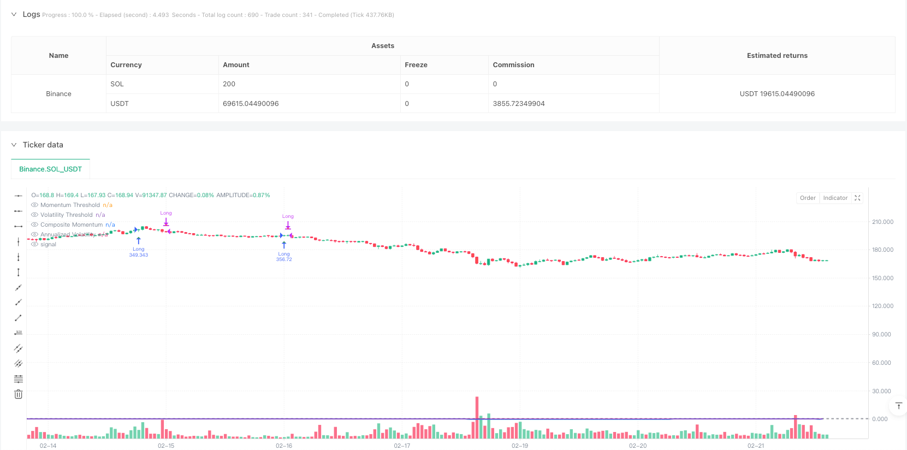
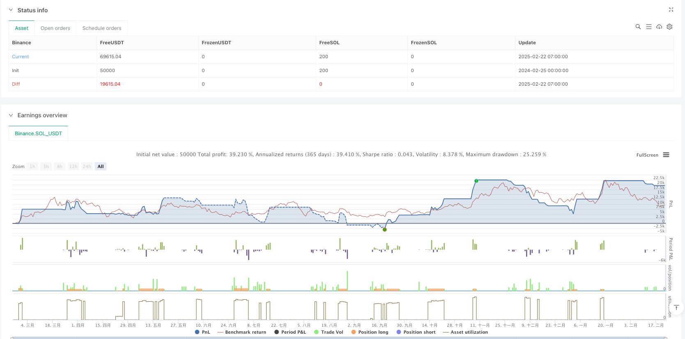

> Name

Multi-Period-Momentum-Driven-Adaptive-Volatility-Filtered-Strategy
> Author

ianzeng123

> Strategy Description





[trans]
#### Overview
This strategy is an advanced trading system based on the multi-period momentum indicator and volatility filtering. It constructs a comprehensive momentum scoring system by calculating price momentum for four time periods: 3 months, 6 months, 9 months and 12 months. At the same time, the strategy introduces an annualized volatility filtering mechanism to control trading risks by setting a volatility threshold. This strategy focuses on capturing trading opportunities with a sustained upward trend and relatively stable fluctuations. It is a typical trend following system.
#### Strategy Principle
The core logic of the strategy includes the following key elements:
1. Momentum calculation: Use the (current price/historical price-1) method to calculate the momentum indicators for 4 time periods respectively.
2. Volatility filtering: Calculate the standard deviation of daily returns and annualize it, and filter high volatility periods by comparing it with a preset threshold (0.5).
3. Signal generation: When the comprehensive momentum indicator turns from negative to positive and the volatility is lower than the threshold, a long signal is generated; when the momentum indicator turns negative, the position is closed.
4. Risk management: Use 1% stop loss and 50% take profit to control single transaction risk.
#### Strategic Advantages
1. Multi-dimensional momentum analysis: By comprehensively considering the momentum of multiple time periods, the strength and persistence of the price trend can be more comprehensively assessed.
2. Adaptive volatility filtering: By dynamically calculating and filtering volatility, false signals during periods of high volatility are effectively avoided.
3. Complete risk control: Stop loss and take profit thresholds are set to effectively control the risk of a single transaction.
4. Systematic decision-making: The strategy is completely systematic, avoiding the interference caused by subjective judgment.
#### Strategy Risk
1. Trend reversal risk: When a strong trend suddenly reverses, you may suffer large losses.
2. Parameter sensitivity: The strategy effect is sensitive to parameter settings such as momentum cycle and volatility threshold.
3. Market environment dependence: Frequent false signals may occur in volatile markets.
4. Impact of slippage: When market liquidity is insufficient, you may face greater transaction costs.
#### Strategy optimization direction
1. Dynamic parameter optimization: An adaptive parameter adjustment mechanism can be introduced to dynamically adjust the momentum cycle and volatility threshold according to market conditions.
2. Market status classification: Add a market status identification module and adopt different parameter settings in different market environments.
3. Signal confirmation mechanism: Introduce additional technical indicators to confirm trading signals and improve the stability of the strategy.
4. Fund management optimization: The position size can be dynamically adjusted according to signal strength to achieve better fund utilization efficiency.
#### Summary
This strategy builds a complete trend following trading system by combining multi-period momentum analysis and volatility filtering. Its core advantage lies in its systematic decision-making process and complete risk control mechanism. Although there are some inherent risks, there is still considerable room for improvement in the strategy through the proposed optimization directions. Overall, this is a well-designed and logical trading strategy suitable for application in trending markets with low volatility.
 || 

#### Overview
This strategy is an advanced trading system based on multi-period momentum indicators and volatility filtering. It constructs a comprehensive momentum scoring system by calculating price momentum across four time periods: 3-month, 6-month, 9-month, and 12-month. Additionally, the strategy incorporates an annualized volatility filtering mechanism to control trading risk by setting volatility thresholds. The strategy focuses on capturing trading opportunities with sustained upward trends and relatively stable volatility, making it a typical trend-following system.

#### Strategy Principles
The core logic includes several key elements:
1. Momentum Calculation: Uses (current_price/historical_price-1) method to calculate momentum indicators for four time periods.
2. Volatility Filtering: Calculates the standard deviation of daily returns and annualizes it, comparing it with a preset threshold (0.5) to filter high volatility periods.
3. Signal Generation: Generates long signals when the composite momentum indicator turns positive from negative and volatility is below the threshold; exits when momentum turns negative.
4. Risk Management: Employs 1% stop-loss and 50% take-profit levels to control single-trade risk.

#### Strategy Advantages
1. Multi-dimensional Momentum Analysis: Provides a more comprehensive assessment of price trend strength and persistence by considering momentum across multiple time periods.
2. Adaptive Volatility Filtering: Effectively avoids false signals during high volatility periods through dynamic volatility calculation and filtering.
3. Comprehensive Risk Control: Implements stop-loss and take-profit thresholds for effective single-trade risk control.
4. Systematic Decision-making: Fully systematized strategy that eliminates subjective judgment interference.

#### Strategy Risks
1. Trend Reversal Risk: May incur significant losses during sudden trend reversals.
2. Parameter Sensitivity: Strategy performance is sensitive to momentum period and volatility threshold parameter settings.
3. Market Environment Dependency: May generate frequent false signals in ranging markets.
4. Slippage Impact: May face significant transaction costs during periods of insufficient market liquidity.

#### Strategy Optimization Directions
1. Dynamic Parameter Optimization: Introduce adaptive parameter adjustment mechanisms to dynamically adjust momentum periods and volatility thresholds based on market conditions.
2. Market State Classification: Add market state identification modules to employ different parameter settings under different market environments.
3. Signal Confirmation Mechanism: Incorporate additional technical indicators to confirm trading signals and improve strategy stability.
4. Capital Management Optimization: Dynamically adjust position sizes based on signal strength to achieve more efficient capital utilization.

#### Summary
This strategy constructs a complete trend-following trading system by combining multi-period momentum analysis and volatility filtering. Its core advantages lie in its systematic decision-making process and comprehensive risk control mechanisms. While inherent risks exist, there is significant room for improvement through the proposed optimization directions. Overall, this is a well-designed and logically rigorous trading strategy suitable for application in low-volatility trend markets.[/trans]


> Source (PineScript)

``` pinescript
/*backtest
start: 2024-02-25 00:00:00
end: 2025-02-22 08:00:00
period: 1h
basePeriod: 1h
exchanges: [{"eid":"Binance","currency":"SOL_USDT"}]
*/

//@version=5
strategy("GOATED Long-Only", overlay=true, initial_capital=1000, default_qty_type=strategy.percent_of_equity, default_qty_value=100)

// Strategy parameters
var float VOLATILITY_THRESHOLD = input.float(0.5, "Volatility Threshold", minval=0.1, maxval=1.0, step=0.1)
var int TRADING_DAYS_PER_YEAR = 252
var float SQRT_TRADING_DAYS = math.sqrt(TRADING_DAYS_PER_YEAR)

// Trade parameters
var float STOP_LOSS = input.float(0.05, "Stop Loss %", minval=0.01, maxval=0.20, step=0.01)
var float TAKE_PROFIT = input.float(0.15, "Take Profit %", minval=0.05, maxval=0.50, step=0.01)

// Momentum periods (in trading days)
var int MOMENTUM_3M = input.int(63, "3-Month Momentum Period", minval=20)
var int MOMENTUM_6M = input.int(126, "6-Month Momentum Period", minval=40)
var int MOMENTUM_9M = input.int(189, "9-Month Momentum Period", minval=60)
var int MOMENTUM_12M = input.int(252, "12-Month Momentum Period", minval=80)

// Function to calculate momentum for a specific period
momentum(period) =>
    close / close[period] - 1

// Function to calculate annualized volatility
calcVolatility() =>
    returns = ta.change(close) / close[1]
    stdDev = ta.stdev(returns, TRADING_DAYS_PER_YEAR)
    annualizedVol = stdDev * SQRT_TRADING_DAYS
    annualizedVol

// Calculate individual momentum scores
float mom3m = momentum(MOMENTUM_3M)
float mom6m = momentum(MOMENTUM_6M)
float mom9m = momentum(MOMENTUM_9M)
float mom12m = momentum(MOMENTUM_12M)

// Calculate average momentum score
var int validPeriods = 0
var float totalMomentum = 0.0

validPeriods := 0
totalMomentum := 0.0

if not na(mom3m)
    validPeriods := validPeriods + 1
    totalMomentum := totalMomentum + mom3m

if not na(mom6m)
    validPeriods := validPeriods + 1
    totalMomentum := totalMomentum + mom6m

if not na(mom9m)
    validPeriods := validPeriods + 1
    totalMomentum := totalMomentum + mom9m

if not na(mom12m)
    validPeriods := validPeriods + 1
    totalMomentum := totalMomentum + mom12m

float compositeMomentum = validPeriods > 0 ? totalMomentum / validPeriods : na

// Calculate volatility
float annualizedVolatility = calcVolatility()

// Generate trading signals
var float MOMENTUM_THRESHOLD = input.float(0.0, "Momentum Threshold", minval=-1.0, maxval=1.0, step=0.01)
bool validVolatility = not na(annualizedVolatility) and annualizedVolatility <= VOLATILITY_THRESHOLD
bool validMomentum = not na(compositeMomentum) and compositeMomentum > MOMENTUM_THRESHOLD

// Store previous momentum state
bool prevValidMomentum = nz(validMomentum[1])

// Entry and exit conditions
bool longCondition = validVolatility and validMomentum and not prevValidMomentum
bool exitLongCondition = validVolatility and (not validMomentum) and prevValidMomentum

// Plot signals
plotshape(longCondition, title="Long Entry", location=location.belowbar, color=color.green, style=shape.triangleup, size=size.small)
plotshape(exitLongCondition, title="Long Exit", location=location.abovebar, color=color.red, style=shape.triangledown, size=size.small)

// Plot momentum and volatility indicators
plot(compositeMomentum, "Composite Momentum", color=color.blue, linewidth=2)
hline(MOMENTUM_THRESHOLD, "Momentum Threshold", color=color.gray, linestyle=hline.style_dashed)

plot(annualizedVolatility, "Annualized Volatility", color=color.purple, linewidth=1)
hline(VOLATILITY_THRESHOLD, "Volatility Threshold", color=color.gray, linestyle=hline.style_dashed)

// Strategy execution - Long positions
if (longCondition)
    strategy.entry("Long", strategy.long)
    
if (strategy.position_size > 0)
    float longStopLoss = strategy.position_avg_price * (1 - STOP_LOSS)
    float longTakeProfit = strategy.position_avg_price * (1 + TAKE_PROFIT)
    strategy.exit("Exit Long", "Long", stop=longStopLoss, limit=longTakeProfit)
    if (exitLongCondition)
        strategy.close("Long", comment="Signal Exit")
```

> Detail

https://www.fmz.com/strategy/483505

> Last Modified

2025-02-24 09:38:10
