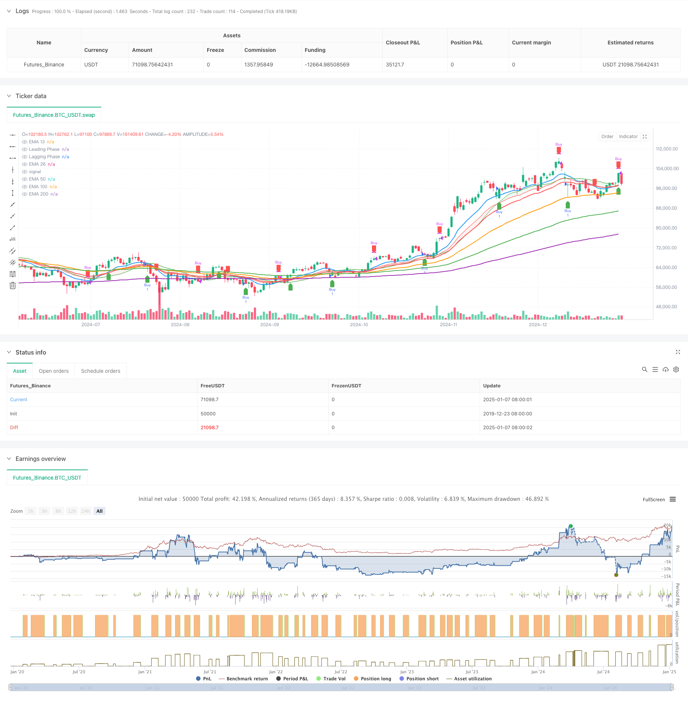

> Name

Multi-Period-Phase-Crossover-with-EMA-Trend-Following-Strategy
> Author

ChaoZhang

> Strategy Description



[trans]
#### Overview
This strategy combines phase crossover signals and multi-period exponential moving averages to capture buying and selling opportunities in the market by smoothing oscillator crossovers and EMA trends. This strategy uses the intersection of the Leading Phase and the Lagging Phase to generate trading signals, and combines 13, 26, 50, 100 and 200 period exponential moving averages to confirm market trends, providing a comprehensive trend following and short-term trading solution.
#### Strategy Principle
The core logic of the strategy consists of two main parts: the phase crossover system and the EMA trend confirmation system. The phase crossover system uses a simple moving average (SMA) with an upward shift as the leading phase, and an exponential moving average (EMA) with a downward shift as the lagging phase. A buy signal is generated when the leading phase crosses above the lagging phase, and a sell signal is generated when it crosses below. The EMA trend confirmation system uses a multi-period (13/26/50/100/200) exponential moving average to confirm the overall market trend, in which the intersection of the 13-period and 26-period EMA serves as a secondary trading signal.
#### Strategic Advantages
1. The signal system is complete: it combines short-term phase crossover signals and long-term trend confirmation, which can effectively filter out false signals.
2. Strong trend tracking ability: through the multi-period EMA system, the main trend direction can be accurately grasped
3. Good visualization effect: use color areas to identify long and short states, and the trading signals are clear and intuitive
4. Strong parameter adjustability: the phase smoothing length and offset can be adjusted according to different market characteristics and trading cycles
5. Reasonable risk control: combined with multiple indicator confirmations, transaction risks can be effectively controlled
#### Strategy Risk
1. Risk of volatile market: Too many trading signals may be generated during the sideways trading phase, increasing transaction costs.
2. Lagging risk: The moving average itself has a lagging nature and may miss the best entry opportunity.
3. False breakthrough risk: False breakthrough signals may appear when the market fluctuates greatly.
4. Parameter sensitivity: Different parameter settings may lead to large differences in strategy performance.
5. Market environment dependence: The strategy performs better in markets with obvious trends, but has poor results in volatile markets.
#### Strategy optimization direction
1. Add volatility filter to reduce trading frequency during periods of low volatility
2. Add trading volume confirmation indicator to improve signal reliability
3. Optimize the stop-loss and stop-profit mechanism and establish a dynamic stop-loss system
4. Introduce market environment classification and adjust strategy parameters according to different market conditions.
5. Develop an adaptive parameter system to achieve dynamic optimization of strategies
#### Summary
This strategy builds a comprehensive trend following trading system by combining phase crossovers and a multi-period EMA system. The strategy has the advantages of clear signals, accurate trend grasp, and reasonable risk control, but it also has certain hysteresis and false signal risks. By adding optimization measures such as volatility filtering and trading volume confirmation, the stability and reliability of the strategy can be further improved. This strategy is suitable for applications in markets with obvious trends, and traders need to adjust parameters based on specific market characteristics and personal risk preferences. ||
#### Overview
This strategy combines phase crossover signals with multi-period exponential moving averages to capture market buying and selling opportunities. It utilizes the crossover of Leading Phase and Lagging Phase to generate trading signals, while incorporating 13, 26, 50, 100, and 200-period EMAs for trend confirmation, providing a comprehensive solution for trend following and short-term trading.

#### Strategy Principles
The core logic consists of two main components: the Phase Crossover System and the EMA Trend Confirmation System. The Phase Crossover System uses a Simple Moving Average (SMA) with upward offset as the Leading Phase and an Exponential Moving Average (EMA) with downward offset as the Lagging Phase. Buy signals are generated when the Leading Phase crosses above the Lagging Phase, and sell signals when it crosses below. The EMA Trend Confirmation System uses multiple period (13/26/50/100/200) exponential moving averages to confirm overall market trends, with the 13 and 26-period EMA crossovers serving as secondary trading signals.

#### Strategy Advantages
1. Complete Signal System: Combines short-term phase crossover signals with long-term trend confirmation to effectively filter false signals
2. Strong Trend Following Capability: Accurately captures main trend directions through multi-period EMA system
3. Good Visualization: Uses colored zones to identify bullish and bearish conditions with clear trading signals
4. Strong Parameter Adaptability: Can be adjusted for different market characteristics and trading periods
5. Reasonable Risk Control: Combines multiple indicators for confirmation to effectively control trading risks

#### Strategy Risks
1. Oscillation Market Risk: May generate excessive trading signals during consolidation phases, increasing trading costs
2. Lag Risk: Moving averages inherently have lag, potentially missing optimal entry points
3. False Breakout Risk: May generate false breakout signals during high market volatility
4. Parameter Sensitivity: Different parameter settings may lead to significant strategy performance variations
5. Market Environment Dependency: Strategy performs better in trending markets but underperforms in oscillating markets

#### Strategy Optimization Directions
1. Add volatility filters to reduce trading frequency during low volatility periods
2. Include volume confirmation indicators to improve signal reliability
3. Optimize stop-loss and take-profit mechanisms, establish dynamic stop-loss system
4. Introduce market environment classification to adjust strategy parameters for different market states
5. Develop adaptive parameter system for dynamic strategy optimization

#### Summary
This strategy builds a comprehensive trend following trading system by combining phase crossover and multi-period EMA systems. It features clear signals, accurate trend capture, and reasonable risk control, while also having certain lag and false signal risks. The strategy's stability and reliability can be further enhanced through optimizations such as adding volatility filters and volume confirmation. It is suitable for application in clearly trending markets, and traders need to adjust parameters based on specific market characteristics and individual risk preferences.[/trans]


> Source (PineScript)

``` pinescript
/*backtest
start: 2019-12-23 08:00:00
end: 2025-01-08 08:00:00
period: 1d
basePeriod: 1d
exchanges: [{"eid":"Futures_Binance","currency":"BTC_USDT"}]
*/

//@version=5
strategy("Phase Cross Strategy with Zone", overlay=true)

// Inputs
length = input.int(20, title="Smoothing Length")
source = input(close, title="Source")
offset = input.float(0.5, title="Offset Amount", minval=0.0)  // Offset for spacing

// Simulating "Phases" with Smoothed Oscillators
lead_phase = ta.sma(source, length) + offset  // Leading phase with offset
lag_phase = ta.ema(source, length) - offset  // Lagging phase with offset

// Signal Logic
buySignal = ta.crossover(lead_phase, lag_phase)
sellSignal = ta.crossunder(lead_phase, lag_phase)

// Plot Phases (as `plot` objects for `fill`)
lead_plot = plot(lead_phase, color=color.green, title="Leading Phase", linewidth=1)
lag_plot = plot(lag_phase, color=color.red, title="Lagging Phase", linewidth=1)

// Fill Zone Between Phases
fill_color = lead_phase > lag_phase ? color.new(color.green, 90) : color.new(color.red, 90)
fill(plot1=lead_plot, plot2=lag_plot, color=fill_color, title="Phase Zone")

// Plot Buy and Sell Signals
plotshape(buySignal, style=shape.labelup, location=location.belowbar, color=color.new(color.green, 0), title="Buy Signal", size=size.small)
plotshape(sellSignal, style=shape.labeldown, location=location.abovebar, color=color.new(color.red, 0), title="Sell Signal", size=size.small)

// Strategy Entry and Exit
if buySignal
    strategy.entry("Buy", strategy.long)

if sellSignal
    strategy.close("Buy")


//indicator("EMA 13, 26, 50, 100, and 200 with Crossover, Value Zone, and Special Candles", overlay=true)

// Define the EMAs
ema13 = ta.ema(close, 13)
ema26 = ta.ema(close, 26)
ema50 = ta.ema(close, 50)
ema100 = ta.ema(close, 100)
ema200 = ta.ema(close, 200)

// Plot the EMAs
plot(ema13, color=color.blue, linewidth=2, title="EMA 13")
plot(ema26, color=color.red, linewidth=2, title="EMA 26")
plot(ema50, color=color.orange, linewidth=2, title="EMA 50")
plot(ema100, color=color.green, linewidth=2, title="EMA 100")
plot(ema200, color=color.purple, linewidth=2, title="EMA 200")

// Crossover conditions
uptrend = ta.crossover(ema13, ema26)  // EMA 13 crosses above EMA 26 (buy)
downtrend = ta.crossunder(ema13, ema26)  // EMA 13 crosses below EMA 26 (sell)

// Plot buy/sell arrows
plotshape(series=uptrend, location=location.belowbar, color=color.green, style=shape.labelup, size=size.small, title="Buy Signal")
plotshape(series=downtrend, location=location.abovebar, color=color.red, style=shape.labeldown, size=size.small, title="Sell Signal")

```

> Detail

https://www.fmz.com/strategy/477949

> Last Modified

2025-01-10 15:17:33
