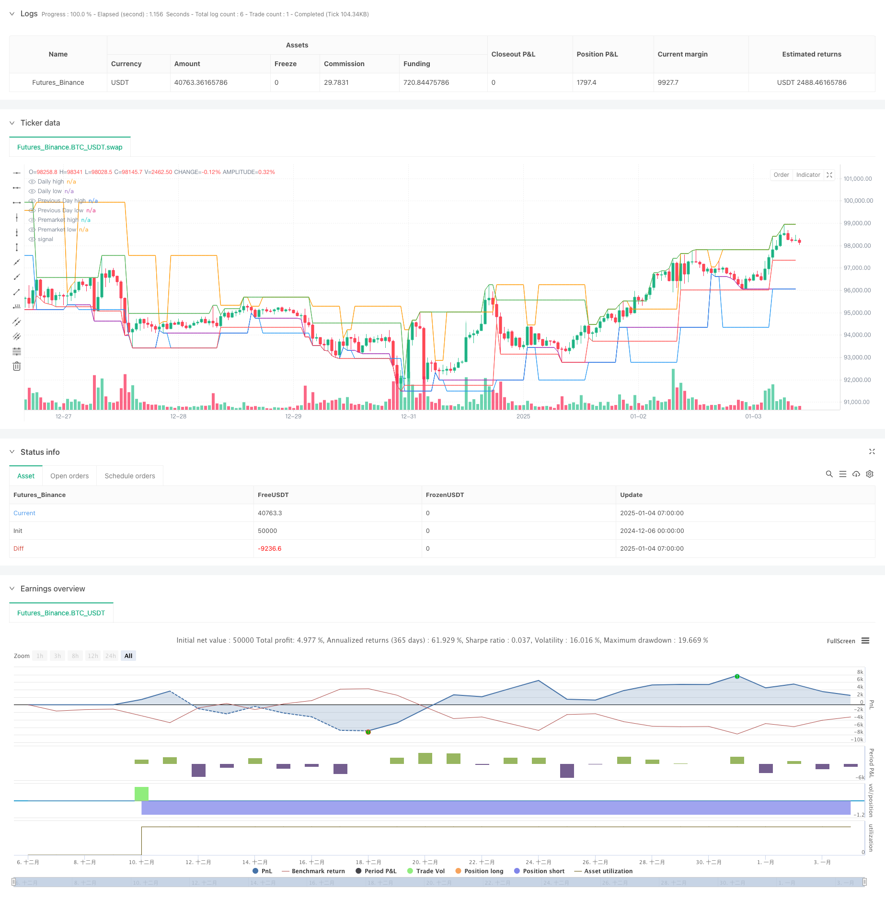

> Name

The leap-forward price breakout trend strategy is a quantitative trading system based on multi-period key price levels-Multi-Period-Price-Level-Breakout-Trend-Trading-System-Based-on-Key-Price-Levels
> Author

ChaoZhang

> Strategy Description



[trans]
#### Overview
This strategy is a breakout trading system based on multiple key price levels. It mainly tracks six key price levels: intraday high (HOD), intraday low (LOD), pre-market high (PMH), pre-market low (PML), previous day high (PDH) and previous day low (PDL), and generates trading signals through price breakthroughs of these levels. The strategy uses automated trading to execute buy and sell operations based on the intersection of price and key levels.
#### Strategy Principle
The core logic of the strategy includes the following key parts:
1. Calculation of key price levels: Use the request.security function to obtain price data in different time periods and calculate six key price levels.
2. Setting of opening conditions: open a long position when the price breaks through PMH or PDH upward; open a short position when the price breaks through PML or PDL downward.
3. Set the closing conditions: if the price reaches HOD when holding a long position, the position will be closed; if the price reaches LOD when holding a short position, the position will be closed.
4. Graphic visualization: Use horizontal lines of different colors to mark each price level, white represents HOD, purple represents LOD, orange represents PDH, blue represents PDL, green represents PMH, and red represents PML.
#### Strategic Advantages
1. Multi-dimensional price reference: Comprehensively grasp market trends by monitoring key price levels in multiple time periods.
2. Breakthrough trading logic is clear: trading signals are generated based on price breakthroughs, and the trading rules are clear and easy to understand.
3. High degree of automation: The system automatically calculates each price level and executes transactions, reducing human intervention.
4. Strong visualization effect: Each price level is visually displayed through horizontal lines of different colors, which facilitates analysis and judgment.
5. Strong adaptability: The strategy can be applied to different trading varieties and time periods.
#### Strategy Risk
1. Risk of false breakthrough: The market may have a false breakthrough leading to false signals.
2. Volatility dependence: Strategies may underperform in low volatility environments.
3. Insufficient risk control: lack of dynamic stop loss and profit-taking mechanisms.
4. Market environment dependence: Frequent trading may occur in sideways markets where the trend is not obvious.
5. Impact of slippage: You may face larger slippage in markets with poor liquidity.
#### Strategy optimization direction
1. Add technical indicator filtering:
- Introduce RSI indicator to filter overbought and oversold
- Use ATR to set dynamic stop loss levels
- Combine with ADX to determine trend strength
2. Improve risk management:
-Set dynamic stop loss mechanism
- Added trailing stop function
- Establish a batch profit mechanism
3. Optimize signal confirmation:
- Increased volume confirmation
- Added multi-period trend confirmation
-Set signal delay confirmation mechanism
#### Summary
This strategy captures market opportunities by monitoring and utilizing multiple key price levels, with clear logic and a high degree of automation. But at the same time, there are certain risks, which need to be optimized by adding technical indicator filtering and improving risk management mechanisms. The core advantage of the strategy lies in its multi-dimensional price reference system, which enables it to better grasp market trends. However, in practical applications, targeted parameter adjustments need to be made according to different market environments. ||
#### Overview
This strategy is a breakout trading system based on multiple key price levels. It primarily tracks six critical price levels: High of Day (HOD), Low of Day (LOD), Premarket High (PMH), Premarket Low (PML), Previous Day High (PDH), and Previous Day Low (PDL). The system generates trading signals through price breakouts of these levels and executes trades automatically based on price crossovers.

#### Strategy Principles
The core logic includes several key components:
1. Key price level calculation: Uses request.security function to obtain price data from different time periods to calculate six key price levels.
2. Entry conditions: Opens long positions when price breaks above PMH or PDH; opens short positions when price breaks below PML or PDL.
3. Exit conditions: Closes long positions when price reaches HOD; closes short positions when price reaches LOD.
4. Visual representation: Marks price levels with different colored horizontal lines - white for HOD, purple for LOD, orange for PDH, blue for PDL, green for PMH, and red for PML.

#### Strategy Advantages
1. Multi-dimensional price reference: Monitors key price levels across multiple time periods for comprehensive market analysis.
2. Clear breakout logic: Generates trading signals based on price breakouts with explicit trading rules.
3. High automation: Automatically calculates price levels and executes trades, reducing manual intervention.
4. Strong visualization: Displays price levels through different colored horizontal lines for intuitive analysis.
5. High adaptability: Applicable to various trading instruments and time periods.

#### Strategy Risks
1. False breakout risk: Market may generate false breakouts leading to incorrect signals.
2. Volatility dependence: Strategy may underperform in low volatility environments.
3. Insufficient risk control: Lacks dynamic stop-loss and profit-taking mechanisms.
4. Market environment dependence: May generate frequent trades in ranging markets.
5. Slippage impact: May face significant slippage in less liquid markets.

#### Strategy Optimization Directions
1. Add technical indicator filters:
- Incorporate RSI for overbought/oversold filtering
- Use ATR for dynamic stop-loss placement
- Integrate ADX for trend strength confirmation

2. Improve risk management:
- Implement dynamic stop-loss mechanisms
- Add trailing stop functionality
- Establish scaled profit-taking system

3. Optimize signal confirmation:
- Add volume confirmation
- Include multi-timeframe trend confirmation
- Set up signal delay confirmation mechanism

#### Summary
This strategy captures market opportunities by monitoring and utilizing multiple key price levels, featuring clear logic and high automation. However, it also carries certain risks that need to be addressed through technical indicator filters and improved risk management mechanisms. The strategy's core advantage lies in its multi-dimensional price reference system, enabling better market trend capture, but practical application requires specific parameter adjustments based on different market conditions.[/trans]


> Source (PineScript)

``` pinescript
/*backtest
start: 2024-12-06 00:00:00
end: 2025-01-04 08:00:00
period: 1h
basePeriod: 1h
exchanges: [{"eid":"Futures_Binance","currency":"BTC_USDT"}]
*/

// This Pine Script™ code is subject to the terms of the Mozilla Public License 2.0 at https://mozilla.org/MPL/2.0/
// © tradingbauhaus

//@version=6
strategy("HOD/LOD/PMH/PML/PDH/PDL Strategy by tradingbauhaus ", shorttitle="HOD/LOD Strategy", overlay=true)

// Daily high and low
dailyhigh = request.security(syminfo.tickerid, 'D', high)
dailylow = request.security(syminfo.tickerid, 'D', low)

// Previous day high and low
var float previousdayhigh = na
var float previousdaylow = na
high1 = request.security(syminfo.tickerid, 'D', high[1])
low1 = request.security(syminfo.tickerid, 'D', low[1])
high0 = request.security(syminfo.tickerid, 'D', high[0])
low0 = request.security(syminfo.tickerid, 'D', low[0])

// Yesterday high and low
if (hour == 9 and minute > 30) or hour > 10
    previousdayhigh := high1
    previousdaylow := low1
else
    previousdayhigh := high0
    previousdaylow := low0

// Premarket high and low
t = time("1440", "0000-0930") // 1440 is the number of minutes in a whole day.
is_first = na(t[1]) and not na(t) or t[1] < t
ending_hour = 9
ending_minute = 30

var float pm_high = na
var float pm_low = na

if is_first and barstate.isnew and ((hour < ending_hour or hour >= 16) or (hour == ending_hour and minute < ending_minute))
    pm_high := high
    pm_low := low
else 
    pm_high := pm_high[1]
    pm_low := pm_low[1]

if high > pm_high and ((hour < ending_hour or hour >= 16) or (hour == ending_hour and minute < ending_minute))
    pm_high := high
    
if low < pm_low and ((hour < ending_hour or hour >= 16) or (hour == ending_hour and minute < ending_minute))
    pm_low := low

// Plotting levels
plot(dailyhigh, style=plot.style_line, title="Daily high", color=color.white, linewidth=1, trackprice=true)
plot(dailylow, style=plot.style_line, title="Daily low", color=color.purple, linewidth=1, trackprice=true)
plot(previousdayhigh, style=plot.style_line, title="Previous Day high", color=color.orange, linewidth=1, trackprice=true)
plot(previousdaylow, style=plot.style_line, title="Previous Day low", color=color.blue, linewidth=1, trackprice=true)
plot(pm_high, style=plot.style_line, title="Premarket high", color=color.green, linewidth=1, trackprice=true)
plot(pm_low, style=plot.style_line, title="Premarket low", color=color.red, linewidth=1, trackprice=true)

// Strategy logic
// Long entry: Price crosses above PMH or PDH
if (ta.crossover(close, pm_high) or ta.crossover(close, previousdayhigh)) and strategy.opentrades == 0
    strategy.entry("Long", strategy.long)

// Short entry: Price crosses below PML or PDL
if (ta.crossunder(close, pm_low) or ta.crossunder(close, previousdaylow)) and strategy.opentrades == 0
    strategy.entry("Short", strategy.short)

// Exit long: Price reaches HOD
if strategy.position_size > 0 and ta.crossover(close, dailyhigh)
    strategy.close("Long")

// Exit short: Price reaches LOD
if strategy.position_size < 0 and ta.crossunder(close, dailylow)
    strategy.close("Short")
```

> Detail

https://www.fmz.com/strategy/477590

> Last Modified

2025-01-06 16:06:30
