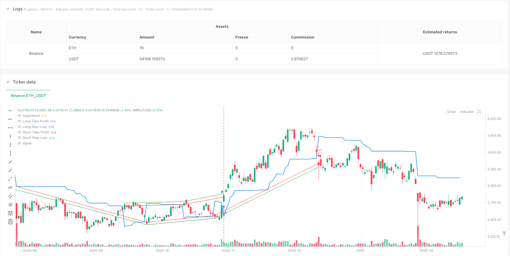
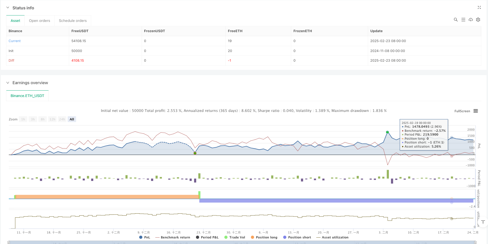

> Name

Multi-Period-Supertrend-Percentage-Risk-Management-Strategy
> Author

ianzeng123

> Strategy Description





[trans]## Overview
This strategy is a quantitative trading system based on the Supertrend indicator, combined with a precise risk management mechanism. The core of the strategy uses the intersection relationship between price and super trend line to determine the timing of entry, and at the same time sets a 1% take-profit and a 1% stop-loss for each transaction to achieve precise control of risk and return. The super trend indicator is calculated through the average true range (ATR) and custom factors. It can effectively identify changes in market trends, help traders enter the market at the early stage of the trend, and leave the market in time when the trend reverses, thereby improving the success rate and stability of transactions.
## Strategy Principle
The core principle of this strategy is based on the calculation and application of the Supertrend indicator:
1. **Super Trend Indicator Calculation**:
   - The strategy first calculates the average true range (ATR), and the default period is 14
   - Multiply ATR by custom factor (default is 3.0) to obtain fluctuation bandwidth
   - Calculate super trend lines based on price and volatility bandwidth
2. **Entry signal generation**:
   - Bull signal: when the price crosses the super trend line upward (ta.crossover function)
   - Short signal: when the price crosses the super trendline downwards (ta.crossunder function)
3. **Risk Management Mechanism**:
   - Long trading: Set a stop loss 1% below the entry price, and set a take profit 1% above the entry price
   - Short trading: Set a stop loss 1% above the entry price and a take profit 1% below the entry price
   - Use the stop and limit parameters of the strategy.entry function to implement automatic stop loss and take profit
4. **Visual assistance**:
   - Draw super trend lines on the chart to help identify the current trend direction
   - Display stop loss and take profit horizontal lines to improve the visibility of transactions
This strategy is written in Pine Script 5.0 and directly obtains the super trend indicator value and direction through the function ta.supertrend, which simplifies the code structure and improves calculation efficiency.
## Strategic Advantages
1. **Trend Following Advantages**:
   - Super trend indicators can effectively identify market trends and reduce losses caused by false breakthroughs
   - The indicator has strong filtering ability against noise and improves the signal quality.
2. **Precise risk management**:
   - Fixed percentage take-profit and stop-loss settings make risk control more precise and consistent
   - The risk of each transaction can be calculated in advance to facilitate fund management
3. **Parameters can be adjusted**:
   - ATR period and multiplier factors can be adjusted according to different market conditions
   - Take profit and stop loss percentages can be customized based on personal risk appetite and market volatility
4. **Visualized transaction process**:
   - Visual display of super trend lines, take profit and stop loss levels on the chart
   - Enhance transparency and confidence in trading decisions
5. **The code is concise and efficient**:
   - Using the built-in functions of Pine Script 5.0, the code structure is clear
   - The calculation logic is intuitive and easy to understand and maintain.
## Strategy Risk
1. **Range shock risk**:
   - In a sideways market, frequent price crossings of super trend lines will lead to continuous losses
   - Solution: Add filter conditions, such as combining directional indicators (such as ADX) to confirm trend strength
2. **Fixed Percent Risk**:
   - 1% take profit and stop loss may be too large or too small in different volatile markets
   - Solution: Dynamically relate take profit and stop loss percentages to market volatility (such as ATR)
3. **Trend Reversal Delay**:
   - The super trend indicator is a lagging indicator and may not send a signal in time at the early stage of a trend reversal.
   - Solution: Combine leading indicators such as momentum indicators to optimize entry timing
4. **Parameter sensitivity**:
   - The choice of ATR period and multiplier factor has a greater impact on strategy performance
   - Solution: Conduct comprehensive parameter optimization and backtesting to find the most suitable parameter combination for a specific market
5. **Take profit level is closer**:
   - A 1% take profit may lock in profits too early and prevent you from enjoying the benefits brought by the general trend
   - Solution: implement a trailing stop loss or partial take profit strategy, and retain some positions to track the trend
## Strategy optimization direction
1. **Dynamic stop profit and stop loss**:
   - Change the fixed 1% take-profit and stop-loss to a dynamic take-profit and stop-loss based on ATR
   - Reasons for optimization: Make risk management better adapt to market volatility and improve the adaptability of strategies
2. **Multi-cycle confirmation**:
   - Added trend confirmation mechanism for higher time frames
   - Reasons for optimization: Reduce false signals, improve transaction quality, and avoid operations that go against the main trend.
3. **Intelligent position management**:
   - Dynamically adjust position sizes based on market volatility and signal strength
   - Reason for optimization: increase risk exposure when high-confidence signals appear and improve capital utilization efficiency
4. **Add filter conditions**:
   - Filter trading signals based on volume, momentum indicators or volatility indicators
   - Reasons for optimization: reduce low-quality signals and improve the stability and winning rate of the strategy
5. **Optimize super trend parameters**:
   - Implement an adaptive parameter adjustment mechanism to dynamically adjust the ATR cycle and multiplier according to market conditions
   - Reasons for optimization: Improve the adaptability of indicators to different market environments and reduce the risk of over-fitting
## Summarize
"Multi-Period Super Trend Percent Risk Control Strategy" is a quantitative trading system that combines trend tracking and precise risk management. The strategy captures market trend changes through the super trend indicator and uses a fixed percentage of take-profit and stop-loss to control risk.
The main advantages of this strategy are that the operating rules are clear, the risks are controllable, and the parameters are adjustable, making it suitable for use as a basic trading system. At the same time, the strategy also has shortcomings such as poor performance in volatile markets and inflexible fixed percentage risk.
In order to further improve the strategy performance, you can consider introducing dynamic stop-profit and stop-loss, multi-cycle confirmation, intelligent position management and other optimization measures. Through these improvements, the strategy is expected to further improve its winning rate and risk-adjusted return while maintaining its original advantages.
This strategy is suitable for mid- to long-term trend traders, especially those who value risk management and pursue stable returns. Through reasonable parameter adjustment and strategy optimization, it can become a reliable trading system component. || ## Overview
This strategy is a quantitative trading system based on the Supertrend indicator, combined with precise risk management mechanisms. The core of the strategy uses the crossover relationship between price and the Supertrend line to determine entry timing, while setting a 1% take profit and 1% stop loss for each trade, achieving precise control of risk and reward. The Supertrend indicator is calculated using the Average True Range (ATR) and a custom factor, effectively identifying market trend changes, helping traders enter at the early stages of trend formation and exit promptly when trends reverse, thereby improving the success rate and stability of trades.

## Strategy Principles

The core principles of this strategy are based on the calculation and application of the Supertrend indicator:

1. **Supertrend Indicator Calculation**:
   - The strategy first calculates the Average True Range (ATR), with a default period of 14
   - Multiplies the ATR by a custom factor (default 3.0) to obtain the volatility band width
   - Calculates the Supertrend line based on price and volatility band width

2. **Entry Signal Generation**:
   - Long signal: When price crosses above the Supertrend line (ta.crossover function)
   - Short signal: When price crosses below the Supertrend line (ta.crossunder function)

3. **Risk Management Mechanism**:
   - Long trades: 1% stop loss below entry price, 1% take profit above entry price
   - Short trades: 1% stop loss above entry price, 1% take profit below entry price
   - Implements automatic stop loss and take profit using the stop and limit parameters of the strategy.entry function

4. **Visual Assistance**:
   - Plots the Supertrend line on the chart to help identify current trend direction
   - Displays stop loss and take profit levels, increasing trade visualization

This strategy is written in Pine Script 5.0, using the ta.supertrend function to directly obtain Supertrend indicator values and direction, simplifying code structure and improving computational efficiency.

## Strategy Advantages

1. **Trend Following Advantages**:
   - The Supertrend indicator effectively identifies market trends, reducing losses from false breakouts
   - The indicator has strong noise filtering capability, improving signal quality

2. **Precise Risk Management**:
   - Fixed percentage stop loss and take profit settings make risk control more precise and consistent
   - Risk for each trade can be calculated in advance, facilitating capital management

3. **Adjustable Parameters**:
   - ATR period and multiplier factor can be adjusted according to different market conditions
   - Take profit and stop loss percentages can be customized according to individual risk preferences and market volatility

4. **Visualized Trading Process**:
   - Intuitively displays Supertrend line, take profit, and stop loss levels on the chart
   - Enhances transparency and confidence in trading decisions

5. **Concise and Efficient Code**:
   - Utilizes built-in functions of Pine Script 5.0, with clear code structure
   - Calculation logic is intuitive, easy to understand and maintain

## Strategy Risks

1. **Range-Bound Market Risk**:
   - In sideways markets, frequent price crossovers of the Supertrend line may lead to consecutive losses
   - Solution: Add filtering conditions, such as combining directional indicators (like ADX) to confirm trend strength

2. **Fixed Percentage Risk**:
   - 1% stop loss and take profit may be too large or too small in markets with different volatility
   - Solution: Dynamically link stop loss and take profit percentages with market volatility (such as ATR)

3. **Trend Reversal Delay**:
   - The Supertrend indicator is a lagging indicator and may not signal promptly at the beginning of trend reversals
   - Solution: Combine leading indicators such as momentum indicators to optimize entry timing

4. **Parameter Sensitivity**:
   - The selection of ATR period and multiplier factor has a significant impact on strategy performance
   - Solution: Conduct comprehensive parameter optimization and backtesting to find the most suitable parameter combinations for specific markets

5. **Close Take Profit Level**:
   - 1% take profit may lock in profits too early, missing out on benefits from major trends
   - Solution: Implement trailing stop loss or partial take profit strategies, retaining some positions to follow trends

## Strategy Optimization Directions

1. **Dynamic Stop Loss and Take Profit**:
   - Change the fixed 1% stop loss and take profit to ATR-based dynamic levels
   - Optimization rationale: Better adapt risk management to market volatility, improving strategy adaptability

2. **Multi-Period Confirmation**:
   - Add trend confirmation mechanisms from higher timeframes
   - Optimization rationale: Reduce false signals, improve trade quality, avoid operating against the main trend

3. **Intelligent Position Management**:
   - Dynamically adjust position size based on market volatility and signal strength
   - Optimization rationale: Increase risk exposure when high-confidence signals appear, improving capital utilization efficiency

4. **Add Filtering Conditions**:
   - Combine volume, momentum indicators, or volatility indicators to filter trading signals
   - Optimization rationale: Reduce low-quality signals, improve strategy stability and win rate

5. **Optimize Supertrend Parameters**:
   - Implement adaptive parameter adjustment mechanisms, dynamically adjusting ATR period and multiplier based on market conditions
   - Optimization rationale: Improve the indicator's adaptability to different market environments, reduce overfitting risk

## Summary

The "Multi-Period Supertrend Percentage Risk Management Strategy" is a quantitative trading system that combines trend following with precise risk management. The strategy captures market trend changes through the Supertrend indicator and controls risk using fixed percentage take profit and stop loss levels.

The main advantages of this strategy include clear operational rules, controllable risk, and adjustable parameters, making it suitable for use as a basic trading system. At the same time, the strategy also has disadvantages such as poor performance in oscillating markets and inflexible fixed percentage risk.

To further enhance strategy performance, consider introducing dynamic stop loss and take profit, multi-period confirmation, intelligent position management, and other optimization measures. Through these improvements, the strategy has the potential to further increase win rate and risk-adjusted returns while maintaining its original advantages.

This strategy is suitable for medium to long-term trend traders, especially those who value risk management and pursue stable returns. With reasonable parameter adjustments and strategy optimization, it can become a reliable trading system component.[/trans]


> Source (PineScript)

``` pinescript
/*backtest
start: 2024-11-08 00:00:00
end: 2025-02-24 08:00:00
period: 1d
basePeriod: 1d
exchanges: [{"eid":"Binance","currency":"ETH_USDT"}]
*/

//@version=5
strategy("Supertrend with 1% Target and 1% Stoploss", overlay=true)

// Input parameters
atr_length = input.int(14, title="ATR Length")
factor = input.float(3.0, title="Factor")
target_pct = input.float(1.0, title="Target Percentage", minval=0.1) / 100
stoploss_pct = input.float(1.0, title="Stop Loss Percentage", minval=0.1) / 100

// Supertrend calculation
[supertrend, direction] = ta.supertrend(factor, atr_length)

// Plot the Supertrend line
plot(supertrend, color=color.blue, linewidth=2, title="Supertrend")

// Long and Short conditions
long_condition = ta.crossover(close, supertrend)
short_condition = ta.crossunder(close, supertrend)

// Calculate stop loss and take profit levels
long_stop_loss = close * (1 - stoploss_pct)
long_take_profit = close * (1 + target_pct)

short_stop_loss = close * (1 + stoploss_pct)
short_take_profit = close * (1 - target_pct)

// Long position entry
if long_condition
    strategy.entry("Long", strategy.long, stop=long_stop_loss, limit=long_take_profit)

// Short position entry
if short_condition
    strategy.entry("Short", strategy.short, stop=short_stop_loss, limit=short_take_profit)

// Plot stoploss and take profit levels for visual reference
plot(long_condition ? long_take_profit : na, color=color.green, style=plot.style_line, linewidth=1, title="Long Take Profit")
plot(long_condition ? long_stop_loss : na, color=color.red, style=plot.style_line, linewidth=1, title="Long Stop Loss")

plot(short_condition ? short_take_profit : na, color=color.green, style=plot.style_line, linewidth=1, title="Short Take Profit")
plot(short_condition ? short_stop_loss : na, color=color.red, style=plot.style_line, linewidth=1, title="Short Stop Loss")

```

> Detail

https://www.fmz.com/strategy/483792

> Last Modified

2025-02-26 10:01:53
