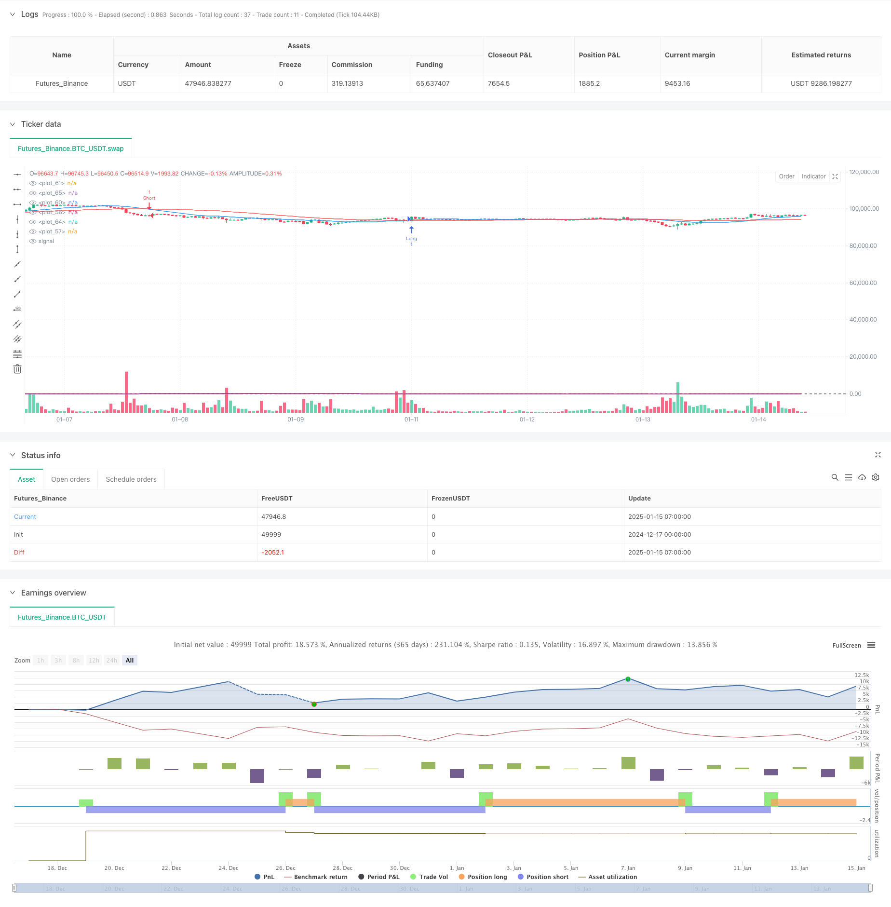

> Name

Multi-Period-Technical-Indicator-Dynamic-Trading-System-Strategy
> Author

ChaoZhang

> Strategy Description



[trans]
#### Overview
This strategy is a comprehensive trading system that combines multiple technical indicators. It mainly uses three indicators: the moving average (MA), the relative strength index (RSI) and the average trend index (ADX) to identify market trends and momentum, and uses the true range indicator (ATR) to dynamically set stop loss and take profit positions. The system uses a multi-period analysis method to confirm trading signals through indicator crossovers in different time periods, which not only ensures the accuracy of transactions, but also effectively controls risks.
#### Strategy Principle
The strategy uses a three-layer verification mechanism to confirm trading signals:
1. Trend identification layer: Use the intersection of the 20-period and 50-period moving averages to determine the trend direction. If the fast line crosses the slow line, it is considered an upward trend, and vice versa is a downward trend.
2. Momentum confirmation layer: Use the 14-period RSI indicator to confirm price momentum. An RSI greater than 50 indicates upward momentum, and an RSI less than 50 indicates downward momentum.
3. Trend strength filter layer: Use the 14-period ADX indicator to measure trend strength. Only when ADX is greater than 25 will the trend be confirmed to be strong enough to trade.
At the same time, the strategy uses a dynamic stop-loss and take-profit system based on ATR:
- Stop loss is set to 2x ATR
- Take profit is set to 4 times ATR, maintaining a risk-return ratio of 1:2
#### Strategic Advantages
1. Multiple confirmation mechanism: Through mutual verification of technical indicators in three different dimensions, the impact of false signals is greatly reduced.
2. Dynamic risk management: The dynamic stop-loss and take-profit settings based on ATR can adaptively adjust according to market volatility and avoid unreasonable risks caused by fixed points.
3. Strong trend tracking: Identify the trend through the MA system and confirm the trend strength with ADX, which can effectively capture the general trend market.
4. Clear operating specifications: There are clear quantitative standards for key points such as entry, stop loss, and take profit, which reduces the interference caused by subjective judgment.
#### Strategy Risk
1. Risk of volatile markets: In a volatile market, frequent moving average crossings may lead to an increase in false signals.
2. Lagging risk: Technical indicators all have a certain degree of lag and may miss the best entry point during violent fluctuations.
3. Parameter sensitivity: The strategy effect is more sensitive to parameter settings, and different market environments may require adjusting parameters.
4. Systemic risk: Under the influence of sudden and major market events, technical indicators may fail.
#### Strategy optimization direction
1. Introduce trading volume indicators: You can consider adding trading volume indicators to assist in verifying the validity of the trend.
2. Optimization parameter adaptation: An adaptive parameter system can be developed to dynamically adjust indicator parameters according to different market environments.
3. Add market sentiment indicators: Introduce market sentiment indicators such as VIX to adjust positions or suspend trading during periods of high volatility.
4. Improve the stop loss mechanism: You can consider adding a trailing stop loss function to better lock in profits.
#### Summary
This strategy builds a relatively complete trading system through the synergy of multiple technical indicators. The core advantage of the strategy lies in its multi-layer verification mechanism and dynamic risk management system, but attention must also be paid to adaptability issues in different market environments. Through continuous optimization and improvement, this strategy is expected to achieve stable returns in actual transactions.
||

#### Overview
This strategy is a comprehensive trading system that combines multiple technical indicators, primarily utilizing Moving Average (MA), Relative Strength Index (RSI), and Average Directional Index (ADX) to identify market trends and momentum. It uses the Average True Range (ATR) to dynamically set stop-loss and take-profit levels. The system employs a multi-period analysis approach, confirming trading signals through indicator crossovers across different time periods, ensuring both trading accuracy and effective risk control.

#### Strategy Principles
The strategy employs a three-layer verification mechanism to confirm trading signals:
1. Trend Identification Layer: Uses crossovers of 20-period and 50-period moving averages to determine trend direction, with fast MA crossing above slow MA indicating an uptrend and vice versa.
2. Momentum Confirmation Layer: Uses 14-period RSI to confirm price momentum, with RSI above 50 indicating upward momentum and below 50 indicating downward momentum.
3. Trend Strength Filter Layer: Uses 14-period ADX to measure trend strength, only confirming trades when ADX is above 25, indicating sufficient trend strength.

Additionally, the strategy implements an ATR-based dynamic stop-loss and take-profit system:
- Stop-loss is set at 2 times ATR
- Take-profit is set at 4 times ATR, maintaining a 1:2 risk-reward ratio

#### Strategy Advantages
1. Multiple Confirmation Mechanism: Validates signals through three different technical indicators, significantly reducing the impact of false signals.
2. Dynamic Risk Management: ATR-based dynamic stop-loss and take-profit settings adapt to market volatility, avoiding unreasonable risks from fixed levels.
3. Strong Trend Following: Effectively captures major trend movements through MA system and ADX confirmation.
4. Clear Operational Standards: Key points such as entry, stop-loss, and take-profit have clear quantitative standards, reducing interference from subjective judgment.

#### Strategy Risks
1. Sideways Market Risk: Frequent MA crossovers in ranging markets may increase false signals.
2. Lag Risk: Technical indicators have inherent lag, potentially missing optimal entry points during volatile movements.
3. Parameter Sensitivity: Strategy performance is sensitive to parameter settings, requiring adjustment in different market environments.
4. Systemic Risk: Technical indicators may fail under sudden major market events.

#### Strategy Optimization Directions
1. Volume Indicator Integration: Consider adding volume indicators to help validate trend validity.
2. Parameter Adaptation: Develop adaptive parameter systems that dynamically adjust indicator parameters based on market conditions.
3. Market Sentiment Integration: Incorporate market sentiment indicators like VIX to adjust positions or pause trading during high volatility periods.
4. Enhanced Stop-Loss Mechanism: Consider adding trailing stop-loss functionality for better profit protection.

#### Summary
This strategy constructs a relatively complete trading system through the synergy of multiple technical indicators. Its core strengths lie in its multi-layer verification mechanism and dynamic risk management system, though attention must be paid to its adaptability in different market environments. Through continuous optimization and improvement, this strategy shows promise for achieving stable returns in actual trading.
[/trans]


> Source (PineScript)

``` pinescript
/*backtest
start: 2024-12-17 00:00:00
end: 2025-01-15 08:00:00
period: 1h
basePeriod: 1h
exchanges: [{"eid":"Futures_Binance","currency":"BTC_USDT","balance":49999}]
*/

//@version=6
strategy("Daily Trading Strategy", overlay=true)

// --- Indikator ---
// Kombinasi MA untuk trend
fastMA = ta.sma(close, 20)
slowMA = ta.sma(close, 50)

// RSI untuk momentum
rsi = ta.rsi(close, 14)

// --- Fungsi untuk menghitung ADX ---
adx(length) =>
    up = ta.change(high)
    down = -ta.change(low)
    plusDM = na(up) ? na : (up > down and up > 0 ? up : 0)
    minusDM = na(down) ? na : (down > up and down > 0 ? down : 0)
    trur = ta.rma(ta.tr, length)
    plus = fixnan(100 * ta.rma(plusDM, length) / trur)
    minus = fixnan(100 * ta.rma(minusDM, length) / trur)
    sum = plus + minus
    adx = 100 * ta.rma(math.abs(plus - minus) / (sum == 0 ? 1 : sum), length)

// ADX untuk kekuatan trend
adxValue = adx(14)

// --- Kondisi Entry Long ---
longEntry = ta.crossover(fastMA, slowMA) and rsi > 50 and adxValue > 25

// --- Kondisi Entry Short ---
shortEntry = ta.crossunder(fastMA, slowMA) and rsi < 50 and adxValue > 25

// --- Stop Loss dan Take Profit ---
// Fungsi untuk menghitung stop loss dan take profit
getSLTP(entryPrice, isLong) =>
    atr = ta.atr(14)
    sl = isLong ? entryPrice - atr * 2 : entryPrice + atr * 2
    tp = isLong ? entryPrice + atr * 4 : entryPrice - atr * 4
    [sl, tp]

// Hitung SL dan TP untuk posisi Long
[longSL, longTP] = getSLTP(close, true)

// Hitung SL dan TP untuk posisi Short
[shortSL, shortTP] = getSLTP(close, false)

// --- Eksekusi Order ---
if (longEntry)
    strategy.entry("Long", strategy.long, stop=longSL, limit=longTP)

if (shortEntry)
    strategy.entry("Short", strategy.short, stop=shortSL, limit=shortTP)

// --- Plot Indikator ---
// MA
plot(fastMA, color=color.blue)
plot(slowMA, color=color.red)

// RSI
plot(rsi, color=color.orange)
hline(50, color=color.gray)

// ADX
plot(adxValue, color=color.purple)
hline(25, color=color.gray)

// --- Alert ---
alertcondition(longEntry, title="Long Entry", message="Long Entry")
alertcondition(shortEntry, title="Short Entry", message="Short Entry")
```

> Detail

https://www.fmz.com/strategy/478688

> Last Modified

2025-01-17 14:26:19
